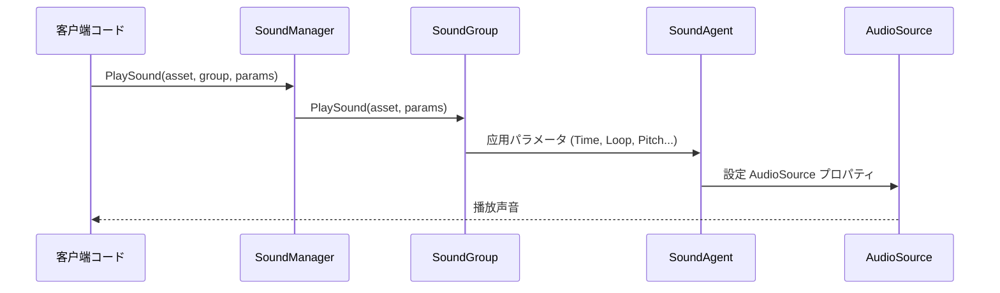

# パラメータ

PlaySoundParams クラスにのプロパティ，、、、パラメータ。パラメータに SoundManager，の。

## 

PlaySoundParams はのコアパラメータクラス，たのオプション。クラスた IReference インターフェース，サポートプール，。

にびし ISoundManager.PlaySound メソッド， PlaySoundParams の。 null パラメータ，デフォルトパラメータ。

### 

PlaySoundParams パラメータ（Parameter Object Pattern），のパラメータ。：

- ** API**：に PlaySound メソッドパラメータ
- ****：をじてプロパティパラメータた
- **サポートデフォルト**：パラメータのデフォルト，
- **プール**： IReference インターフェース，サポート ReferencePool 

### パラメータフロー



## パラメータ

### パラメータ

| パラメータ | タイプ | デフォルト |  |
|------|------|--------|------|
| Time | float | 0f | （）， |
| Loop | bool | false | は |
| FadeInSeconds | float | 0f | （），の |

### パラメータ

| パラメータ | タイプ | デフォルト |  |
|------|------|--------|------|
| MuteInSoundGroup | bool | false | には |
| VolumeInSoundGroup | float | 1f | にの（0.0-1.0） |
| Priority | int | 0 | ， |

### パラメータ

| パラメータ | タイプ | デフォルト |  |
|------|------|--------|------|
| Pitch | float | 1f | ，1.0  |
| PanStereo | float | 0f | ，-1 ，1  |

### パラメータ

| パラメータ | タイプ | デフォルト |  |
|------|------|--------|------|
| SpatialBlend | float | 0f | ，0  2D ，1  3D  |
| MaxDistance | float | 100f | （ 3D ） |
| DopplerLevel | float | 1f | ，0  |

## パラメータ

### Time - 

の（）。、。

```csharp
var playSoundParams = PlaySoundParams.Create();
playSoundParams.Time = 5.5f; // 从第5.5秒開始播放
await soundManager.PlaySound("bgm_music", "MusicGroup", playSoundParams);
```
> Source: [PlaySoundParams.cs](https://github.com/GameFrameX/com.gameframex.unity.sound/blob/main/Runtime/Sound/Sound/PlaySoundParams.cs#L124-L128)

### Loop - 

は。 true， false。

```csharp
// 播放循环背景音乐
var musicParams = PlaySoundParams.Create(isLoop: true);
// 或者
var musicParams = PlaySoundParams.Create();
musicParams.Loop = true;
await soundManager.PlaySound("bgm_forest", "MusicGroup", musicParams);
```
> Source: [PlaySoundParams.cs](https://github.com/GameFrameX/com.gameframex.unity.sound/blob/main/Runtime/Sound/Sound/PlaySoundParams.cs#L142-L146)

### FadeInSeconds - 

の， 0 。の。

```csharp
var playSoundParams = PlaySoundParams.Create();
playSoundParams.FadeInSeconds = 2.0f; // 2秒淡入
await soundManager.PlaySound("ui_click", "UIGroup", playSoundParams);
```
> Source: [PlaySoundParams.cs](https://github.com/GameFrameX/com.gameframex.unity.sound/blob/main/Runtime/Sound/Sound/PlaySoundParams.cs#L169-L173)

### MuteInSoundGroup - 

には。：，の。

```csharp
var playSoundParams = PlaySoundParams.Create();
playSoundParams.MuteInSoundGroup = true; // 暂时静音
await soundManager.PlaySound("voice_intro", "VoiceGroup", playSoundParams);
```
> Source: [PlaySoundParams.cs](https://github.com/GameFrameX/com.gameframex.unity.sound/blob/main/Runtime/Sound/Sound/PlaySoundParams.cs#L133-L137)

### VolumeInSoundGroup - 

にの。 =  × 。

```csharp
var playSoundParams = PlaySoundParams.Create();
playSoundParams.VolumeInSoundGroup = 0.5f; // 50% 音量
await soundManager.PlaySound("effect_explosion", "EffectGroup", playSoundParams);
```
> Source: [PlaySoundParams.cs](https://github.com/GameFrameX/com.gameframex.unity.sound/blob/main/Runtime/Sound/Sound/PlaySoundParams.cs#L160-L164)

### Priority - 

の。の，のの。：0-255，。

```csharp
var playSoundParams = PlaySoundParams.Create();
playSoundParams.Priority = 100; // 高优先级
await soundManager.PlaySound("ui_important", "UIGroup", playSoundParams);
```
> Source: [PlaySoundParams.cs](https://github.com/GameFrameX/com.gameframex.unity.sound/blob/main/Runtime/Sound/Sound/PlaySoundParams.cs#L151-L155)

### Pitch - 

の/。1.0 ， 1.0 /， 1.0 /。

```csharp
var playSoundParams = PlaySoundParams.Create();
playSoundParams.Pitch = 0.8f; // 稍微降低音调
await soundManager.PlaySound("npc_voice", "VoiceGroup", playSoundParams);
```
> Source: [PlaySoundParams.cs](https://github.com/GameFrameX/com.gameframex.unity.sound/blob/main/Runtime/Sound/Sound/PlaySoundParams.cs#L178-L182)

### PanStereo - 

にの。-1.0 ，0.0 ，1.0 。

```csharp
var playSoundParams = PlaySoundParams.Create();
playSoundParams.PanStereo = -0.5f; // 偏左
await soundManager.PlaySound("footstep_left", "EffectGroup", playSoundParams);
```
> Source: [PlaySoundParams.cs](https://github.com/GameFrameX/com.gameframex.unity.sound/blob/main/Runtime/Sound/Sound/PlaySoundParams.cs#L187-L191)

### SpatialBlend - 

 2D（） 3D（）の。0.0  2D ，1.0  3D 。

```csharp
var playSoundParams = PlaySoundParams.Create();
playSoundParams.SpatialBlend = 1.0f; // 完全 3D 声音
playSoundParams.MaxDistance = 50f;
await soundManager.PlaySound("ambient_bird", "WorldGroup", playSoundParams);
```
> Source: [PlaySoundParams.cs](https://github.com/GameFrameX/com.gameframex.unity.sound/blob/main/Runtime/Sound/Sound/PlaySoundParams.cs#L196-L200)

### MaxDistance - 

 3D の。，。

```csharp
var playSoundParams = PlaySoundParams.Create();
playSoundParams.SpatialBlend = 1.0f;
playSoundParams.MaxDistance = 30f; // 30米外听不到
await soundManager.PlaySound("car_engine", "WorldGroup", playSoundParams);
```
> Source: [PlaySoundParams.cs](https://github.com/GameFrameX/com.gameframex.unity.sound/blob/main/Runtime/Sound/Sound/PlaySoundParams.cs#L205-L209)

### DopplerLevel - 

 3D の。と，。0.0 ，1.0 。

```csharp
var playSoundParams = PlaySoundParams.Create();
playSoundParams.SpatialBlend = 1.0f;
playSoundParams.DopplerLevel = 0.5f; // 减弱多普勒效果
await soundManager.PlaySound("car_passing", "WorldGroup", playSoundParams);
```
> Source: [PlaySoundParams.cs](https://github.com/GameFrameX/com.gameframex.unity.sound/blob/main/Runtime/Sound/Sound/PlaySoundParams.cs#L214-L218)

## メソッド

### パラメータ

メソッド `Create()`  PlaySoundParams ，メソッドプール：

```csharp
// 基础用法：使用デフォルトパラメータ
var playSoundParams = PlaySoundParams.Create();

// 带循环パラメータ
var loopParams = PlaySoundParams.Create(isLoop: true);
```
> Source: [PlaySoundParams.cs](https://github.com/GameFrameX/com.gameframex.unity.sound/blob/main/Runtime/Sound/Sound/PlaySoundParams.cs#L233-L239)

### 

```csharp
// 作成播放パラメータ并設定
var playSoundParams = PlaySoundParams.Create();
playSoundParams.Loop = true;                      // 循环播放
playSoundParams.VolumeInSoundGroup = 0.8f;        // 80% 音量
playSoundParams.Priority = 100;                   // 高优先级
playSoundParams.FadeInSeconds = 1.0f;             // 1秒淡入
playSoundParams.Pitch = 1.0f;                      // 正常音调

// 播放声音
int serialId = await soundManager.PlaySound("bgm_battle", "MusicGroup", playSoundParams);
```
> Source: [ISoundManager.cs](https://github.com/GameFrameX/com.gameframex.unity.sound/blob/main/Runtime/Interface/ISoundManager.cs#L165-L167)

### パラメータ AudioSource の

PlaySoundParams のパラメータ Unity の AudioSource コンポーネント：

| PlaySoundParams | AudioSource |  |
|-----------------|-------------|------|
| Time | time |  |
| MuteInSoundGroup | mute × groupMute |  |
| Loop | loop |  |
| Priority | priority |  |
| VolumeInSoundGroup | volume × groupVolume |  |
| FadeInSeconds | Play()  |  |
| Pitch | pitch |  |
| PanStereo | panStereo |  |
| SpatialBlend | spatialBlend |  |
| MaxDistance | maxDistance |  |
| DopplerLevel | dopplerLevel |  |

> Source: [SoundManager.SoundGroup.cs](https://github.com/GameFrameX/com.gameframex.unity.sound/blob/main/Runtime/Sound/Sound/SoundManager.SoundGroup.cs#L216-L226)

## 

1. **プール**： `PlaySoundParams.Create()` のパラメータにたプール，。

2. **パラメータ null**：びし PlaySound  null パラメータ，デフォルトパラメータの PlaySoundParams。

3. **と**：の，のにのの。

4. ****： = （SoundGroup.Volume）× （VolumeInSoundGroup）。

5. ****：パラメータ（MaxDistance、DopplerLevel） SpatialBlend  0 の。

## リンク

- [インターフェース](./5-api-reference.1-interfaces) - ISoundManager とインターフェース
- [イベント](./5-api-reference.3-event-args) - イベントパラメータ
- [マネージャー](./4-core-concepts.1-sound-manager) - マネージャー
- [](./4-core-concepts.2-sound-group) - 
- [](./4-core-concepts.3-sound-agent) - 
