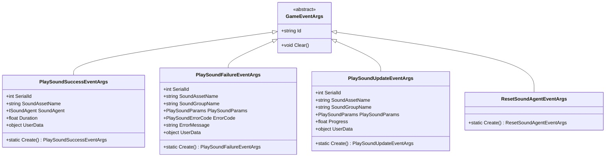
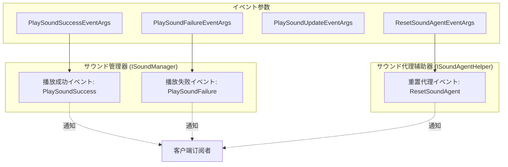
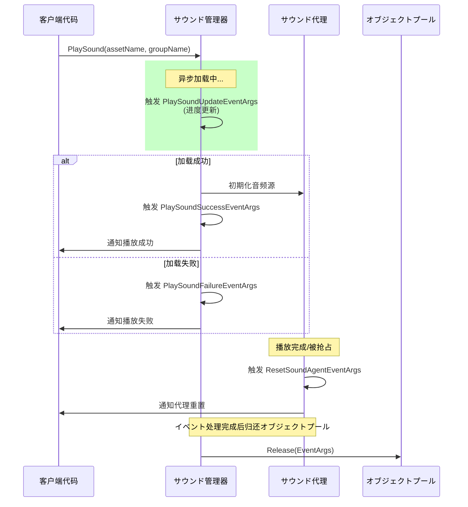

# イベント参数

本节详细介绍 GameFrameX サウンド系统中使用的イベント参数クラス，这些クラスに使用在サウンド播放过程中传递イベント数据，使外部コンポーネント能够响应サウンド播放的成功、失败、更新以及サウンド代理重置等ステータス变化。

## 概要

GameFrameX サウンド系统采用イベント驱动架构，当サウンド播放ステータス发生变化时，系统会抛出相应的イベント并携带详细的イベント参数。这些イベント参数クラス均を継承 `GameFrameX.Event.Runtime.GameEventArgs` 基クラス，提供します统一的オブジェクトプール管理机制以优化内存使用。

イベント参数在系统中的主要作用包括：

- **ステータス通知**：将サウンド播放的结果（成功或失败）通知给订阅者
- **进度追踪**：提供异步加载进度信息に使用 UI 展示
- **错误处理**：携带错误码和错误信息便于问题诊断
- **代理管理**：通知サウンド代理必要重置以复用リソース

## イベント参数クラス体系

GameFrameX サウンド系统定义了四个コアイベント参数クラス，分别对应不同的サウンド系统ステータス变化。



### イベント流与コンポーネント关系



## コアイベント参数详解

### PlaySoundSuccessEventArgs

`PlaySoundSuccessEventArgs` 在サウンド成功开始播放时触发，包含了播放操作的完整结果信息。

```csharp
public sealed class PlaySoundSuccessEventArgs : GameEventArgs
{
    /// <summary>
    /// 取得サウンド的序列编号。
    /// </summary>
    public int SerialId { get; private set; }

    /// <summary>
    /// 取得サウンドリソース名称。
    /// </summary>
    public string SoundAssetName { get; private set; }

    /// <summary>
    /// 取得に使用播放的サウンド代理。
    /// </summary>
    public ISoundAgent SoundAgent { get; private set; }

    /// <summary>
    /// 取得加载持续时间。
    /// </summary>
    public float Duration { get; private set; }

    /// <summary>
    /// 取得用户自定义数据。
    /// </summary>
    public object UserData { get; private set; }

    public static PlaySoundSuccessEventArgs Create(int serialId, string soundAssetName, 
        ISoundAgent soundAgent, float duration, object userData)
    {
        // 从オブジェクトプール取得インスタンス并初期化
    }
}
```
> Source: [PlaySoundSuccessEventArgs.cs](https://github.com/GameFrameX/com.gameframex.unity.sound/blob/main/Runtime/EventArgs/PlaySoundSuccessEventArgs.cs#L41-L98)

**使用シーン**：当必要知道サウンド是否成功播放、取得に使用控制播放的 SoundAgent 代理インスタンス，或记录加载耗时等シーン时订阅此イベント。

---

### PlaySoundFailureEventArgs

`PlaySoundFailureEventArgs` 在サウンド播放失败时触发，携带详细的错误信息以便诊断问题。

```csharp
public sealed class PlaySoundFailureEventArgs : GameEventArgs
{
    /// <summary>
    /// 取得サウンド的序列编号。
    /// </summary>
    public int SerialId { get; private set; }

    /// <summary>
    /// 取得サウンドリソース名称。
    /// </summary>
    public string SoundAssetName { get; private set; }

    /// <summary>
    /// 取得サウンド组名称。
    /// </summary>
    public string SoundGroupName { get; private set; }

    /// <summary>
    /// 取得播放サウンド参数。
    /// </summary>
    public PlaySoundParams PlaySoundParams { get; private set; }

    /// <summary>
    /// 取得错误码。
    /// </summary>
    public PlaySoundErrorCode ErrorCode { get; private set; }

    /// <summary>
    /// 取得错误信息。
    /// </summary>
    public string ErrorMessage { get; private set; }

    /// <summary>
    /// 取得用户自定义数据。
    /// </summary>
    public object UserData { get; private set; }

    public static PlaySoundFailureEventArgs Create(int serialId, string soundAssetName, 
        string soundGroupName, PlaySoundParams playSoundParams, PlaySoundErrorCode errorCode, 
        string errorMessage, object userData)
    {
        // 从オブジェクトプール取得インスタンス并初期化
    }
}
```
> Source: [PlaySoundFailureEventArgs.cs](https://github.com/GameFrameX/com.gameframex.unity.sound/blob/main/Runtime/EventArgs/PlaySoundFailureEventArgs.cs#L41-L115)

**错误码枚举 (PlaySoundErrorCode)**：

| 错误码 | 説明 |
|--------|------|
| `Unknown` | 未知错误 |
| `SoundGroupNotExist` | サウンド组不存在 |
| `SoundGroupHasNoAgent` | サウンド组没有サウンド代理 |
| `LoadAssetFailure` | 加载リソース失败 |
| `IgnoredDueToLowPriority` | 因优先级低被忽略 |
| `SetSoundAssetFailure` | 設定サウンドリソース失败 |

> Source: [PlaySoundErrorCode.cs](https://github.com/GameFrameX/com.gameframex.unity.sound/blob/main/Runtime/Sound/Sound/PlaySoundErrorCode.cs#L38-L69)

---

### PlaySoundUpdateEventArgs

`PlaySoundUpdateEventArgs` 在异步加载サウンドリソース的过程中定期触发，に使用报告加载进度。

```csharp
public sealed class PlaySoundUpdateEventArgs : GameEventArgs
{
    /// <summary>
    /// 取得サウンド的序列编号。
    /// </summary>
    public int SerialId { get; private set; }

    /// <summary>
    /// 取得サウンドリソース名称。
    /// </summary>
    public string SoundAssetName { get; private set; }

    /// <summary>
    /// 取得サウンド组名称。
    /// </summary>
    public string SoundGroupName { get; private set; }

    /// <summary>
    /// 取得播放サウンド参数。
    /// </summary>
    public PlaySoundParams PlaySoundParams { get; private set; }

    /// <summary>
    /// 取得加载サウンド进度。
    /// </summary>
    public float Progress { get; private set; }

    /// <summary>
    /// 取得用户自定义数据。
    /// </summary>
    public object UserData { get; private set; }

    public static PlaySoundUpdateEventArgs Create(int serialId, string soundAssetName, 
        string soundGroupName, PlaySoundParams playSoundParams, float progress, object userData)
    {
        // 从オブジェクトプール取得インスタンス并初期化
    }
}
```
> Source: [PlaySoundUpdateEventArgs.cs](https://github.com/GameFrameX/com.gameframex.unity.sound/blob/main/Runtime/EventArgs/PlaySoundUpdateEventArgs.cs#L41-L106)

**使用シーン**：在 UI 上显示加载进度条，或进行其他必要知道加载进度的操作。

---

### ResetSoundAgentEventArgs

`ResetSoundAgentEventArgs` は轻量级イベント参数，当サウンド代理必要重置（例如播放完毕或被抢占）时触发。

```csharp
public sealed class ResetSoundAgentEventArgs : GameEventArgs
{
    /// <summary>
    /// 初期化重置サウンド代理イベント的新インスタンス。
    /// </summary>
    public ResetSoundAgentEventArgs()
    {
    }

    /// <summary>
    /// 作成重置サウンド代理イベント。
    /// </summary>
    public static ResetSoundAgentEventArgs Create()
    {
        ResetSoundAgentEventArgs resetSoundAgentEventArgs = ReferencePool.Acquire<ResetSoundAgentEventArgs>();
        return resetSoundAgentEventArgs;
    }

    /// <summary>
    /// 清理重置サウンド代理イベント。
    /// </summary>
    public override void Clear()
    {
    }

    public static readonly string EventId = typeof(ResetSoundAgentEventArgs).FullName;

    public override string Id => EventId;
}
```
> Source: [ResetSoundAgentEventArgs.cs](https://github.com/GameFrameX/com.gameframex.unity.sound/blob/main/Runtime/EventArgs/ResetSoundAgentEventArgs.cs#L41-L76)

**使用シーン**：监听サウンド代理的重置ステータス，以便进行リソース清理或ステータス同步。

---

## イベント订阅与使用示例

### 订阅播放成功イベント

```csharp
// 取得サウンド管理器インスタンス
var soundManager = GameEntry.GetManager<ISoundManager>();

// 订阅播放成功イベント
soundManager.PlaySoundSuccess += OnPlaySoundSuccess;

private void OnPlaySoundSuccess(object sender, PlaySoundSuccessEventArgs e)
{
    UnityEngine.Debug.Log($"サウンド播放成功: {e.SoundAssetName}, 持续时间: {e.Duration}");
    // 可能を通じて e.SoundAgent 控制播放，如暂停、停止等
    // e.UserData 包含播放时传入的自定义数据
}
```

> Source: [ISoundManager.cs](https://github.com/GameFrameX/com.gameframex.unity.sound/blob/main/Runtime/Interface/ISoundManager.cs#L50-L53)

### 订阅播放失败イベント

```csharp
soundManager.PlaySoundFailure += OnPlaySoundFailure;

private void OnPlaySoundFailure(object sender, PlaySoundFailureEventArgs e)
{
    UnityEngine.Debug.LogError($"サウンド播放失败: {e.SoundAssetName}, 错误码: {e.ErrorCode}, 错误信息: {e.ErrorMessage}");
    // 可能に基づいて错误码进行不同的处理
    if (e.ErrorCode == PlaySoundErrorCode.SoundGroupNotExist)
    {
        // 处理サウンド组不存在的情况
    }
}
```

> Source: [ISoundManager.cs](https://github.com/GameFrameX/com.gameframex.unity.sound/blob/main/Runtime/Interface/ISoundManager.cs#L55-L58)

### 订阅重置サウンド代理イベント

```csharp
// サウンド代理辅助器インターフェース
public interface ISoundAgentHelper
{
    /// <summary>
    /// 重置サウンド代理イベント。
    /// </summary>
    event EventHandler<ResetSoundAgentEventArgs> ResetSoundAgent;
}
```
> Source: [ISoundAgentHelper.cs](https://github.com/GameFrameX/com.gameframex.unity.sound/blob/main/Runtime/Interface/ISoundAgentHelper.cs#L102-L105)

---

## オブジェクトプール机制

所有イベント参数クラス都采用オブジェクトプール模式进行管理，这是 GameFrameX フレームワーク的内存优化策略：

1. **作成**：使用静态 `Create()` メソッド从オブジェクトプール取得インスタンス
2. **使用**：填充イベントプロパティ
3. **释放**：イベント处理完成后，フレームワーク自动呼び出し `ReferencePool.Release()` 归还到オブジェクトプール
4. **重置**：归还时呼び出し `Clear()` メソッド将所有プロパティ重置为默认值

这种设计避免了频繁的对象分配和垃圾回收，提高了性能，特别是在频繁触发イベント的シーン下效果显著。

```csharp
// イベント参数作成示例
PlaySoundSuccessEventArgs args = PlaySoundSuccessEventArgs.Create(
    serialId: 1,
    soundAssetName: "bgm_music",
    soundAgent: soundAgent,
    duration: 180.5f,
    userData: null
);

// 触发イベント
soundManager.PlaySoundSuccess?.Invoke(this, args);

// 归还到オブジェクトプール
ReferencePool.Release(args);
```

---

## イベント触发时序



---

## 関連リンク

- [インターフェース定义](./5-api-reference.1-interfaces) - ISoundManager 和 ISoundAgentHelper インターフェース详细定义
- [播放参数](./5-api-reference.2-play-sound-params) - PlaySoundParams 参数配置説明
- [サウンド管理器](./4-core-concepts.1-sound-manager) - サウンド管理器コア概念与実装
- [サウンド代理](./4-core-concepts.3-sound-agent) - サウンド代理コンポーネント详解
