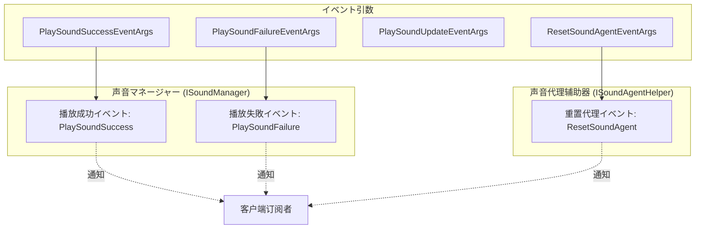
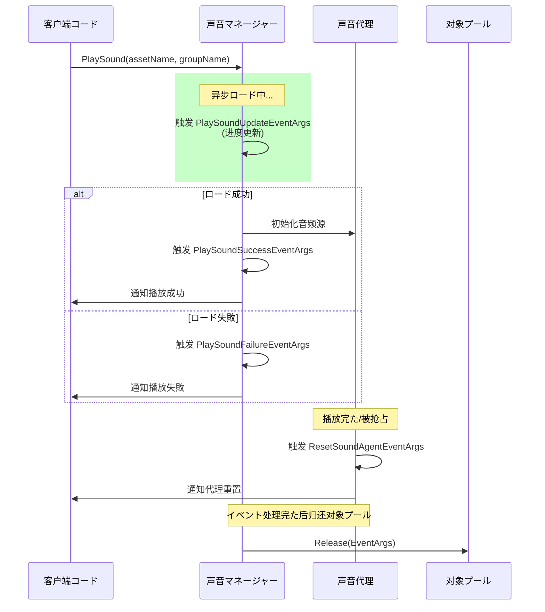

# イベント

 GameFrameX のイベントクラス，クラスににイベントデータ，コンポーネントレスポンスの、、。

## 

GameFrameX イベントアーキテクチャ，，のイベントのイベント。イベントクラス `GameFrameX.Event.Runtime.GameEventArgs` クラス，たのプール。

イベントにの：

- ****：の（）
- ****：ロードに UI 
- **エラー**：エラーとエラー
- ****：リソース

## イベントクラス

GameFrameX たコアイベントクラス，の。


### イベントとコンポーネント



## コアイベント

### PlaySoundSuccessEventArgs

`PlaySoundSuccessEventArgs` に，むたの。

```csharp
public sealed class PlaySoundSuccessEventArgs : GameEventArgs
{
    /// <summary>
    /// 获取声音の序列编号。
    /// </summary>
    public int SerialId { get; private set; }

    /// <summary>
    /// 获取声音リソース名称。
    /// </summary>
    public string SoundAssetName { get; private set; }

    /// <summary>
    /// 获取に使用播放の声音代理。
    /// </summary>
    public ISoundAgent SoundAgent { get; private set; }

    /// <summary>
    /// 获取ロード持续时间。
    /// </summary>
    public float Duration { get; private set; }

    /// <summary>
    /// 获取用户カスタマイズデータ。
    /// </summary>
    public object UserData { get; private set; }

    public static PlaySoundSuccessEventArgs Create(int serialId, string soundAssetName, 
        ISoundAgent soundAgent, float duration, object userData)
    {
        // 从对象プール获取实例并初始化
    }
}
```
> Source: [PlaySoundSuccessEventArgs.cs](https://github.com/GameFrameX/com.gameframex.unity.sound/blob/main/Runtime/EventArgs/PlaySoundSuccessEventArgs.cs#L41-L98)

**シーン**：は、にの SoundAgent ，ロードイベント。

---

### PlaySoundFailureEventArgs

`PlaySoundFailureEventArgs` に，のエラー。

```csharp
public sealed class PlaySoundFailureEventArgs : GameEventArgs
{
    /// <summary>
    /// 获取声音の序列编号。
    /// </summary>
    public int SerialId { get; private set; }

    /// <summary>
    /// 获取声音リソース名称。
    /// </summary>
    public string SoundAssetName { get; private set; }

    /// <summary>
    /// 获取声音组名称。
    /// </summary>
    public string SoundGroupName { get; private set; }

    /// <summary>
    /// 获取播放声音パラメータ。
    /// </summary>
    public PlaySoundParams PlaySoundParams { get; private set; }

    /// <summary>
    /// 获取エラー码。
    /// </summary>
    public PlaySoundErrorCode ErrorCode { get; private set; }

    /// <summary>
    /// 获取エラー信息。
    /// </summary>
    public string ErrorMessage { get; private set; }

    /// <summary>
    /// 获取用户カスタマイズデータ。
    /// </summary>
    public object UserData { get; private set; }

    public static PlaySoundFailureEventArgs Create(int serialId, string soundAssetName, 
        string soundGroupName, PlaySoundParams playSoundParams, PlaySoundErrorCode errorCode, 
        string errorMessage, object userData)
    {
        // 从对象プール获取实例并初始化
    }
}
```
> Source: [PlaySoundFailureEventArgs.cs](https://github.com/GameFrameX/com.gameframex.unity.sound/blob/main/Runtime/EventArgs/PlaySoundFailureEventArgs.cs#L41-L115)

**エラー (PlaySoundErrorCode)**：

| エラー |  |
|--------|------|
| `Unknown` | エラー |
| `SoundGroupNotExist` | に |
| `SoundGroupHasNoAgent` |  |
| `LoadAssetFailure` | ロードリソース |
| `IgnoredDueToLowPriority` |  |
| `SetSoundAssetFailure` | リソース |

> Source: [PlaySoundErrorCode.cs](https://github.com/GameFrameX/com.gameframex.unity.sound/blob/main/Runtime/Sound/Sound/PlaySoundErrorCode.cs#L38-L69)

---

### PlaySoundUpdateEventArgs

`PlaySoundUpdateEventArgs` にロードリソースの，にロード。

```csharp
public sealed class PlaySoundUpdateEventArgs : GameEventArgs
{
    /// <summary>
    /// 获取声音の序列编号。
    /// </summary>
    public int SerialId { get; private set; }

    /// <summary>
    /// 获取声音リソース名称。
    /// </summary>
    public string SoundAssetName { get; private set; }

    /// <summary>
    /// 获取声音组名称。
    /// </summary>
    public string SoundGroupName { get; private set; }

    /// <summary>
    /// 获取播放声音パラメータ。
    /// </summary>
    public PlaySoundParams PlaySoundParams { get; private set; }

    /// <summary>
    /// 获取ロード声音进度。
    /// </summary>
    public float Progress { get; private set; }

    /// <summary>
    /// 获取用户カスタマイズデータ。
    /// </summary>
    public object UserData { get; private set; }

    public static PlaySoundUpdateEventArgs Create(int serialId, string soundAssetName, 
        string soundGroupName, PlaySoundParams playSoundParams, float progress, object userData)
    {
        // 从对象プール获取实例并初始化
    }
}
```
> Source: [PlaySoundUpdateEventArgs.cs](https://github.com/GameFrameX/com.gameframex.unity.sound/blob/main/Runtime/EventArgs/PlaySoundUpdateEventArgs.cs#L41-L106)

**シーン**：に UI ロード，ロードの。

---

### ResetSoundAgentEventArgs

`ResetSoundAgentEventArgs` はイベント，（）。

```csharp
public sealed class ResetSoundAgentEventArgs : GameEventArgs
{
    /// <summary>
    /// 初始化重置声音代理イベントの新实例。
    /// </summary>
    public ResetSoundAgentEventArgs()
    {
    }

    /// <summary>
    /// 作成重置声音代理イベント。
    /// </summary>
    public static ResetSoundAgentEventArgs Create()
    {
        ResetSoundAgentEventArgs resetSoundAgentEventArgs = ReferencePool.Acquire<ResetSoundAgentEventArgs>();
        return resetSoundAgentEventArgs;
    }

    /// <summary>
    /// 清理重置声音代理イベント。
    /// </summary>
    public override void Clear()
    {
    }

    public static readonly string EventId = typeof(ResetSoundAgentEventArgs).FullName;

    public override string Id => EventId;
}
```
> Source: [ResetSoundAgentEventArgs.cs](https://github.com/GameFrameX/com.gameframex.unity.sound/blob/main/Runtime/EventArgs/ResetSoundAgentEventArgs.cs#L41-L76)

**シーン**：の，リソース。

---

## イベントと

### イベント

```csharp
// 获取声音マネージャー实例
var soundManager = GameEntry.GetManager<ISoundManager>();

// 订阅播放成功イベント
soundManager.PlaySoundSuccess += OnPlaySoundSuccess;

private void OnPlaySoundSuccess(object sender, PlaySoundSuccessEventArgs e)
{
    UnityEngine.Debug.Log($"声音播放成功: {e.SoundAssetName}, 持续时间: {e.Duration}");
    // 可能を通じて e.SoundAgent 控制播放，如暂停、停止等
    // e.UserData 含む播放时传入のカスタマイズデータ
}
```

> Source: [ISoundManager.cs](https://github.com/GameFrameX/com.gameframex.unity.sound/blob/main/Runtime/Interface/ISoundManager.cs#L50-L53)

### イベント

```csharp
soundManager.PlaySoundFailure += OnPlaySoundFailure;

private void OnPlaySoundFailure(object sender, PlaySoundFailureEventArgs e)
{
    UnityEngine.Debug.LogError($"声音播放失敗: {e.SoundAssetName}, エラー码: {e.ErrorCode}, エラー信息: {e.ErrorMessage}");
    // 可能根据エラー码进行不同の处理
    if (e.ErrorCode == PlaySoundErrorCode.SoundGroupNotExist)
    {
        // 处理声音组不存にの情况
    }
}
```

> Source: [ISoundManager.cs](https://github.com/GameFrameX/com.gameframex.unity.sound/blob/main/Runtime/Interface/ISoundManager.cs#L55-L58)

### イベント

```csharp
// 声音代理辅助器インターフェース
public interface ISoundAgentHelper
{
    /// <summary>
    /// 重置声音代理イベント。
    /// </summary>
    event EventHandler<ResetSoundAgentEventArgs> ResetSoundAgent;
}
```
> Source: [ISoundAgentHelper.cs](https://github.com/GameFrameX/com.gameframex.unity.sound/blob/main/Runtime/Interface/ISoundAgentHelper.cs#L102-L105)

---

## プール

イベントクラスプール，は GameFrameX フレームワークの：

1. ****： `Create()` メソッドプール
2. ****：イベントプロパティ
3. ****：イベントた，フレームワークびし `ReferencePool.Release()` プール
4. ****：びし `Clear()` メソッドプロパティデフォルト

たのと，た，はにイベントの。

```csharp
// イベント引数作成例
PlaySoundSuccessEventArgs args = PlaySoundSuccessEventArgs.Create(
    serialId: 1,
    soundAssetName: "bgm_music",
    soundAgent: soundAgent,
    duration: 180.5f,
    userData: null
);

// 触发イベント
soundManager.PlaySoundSuccess?.Invoke(this, args);

// 归还到对象プール
ReferencePool.Release(args);
```

---

## イベント



---

## リンク

- [インターフェース](./5-api-reference.1-interfaces) - ISoundManager と ISoundAgentHelper インターフェース
- [パラメータ](./5-api-reference.2-play-sound-params) - PlaySoundParams パラメータ
- [マネージャー](./4-core-concepts.1-sound-manager) - マネージャーコアコンセプトと
- [](./4-core-concepts.3-sound-agent) - コンポーネント
