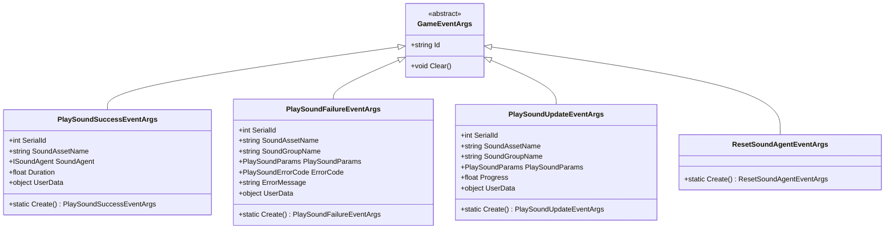
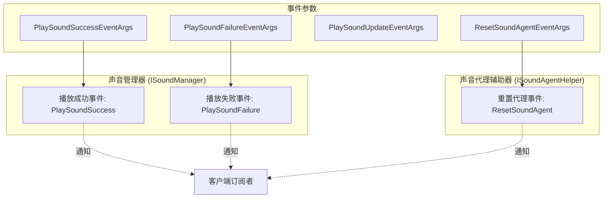
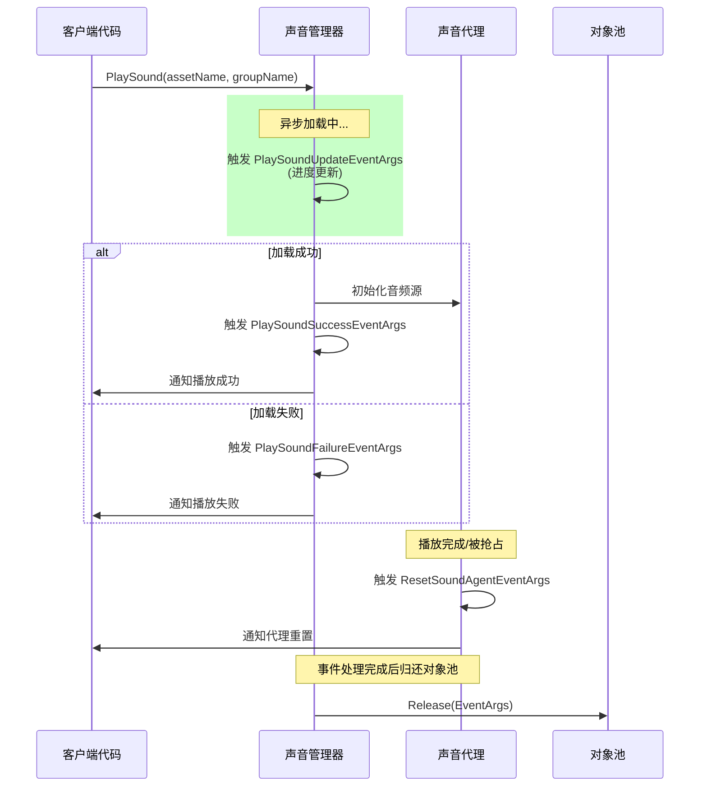

# イベントパラメータ

本节詳細介绍 GameFrameX 声音系统中使用的イベントパラメータ类，这些类用于在声音再生过程中传递イベント数据，使外部コンポーネント能够响应声音再生的成功、失敗、アップデートおよび声音代理重置等ステータス变化。

## 概要

GameFrameX 声音系统采用イベント驱动アーキテクチャ，当声音再生ステータス发生变化时，系统会抛出相应的イベント并携带詳細的イベントパラメータ。这些イベントパラメータ类均継承自 `GameFrameX.Event.Runtime.GameEventArgs` 基底クラス，提供します統一された的对象池管理机制以最適化内存使用。

イベントパラメータ在系统中的主な作用含みます：

- **ステータス通知**：将声音再生的結果（成功或失敗）通知给購読者
- **進捗追踪**：提供非同期ロード進捗情報用于 UI 表示
- **エラー処理**：携带エラー码和エラー情報便于問題診断
- **代理管理**：通知声音代理〜する必要があります重置以复用リソース

## イベントパラメータ类体系

GameFrameX 声音系统定義了四个コアイベントパラメータ类，分别对应不同的声音系统ステータス变化。



### イベント流与コンポーネント关系



## コアイベントパラメータ详解

### PlaySoundSuccessEventArgs

`PlaySoundSuccessEventArgs` 在声音成功开始再生时トリガー，パッケージ含了再生操作的完全な結果情報。

```csharp
public sealed class PlaySoundSuccessEventArgs : GameEventArgs
{
    /// <summary>
    /// 获取声音的序列编号。
    /// </summary>
    public int SerialId { get; private set; }

    /// <summary>
    /// 获取声音资源名称。
    /// </summary>
    public string SoundAssetName { get; private set; }

    /// <summary>
    /// 获取用于播放的声音代理。
    /// </summary>
    public ISoundAgent SoundAgent { get; private set; }

    /// <summary>
    /// 获取加载持续时间。
    /// </summary>
    public float Duration { get; private set; }

    /// <summary>
    /// 获取用户自定义数据。
    /// </summary>
    public object UserData { get; private set; }

    public static PlaySoundSuccessEventArgs Create(int serialId, string soundAssetName, 
        ISoundAgent soundAgent, float duration, object userData)
    {
        // 从对象池获取实例并初始化
    }
}
```
> Source: [PlaySoundSuccessEventArgs.cs](https://github.com/GameFrameX/com.gameframex.unity.sound/blob/main/Runtime/EventArgs/PlaySoundSuccessEventArgs.cs#L41-L98)

**使用シーン**：当〜する必要があります知道声音是否成功再生、取得用于控制再生的 SoundAgent 代理インスタンス，或记录ロード耗时等シーン时購読此イベント。

---

### PlaySoundFailureEventArgs

`PlaySoundFailureEventArgs` 在声音再生失敗时トリガー，携带詳細的エラー情報以便診断問題。

```csharp
public sealed class PlaySoundFailureEventArgs : GameEventArgs
{
    /// <summary>
    /// 获取声音的序列编号。
    /// </summary>
    public int SerialId { get; private set; }

    /// <summary>
    /// 获取声音资源名称。
    /// </summary>
    public string SoundAssetName { get; private set; }

    /// <summary>
    /// 获取声音组名称。
    /// </summary>
    public string SoundGroupName { get; private set; }

    /// <summary>
    /// 获取播放声音参数。
    /// </summary>
    public PlaySoundParams PlaySoundParams { get; private set; }

    /// <summary>
    /// 获取错误码。
    /// </summary>
    public PlaySoundErrorCode ErrorCode { get; private set; }

    /// <summary>
    /// 获取错误信息。
    /// </summary>
    public string ErrorMessage { get; private set; }

    /// <summary>
    /// 获取用户自定义数据。
    /// </summary>
    public object UserData { get; private set; }

    public static PlaySoundFailureEventArgs Create(int serialId, string soundAssetName, 
        string soundGroupName, PlaySoundParams playSoundParams, PlaySoundErrorCode errorCode, 
        string errorMessage, object userData)
    {
        // 从对象池获取实例并初始化
    }
}
```
> Source: [PlaySoundFailureEventArgs.cs](https://github.com/GameFrameX/com.gameframex.unity.sound/blob/main/Runtime/EventArgs/PlaySoundFailureEventArgs.cs#L41-L115)

**エラー码列挙型 (PlaySoundErrorCode)**：

| エラー码 | 説明 |
|--------|------|
| `Unknown` | 未知エラー |
| `SoundGroupNotExist` | 声音组不存在 |
| `SoundGroupHasNoAgent` | 声音组没有声音代理 |
| `LoadAssetFailure` | ロードリソース失敗 |
| `IgnoredDueToLowPriority` | 因优先级低被忽略 |
| `SetSoundAssetFailure` | 設定声音リソース失敗 |

> Source: [PlaySoundErrorCode.cs](https://github.com/GameFrameX/com.gameframex.unity.sound/blob/main/Runtime/Sound/Sound/PlaySoundErrorCode.cs#L38-L69)

---

### PlaySoundUpdateEventArgs

`PlaySoundUpdateEventArgs` 在非同期ロード声音リソース的过程中定期トリガー，用于报告ロード進捗。

```csharp
public sealed class PlaySoundUpdateEventArgs : GameEventArgs
{
    /// <summary>
    /// 获取声音的序列编号。
    /// </summary>
    public int SerialId { get; private set; }

    /// <summary>
    /// 获取声音资源名称。
    /// </summary>
    public string SoundAssetName { get; private set; }

    /// <summary>
    /// 获取声音组名称。
    /// </summary>
    public string SoundGroupName { get; private set; }

    /// <summary>
    /// 获取播放声音参数。
    /// </summary>
    public PlaySoundParams PlaySoundParams { get; private set; }

    /// <summary>
    /// 获取加载声音进度。
    /// </summary>
    public float Progress { get; private set; }

    /// <summary>
    /// 获取用户自定义数据。
    /// </summary>
    public object UserData { get; private set; }

    public static PlaySoundUpdateEventArgs Create(int serialId, string soundAssetName, 
        string soundGroupName, PlaySoundParams playSoundParams, float progress, object userData)
    {
        // 从对象池获取实例并初始化
    }
}
```
> Source: [PlaySoundUpdateEventArgs.cs](https://github.com/GameFrameX/com.gameframex.unity.sound/blob/main/Runtime/EventArgs/PlaySoundUpdateEventArgs.cs#L41-L106)

**使用シーン**：在 UI 上显示ロード進捗条，或进行其他〜する必要があります知道ロード進捗的操作。

---

### ResetSoundAgentEventArgs

`ResetSoundAgentEventArgs` は轻量级イベントパラメータ，当声音代理〜する必要があります重置（例えば再生完毕或被抢占）时トリガー。

```csharp
public sealed class ResetSoundAgentEventArgs : GameEventArgs
{
    /// <summary>
    /// 初始化重置声音代理事件的新实例。
    /// </summary>
    public ResetSoundAgentEventArgs()
    {
    }

    /// <summary>
    /// 创建重置声音代理事件。
    /// </summary>
    public static ResetSoundAgentEventArgs Create()
    {
        ResetSoundAgentEventArgs resetSoundAgentEventArgs = ReferencePool.Acquire<ResetSoundAgentEventArgs>();
        return resetSoundAgentEventArgs;
    }

    /// <summary>
    /// 清理重置声音代理事件。
    /// </summary>
    public override void Clear()
    {
    }

    public static readonly string EventId = typeof(ResetSoundAgentEventArgs).FullName;

    public override string Id => EventId;
}
```
> Source: [ResetSoundAgentEventArgs.cs](https://github.com/GameFrameX/com.gameframex.unity.sound/blob/main/Runtime/EventArgs/ResetSoundAgentEventArgs.cs#L41-L76)

**使用シーン**：监听声音代理的重置ステータス，以便进行リソース清理或ステータス同步。

---

## イベント購読与使用例

### 購読再生成功イベント

```csharp
// 获取声音管理器实例
var soundManager = GameEntry.GetManager<ISoundManager>();

// 订阅播放成功事件
soundManager.PlaySoundSuccess += OnPlaySoundSuccess;

private void OnPlaySoundSuccess(object sender, PlaySoundSuccessEventArgs e)
{
    UnityEngine.Debug.Log($"声音播放成功: {e.SoundAssetName}, 持续时间: {e.Duration}");
    // 可以通过 e.SoundAgent 控制播放，如暂停、停止等
    // e.UserData 包含播放时传入的自定义数据
}
```

> Source: [ISoundManager.cs](https://github.com/GameFrameX/com.gameframex.unity.sound/blob/main/Runtime/Interface/ISoundManager.cs#L50-L53)

### 購読再生失敗イベント

```csharp
soundManager.PlaySoundFailure += OnPlaySoundFailure;

private void OnPlaySoundFailure(object sender, PlaySoundFailureEventArgs e)
{
    UnityEngine.Debug.LogError($"声音播放失败: {e.SoundAssetName}, 错误码: {e.ErrorCode}, 错误信息: {e.ErrorMessage}");
    // 可以根据错误码进行不同的处理
    if (e.ErrorCode == PlaySoundErrorCode.SoundGroupNotExist)
    {
        // 处理声音组不存在的情况
    }
}
```

> Source: [ISoundManager.cs](https://github.com/GameFrameX/com.gameframex.unity.sound/blob/main/Runtime/Interface/ISoundManager.cs#L55-L58)

### 購読重置声音代理イベント

```csharp
// 声音代理辅助器接口
public interface ISoundAgentHelper
{
    /// <summary>
    /// 重置声音代理事件。
    /// </summary>
    event EventHandler<ResetSoundAgentEventArgs> ResetSoundAgent;
}
```
> Source: [ISoundAgentHelper.cs](https://github.com/GameFrameX/com.gameframex.unity.sound/blob/main/Runtime/Interface/ISoundAgentHelper.cs#L102-L105)

---

## 对象池机制

所有イベントパラメータ类都采用对象池モード进行管理，这是 GameFrameX フレームワーク的内存最適化策略：

1. **作成**：使用静态 `Create()` メソッド从对象池取得インスタンス
2. **使用**：填充イベントプロパティ
3. **解放**：イベント処理完成后，フレームワーク自动呼び出し `ReferencePool.Release()` 归还到对象池
4. **重置**：归还时呼び出し `Clear()` メソッド将所有プロパティ重置为デフォルト值

这种設計避免了频繁的对象分配和垃圾回收，提高了性能，特别是在频繁トリガーイベント的シーン下效果显著。

```csharp
// 事件参数创建示例
PlaySoundSuccessEventArgs args = PlaySoundSuccessEventArgs.Create(
    serialId: 1,
    soundAssetName: "bgm_music",
    soundAgent: soundAgent,
    duration: 180.5f,
    userData: null
);

// 触发事件
soundManager.PlaySoundSuccess?.Invoke(this, args);

// 归还到对象池
ReferencePool.Release(args);
```

---

## イベントトリガー时序



---

## 関連リンク

- [インターフェース定義](./5-api-reference.1-interfaces) - ISoundManager 和 ISoundAgentHelper インターフェース詳細定義
- [再生パラメータ](./5-api-reference.2-play-sound-params) - PlaySoundParams パラメータ設定説明
- [声音マネージャー](./4-core-concepts.1-sound-manager) - 声音マネージャーコアコンセプト与実装
- [声音代理](./4-core-concepts.3-sound-agent) - 声音代理コンポーネント详解
