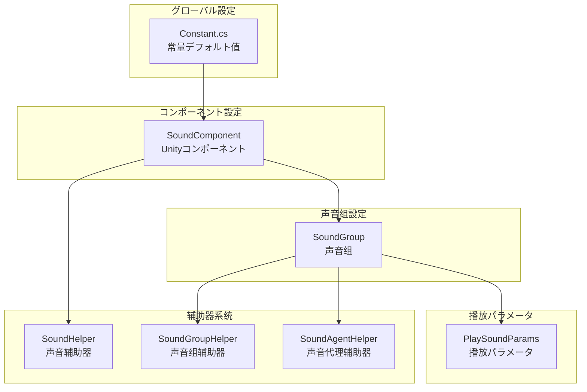
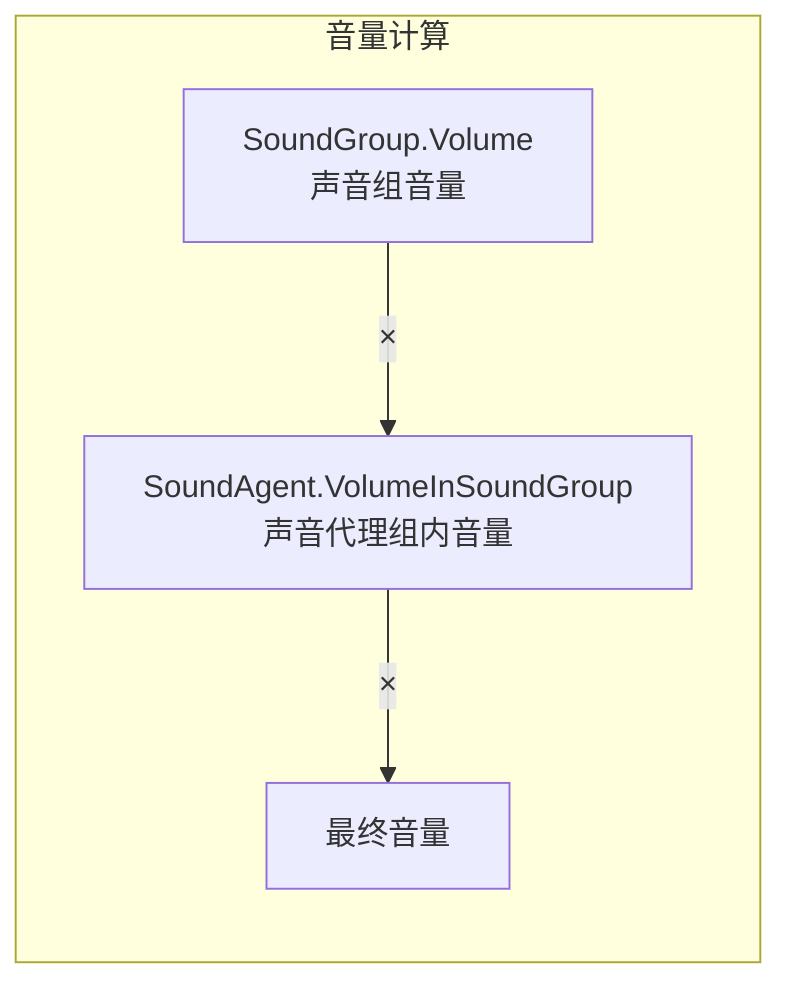

# 

ドキュメント GameFrameX Sound コンポーネントの，のオプションデフォルト。

## 

GameFrameX Sound コンポーネントアーキテクチャ，グローバルデフォルトのパラメータ，たの。にプロパティ，グローバルデフォルト，にの。

む：

1. **デフォルト** - のグローバルデフォルト
2. **** - の、、
3. **パラメータ** - のパラメータ
4. **** - の

## アーキテクチャ



### フロー

，ロード `Constant.cs` のデフォルトの。 `SoundComponent` に Unity ， Inspector の。、と。，をじて `PlaySoundParams` デフォルトのパラメータ。

## デフォルト

に `Runtime/Sound/Sound/Constant.cs` ファイル，はのデフォルト。

> Source: [Constant.cs](https://github.com/GameFrameX/com.gameframex.unity.sound/blob/main/Runtime/Sound/Sound/Constant.cs#L38-L99)

|  | タイプ | デフォルト |  |
|------|------|--------|------|
| DefaultTime | float | 0f | （） |
| DefaultMute | bool | false | デフォルトは |
| DefaultLoop | bool | false | デフォルトは |
| DefaultPriority | int | 0 | ロード |
| DefaultVolume | float | 1f | デフォルト（0.0-1.0） |
| DefaultFadeInSeconds | float | 0f | （） |
| DefaultFadeOutSeconds | float | 0f | （） |
| DefaultPitch | float | 1f | （0.5-2.0） |
| DefaultPanStereo | float | 0f | （-1.01.0） |
| DefaultSpatialBlend | float | 0f | （0.01.0） |
| DefaultMaxDistance | float | 100f |  |
| DefaultDopplerLevel | float | 1f |  |

## 

（SoundGroup）にの。、と。

### SoundComponent の

に Unity エディター，をじて `SoundComponent` コンポーネントの Inspector ：

> Source: [SoundComponent.SoundGroup.cs](https://github.com/GameFrameX/com.gameframex.unity.sound/blob/main/Runtime/Sound/SoundComponent.SoundGroup.cs#L45-L111)

```csharp
[Serializable]
private sealed class SoundGroup
{
    [SerializeField] private string m_Name = null;
    [SerializeField] private bool m_AvoidBeingReplacedBySamePriority = false;
    [SerializeField] private bool m_Mute = false;
    [SerializeField, Range(0f, 1f)] private float m_Volume = 1f;
    [SerializeField] private int m_AgentHelperCount = 1;
}
```

### パラメータ

| パラメータ | タイプ | デフォルト |  |
|------|------|--------|------|
| Name | string | - | ，にと |
| AvoidBeingReplacedBySamePriority | bool | false | は |
| Mute | bool | false | は |
| Volume | float | 1f | （0.0-1.0） |
| AgentHelperCount | int | 1 | ，の |

### 

をじて `ISoundGroup` インターフェースに：

> Source: [ISoundGroup.cs](https://github.com/GameFrameX/com.gameframex.unity.sound/blob/main/Runtime/Interface/ISoundGroup.cs#L38-L87)

```csharp
public interface ISoundGroup
{
    string Name { get; }
    int SoundAgentCount { get; }
    bool AvoidBeingReplacedBySamePriority { get; set; }
    bool Mute { get; set; }
    float Volume { get; set; }
    ISoundHelper Helper { get; }
}
```

### ：

```csharp
// を通じて SoundComponent 添加声音组
var soundComponent = GameEntry.GetComponent<SoundComponent>();
soundComponent.AddSoundGroup("背景音乐", 1);  // 名称と代理数量
soundComponent.AddSoundGroup("音效", 5);      // 同时サポート5个音效

// を通じて SoundManager 添加更詳細の声音组設定
soundComponent.AddSoundGroup(
    "语音",                    // 声音组名称
    true,                      // 避免被同优先级替换
    false,                     // 不静音
    0.8f,                      // 音量 80%
    3                          // 3个代理
);

// 获取声音组并动态调整
var soundGroup = soundComponent.GetSoundGroup("背景音乐");
soundGroup.Volume = 0.5f;  // 调整音量
soundGroup.Mute = true;    // 静音
```

## パラメータ

`PlaySoundParams` クラスにのパラメータ。パラメータにびし `PlaySound` メソッドオプションパラメータ。

> Source: [PlaySoundParams.cs](https://github.com/GameFrameX/com.gameframex.unity.sound/blob/main/Runtime/Sound/Sound/PlaySoundParams.cs#L40-L258)

### PlaySoundParams プロパティ

| プロパティ | タイプ | デフォルト |  |
|------|------|--------|------|
| Time | float | 0f | ， |
| MuteInSoundGroup | bool | false | には |
| Loop | bool | false | は |
| Priority | int | 0 | （） |
| VolumeInSoundGroup | float | 1f | にの |
| FadeInSeconds | float | 0f | （） |
| Pitch | float | 1f | （0.5-2.0，1） |
| PanStereo | float | 0f | （-1，1） |
| SpatialBlend | float | 0f | （02D，13D） |
| MaxDistance | float | 100f | 3Dの |
| DopplerLevel | float | 1f |  |

###  PlaySoundParams

```csharp
// 作成播放パラメータ
var playParams = PlaySoundParams.Create();

// 設定パラメータ
playParams.Loop = true;                    // 循环播放
playParams.VolumeInSoundGroup = 0.8f;      // 80% 音量
playParams.Pitch = 1.2f;                   // 稍微加快
playParams.FadeInSeconds = 0.5f;           // 0.5秒淡入
playParams.Priority = 100;                  // 高优先级

// 播放声音时传入パラメータ
await soundComponent.PlaySound("bgm_music", "背景音乐", playParams);

// 使用完た后释放（如果启用た引用计数）
if (playParams.Referenced)
{
    ReferencePool.Release(playParams);
}
```

## SoundComponent コンポーネント

`SoundComponent` は Unity にのコンポーネント。をじて Inspector コード。

> Source: [SoundComponent.cs](https://github.com/GameFrameX/com.gameframex.unity.sound/blob/main/Runtime/Sound/SoundComponent.cs#L46-L75)

### Inspector 

| プロパティ | タイプ | デフォルト |  |
|------|------|--------|------|
| Instance Root | Transform | null | の |
| Audio Mixer | AudioMixer | null | Unity  |
| Sound Helper Type Name | string | "GameFrameX.Sound.Runtime.DefaultSoundHelper" | タイプ |
| Custom Sound Helper | SoundHelperBase | null | カスタマイズ |
| Sound Group Helper Type Name | string | "GameFrameX.Sound.Runtime.DefaultSoundGroupHelper" | タイプ |
| Custom Sound Group Helper | SoundGroupHelperBase | null | カスタマイズ |
| Sound Agent Helper Type Name | string | "GameFrameX.Sound.Runtime.DefaultSoundAgentHelper" | タイプ |
| Custom Sound Agent Helper | SoundAgentHelperBase | null | カスタマイズ |
| Sound Groups | SoundGroup[] | null |  |

### コード SoundComponent

```csharp
// 作成 SoundComponent 并設定
var soundGameObject = new GameObject("Sound");
var soundComponent = soundGameObject.AddComponent<SoundComponent>();

// を通じてコード設定辅助器タイプ
// 注意：这些通常に Inspector 中設定
// soundComponent.m_SoundHelperTypeName = "MyCustomSoundHelper";
// soundComponent.m_SoundGroupHelperTypeName = "MyCustomSoundGroupHelper";
// soundComponent.m_SoundAgentHelperTypeName = "MyCustomSoundAgentHelper";

// 設定 AudioMixer
// soundComponent.m_AudioMixer = myAudioMixer;

// 設定实例根节点
// soundComponent.m_InstanceRoot = myInstanceRoot;
```

## 

GameFrameX Sound （Helper）。をじてクラスカスタマイズ。

### タイプ

|  | クラス |  |
|--------|------|------|
| SoundHelper | SoundHelperBase | リソースのロードと |
| SoundGroupHelper | SoundGroupHelperBase | の |
| SoundAgentHelper | SoundAgentHelperBase | の |

> Source: [SoundHelperBase.cs](https://github.com/GameFrameX/com.gameframex.unity.sound/blob/main/Runtime/Sound/SoundHelperBase.cs#L41-L48)

### カスタマイズ

```csharp
// カスタマイズ声音代理辅助器
public class MyCustomSoundAgentHelper : SoundAgentHelperBase
{
    private AudioSource _audioSource;

    public override bool IsPlaying => _audioSource?.isPlaying ?? false;
    public override float Length => _audioSource?.clip?.length ?? 0;
    public override float Time { get => _audioSource?.time ?? 0; set { if (_audioSource) _audioSource.time = value; } }
    public override bool Mute { get => _audioSource?.mute ?? false; set { if (_audioSource) _audioSource.mute = value; } }
    public override bool Loop { get => _audioSource?.loop ?? false; set { if (_audioSource) _audioSource.loop = value; } }
    public override int Priority { get => _audioSource?.priority ?? 128; set { if (_audioSource) _audioSource.priority = value; } }
    public override float Volume { get => _audioSource?.volume ?? 1f; set { if (_audioSource) _audioSource.volume = value; } }
    public override float Pitch { get => _audioSource?.pitch ?? 1f; set { if (_audioSource) _audioSource.pitch = value; } }
    public override float PanStereo { get => _audioSource?.panStereo ?? 0; set { if (_audioSource) _audioSource.panStereo = value; } }
    public override float SpatialBlend { get => _audioSource?.spatialBlend ?? 0; set { if (_audioSource) _audioSource.spatialBlend = value; } }
    public override float MaxDistance { get => _audioSource?.maxDistance ?? 100f; set { if (_audioSource) _audioSource.maxDistance = value; } }
    public override float DopplerLevel { get => _audioSource?.dopplerLevel ?? 1f; set { if (_audioSource) _audioSource.dopplerLevel = value; } }
    public override AudioMixerGroup AudioMixerGroup { get; set; }

    public override event EventHandler<ResetSoundAgentEventArgs> ResetSoundAgent;

    public override void Play(float fadeInSeconds)
    {
        _audioSource.Play();
    }

    public override void Stop(float fadeOutSeconds)
    {
        _audioSource.Stop();
    }

    public override void Pause(float fadeOutSeconds)
    {
        _audioSource.Pause();
    }

    public override void Resume(float fadeInSeconds)
    {
        _audioSource.UnPause();
    }

    public override void Reset()
    {
        if (_audioSource)
        {
            _audioSource.clip = null;
            _audioSource.Stop();
        }
    }

    public override bool SetSoundAsset(object soundAsset)
    {
        if (soundAsset is AudioClip clip)
        {
            _audioSource.clip = clip;
            return true;
        }
        return false;
    }

    public override void SetBindingEntity(Entity.Runtime.Entity bindingEntity)
    {
        // 实现3D声音绑定逻辑
    }

    public override void SetWorldPosition(Vector3 worldPosition)
    {
        if (_audioSource)
        {
            _audioSource.transform.position = worldPosition;
        }
    }

    private void Awake()
    {
        _audioSource = gameObject.AddComponent<AudioSource>();
        _audioSource.spatialBlend = 1f; // デフォルト为3D声音
    }
}
```

## 

の：



：` = SoundGroup.Volume × SoundAgent.VolumeInSoundGroup`

：
-  = 0.8（80%）
-  = 0.5（50%）
-  = 0.8 × 0.5 = 0.4（40%）

## 

はの：

```csharp
// 1. 初始化 SoundComponent
var soundGameObject = new GameObject("SoundSystem");
var soundComponent = soundGameObject.AddComponent<SoundComponent>();

// 2. 設定声音组（に Start 中自动处理，这里展示等效コード）
// を通じてコード添加声音组
soundComponent.AddSoundGroup("音乐", 1);                    // 背景音乐组，1个代理
soundComponent.AddSoundGroup("音效", 10);                   // 音效组，10个代理
soundComponent.AddSoundGroup("语音", 3, true, false, 0.8f, 3); // 语音组，3个代理，80%音量

// 3. 播放不同タイプの声音
// 播放背景音乐 - 循环
var bgmParams = PlaySoundParams.Create(true);
bgmParams.VolumeInSoundGroup = 0.6f;
bgmParams.FadeInSeconds = 1.0f;
await soundComponent.PlaySound("assets/audio/bgm_title", "音乐", bgmParams);

// 播放音效 - 一次播放
var sfxParams = PlaySoundParams.Create(false);
sfxParams.VolumeInSoundGroup = 1.0f;
sfxParams.Priority = 100;  // 高优先级
await soundComponent.PlaySound("assets/audio/sfx_click", "音效", sfxParams);

// 播放3D音效
var posParams = PlaySoundParams.Create(false);
posParams.SpatialBlend = 1.0f;  // 3D声音
posParams.MaxDistance = 50f;
await soundComponent.PlaySound("assets/audio/sfx_footstep", "音效", posParams, Vector3.one * 10);

// 4. 実行时控制
var musicGroup = soundComponent.GetSoundGroup("音乐");
musicGroup.Volume = 0.5f;  // 调整背景音乐音量
musicGroup.Mute = false;   // 取消静音

// 5. 停止声音
soundComponent.StopAllLoadedSounds(0.5f);  // 0.5秒淡出
```

## リンク

- [コアコンセプト - マネージャー](./4-core-concepts.1-sound-manager)
- [コアコンセプト - ](./4-core-concepts.2-sound-group)
- [コアコンセプト - ](./4-core-concepts.3-sound-agent)
- [API リファレンス - インターフェース](./5-api-reference.1-interfaces)
- [API リファレンス - パラメータ](./5-api-reference.2-play-sound-params)
- [ガイド](./7-extending)
