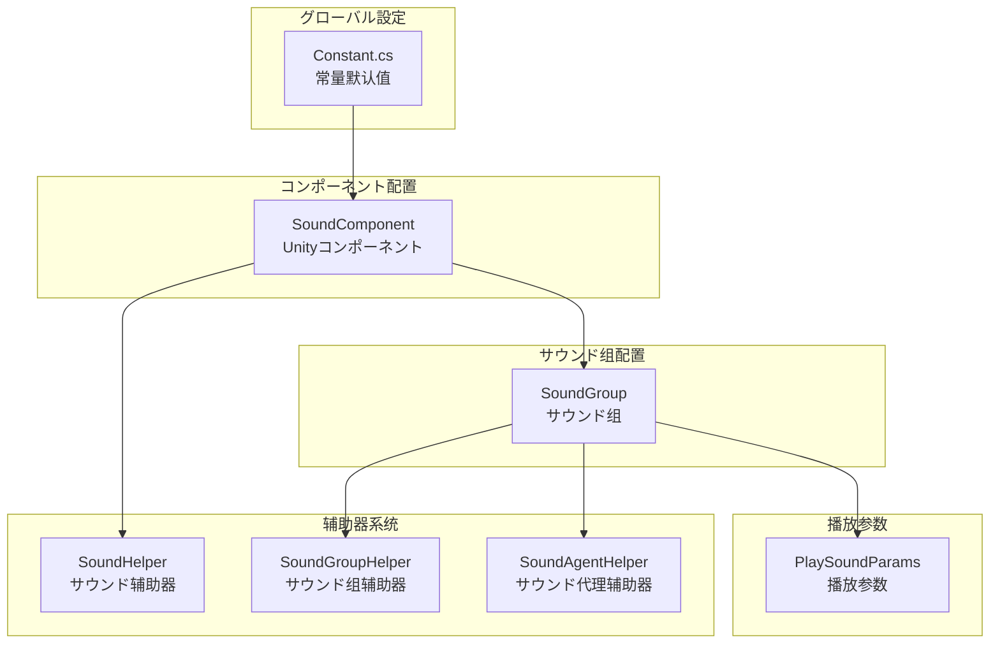
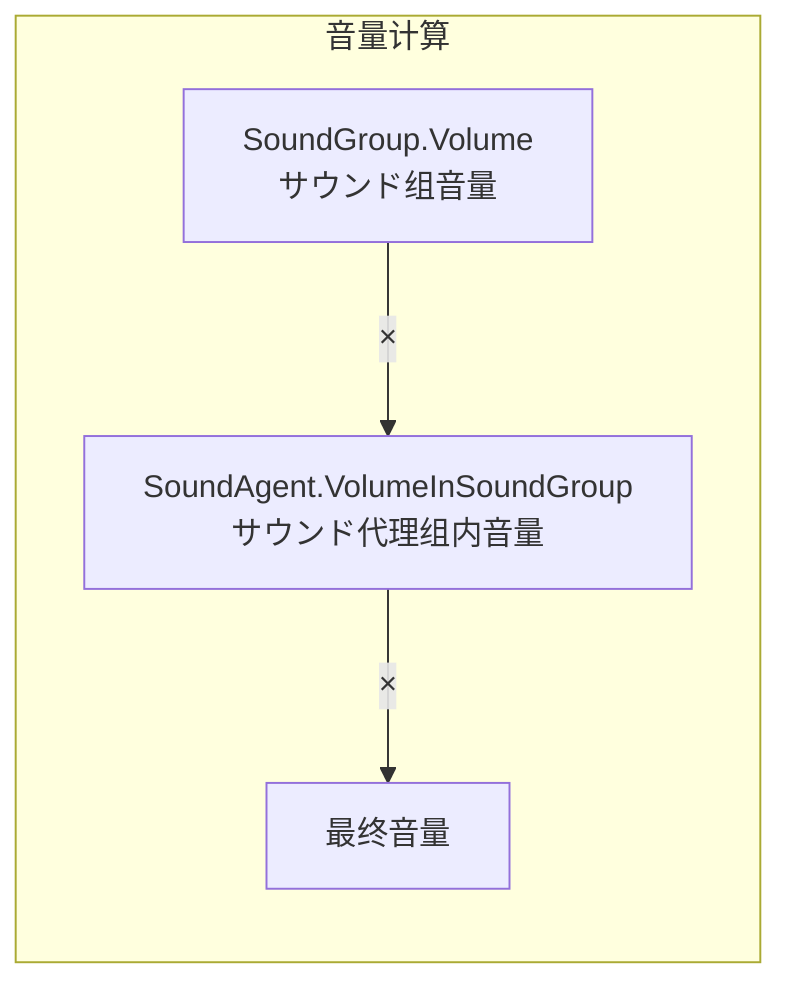

# 設定説明

本文档详细介绍 GameFrameX Sound サウンドコンポーネント的配置系统，涵盖所有可配置的选项及其默认值。

## 概要

GameFrameX Sound コンポーネント采用分层配置架构，从全局默认值到单个サウンド的播放参数，形成了完整的配置体系。这种设计允许開発者在不同层级設定サウンドプロパティ，既可能設定全局默认值，也可能在必要时覆盖单个サウンド的播放行为。

配置系统主要包含以下几个层级：

1. **常量默认值** - 系统级的全局默认值
2. **サウンド组配置** - サウンド组的音量、静音、同优先级替换策略
3. **播放参数配置** - 单个サウンド的播放参数
4. **辅助器配置** - 可扩展的辅助器系统

## 設定架构



### 設定フロー説明

系统初期化时，首先加载 `Constant.cs` 中的常量默认值作为所有サウンド的基准。然后 `SoundComponent` 在 Unity シーン中启动时，会に基づいて Inspector 面板中的設定作成サウンド组。每个サウンド组可能独立配置音量、静音ステータス和代理数量。当播放サウンド时，可能を通じて `PlaySoundParams` 覆盖默认的播放参数。

## 常量默认值

常量定义在 `Runtime/Sound/Sound/Constant.cs` ファイル中，这些值是整个系统的基础默认值。

> Source: [Constant.cs](https://github.com/GameFrameX/com.gameframex.unity.sound/blob/main/Runtime/Sound/Sound/Constant.cs#L38-L99)

| 常量 | クラス型 | 默认值 | 説明 |
|------|------|--------|------|
| DefaultTime | float | 0f | 播放位置（秒） |
| DefaultMute | bool | false | 默认是否静音 |
| DefaultLoop | bool | false | 默认是否循环播放 |
| DefaultPriority | int | 0 | サウンド加载优先级 |
| DefaultVolume | float | 1f | 默认音量（0.0-1.0） |
| DefaultFadeInSeconds | float | 0f | 淡入时间（秒） |
| DefaultFadeOutSeconds | float | 0f | 淡出时间（秒） |
| DefaultPitch | float | 1f | 音调（0.5-2.0） |
| DefaultPanStereo | float | 0f | 立体声相（-1.0到1.0） |
| DefaultSpatialBlend | float | 0f | 空间混合量（0.0到1.0） |
| DefaultMaxDistance | float | 100f | 最大距离 |
| DefaultDopplerLevel | float | 1f | 多普勒等级 |

## サウンド组配置

サウンド组（SoundGroup）に使用管理一组関連サウンド的共享設定。每个サウンド组可能独立控制音量、静音ステータス和サウンド代理数量。

### SoundComponent 中的サウンド组配置

在 Unity 编辑器中，を通じて `SoundComponent` コンポーネント的 Inspector 面板配置サウンド组：

> Source: [SoundComponent.SoundGroup.cs](https://github.com/GameFrameX/com.gameframex.unity.sound/blob/main/Runtime/Sound/SoundComponent.SoundGroup.cs#L45-L111)

```csharp
[Serializable]
private sealed class SoundGroup
{
    [SerializeField] private string m_Name = null;
    [SerializeField] private bool m_AvoidBeingReplacedBySamePriority = false;
    [SerializeField] private bool m_Mute = false;
    [SerializeField, Range(0f, 1f)] private float m_Volume = 1f;
    [SerializeField] private int m_AgentHelperCount = 1;
}
```

### サウンド组参数説明

| 参数 | クラス型 | 默认值 | 説明 |
|------|------|--------|------|
| Name | string | - | サウンド组名称，に使用标识和取得サウンド组 |
| AvoidBeingReplacedBySamePriority | bool | false | 是否避免被同优先级サウンド替换 |
| Mute | bool | false | サウンド组是否静音 |
| Volume | float | 1f | サウンド组音量（0.0-1.0） |
| AgentHelperCount | int | 1 | サウンド代理辅助器数量，决定可同时播放的サウンド数量 |

### 运行时动态配置

を通じて `ISoundGroup` インターフェース可能在运行时动态修改サウンド组配置：

> Source: [ISoundGroup.cs](https://github.com/GameFrameX/com.gameframex.unity.sound/blob/main/Runtime/Interface/ISoundGroup.cs#L38-L87)

```csharp
public interface ISoundGroup
{
    string Name { get; }
    int SoundAgentCount { get; }
    bool AvoidBeingReplacedBySamePriority { get; set; }
    bool Mute { get; set; }
    float Volume { get; set; }
    ISoundHelper Helper { get; }
}
```

### 設定示例：作成サウンド组

```csharp
// を通じて SoundComponent 添加サウンド组
var soundComponent = GameEntry.GetComponent<SoundComponent>();
soundComponent.AddSoundGroup("背景音乐", 1);  // 名称和代理数量
soundComponent.AddSoundGroup("音效", 5);      // 同时サポート5个音效

// を通じて SoundManager 添加更详细的サウンド组配置
soundComponent.AddSoundGroup(
    "语音",                    // サウンド组名称
    true,                      // 避免被同优先级替换
    false,                     // 不静音
    0.8f,                      // 音量 80%
    3                          // 3个代理
);

// 取得サウンド组并动态调整
var soundGroup = soundComponent.GetSoundGroup("背景音乐");
soundGroup.Volume = 0.5f;  // 调整音量
soundGroup.Mute = true;    // 静音
```

## 播放参数配置

`PlaySoundParams` クラスに使用配置单个サウンド的播放参数。这些参数在呼び出し `PlaySound` メソッド时作为可选参数传入。

> Source: [PlaySoundParams.cs](https://github.com/GameFrameX/com.gameframex.unity.sound/blob/main/Runtime/Sound/Sound/PlaySoundParams.cs#L40-L258)

### PlaySoundParams プロパティ

| プロパティ | クラス型 | 默认值 | 説明 |
|------|------|--------|------|
| Time | float | 0f | 播放位置，从指定时间开始播放 |
| MuteInSoundGroup | bool | false | 在サウンド组内是否静音 |
| Loop | bool | false | 是否循环播放 |
| Priority | int | 0 | サウンド优先级（数值越高越优先） |
| VolumeInSoundGroup | float | 1f | 在サウンド组内的音量系数 |
| FadeInSeconds | float | 0f | 淡入时间（秒） |
| Pitch | float | 1f | 音调（0.5-2.0，1为正常） |
| PanStereo | float | 0f | 立体声相（-1为左声道，1为右声道） |
| SpatialBlend | float | 0f | 空间混合（0为2D，1为3D） |
| MaxDistance | float | 100f | 3Dサウンド的最大距离 |
| DopplerLevel | float | 1f | 多普勒效果等级 |

### 使用 PlaySoundParams

```csharp
// 作成播放参数
var playParams = PlaySoundParams.Create();

// 配置参数
playParams.Loop = true;                    // 循环播放
playParams.VolumeInSoundGroup = 0.8f;      // 80% 音量
playParams.Pitch = 1.2f;                   // 稍微加快
playParams.FadeInSeconds = 0.5f;           // 0.5秒淡入
playParams.Priority = 100;                  // 高优先级

// 播放サウンド时传入参数
await soundComponent.PlaySound("bgm_music", "背景音乐", playParams);

// 使用完成后释放（如果启用了引用计数）
if (playParams.Referenced)
{
    ReferencePool.Release(playParams);
}
```

## SoundComponent コンポーネント配置

`SoundComponent` 是 Unity シーン中に使用初期化サウンド系统的主コンポーネント。を通じて Inspector 面板或代码进行配置。

> Source: [SoundComponent.cs](https://github.com/GameFrameX/com.gameframex.unity.sound/blob/main/Runtime/Sound/SoundComponent.cs#L46-L75)

### Inspector 可配置项

| プロパティ | クラス型 | 默认值 | 説明 |
|------|------|--------|------|
| Instance Root | Transform | null | サウンドインスタンス的根节点 |
| Audio Mixer | AudioMixer | null | Unity 音频混音器 |
| Sound Helper Type Name | string | "GameFrameX.Sound.Runtime.DefaultSoundHelper" | サウンド辅助器クラス型 |
| Custom Sound Helper | SoundHelperBase | null | 自定义サウンド辅助器インスタンス |
| Sound Group Helper Type Name | string | "GameFrameX.Sound.Runtime.DefaultSoundGroupHelper" | サウンド组辅助器クラス型 |
| Custom Sound Group Helper | SoundGroupHelperBase | null | 自定义サウンド组辅助器インスタンス |
| Sound Agent Helper Type Name | string | "GameFrameX.Sound.Runtime.DefaultSoundAgentHelper" | サウンド代理辅助器クラス型 |
| Custom Sound Agent Helper | SoundAgentHelperBase | null | 自定义サウンド代理辅助器インスタンス |
| Sound Groups | SoundGroup[] | null | サウンド组数组 |

### 代码配置 SoundComponent

```csharp
// 作成 SoundComponent 并配置
var soundGameObject = new GameObject("Sound");
var soundComponent = soundGameObject.AddComponent<SoundComponent>();

// を通じて代码配置辅助器クラス型
// 注意：这些通常在 Inspector 中配置
// soundComponent.m_SoundHelperTypeName = "MyCustomSoundHelper";
// soundComponent.m_SoundGroupHelperTypeName = "MyCustomSoundGroupHelper";
// soundComponent.m_SoundAgentHelperTypeName = "MyCustomSoundAgentHelper";

// 配置 AudioMixer
// soundComponent.m_AudioMixer = myAudioMixer;

// 配置インスタンス根节点
// soundComponent.m_InstanceRoot = myInstanceRoot;
```

## 辅助器系统配置

GameFrameX Sound 采用辅助器（Helper）模式実装可扩展性。開発者可能を通じて继承基クラス作成自定义辅助器。

### 辅助器クラス型

| 辅助器 | 基クラス | 用途 |
|--------|------|------|
| SoundHelper | SoundHelperBase | 管理サウンドリソース的加载和释放 |
| SoundGroupHelper | SoundGroupHelperBase | 管理サウンド组的音频混合 |
| SoundAgentHelper | SoundAgentHelperBase | 控制单个サウンド的播放行为 |

> Source: [SoundHelperBase.cs](https://github.com/GameFrameX/com.gameframex.unity.sound/blob/main/Runtime/Sound/SoundHelperBase.cs#L41-L48)

### 自定义辅助器示例

```csharp
// 自定义サウンド代理辅助器
public class MyCustomSoundAgentHelper : SoundAgentHelperBase
{
    private AudioSource _audioSource;

    public override bool IsPlaying => _audioSource?.isPlaying ?? false;
    public override float Length => _audioSource?.clip?.length ?? 0;
    public override float Time { get => _audioSource?.time ?? 0; set { if (_audioSource) _audioSource.time = value; } }
    public override bool Mute { get => _audioSource?.mute ?? false; set { if (_audioSource) _audioSource.mute = value; } }
    public override bool Loop { get => _audioSource?.loop ?? false; set { if (_audioSource) _audioSource.loop = value; } }
    public override int Priority { get => _audioSource?.priority ?? 128; set { if (_audioSource) _audioSource.priority = value; } }
    public override float Volume { get => _audioSource?.volume ?? 1f; set { if (_audioSource) _audioSource.volume = value; } }
    public override float Pitch { get => _audioSource?.pitch ?? 1f; set { if (_audioSource) _audioSource.pitch = value; } }
    public override float PanStereo { get => _audioSource?.panStereo ?? 0; set { if (_audioSource) _audioSource.panStereo = value; } }
    public override float SpatialBlend { get => _audioSource?.spatialBlend ?? 0; set { if (_audioSource) _audioSource.spatialBlend = value; } }
    public override float MaxDistance { get => _audioSource?.maxDistance ?? 100f; set { if (_audioSource) _audioSource.maxDistance = value; } }
    public override float DopplerLevel { get => _audioSource?.dopplerLevel ?? 1f; set { if (_audioSource) _audioSource.dopplerLevel = value; } }
    public override AudioMixerGroup AudioMixerGroup { get; set; }

    public override event EventHandler<ResetSoundAgentEventArgs> ResetSoundAgent;

    public override void Play(float fadeInSeconds)
    {
        _audioSource.Play();
    }

    public override void Stop(float fadeOutSeconds)
    {
        _audioSource.Stop();
    }

    public override void Pause(float fadeOutSeconds)
    {
        _audioSource.Pause();
    }

    public override void Resume(float fadeInSeconds)
    {
        _audioSource.UnPause();
    }

    public override void Reset()
    {
        if (_audioSource)
        {
            _audioSource.clip = null;
            _audioSource.Stop();
        }
    }

    public override bool SetSoundAsset(object soundAsset)
    {
        if (soundAsset is AudioClip clip)
        {
            _audioSource.clip = clip;
            return true;
        }
        return false;
    }

    public override void SetBindingEntity(Entity.Runtime.Entity bindingEntity)
    {
        // 実装3Dサウンド绑定逻辑
    }

    public override void SetWorldPosition(Vector3 worldPosition)
    {
        if (_audioSource)
        {
            _audioSource.transform.position = worldPosition;
        }
    }

    private void Awake()
    {
        _audioSource = gameObject.AddComponent<AudioSource>();
        _audioSource.spatialBlend = 1f; // 默认为3Dサウンド
    }
}
```

## 音量计算层级

最终的播放音量由多个层级相乘决定：



计算公式为：`最终音量 = SoundGroup.Volume × SoundAgent.VolumeInSoundGroup`

例如：
- サウンド组音量 = 0.8（80%）
- サウンド播放音量 = 0.5（50%）
- 最终音量 = 0.8 × 0.5 = 0.4（40%）

## 完整配置示例

以下は完整的サウンド系统配置示例：

```csharp
// 1. 初期化 SoundComponent
var soundGameObject = new GameObject("SoundSystem");
var soundComponent = soundGameObject.AddComponent<SoundComponent>();

// 2. 配置サウンド组（在 Start 中自动处理，这里展示等效代码）
// を通じて代码添加サウンド组
soundComponent.AddSoundGroup("音乐", 1);                    // 背景音乐组，1个代理
soundComponent.AddSoundGroup("音效", 10);                   // 音效组，10个代理
soundComponent.AddSoundGroup("语音", 3, true, false, 0.8f, 3); // 语音组，3个代理，80%音量

// 3. 播放不同クラス型的サウンド
// 播放背景音乐 - 循环
var bgmParams = PlaySoundParams.Create(true);
bgmParams.VolumeInSoundGroup = 0.6f;
bgmParams.FadeInSeconds = 1.0f;
await soundComponent.PlaySound("assets/audio/bgm_title", "音乐", bgmParams);

// 播放音效 - 一次播放
var sfxParams = PlaySoundParams.Create(false);
sfxParams.VolumeInSoundGroup = 1.0f;
sfxParams.Priority = 100;  // 高优先级
await soundComponent.PlaySound("assets/audio/sfx_click", "音效", sfxParams);

// 播放3D音效
var posParams = PlaySoundParams.Create(false);
posParams.SpatialBlend = 1.0f;  // 3Dサウンド
posParams.MaxDistance = 50f;
await soundComponent.PlaySound("assets/audio/sfx_footstep", "音效", posParams, Vector3.one * 10);

// 4. 运行时控制
var musicGroup = soundComponent.GetSoundGroup("音乐");
musicGroup.Volume = 0.5f;  // 调整背景音乐音量
musicGroup.Mute = false;   // 取消静音

// 5. 停止サウンド
soundComponent.StopAllLoadedSounds(0.5f);  // 0.5秒淡出
```

## 関連リンク

- [コア概念 - サウンド管理器](./4-core-concepts.1-sound-manager)
- [コア概念 - サウンド组](./4-core-concepts.2-sound-group)
- [コア概念 - サウンド代理](./4-core-concepts.3-sound-agent)
- [API 参考 - インターフェース定义](./5-api-reference.1-interfaces)
- [API 参考 - 播放参数](./5-api-reference.2-play-sound-params)
- [扩展指南](./7-extending)
