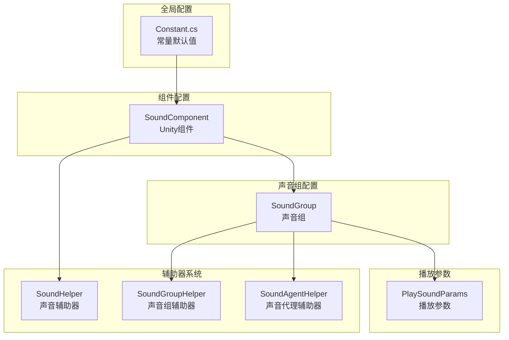
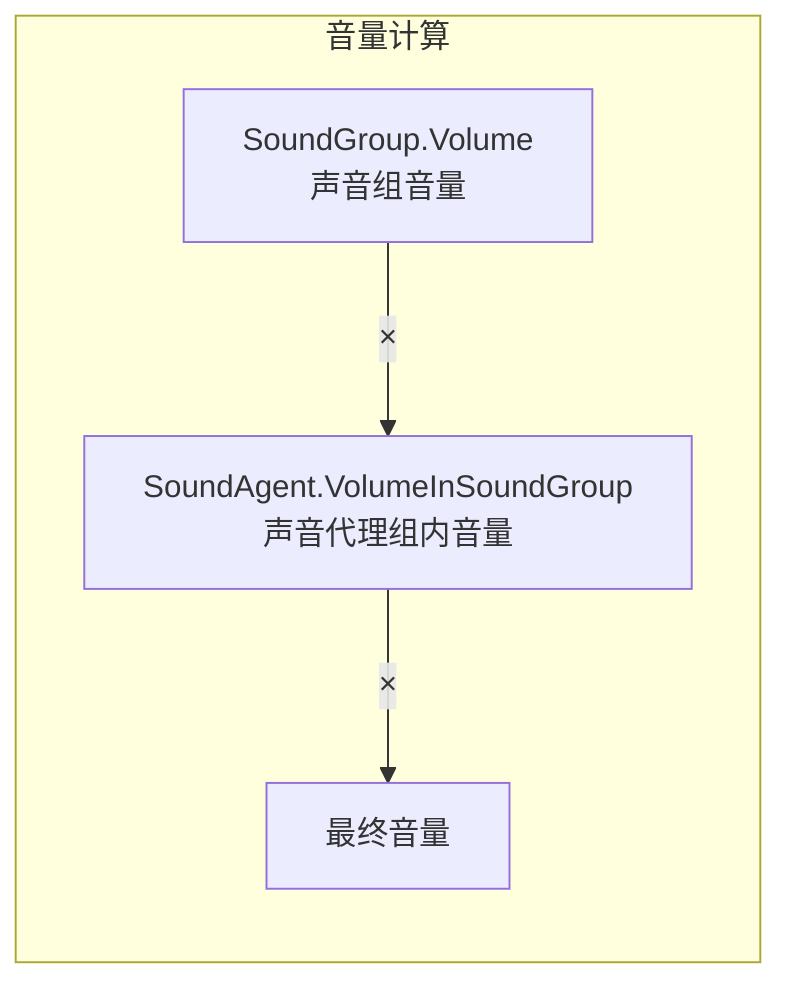

# 設定説明

このドキュメント詳細介绍 GameFrameX Sound 声音コンポーネント的設定系统，涵盖所有可設定的オプション及其デフォルト值。

## 概要

GameFrameX Sound コンポーネント采用分层設定アーキテクチャ，从全局デフォルト值到单个声音的再生パラメータ，形成了完全な的設定体系。这种設計允许開発者在不同层级設定声音プロパティ，既〜できます設定全局デフォルト值，也〜できます在〜する必要があります时覆盖单个声音的再生行为。

設定系统主なパッケージ含以下几个层级：

1. **常量デフォルト值** - 系统级的全局デフォルト值
2. **声音组設定** - 声音组的音量、静音、同优先级置換策略
3. **再生パラメータ設定** - 单个声音的再生パラメータ
4. **辅助器設定** - 可拡張的辅助器系统

## 設定アーキテクチャ



### 設定フロー説明

系统初期化时，まずロード `Constant.cs` 中的常量デフォルト值作为所有声音的基准。次に `SoundComponent` 在 Unity シーン中启动时，会根据 Inspector パネル中的設定作成声音组。每个声音组〜できます独立設定音量、静音ステータス和代理数量。当再生声音时，〜できます通过 `PlaySoundParams` 覆盖デフォルト的再生パラメータ。

## 常量デフォルト值

常量定義在 `Runtime/Sound/Sound/Constant.cs` ファイル中，这些值是整个系统的基本デフォルト值。

> Source: [Constant.cs](https://github.com/GameFrameX/com.gameframex.unity.sound/blob/main/Runtime/Sound/Sound/Constant.cs#L38-L99)

| 常量 | タイプ | デフォルト值 | 説明 |
|------|------|--------|------|
| DefaultTime | float | 0f | 再生位置（秒） |
| DefaultMute | bool | false | デフォルト是否静音 |
| DefaultLoop | bool | false | デフォルト是否循环再生 |
| DefaultPriority | int | 0 | 声音ロード优先级 |
| DefaultVolume | float | 1f | デフォルト音量（0.0-1.0） |
| DefaultFadeInSeconds | float | 0f | 淡入时间（秒） |
| DefaultFadeOutSeconds | float | 0f | 淡出时间（秒） |
| DefaultPitch | float | 1f | 音调（0.5-2.0） |
| DefaultPanStereo | float | 0f | 立体声相（-1.0到1.0） |
| DefaultSpatialBlend | float | 0f | 空间混合量（0.0到1.0） |
| DefaultMaxDistance | float | 100f | 最大距离 |
| DefaultDopplerLevel | float | 1f | 多普勒等级 |

## 声音组設定

声音组（SoundGroup）用于管理一组相关声音的共享設定。每个声音组〜できます独立控制音量、静音ステータス和声音代理数量。

### SoundComponent 中的声音组設定

在 Unity エディタ中，通过 `SoundComponent` コンポーネント的 Inspector パネル設定声音组：

> Source: [SoundComponent.SoundGroup.cs](https://github.com/GameFrameX/com.gameframex.unity.sound/blob/main/Runtime/Sound/SoundComponent.SoundGroup.cs#L45-L111)

```csharp
[Serializable]
private sealed class SoundGroup
{
    [SerializeField] private string m_Name = null;
    [SerializeField] private bool m_AvoidBeingReplacedBySamePriority = false;
    [SerializeField] private bool m_Mute = false;
    [SerializeField, Range(0f, 1f)] private float m_Volume = 1f;
    [SerializeField] private int m_AgentHelperCount = 1;
}
```

### 声音组パラメータ説明

| パラメータ | タイプ | デフォルト值 | 説明 |
|------|------|--------|------|
| Name | string | - | 声音组名称，用于标识和取得声音组 |
| AvoidBeingReplacedBySamePriority | bool | false | 是否避免被同优先级声音置換 |
| Mute | bool | false | 声音组是否静音 |
| Volume | float | 1f | 声音组音量（0.0-1.0） |
| AgentHelperCount | int | 1 | 声音代理辅助器数量，决定可同時に再生的声音数量 |

### ランタイム动态設定

通过 `ISoundGroup` インターフェース〜できます在ランタイム动态変更声音组設定：

> Source: [ISoundGroup.cs](https://github.com/GameFrameX/com.gameframex.unity.sound/blob/main/Runtime/Interface/ISoundGroup.cs#L38-L87)

```csharp
public interface ISoundGroup
{
    string Name { get; }
    int SoundAgentCount { get; }
    bool AvoidBeingReplacedBySamePriority { get; set; }
    bool Mute { get; set; }
    float Volume { get; set; }
    ISoundHelper Helper { get; }
}
```

### 設定例：作成声音组

```csharp
// 通过 SoundComponent 添加声音组
var soundComponent = GameEntry.GetComponent<SoundComponent>();
soundComponent.AddSoundGroup("背景音乐", 1);  // 名称和代理数量
soundComponent.AddSoundGroup("音效", 5);      // 同时支持5个音效

// 通过 SoundManager 添加更详细的声音组配置
soundComponent.AddSoundGroup(
    "语音",                    // 声音组名称
    true,                      // 避免被同优先级替换
    false,                     // 不静音
    0.8f,                      // 音量 80%
    3                          // 3个代理
);

// 获取声音组并动态调整
var soundGroup = soundComponent.GetSoundGroup("背景音乐");
soundGroup.Volume = 0.5f;  // 调整音量
soundGroup.Mute = true;    // 静音
```

## 再生パラメータ設定

`PlaySoundParams` 类用于設定单个声音的再生パラメータ。这些パラメータ在呼び出し `PlaySound` メソッド时作为可选パラメータ传入。

> Source: [PlaySoundParams.cs](https://github.com/GameFrameX/com.gameframex.unity.sound/blob/main/Runtime/Sound/Sound/PlaySoundParams.cs#L40-L258)

### PlaySoundParams プロパティ

| プロパティ | タイプ | デフォルト值 | 説明 |
|------|------|--------|------|
| Time | float | 0f | 再生位置，从指定时间开始再生 |
| MuteInSoundGroup | bool | false | 在声音组内是否静音 |
| Loop | bool | false | 是否循环再生 |
| Priority | int | 0 | 声音优先级（数值越高越优先） |
| VolumeInSoundGroup | float | 1f | 在声音组内的音量系数 |
| FadeInSeconds | float | 0f | 淡入时间（秒） |
| Pitch | float | 1f | 音调（0.5-2.0，1为正常） |
| PanStereo | float | 0f | 立体声相（-1为左声道，1为右声道） |
| SpatialBlend | float | 0f | 空间混合（0为2D，1为3D） |
| MaxDistance | float | 100f | 3D声音的最大距离 |
| DopplerLevel | float | 1f | 多普勒效果等级 |

### 使用 PlaySoundParams

```csharp
// 创建播放参数
var playParams = PlaySoundParams.Create();

// 配置参数
playParams.Loop = true;                    // 循环播放
playParams.VolumeInSoundGroup = 0.8f;      // 80% 音量
playParams.Pitch = 1.2f;                   // 稍微加快
playParams.FadeInSeconds = 0.5f;           // 0.5秒淡入
playParams.Priority = 100;                  // 高优先级

// 播放声音时传入参数
await soundComponent.PlaySound("bgm_music", "背景音乐", playParams);

// 使用完成后释放（如果启用了引用计数）
if (playParams.Referenced)
{
    ReferencePool.Release(playParams);
}
```

## SoundComponent コンポーネント設定

`SoundComponent` 是 Unity シーン中用于初期化声音系统的主コンポーネント。通过 Inspector パネル或コード进行設定。

> Source: [SoundComponent.cs](https://github.com/GameFrameX/com.gameframex.unity.sound/blob/main/Runtime/Sound/SoundComponent.cs#L46-L75)

### Inspector 可設定项

| プロパティ | タイプ | デフォルト值 | 説明 |
|------|------|--------|------|
| Instance Root | Transform | null | 声音インスタンス的根节点 |
| Audio Mixer | AudioMixer | null | Unity 音频混音器 |
| Sound Helper Type Name | string | "GameFrameX.Sound.Runtime.DefaultSoundHelper" | 声音辅助器タイプ |
| Custom Sound Helper | SoundHelperBase | null | 自定義声音辅助器インスタンス |
| Sound Group Helper Type Name | string | "GameFrameX.Sound.Runtime.DefaultSoundGroupHelper" | 声音组辅助器タイプ |
| Custom Sound Group Helper | SoundGroupHelperBase | null | 自定義声音组辅助器インスタンス |
| Sound Agent Helper Type Name | string | "GameFrameX.Sound.Runtime.DefaultSoundAgentHelper" | 声音代理辅助器タイプ |
| Custom Sound Agent Helper | SoundAgentHelperBase | null | 自定義声音代理辅助器インスタンス |
| Sound Groups | SoundGroup[] | null | 声音组数组 |

### コード設定 SoundComponent

```csharp
// 创建 SoundComponent 并配置
var soundGameObject = new GameObject("Sound");
var soundComponent = soundGameObject.AddComponent<SoundComponent>();

// 通过代码配置辅助器类型
// 注意：这些通常在 Inspector 中配置
// soundComponent.m_SoundHelperTypeName = "MyCustomSoundHelper";
// soundComponent.m_SoundGroupHelperTypeName = "MyCustomSoundGroupHelper";
// soundComponent.m_SoundAgentHelperTypeName = "MyCustomSoundAgentHelper";

// 配置 AudioMixer
// soundComponent.m_AudioMixer = myAudioMixer;

// 配置实例根节点
// soundComponent.m_InstanceRoot = myInstanceRoot;
```

## 辅助器系统設定

GameFrameX Sound 采用辅助器（Helper）モード実装可拡張性。開発者〜できます通过継承基底クラス作成自定義辅助器。

### 辅助器タイプ

| 辅助器 | 基底クラス | 用途 |
|--------|------|------|
| SoundHelper | SoundHelperBase | 管理声音リソース的ロード和解放 |
| SoundGroupHelper | SoundGroupHelperBase | 管理声音组的音频混合 |
| SoundAgentHelper | SoundAgentHelperBase | 控制单个声音的再生行为 |

> Source: [SoundHelperBase.cs](https://github.com/GameFrameX/com.gameframex.unity.sound/blob/main/Runtime/Sound/SoundHelperBase.cs#L41-L48)

### 自定義辅助器例

```csharp
// 自定义声音代理辅助器
public class MyCustomSoundAgentHelper : SoundAgentHelperBase
{
    private AudioSource _audioSource;

    public override bool IsPlaying => _audioSource?.isPlaying ?? false;
    public override float Length => _audioSource?.clip?.length ?? 0;
    public override float Time { get => _audioSource?.time ?? 0; set { if (_audioSource) _audioSource.time = value; } }
    public override bool Mute { get => _audioSource?.mute ?? false; set { if (_audioSource) _audioSource.mute = value; } }
    public override bool Loop { get => _audioSource?.loop ?? false; set { if (_audioSource) _audioSource.loop = value; } }
    public override int Priority { get => _audioSource?.priority ?? 128; set { if (_audioSource) _audioSource.priority = value; } }
    public override float Volume { get => _audioSource?.volume ?? 1f; set { if (_audioSource) _audioSource.volume = value; } }
    public override float Pitch { get => _audioSource?.pitch ?? 1f; set { if (_audioSource) _audioSource.pitch = value; } }
    public override float PanStereo { get => _audioSource?.panStereo ?? 0; set { if (_audioSource) _audioSource.panStereo = value; } }
    public override float SpatialBlend { get => _audioSource?.spatialBlend ?? 0; set { if (_audioSource) _audioSource.spatialBlend = value; } }
    public override float MaxDistance { get => _audioSource?.maxDistance ?? 100f; set { if (_audioSource) _audioSource.maxDistance = value; } }
    public override float DopplerLevel { get => _audioSource?.dopplerLevel ?? 1f; set { if (_audioSource) _audioSource.dopplerLevel = value; } }
    public override AudioMixerGroup AudioMixerGroup { get; set; }

    public override event EventHandler<ResetSoundAgentEventArgs> ResetSoundAgent;

    public override void Play(float fadeInSeconds)
    {
        _audioSource.Play();
    }

    public override void Stop(float fadeOutSeconds)
    {
        _audioSource.Stop();
    }

    public override void Pause(float fadeOutSeconds)
    {
        _audioSource.Pause();
    }

    public override void Resume(float fadeInSeconds)
    {
        _audioSource.UnPause();
    }

    public override void Reset()
    {
        if (_audioSource)
        {
            _audioSource.clip = null;
            _audioSource.Stop();
        }
    }

    public override bool SetSoundAsset(object soundAsset)
    {
        if (soundAsset is AudioClip clip)
        {
            _audioSource.clip = clip;
            return true;
        }
        return false;
    }

    public override void SetBindingEntity(Entity.Runtime.Entity bindingEntity)
    {
        // 实现3D声音绑定逻辑
    }

    public override void SetWorldPosition(Vector3 worldPosition)
    {
        if (_audioSource)
        {
            _audioSource.transform.position = worldPosition;
        }
    }

    private void Awake()
    {
        _audioSource = gameObject.AddComponent<AudioSource>();
        _audioSource.spatialBlend = 1f; // 默认为3D声音
    }
}
```

## 音量计算层级

最终的再生音量由多个层级相乘决定：



计算公式为：`最终音量 = SoundGroup.Volume × SoundAgent.VolumeInSoundGroup`

例えば：
- 声音组音量 = 0.8（80%）
- 声音再生音量 = 0.5（50%）
- 最终音量 = 0.8 × 0.5 = 0.4（40%）

## 完全な設定例

以下は完全な的声音系统設定例：

```csharp
// 1. 初始化 SoundComponent
var soundGameObject = new GameObject("SoundSystem");
var soundComponent = soundGameObject.AddComponent<SoundComponent>();

// 2. 配置声音组（在 Start 中自动处理，这里展示等效代码）
// 通过代码添加声音组
soundComponent.AddSoundGroup("音乐", 1);                    // 背景音乐组，1个代理
soundComponent.AddSoundGroup("音效", 10);                   // 音效组，10个代理
soundComponent.AddSoundGroup("语音", 3, true, false, 0.8f, 3); // 语音组，3个代理，80%音量

// 3. 播放不同类型的声音
// 播放背景音乐 - 循环
var bgmParams = PlaySoundParams.Create(true);
bgmParams.VolumeInSoundGroup = 0.6f;
bgmParams.FadeInSeconds = 1.0f;
await soundComponent.PlaySound("assets/audio/bgm_title", "音乐", bgmParams);

// 播放音效 - 一次播放
var sfxParams = PlaySoundParams.Create(false);
sfxParams.VolumeInSoundGroup = 1.0f;
sfxParams.Priority = 100;  // 高优先级
await soundComponent.PlaySound("assets/audio/sfx_click", "音效", sfxParams);

// 播放3D音效
var posParams = PlaySoundParams.Create(false);
posParams.SpatialBlend = 1.0f;  // 3D声音
posParams.MaxDistance = 50f;
await soundComponent.PlaySound("assets/audio/sfx_footstep", "音效", posParams, Vector3.one * 10);

// 4. 运行时控制
var musicGroup = soundComponent.GetSoundGroup("音乐");
musicGroup.Volume = 0.5f;  // 调整背景音乐音量
musicGroup.Mute = false;   // 取消静音

// 5. 停止声音
soundComponent.StopAllLoadedSounds(0.5f);  // 0.5秒淡出
```

## 関連リンク

- [コアコンセプト - 声音マネージャー](./4-core-concepts.1-sound-manager)
- [コアコンセプト - 声音组](./4-core-concepts.2-sound-group)
- [コアコンセプト - 声音代理](./4-core-concepts.3-sound-agent)
- [API リファレンス - インターフェース定義](./5-api-reference.1-interfaces)
- [API リファレンス - 再生パラメータ](./5-api-reference.2-play-sound-params)
- [拡張ガイド](./7-extending)
