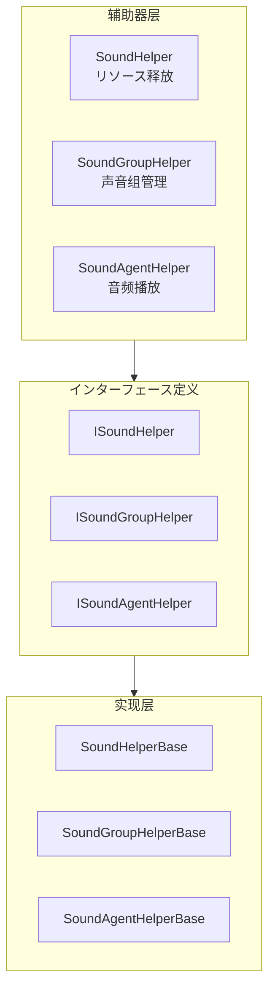

# ガイド

ドキュメント GameFrameX ，カスタマイズ、とのメソッド。

## 

GameFrameX モジュール，たプロジェクトの。をじてインターフェースとクラス，：

- カスタマイズのリソースロードと
- の
- デフォルトの（ FMOD、CRIWARE ）
- カスタマイズと

## アーキテクチャ

の，のコンポーネント：



### 

|  | インターフェース | クラス |  |
|--------|------|------|------|
|  | ISoundHelper | SoundHelperBase | カスタマイズリソース |
|  | ISoundGroupHelper | SoundGroupHelperBase | と |
|  | ISoundAgentHelper | SoundAgentHelperBase | （） |

## カスタマイズ

（SoundHelper）リソースの。デフォルトたにづく Unity リソースの。

### インターフェース

> Source: [ISoundHelper.cs](https://github.com/GameFrameX/com.gameframex.unity.sound/blob/main/Runtime/Interface/ISoundHelper.cs#L35-L46)

```csharp
namespace GameFrameX.Sound.Runtime
{
    public interface ISoundHelper
    {
        void ReleaseSoundAsset(object soundAsset);
    }
}
```

### クラス

> Source: [SoundHelperBase.cs](https://github.com/GameFrameX/com.gameframex.unity.sound/blob/main/Runtime/Sound/SoundHelperBase.cs#L38-L49)

```csharp
public abstract class SoundHelperBase : MonoBehaviour, ISoundHelper
{
    public abstract void ReleaseSoundAsset(object soundAsset);
}
```

### 

カスタマイズリソースの：

```csharp
using GameFrameX.Sound.Runtime;
using UnityEngine;

public class CustomSoundHelper : SoundHelperBase
{
    public override void ReleaseSoundAsset(object soundAsset)
    {
        if (soundAsset == null)
        {
            return;
        }

        // カスタマイズリソース释放逻辑
        // 例如：使用对象プール管理 AudioClip
        AudioClip clip = soundAsset as AudioClip;
        if (clip != null)
        {
            // 例：延迟释放或放入对象プール
            Resources.UnloadAsset(clip);
        }
    }
}
```

## カスタマイズ

（SoundGroupHelper）に，（AudioMixerGroup）の。

### インターフェース

> Source: [ISoundGroupHelper.cs](https://github.com/GameFrameX/com.gameframex.unity.sound/blob/main/Runtime/Interface/ISoundGroupHelper.cs#L35-L41)

```csharp
namespace GameFrameX.Sound.Runtime
{
    public interface ISoundGroupHelper
    {
    }
}
```

### クラス

> Source: [SoundGroupHelperBase.cs](https://github.com/GameFrameX/com.gameframex.unity.sound/blob/main/Runtime/Sound/SoundGroupHelperBase.cs#L38-L55)

```csharp
public abstract class SoundGroupHelperBase : MonoBehaviour, ISoundGroupHelper
{
    [SerializeField] private AudioMixerGroup m_AudioMixerGroup = null;

    public AudioMixerGroup AudioMixerGroup
    {
        get { return m_AudioMixerGroup; }
        set { m_AudioMixerGroup = value; }
    }
}
```

### 

```csharp
using GameFrameX.Sound.Runtime;
using UnityEngine;
using UnityEngine.Audio;

public class CustomSoundGroupHelper : SoundGroupHelperBase
{
    [SerializeField] private float m_CustomVolume = 1.0f;

    protected override void Awake()
    {
        base.Awake();
        
        // カスタマイズ初始化逻辑
        if (AudioMixerGroup != null)
        {
            Debug.Log($"SoundGroup initialized with mixer: {AudioMixerGroup.name}");
        }
    }

    public float CustomVolume
    {
        get { return m_CustomVolume; }
        set { m_CustomVolume = value; }
    }
}
```

## カスタマイズ（）

（SoundAgentHelper）はのコア，の。をじてカスタマイズ SoundAgentHelper，：

-  Unity AudioSource 
- （FMOD、CRIWARE、Wwise ）
- の
- カスタマイズの

### インターフェース

> Source: [ISoundAgentHelper.cs](https://github.com/GameFrameX/com.gameframex.unity.sound/blob/main/Runtime/Interface/ISoundAgentHelper.cs#L35-L143)

```csharp
namespace GameFrameX.Sound.Runtime
{
    public interface ISoundAgentHelper
    {
        // プロパティ
        bool IsPlaying { get; }
        float Length { get; }
        float Time { get; set; }
        bool Mute { get; set; }
        bool Loop { get; set; }
        int Priority { get; set; }
        float Volume { get; set; }
        float Pitch { get; set; }
        float PanStereo { get; set; }
        float SpatialBlend { get; set; }
        float MaxDistance { get; set; }
        float DopplerLevel { get; set; }

        // イベント
        event EventHandler<ResetSoundAgentEventArgs> ResetSoundAgent;

        // メソッド
        void Play(float fadeInSeconds);
        void Stop(float fadeOutSeconds);
        void Pause(float fadeOutSeconds);
        void Resume(float fadeInSeconds);
        void Reset();
        bool SetSoundAsset(object soundAsset);
    }
}
```

### クラス

> Source: [SoundAgentHelperBase.cs](https://github.com/GameFrameX/com.gameframex.unity.sound/blob/main/Runtime/Sound/SoundAgentHelperBase.cs#L38-L163)

クラス `MonoBehaviour`，カスタマイズクラス。

### ：

カスタマイズの SoundAgentHelper：

```csharp
using GameFrameX.Sound.Runtime;
using GameFrameX.Entity.Runtime;
using GameFrameX.Runtime;
using UnityEngine;
using UnityEngine.Audio;
using System;

public class CustomAudioSourceAgentHelper : SoundAgentHelperBase
{
    private AudioSource m_AudioSource;
    private bool m_IsPlaying;
    private float m_CurrentVolume = 1.0f;
    private EventHandler<ResetSoundAgentEventArgs> m_ResetEventHandler;

    public override bool IsPlaying => m_IsPlaying;

    public override float Length => m_AudioSource?.clip?.length ?? 0f;

    public override float Time
    {
        get => m_AudioSource.time;
        set => m_AudioSource.time = value;
    }

    public override bool Mute
    {
        get => m_AudioSource.mute;
        set => m_AudioSource.mute = value;
    }

    public override bool Loop
    {
        get => m_AudioSource.loop;
        set => m_AudioSource.loop = value;
    }

    public override int Priority
    {
        get => 128 - m_AudioSource.priority;
        set => m_AudioSource.priority = 128 - value;
    }

    public override float Volume
    {
        get => m_CurrentVolume;
        set
        {
            m_CurrentVolume = value;
            m_AudioSource.volume = value;
        }
    }

    public override float Pitch
    {
        get => m_AudioSource.pitch;
        set => m_AudioSource.pitch = value;
    }

    public override float PanStereo
    {
        get => m_AudioSource.panStereo;
        set => m_AudioSource.panStereo = value;
    }

    public override float SpatialBlend
    {
        get => m_AudioSource.spatialBlend;
        set => m_AudioSource.spatialBlend = value;
    }

    public override float MaxDistance
    {
        get => m_AudioSource.maxDistance;
        set => m_AudioSource.maxDistance = value;
    }

    public override float DopplerLevel
    {
        get => m_AudioSource.dopplerLevel;
        set => m_AudioSource.dopplerLevel = value;
    }

    public override AudioMixerGroup AudioMixerGroup
    {
        get => m_AudioSource.outputAudioMixerGroup;
        set => m_AudioSource.outputAudioMixerGroup = value;
    }

    public override event EventHandler<ResetSoundAgentEventArgs> ResetSoundAgent
    {
        add => m_ResetEventHandler += value;
        remove => m_ResetEventHandler -= value;
    }

    public override void Play(float fadeInSeconds)
    {
        m_IsPlaying = true;
        m_AudioSource.Play();
        // 可能添加淡入逻辑
    }

    public override void Stop(float fadeOutSeconds)
    {
        m_IsPlaying = false;
        m_AudioSource.Stop();
    }

    public override void Pause(float fadeOutSeconds)
    {
        m_IsPlaying = false;
        m_AudioSource.Pause();
    }

    public override void Resume(float fadeInSeconds)
    {
        m_IsPlaying = true;
        m_AudioSource.UnPause();
    }

    public override void Reset()
    {
        m_IsPlaying = false;
        m_AudioSource.clip = null;
    }

    public override bool SetSoundAsset(object soundAsset)
    {
        if (soundAsset is AudioClip clip)
        {
            m_AudioSource.clip = clip;
            return true;
        }
        return false;
    }

    public override void SetBindingEntity(Entity bindingEntity)
    {
        // 实现实体绑定逻辑
    }

    public override void SetWorldPosition(Vector3 worldPosition)
    {
        transform.position = worldPosition;
    }

    private void Awake()
    {
        m_AudioSource = gameObject.GetOrAddComponent<AudioSource>();
        m_AudioSource.playOnAwake = false;
    }
}
```

## カスタマイズ

に SoundComponent カスタマイズ：

### ：をじて Inspector （）

に Unity エディター，た SoundComponent のゲームオブジェクト，に Inspector ：

```csharp
// SoundComponent 字段説明
[SerializeField] private string m_SoundHelperTypeName = "GameFrameX.Sound.Runtime.DefaultSoundHelper";
[SerializeField] private SoundHelperBase m_CustomSoundHelper = null;

[SerializeField] private string m_SoundGroupHelperTypeName = "GameFrameX.Sound.Runtime.DefaultSoundGroupHelper";
[SerializeField] private SoundGroupHelperBase m_CustomSoundGroupHelper = null;

[SerializeField] private string m_SoundAgentHelperTypeName = "GameFrameX.Sound.Runtime.DefaultSoundAgentHelper";
[SerializeField] private SoundAgentHelperBase m_CustomSoundAgentHelper = null;
```

### ：コード

にカスタマイズと：

```csharp
// 获取 SoundComponent
var soundComponent = GameEntry.GetComponent<SoundComponent>();

// 添加カスタマイズ声音组
soundComponent.AddSoundGroup("CustomGroup", 4);

// 获取カスタマイズ声音组
var customGroup = soundComponent.GetSoundGroup("CustomGroup");
```

### ： SoundComponent

 SoundComponent のクラス，カスタマイズ：

```csharp
using GameFrameX.Sound.Runtime;
using UnityEngine;

public class CustomSoundComponent : SoundComponent
{
    protected override void Awake()
    {
        // カスタマイズ初始化前逻辑
        base.Awake();
        // カスタマイズ初始化后逻辑
    }

    private void Start()
    {
        // 动态添加カスタマイズ声音组
        AddSoundGroup("Music", 2);
        AddSoundGroup("SFX", 8);
        AddSoundGroup("Voice", 4);
    }
}
```

## 

### 

```csharp
var soundComponent = GameEntry.GetComponent<SoundComponent>();

// 基础添加
soundComponent.AddSoundGroup("Music", 4);

// 完全パラメータ添加
soundComponent.AddSoundGroup(
    "Music",                      // 声音组名称
    false,                        // 避免被同优先级替换
    false,                        // 静音
    1.0f,                         // 音量
    4                             // 代理数量
);
```

### 

```csharp
var soundComponent = GameEntry.GetComponent<SoundComponent>();

// 获取指定声音组
var musicGroup = soundComponent.GetSoundGroup("Music");

// 获取所有声音组
var allGroups = soundComponent.GetAllSoundGroups();

// 检查声音组は否存に
if (soundComponent.HasSoundGroup("Music"))
{
    // 处理逻辑
}
```

### 

```csharp
var musicGroup = soundComponent.GetSoundGroup("Music") as ISoundGroup;

// 設定音量
musicGroup.Volume = 0.8f;

// 設定静音
musicGroup.Mute = false;

// 停止所有已ロード声音
musicGroup.StopAllLoadedSounds();

// 停止所有已ロード声音（带淡出）
musicGroup.StopAllLoadedSounds(0.5f);
```

## パラメータ

をじて PlaySoundParams カスタマイズ：

```csharp
using GameFrameX.Sound.Runtime;

// 作成播放パラメータ
var playParams = PlaySoundParams.Create(isLoop: false);

// 設定播放パラメータ
playParams.Priority = 100;                    // 优先级 (0-255)
playParams.VolumeInSoundGroup = 1.0f;        // 组内音量
playParams.Pitch = 1.0f;                      // 音调
playParams.PanStereo = 0f;                    // 立体声 (-1~1)
playParams.SpatialBlend = 0f;                 // 空间混合 (2D-3D)
playParams.MaxDistance = 50f;                 // 最大距离
playParams.DopplerLevel = 1f;                 // 多普勒等级
playParams.FadeInSeconds = 0.3f;             // 淡入时间
playParams.Loop = false;                      // 循环播放

// 播放声音
int serialId = await soundComponent.PlaySound(
    "Assets/Audio/BGM_Main.mp3",
    "Music",
    playParams
);
```

## 

### 1. のクラス

のクラス，はインターフェース。クラスた：

```csharp
// ✅ 正确：继承基クラス
public class MySoundAgentHelper : SoundAgentHelperBase { }

// ❌ エラー：直接实现インターフェース
public class MySoundAgentHelper : MonoBehaviour, ISoundAgentHelper { }
```

### 2. リソース

にカスタマイズ SoundAgentHelper リソースの：

```csharp
public override void Reset()
{
    base.Reset();
    // 清理音频リソース引用
    if (m_AudioSource != null)
    {
        m_AudioSource.clip = null;
    }
}
```

### 3. イベント

た，イベント：

```csharp
public override void Update()
{
    // 检测播放完た
    if (!IsPlaying && m_AudioSource.clip != null && m_ResetEventHandler != null)
    {
        var eventArgs = ResetSoundAgentEventArgs.Create();
        m_ResetEventHandler(this, eventArgs);
        ReferencePool.Release(eventArgs);
    }
}
```

### 4. 

 AudioMixerGroup サポート：

```csharp
public override AudioMixerGroup AudioMixerGroup
{
    get => m_AudioSource.outputAudioMixerGroup;
    set
    {
        m_AudioSource.outputAudioMixerGroup = value;
        // 可能添加额外の混音器設定逻辑
    }
}
```

### 5. 

 FMOD の：

```csharp
public class FmodSoundAgentHelper : SoundAgentHelperBase
{
    private FMOD.Studio.EventInstance m_EventInstance;

    public override bool IsPlaying
    {
        get
        {
            m_EventInstance.getPlaybackState(out var state);
            return state == FMOD.Studio.PLAYBACK_STATE.PLAYING;
        }
    }

    public override float Length
    {
        get
        {
            m_EventInstance.getDescription(out var description);
            description.getLength(out var length);
            return length / 1000f; // 转换为秒
        }
    }

    public override void Play(float fadeInSeconds)
    {
        m_EventInstance.start();
    }

    public override void Stop(float fadeOutSeconds)
    {
        m_EventInstance.stop(FMOD.Studio.STOP_MODE.ALLOWFADEOUT);
    }

    public override bool SetSoundAsset(object soundAsset)
    {
        // 将リソースパス转换为 FMOD イベント
        string eventPath = soundAsset as string;
        if (!string.IsNullOrEmpty(eventPath))
        {
            FMODUnity.RuntimeManager.StudioSystem.createEvent(eventPath, out m_EventInstance);
            return true;
        }
        return false;
    }
}
```

## リンク

- [コアコンセプト - マネージャー](./4-core-concepts.1-sound-manager)
- [コアコンセプト - ](./4-core-concepts.2-sound-group)
- [コアコンセプト - ](./4-core-concepts.3-sound-agent)
- [API リファレンス - インターフェース](./5-api-reference.1-interfaces)
- [API リファレンス - パラメータ](./5-api-reference.2-play-sound-params)
- [API リファレンス - イベント](./5-api-reference.3-event-args)
- [](./6-configuration)
- [クイックスタート](./3-getting-started)
