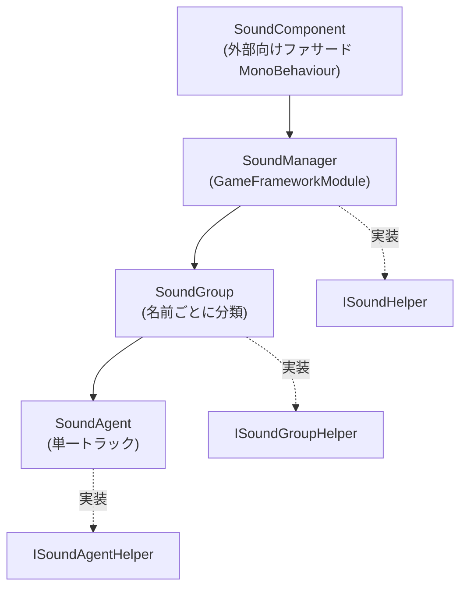

# アーキテクチャ概要：Component / Manager / Group / Agent

GameFrameX サウンドモジュールは4層のレイヤー構造設計を採用しています：`SoundComponent` が外部向けファサードとしてフレームワークモジュール `SoundManager` を呼び出し、マネージャー内部は `SoundGroup`（サウンドグループ）ごとにリソースを分類し、各サウンドグループの下に複数の `SoundAgent`（サウンドエージェント）がマウントされ、実際にサウンドを再生します。各層には `*Helper` インターフェースが用意されており、低層の実装を置き換える（例：異なるオーディオエンジンの接入）ために使用されます。

## 動作原理の概要

4つの `*Helper`（`ISoundHelper` / `ISoundGroupHelper` / `ISoundAgentHelper` / `ISoundHelperBase`）はインジェクションポイントであり、デフォルト実装は [DefaultSoundHelper.cs](https://github.com/GameFrameX/com.gameframex.unity.sound/blob/main/Runtime/Sound/DefaultSoundHelper.cs#L1-L80)、[DefaultSoundGroupHelper.cs](https://github.com/GameFrameX/com.gameframex.unity.sound/blob/main/Runtime/Sound/DefaultSoundGroupHelper.cs)、[DefaultSoundAgentHelper.cs](https://github.com/GameFrameX/com.gameframex.unity.sound/blob/main/Runtime/Sound/DefaultSoundAgentHelper.cs) を参照してください。

## 各層の責務

| 層 | 型 / ファイル | 責務 |
|------|------------|------|
| Component | [SoundComponent](https://github.com/GameFrameX/com.gameframex.unity.sound/blob/main/Runtime/Sound/SoundComponent.cs) は `MonoBehaviour` を継承 | 外部向けファサード。上位層（UI、戦闘など）からの呼び出しを受け付け、`SoundManager` へ転送する。`PlaySound` / `StopSound` / 音量の増減、サウンドグループの登録などの API を提供 |
| Manager | [SoundManager](https://github.com/GameFrameX/com.gameframex.unity.sound/blob/main/Runtime/Sound/Sound/SoundManager.cs) は `GameFrameworkModule` を継承 | モジュールの中核。すべての `SoundGroup` の辞書を管理し、ロード、解放、成功/失敗イベントを一括処理する |
| Group | [SoundGroup](https://github.com/GameFrameX/com.gameframex.unity.sound/blob/main/Runtime/Sound/Sound/SoundManager.SoundGroup.cs) は [ISoundGroup](https://github.com/GameFrameX/com.gameframex.unity.sound/blob/main/Runtime/Interface/ISoundGroup.cs) を実装 | 名前ごとに分けられたサウンドグループ（BGM、UI、戦闘など）。そのグループで同時に再生できるトラック数（`SoundAgentCount`）やミキシング属性を決定する |
| Agent | [SoundAgent](https://github.com/GameFrameX/com.gameframex.unity.sound/blob/main/Runtime/Sound/Sound/SoundManager.SoundAgent.cs) は [ISoundAgent](https://github.com/GameFrameX/com.gameframex.unity.sound/blob/main/Runtime/Interface/ISoundAgent.cs) を実装 | 単一のサウンド再生エージェント。再生状態、音量、ミュート、所属グループなどの属性を管理する |

## 主要な呼び出しチェーン

`PlaySound` を一度呼び出すと、パラメータはこのチェーンに沿って渡されます：

1. `SoundComponent.PlaySound(soundGroup, soundAssetName, ...)` が `PlaySoundParams` を収集し、`serialId` にシリアライズします。
2. `SoundManager.PlaySound(serialId, soundGroupName, ...)` が `m_SoundGroups` 辞書内で対応するグループを検索または作成します。
3. 対象の `SoundGroup` はその `Helper`（`ISoundGroupHelper`）を通じて、空き状態の `SoundAgent` を申請/再利用します。
4. `SoundAgent` が実際にリソースをロードし（依存性注入された `IAssetManager`）、ロード完了後、`Helper` を通じてオーディオを実際に再生します。
5. ロード/再生の成功と失敗は、それぞれ `PlaySoundSuccess` / `PlaySoundFailure` イベントをトリガーします [SoundManager.cs#90-L103](https://github.com/GameFrameX/com.gameframex.unity.sound/blob/main/Runtime/Sound/Sound/SoundManager.cs#L90-L103)。

## インターフェースと拡張ポイント

| インターフェース | デフォルト実装 | 置き換えシーン |
|------|---------|---------|
| [ISoundHelper](https://github.com/GameFrameX/com.gameframex.unity.sound/blob/main/Runtime/Interface/ISoundHelper.cs) | [DefaultSoundHelper.cs](https://github.com/GameFrameX/com.gameframex.unity.sound/blob/main/Runtime/Sound/DefaultSoundHelper.cs) | オーディオバックエンドの置き換え（FMOD / Wwise など） |
| [ISoundGroupHelper](https://github.com/GameFrameX/com.gameframex.unity.sound/blob/main/Runtime/Interface/ISoundGroupHelper.cs) | [DefaultSoundGroupHelper.cs](https://github.com/GameFrameX/com.gameframex.unity.sound/blob/main/Runtime/Sound/DefaultSoundGroupHelper.cs) | グループの作成・回収ポリシーのカスタマイズ |
| [ISoundAgentHelper](https://github.com/GameFrameX/com.gameframex.unity.sound/blob/main/Runtime/Interface/ISoundAgentHelper.cs) | [DefaultSoundAgentHelper.cs](https://github.com/GameFrameX/com.gameframex.unity.sound/blob/main/Runtime/Sound/DefaultSoundAgentHelper.cs) | 再生、音量、ミュート、ローパスフィルタなどの動作のカスタマイズ |
| `ISoundManager` | `SoundManager`（実装） | 通常は置き換え不要 |

`SoundComponent` は `Awake` 内で、`GameFrameXSound` フックの `[Preserve]` 参照リスト [GameFrameXSoundCroppingHelper.cs](https://github.com/GameFrameX/com.gameframex.unity.sound/blob/main/Runtime/GameFrameXSoundCroppingHelper.cs#L1-L36) に従ってデフォルトの Helper 型を保持し、コードのトリミング（不要コード削除）から保護します。

## 次のステップ

- 導入と初期化の手順：《サウンドモジュールの導入方法》を参照
- 一連の BGM を再生して切り替える：《サウンドの再生と制御方法》を参照
- 再生失敗やサウンドがトリミングされるなどの問題のトラブルシューティング：《サウンド再生が失敗する場合の対処方法》を参照
- API とエラーコードのクイックリファレンス：《API リファレンス》を参照