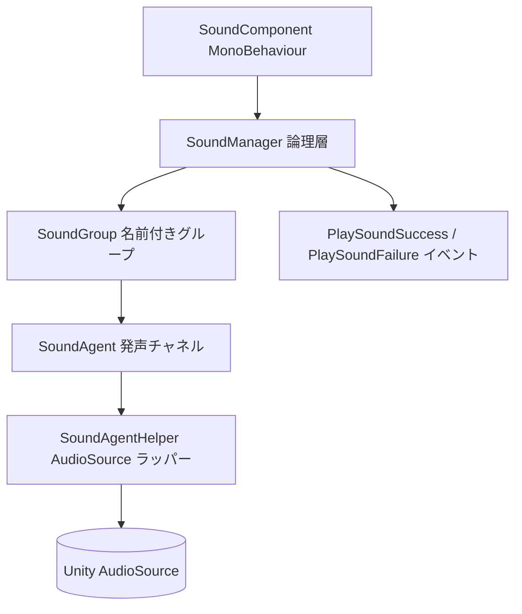

# サウンドモジュールの概要

GameFrameX Sound は GameFrameX フレームワークのサウンドサブモジュールです。Unity AudioSource をベースとしたグループ再生、空間オーディオ、優先度によるプリエンプション、イベント駆動型通知の機能を提供し、ゲームで BGM、SFX、Voice など複数種類のオーディオリソースを効率的に管理できるようにします。

## クイックスタート

### 1. インストール

次のいずれかの方法で `com.gameframex.unity.sound` を Unity プロジェクトに追加します:

1. `Packages/manifest.json` に scopedRegistries と依存関係を追加します:

```json
{
  "scopedRegistries": [
    {
      "name": "GameFrameX",
      "url": "https://gameframex.upm.alianblank.uk",
      "scopes": ["com.gameframex"]
    }
  ],
  "dependencies": {
    "com.gameframex.unity.sound": "1.2.0"
  }
}
```

Source: [README.zh-CN.md](https://github.com/GameFrameX/com.gameframex.unity.sound/blob/main/README.zh-CN.md#L38-L58)

2. Git 依存関係を直接追加します:
```json
{
  "dependencies": {
    "com.gameframex.unity.sound": "https://github.com/gameframex/com.gameframex.unity.sound.git"
  }
}
```

Source: [README.zh-CN.md](https://github.com/GameFrameX/com.gameframex.unity.sound/blob/main/README.zh-CN.md#L60-L65)

3. Unity の `Package Manager` に `Git URL` を貼り付けてインストールするか、リポジトリをプロジェクトの `Packages` ディレクトリに直接配置します。

### 2. 最小再生例

`SoundManager` を使ってグループを取得し、`PlaySound` を呼び出すだけでオーディオを再生できます:

```csharp
using GameFrameX.Sound.Runtime;

SoundManager soundManager = GameFrameworkEntry.GetModule<SoundManager>();
soundManager.PlaySound("SFX", "Assets/Audio/click.wav");
```

Source: [ISoundManager.cs](https://github.com/GameFrameX/com.gameframex.unity.sound/blob/main/Runtime/Interface/ISoundManager.cs#L43-L80)

主要な再生パラメータはすべて `PlaySoundParams` に集約されており、音量、ピッチ、フェードイン/フェードアウト、ループ、優先度、空間ブレンドなどのプロパティを設定できます:

```csharp
PlaySoundParams param = new PlaySoundParams
{
    Loop = false,
    Volume = 1f,
    Pitch = 1f,
    FadeInSeconds = 0.2f,
    Priority = 0,
};
```

Source: [PlaySoundParams.cs](https://github.com/GameFrameX/com.gameframex.unity.sound/blob/main/Runtime/Sound/Sound/PlaySoundParams.cs#L40-L80)

### 3. 再生結果の監視

`PlaySoundSuccess` と `PlaySoundFailure` のイベントを通じて、非同期再生の結果を取得します:

```csharp
soundManager.PlaySoundSuccess += (sender, e) => { /* 再生成功 */ };
soundManager.PlaySoundFailure += (sender, e) => { /* 再生失敗 */ };
```

Source: [SoundManager.cs](https://github.com/GameFrameX/com.gameframex.unity.sound/blob/main/Runtime/Sound/Sound/SoundManager.cs#L90-L100)

## 動作原理の概要

サウンドモジュールは、GameFrameX の古典的な「Manager + Helper + Agent」の階層構造を採用しており、実行時には最も外側の MonoBehaviour コンポーネントから実際の `AudioSource` まで掘り下げて処理が行われます:



- **SoundGroup**:名前付きグループ(`BGM`、`SFX`、`Voice` など)。独立した音量、ミュート状態、同時実行エージェント数を管理します。
- **SoundAgent**:グループ配下の同時発声チャネル。エージェントがすべてビジーの場合、低優先度のリクエストは自動的に排除されます。
- **SoundAgentHelper**:`AudioSource` のラッパーであり、実際の再生、フェードイン/フェードアウト、ライフサイクル管理を担当します。
- **PlaySoundParams**:プール化された再生パラメータオブジェクト。すべてのプロパティを必要に応じて上書きできます。
- **イベントシステム**:再生の成功/失敗は GameFrameX のイベントバスを通じて一元的に配信され、イベントパラメータも同様に参照プールから取得されます。

## 機能と特徴

| 機能 | 説明 |
|------|------|
| サウンドグループ | サウンドを名前付きグループ(BGM、SFX、Voice など)に整理し、各グループごとに独立した音量、ミュート、エージェント数を管理 |
| 優先度再生 | 非同期再生。エージェントがビジーの場合、低優先度のサウンドを自動的に排除 |
| 完全なライフサイクル | 再生、一時停止、停止、フェードイン/フェードアウトをサポート |
| 空間オーディオ | サウンドをゲームエンティティにバインド、または指定したワールド座標に配置可能 |
| AudioMixer 統合 | グループを指定した AudioMixer Group にルーティングし、きめ細かなミキシングを実現 |
| イベント駆動通知 | GameFrameX のイベントシステムを通じて再生成功・失敗の通知を配信 |
| 参照プール化 | すべてのイベントパラメータと再生パラメータは参照プールから取得され、GC を最小化 |

Source: [README.zh-CN.md](https://github.com/GameFrameX/com.gameframex.unity.sound/blob/main/README.zh-CN.md#L24-L32)

## 依存関係

| パッケージ | 説明 |
|----|------|
| `com.gameframex.unity` | コアフレームワーク(モジュールシステム、参照プール、ユーティリティクラス) |
| `com.gameframex.unity.asset` | リソース読み込み(YooAsset 統合) |
| `com.gameframex.unity.entity` | エンティティシステム。空間オーディオのバインドに使用 |
| `com.gameframex.unity.event` | イベントシステム。再生通知に使用 |

Source: [README.zh-CN.md](https://github.com/GameFrameX/com.gameframex.unity.sound/blob/main/README.zh-CN.md#L85-L93)

## 次のステップ

- オーディオの読み込みと再生のトリガー方法については、「サウンドの再生方法」を参照してください(準備中)
- イベントの購読と失敗理由コードについては、「再生イベントとエラーコードリファレンス」を参照してください(準備中)
- カスタム Helper とグループ設定については、「グループと Helper の拡張」を参照してください(準備中)