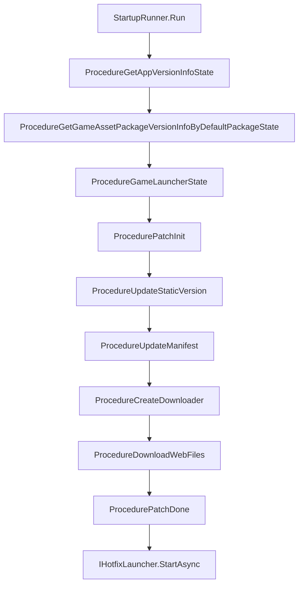

# 起動フローの概要

`com.gameframex.unity.startup` は「ゲームの起動からプレイ可能になるまで」の過程を、設定可能でプラグイン式の起動パイプラインに分割します：まずメイン/バックアップ URL でグローバル情報を取得 → App とリソースのバージョンを検証 → YooAsset パッチフロー（初期化 → 静的バージョン → マニフェスト → ダウンロード → 完了）→ ホットフィックスエントリを起動。開発者は `IStartupUIHandler`（UI 表示）と `IHotfixLauncher`（ホットフィックスエントリ）を実装するだけで、デフォルトの実装を置き換えることができます。

## クイックスタート

1. `Packages/manifest.json` に依存関係を追加します：

    ```json
    {
      "dependencies": {
        "com.gameframex.unity.startup": "1.1.0"
      },
      "scopedRegistries": [
        {
          "name": "GameFrameX",
          "url": "https://gameframex.upm.alianblank.uk",
          "scopes": ["com.gameframex"]
        }
      ]
    }
    ```

    `scopes` は、どのパッケージがこのレジストリ経由で解決されるかを制御します。`com.gameframex` で始まるパッケージのみがここから取得されます。

2. Unity Editor で `Create > GameFrameX > Startup Options` から設定アセットを作成し、メイン/バックアップ URL、PlayMode、ホットフィックスエントリ、HTTP 共通パラメータなどを入力します。

3. `IStartupUIHandler`（FairyGUI / UGUI / カスタム UI いずれも可）と `IHotfixLauncher`（HybridCLR またはその他のホットフィックスソリューション）を実装します。

4. シーン内で 1 行のエントリを呼び出します：

    ```csharp
    var result = await StartupRunner.Run(_options, uiHandler, hotfixLauncher);
    if (result.Success) { /* 起動完了、ゲーム準備完了 */ }
    ```

    出典: [README.zh-CN.md](https://github.com/GameFrameX/com.gameframex.unity.startup/blob/main/README.zh-CN.md#L1-L100)

## 仕組みの概要

起動パイプラインは有限状態マシン（FSM）形式で `Procedure` ノードを編成し、各ノードは担当する処理を完了した後、`ChangeState<T>` で次のノードへ切り替わります。



ノードの説明：

| フローノード | 役割 |
|----------|------|
| `ProcedureGetAppVersionInfoState` | グローバル情報の取得（URL メイン/バックアップ failover） |
| `ProcedureGetGameAssetPackageVersionInfoByDefaultPackageState` | App とアセットパッケージのバージョンを取得 |
| `ProcedureGameLauncherState` | YooAsset リソースモードへ切り替え |
| `ProcedurePatchInit` | PlayMode に応じて YooAsset アセットパッケージを初期化 |
| `ProcedureUpdateStaticVersion` | アセットパッケージの静的バージョン番号をリクエスト |
| `ProcedureUpdateManifest` | リソースマニフェストを更新 |
| `ProcedureCreateDownloader` | ダウンローダーを作成 |
| `ProcedureDownloadWebFiles` | パッチファイルをダウンロードして進捗を更新 |
| `ProcedurePatchDone` | パッチフローを完了 |
| `IHotfixLauncher.StartAsync` | ホットフィックスアセンブリをロードしてエントリを実行 |

完了を通知する 2 つの経路が同時にトリガーされます：`UniTask<StartupResult>` の await 結果、および `StartupCompletedEventArgs` / `StartupFailedEventArgs` イベントで、開発者はいずれかを選んで購読できます。

## 主要設定項目クイックリファレンス

`StartupOptions` ScriptableObject の主要フィールド：

| フィールド | 用途 |
|------|------|
| `GlobalInfoUrls` | グローバル情報 API のメイン/バックアップ URL リスト。`MaxAttemptsPerUrl` のリトライ戦略と併用 |
| `GamePlayMode` | リソース実行モード。起動フローはロード前に Asset コンポーネントへ同期します |
| `HotfixAssemblyName` / `HotfixEntryTypeName` / `HotfixEntryMethodName` | ホットフィックスエントリ（アセンブリ / 型 / メソッド） |
| `PackageName` / `Channel` / `SubChannel` | HTTP 共通パラメータ（純粋なデータで SDK 依存なし） |
| `LauncherUIResName` | 起動 UI のリソースパス。デフォルトは `UI/UILauncher` |
| `SkipRemoteStartupRequests` | すべてのリモート起動リクエストをスキップ。WebGL スタンドアロンやバックエンドなしデプロイ時に有効化します |

PlayMode の適応分岐：`EditorSimulateMode` / `OfflinePlayMode` / `HostPlayMode` / `WebPlayMode`。`ProcedurePatchInit` は現在のモードに応じて、空の URL または実際の URL を選択して YooAsset を初期化します：

出典: [ProcedurePatchInit.cs](https://github.com/GameFrameX/com.gameframex.unity.startup/blob/main/Runtime/Procedures/Patch/ProcedurePatchInit.cs#L33-L48)

## 次のステップ

- 起動 UI の実装：『IStartupUIHandler の実装方法』を参照
- HybridCLR の導入：『IHotfixLauncher の実装方法』を参照
- メイン/バックアップ URL のリトライ戦略：『URL Failover リファレンス』を参照
- スタンドアロン/バックエンドなしデプロイ：`SkipRemoteStartupRequests` を有効化