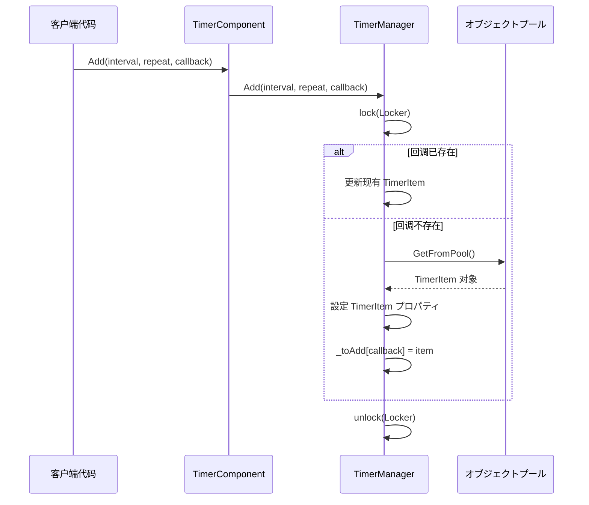
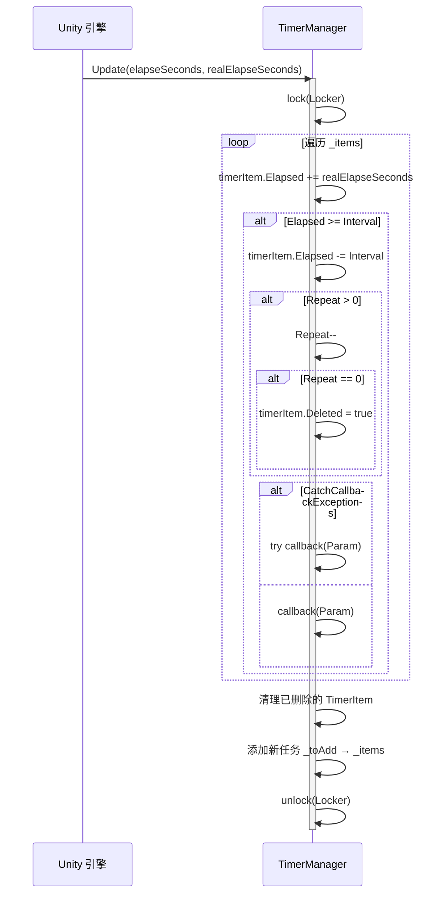

# Timer コンポーネント介绍

Timer コンポーネント是 GameFrameX フレームワーク为 Unity ゲーム开发提供的タイマー管理模块。该コンポーネント提供します在ゲーム中添加、管理和执行定时任务的能力，サポート单次执行、重复执行和帧更新等多种定时模式。

## 概要

Timer コンポーネント是 GameFrameX 架构中专注于时间调度的基础コンポーネント。在ゲーム开发过程中，開発者经常必要处理各种与时间関連的逻辑，例如：

- 延迟执行某些操作
- 周期性触发ゲームイベント
- 倒计时機能
- 每帧执行特定逻辑

Timer コンポーネントを通じて简洁的 API 设计，让開発者可能轻松実装这些需求，同时提供します线程安全的実装和性能优化。

## コンポーネント架构

Timer コンポーネント采用经典的三层アーキテクチャ設計，包括コンポーネント层、インターフェース层和実装层：

```mermaid
flowchart TD
    subgraph Unity["Unity コンポーネント层"]
        TC[TimerComponent]
    end

    subgraph Interface["インターフェース层"]
        ITM[ITimerManager]
    end

    subgraph Implementation["実装层"]
        TM[TimerManager]
        Pool[オブジェクトプール _pool]
    end

    subgraph Data["数据层"]
        Items["_items 字典"]
        ToAdd["_toAdd 字典"]
        ToRemove["_toRemove 列表"]
    end

    TC -->|"呼び出しメソッド"| ITM
    ITM <|..|"実装"| TM
    TM -->|"对象复用"| Pool
    TM -->|"管理"| Items
    TM -->|"管理"| ToAdd
    TM -->|"管理"| ToRemove
```

### 架构説明

| 层次 | クラス名 | 职责 |
|------|------|------|
| コンポーネント层 | TimerComponent | 作为 Unity コンポーネント暴露给シーン，提供面向用户的 API |
| インターフェース层 | ITimerManager | 定义タイマー管理器的抽象インターフェース |
| 実装层 | TimerManager | 実装具体的タイマー逻辑 |

## コア设计

### インターフェース-実装模式

Timer コンポーネント使用インターフェース-実装分离的设计，便于单元测试和扩展：

```csharp
> Source: [ITimerManager.cs](https://github.com/GameFrameX/com.gameframex.unity.timer/blob/main/Runtime/Timer/ITimerManager.cs#L1-L54)

public interface ITimerManager
{
    void Add(float interval, int repeat, Action<object> callback, object callbackParam = null);
    void AddOnce(float interval, Action<object> callback, object callbackParam = null);
    void AddUpdate(Action<object> callback);
    void AddUpdate(Action<object> callback, object callbackParam);
    bool Exists(Action<object> callback);
    void Remove(Action<object> callback);
}
```

这种设计允许在不同的模块中を通じてインターフェース引用タイマー機能，而不依赖具体実装。

### オブジェクトプール模式

TimerManager 内部使用オブジェクトプール来复用 TimerItem 对象，减少垃圾回收压力：

```csharp
> Source: [TimerManager.cs](https://github.com/GameFrameX/com.gameframex.unity.timer/blob/main/Runtime/Timer/TimerManager.cs#L266-L289)

private TimerItem GetFromPool()
{
    TimerItem t;
    int cnt = _pool.Count;
    if (cnt > 0)
    {
        t = _pool[cnt - 1];
        _pool.RemoveAt(cnt - 1);
        t.Deleted = false;
        t.Elapsed = 0;
    }
    else
    {
        t = new TimerItem();
    }
    return t;
}
```

### 线程安全设计

TimerManager 使用 `lock` 锁机制确保多线程环境下的数据安全：

```csharp
> Source: [TimerManager.cs](https://github.com/GameFrameX/com.gameframex.unity.timer/blob/main/Runtime/Timer/TimerManager.cs#L38-L38)

private static readonly object Locker = new object();
```

所有对 `_items`、`_toAdd`、`_toRemove` 等共享数据的操作都在锁的保护下进行。

### 異常处理策略

を通じて静态プロパティ `CatchCallbackExceptions` 可能控制是否捕获回调中的異常：

```csharp
> Source: [TimerManager.cs](https://github.com/GameFrameX/com.gameframex.unity.timer/blob/main/Runtime/Timer/TimerManager.cs#L40-L43)

/// <summary>
/// 是否触发回调異常
/// </summary>
public static bool CatchCallbackExceptions = false;
```

当設定为 `true` 时，回调中的異常会被捕获并记录警告日志，不会中断タイマー的主循环。

## コアフロー

### 任务添加フロー



### 任务执行フロー



## コア機能

Timer コンポーネント提供以下コア機能：

| メソッド | 機能説明 |
|------|----------|
| Add | 添加定时重复执行的任务 |
| AddOnce | 添加只执行一次的任务 |
| AddUpdate | 添加每帧更新执行的任务 |
| Exists | 检查指定任务是否存在 |
| Remove | 移除指定的任务 |

### 添加定时任务 (Add)

添加一个定时重复执行的任务，サポート指定间隔时间和重复次数：

```csharp
> Source: [README.md](https://github.com/GameFrameX/com.gameframex.unity.timer/blob/main/README.md#L30-L32)

Add(1000, 5, MyMethod);
```

参数説明：
- `interval`：间隔时间（单位为毫秒）
- `repeat`：重复次数，0 表示无限重复
- `callback`：回调函数
- `callbackParam`：回调参数（可选）

### 添加单次任务 (AddOnce)

添加一个延迟执行一次的任务：

```csharp
> Source: [README.md](https://github.com/GameFrameX/com.gameframex.unity.timer/blob/main/README.md#L46-L48)

AddOnce(5000, MyMethod);
```

### 添加帧更新任务 (AddUpdate)

添加每帧执行的任务，适に使用必要持续监测或更新的シーン：

```csharp
> Source: [README.md](https://github.com/GameFrameX/com.gameframex.unity.timer/blob/main/README.md#L60-L63)

AddUpdate(MyMethod);
```

### 检查和移除任务

检查任务是否存在并に基づいて必要移除：

```csharp
> Source: [README.md](https://github.com/GameFrameX/com.gameframex.unity.timer/blob/main/README.md#L78-L95)

bool exists = GetComponent<TimerComponent>().Exists(MyMethod);
GetComponent<TimerComponent>().Remove(MyMethod);
```

## 使用例

以下は完整的使用示例：

```csharp
// 假设这是您要触发的メソッド
void MyMethod(object param)
{
    Debug.Log("メソッド被触发");
}

// 作成定时任务，每隔1秒执行MyMethodメソッド，共执行5次
GetComponent<TimerComponent>().Add(1000, 5, MyMethod);

// 作成定时任务，5秒后执行一次MyMethodメソッド
GetComponent<TimerComponent>().AddOnce(5000, MyMethod);

// 检查是否存在某个任务
bool exists = GetComponent<TimerComponent>().Exists(MyMethod);

// 移除特定的任务
GetComponent<TimerComponent>().Remove(MyMethod);
```

> Source: [README.md](https://github.com/GameFrameX/com.gameframex.unity.timer/blob/main/README.md#L101-L119)

## 設定选项

Timer コンポーネント提供以下可配置项：

| 选项 | クラス型 | 默认值 | 説明 |
|------|------|--------|------|
| CatchCallbackExceptions | static bool | false | 是否捕获回调中的異常，防止タイマー主循环被中断 |

### 設定示例

```csharp
// 开启異常捕获，防止回调異常中断タイマー
TimerManager.CatchCallbackExceptions = true;
```

## 注意事项

1. **初期化要求**：在使用タイマー前，必ず `TimerManager` 已正确初期化并已注册到 `GameFrameworkEntry` 模块中。

2. **性能考虑**：尽量避免使用过小的间隔时间（例如小于帧时间），这可能会导致性能问题。建议最小间隔不低于 100 毫秒。

3. **回调签名**：所有回调函数必須符合 `Action<object>` 签名，即接受一个 object 参数并返回 void。

4. **线程安全**：虽然 TimerManager 内部実装了线程安全机制，但在多线程环境下仍需注意回调函数的线程安全性。

## 関連リンク

- [機能特性](./1-overview.features) - 了解更多 Timer コンポーネント的機能细节
- [安装指南](./2-installation) - 如何安装和配置 Timer コンポーネント
- [快速开始](./3-getting-started) - 快速上手 Timer コンポーネント
- [添加定时任务](./4-core-functions.add-timer) - 定时任务详细用法
- [添加单次任务](./4-core-functions.add-once) - 单次任务详细用法
- [添加帧更新任务](./4-core-functions.add-update) - 帧更新任务详细用法
- [检查和移除任务](./4-core-functions.exists-remove) - 任务管理详细用法
- [API 参考](./5-api-reference.timer-component) - TimerComponent 完整 API
