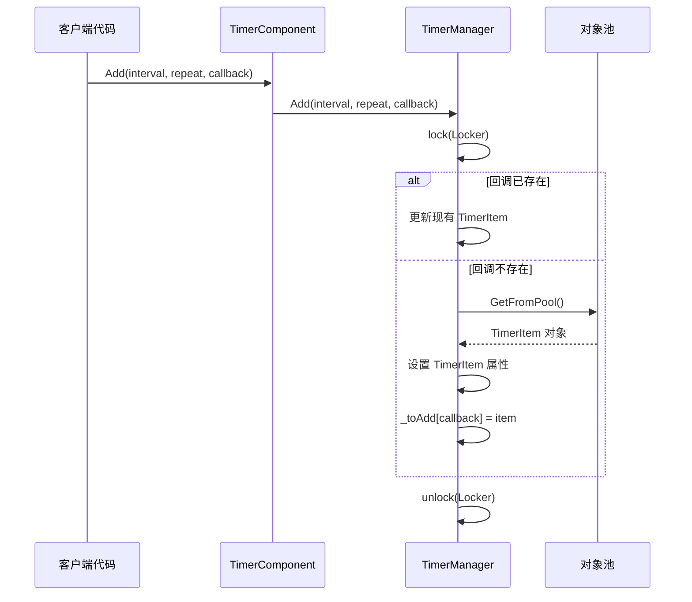
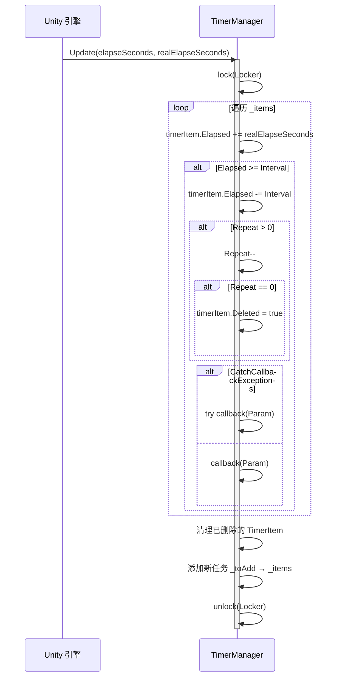

# Timer コンポーネント介绍

Timer コンポーネント是 GameFrameX フレームワーク为 Unity 游戏开发提供的计时器管理モジュール。该コンポーネント提供します在游戏中追加、管理和执行定时任务的能力，サポート单次执行、重复执行和帧アップデート等多种定时モード。

## 概要

Timer コンポーネント是 GameFrameX アーキテクチャ中专注于时间调度的基本コンポーネント。在游戏开发过程中，開発者经常〜する必要があります処理各种与时间相关的逻辑，例えば：

- 延迟执行某些操作
- 周期性トリガー游戏イベント
- 倒计时機能
- 每帧执行特定逻辑

Timer コンポーネント通过シンプル的 API 設計，让開発者〜できます轻松実装这些需求，同時に提供します线程安全的実装和性能最適化。

## コンポーネントアーキテクチャ

Timer コンポーネント采用经典的三层アーキテクチャ設計，含みますコンポーネント層、インターフェース層和実装層：

```mermaid
flowchart TD
    subgraph Unity["Unity 组件层"]
        TC[TimerComponent]
    end

    subgraph Interface["接口层"]
        ITM[ITimerManager]
    end

    subgraph Implementation["实现层"]
        TM[TimerManager]
        Pool[对象池 _pool]
    end

    subgraph Data["数据层"]
        Items["_items 字典"]
        ToAdd["_toAdd 字典"]
        ToRemove["_toRemove 列表"]
    end

    TC -->|"调用方法"| ITM
    ITM <|..|"实现"| TM
    TM -->|"对象复用"| Pool
    TM -->|"管理"| Items
    TM -->|"管理"| ToAdd
    TM -->|"管理"| ToRemove
```

### アーキテクチャ説明

| 层次 | 类名 | 职责 |
|------|------|------|
| コンポーネント層 | TimerComponent | 作为 Unity コンポーネント暴露给シーン，提供面向ユーザー的 API |
| インターフェース層 | ITimerManager | 定義计时器マネージャー的抽象インターフェース |
| 実装層 | TimerManager | 実装具体的计时器逻辑 |

## コア設計

### インターフェース-実装モード

Timer コンポーネント使用インターフェース-実装分离的設計，便于单元テスト和拡張：

```csharp
> Source: [ITimerManager.cs](https://github.com/GameFrameX/com.gameframex.unity.timer/blob/main/Runtime/Timer/ITimerManager.cs#L1-L54)

public interface ITimerManager
{
    void Add(float interval, int repeat, Action<object> callback, object callbackParam = null);
    void AddOnce(float interval, Action<object> callback, object callbackParam = null);
    void AddUpdate(Action<object> callback);
    void AddUpdate(Action<object> callback, object callbackParam);
    bool Exists(Action<object> callback);
    void Remove(Action<object> callback);
}
```

这种設計允许在不同的モジュール中通过インターフェース参照计时器機能，而不依赖具体実装。

### 对象池モード

TimerManager 内部使用对象池来复用 TimerItem 对象，减少垃圾回收压力：

```csharp
> Source: [TimerManager.cs](https://github.com/GameFrameX/com.gameframex.unity.timer/blob/main/Runtime/Timer/TimerManager.cs#L266-L289)

private TimerItem GetFromPool()
{
    TimerItem t;
    int cnt = _pool.Count;
    if (cnt > 0)
    {
        t = _pool[cnt - 1];
        _pool.RemoveAt(cnt - 1);
        t.Deleted = false;
        t.Elapsed = 0;
    }
    else
    {
        t = new TimerItem();
    }
    return t;
}
```

### 线程安全設計

TimerManager 使用 `lock` 锁机制確認してください多线程環境下的数据安全：

```csharp
> Source: [TimerManager.cs](https://github.com/GameFrameX/com.gameframex.unity.timer/blob/main/Runtime/Timer/TimerManager.cs#L38-L38)

private static readonly object Locker = new object();
```

所有对 `_items`、`_toAdd`、`_toRemove` 等共享数据的操作都在锁的保护下进行。

### 例外処理策略

通过静态プロパティ `CatchCallbackExceptions` 〜できます控制是否捕获コールバック中的例外：

```csharp
> Source: [TimerManager.cs](https://github.com/GameFrameX/com.gameframex.unity.timer/blob/main/Runtime/Timer/TimerManager.cs#L40-L43)

/// <summary>
/// 是否触发回调异常
/// </summary>
public static bool CatchCallbackExceptions = false;
```

当設定为 `true` 时，コールバック中的例外会被捕获并记录警告ログ，不会中断计时器的主循环。

## コアフロー

### 任务追加フロー



### 任务执行フロー



## コア機能

Timer コンポーネント提供以下コア機能：

| メソッド | 機能説明 |
|------|----------|
| Add | 追加定时重复执行的任务 |
| AddOnce | 追加只执行一次的任务 |
| AddUpdate | 追加每帧アップデート执行的任务 |
| Exists | 確認指定任务是否存在 |
| Remove | 移除指定的任务 |

### 追加定时任务 (Add)

追加一个定时重复执行的任务，サポート指定间隔时间和重复次数：

```csharp
> Source: [README.md](https://github.com/GameFrameX/com.gameframex.unity.timer/blob/main/README.md#L30-L32)

Add(1000, 5, MyMethod);
```

パラメータ説明：
- `interval`：间隔时间（单位为毫秒）
- `repeat`：重复次数，0 表示无限重复
- `callback`：コールバック函数
- `callbackParam`：コールバックパラメータ（可选）

### 追加单次任务 (AddOnce)

追加一个延迟执行一次的任务：

```csharp
> Source: [README.md](https://github.com/GameFrameX/com.gameframex.unity.timer/blob/main/README.md#L46-L48)

AddOnce(5000, MyMethod);
```

### 追加帧アップデート任务 (AddUpdate)

追加每帧执行的任务，適しています〜する必要があります持续监测或アップデート的シーン：

```csharp
> Source: [README.md](https://github.com/GameFrameX/com.gameframex.unity.timer/blob/main/README.md#L60-L63)

AddUpdate(MyMethod);
```

### 確認和移除任务

確認任务是否存在并根据〜する必要があります移除：

```csharp
> Source: [README.md](https://github.com/GameFrameX/com.gameframex.unity.timer/blob/main/README.md#L78-L95)

bool exists = GetComponent<TimerComponent>().Exists(MyMethod);
GetComponent<TimerComponent>().Remove(MyMethod);
```

## 使用例

以下は完全な的使用例：

```csharp
// 假设这是您要触发的方法
void MyMethod(object param)
{
    Debug.Log("方法被触发");
}

// 创建定时任务，每隔1秒执行MyMethod方法，共执行5次
GetComponent<TimerComponent>().Add(1000, 5, MyMethod);

// 创建定时任务，5秒后执行一次MyMethod方法
GetComponent<TimerComponent>().AddOnce(5000, MyMethod);

// 检查是否存在某个任务
bool exists = GetComponent<TimerComponent>().Exists(MyMethod);

// 移除特定的任务
GetComponent<TimerComponent>().Remove(MyMethod);
```

> Source: [README.md](https://github.com/GameFrameX/com.gameframex.unity.timer/blob/main/README.md#L101-L119)

## 設定オプション

Timer コンポーネント提供以下可設定项：

| オプション | タイプ | デフォルト值 | 説明 |
|------|------|--------|------|
| CatchCallbackExceptions | static bool | false | 是否捕获コールバック中的例外，防止计时器主循环被中断 |

### 設定例

```csharp
// 开启异常捕获，防止回调异常中断计时器
TimerManager.CatchCallbackExceptions = true;
```

## 注意事项

1. **初期化要求**：在使用计时器前，请確認してください `TimerManager` 已正确初期化并已登録到 `GameFrameworkEntry` モジュール中。

2. **性能考虑**：尽量避免使用过小的间隔时间（例えば小于帧时间），这〜の可能性があります会导致性能問題。お勧め最小间隔不低于 100 毫秒。

3. **コールバック签名**：所有コールバック函数〜しなければなりません符合 `Action<object>` 签名，つまり接受一个 object パラメータ并返す void。

4. **线程安全**：虽然 TimerManager 内部実装了线程安全机制，但在多线程環境下仍需注意コールバック函数的线程安全性。

## 関連リンク

- [機能特性](./1-overview.features) - 理解する更多 Timer コンポーネント的機能细节
- [インストールガイド](./2-installation) - 如何インストール和設定 Timer コンポーネント
- [快速开始](./3-getting-started) - 快速上手 Timer コンポーネント
- [追加定时任务](./4-core-functions.add-timer) - 定时任务詳細用法
- [追加单次任务](./4-core-functions.add-once) - 单次任务詳細用法
- [追加帧アップデート任务](./4-core-functions.add-update) - 帧アップデート任务詳細用法
- [確認和移除任务](./4-core-functions.exists-remove) - 任务管理詳細用法
- [API リファレンス](./5-api-reference.timer-component) - TimerComponent 完全な API
