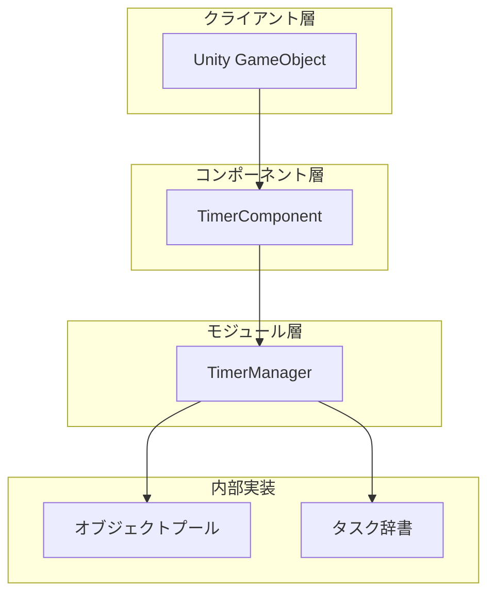

# クイックスタート

TimerコンポーネントはGameFrameXフレームワークが提供するタイマー機能モジュールであり、Unityプロジェクトでタイマータスクの管理と実行に使用されます。定期イベント、ワンショット遅延実行、毎フレーム更新など、Timerコンポーネントはシンプルで効率的なソリューションを提供します。

## 概要

Timerコンポーネントは以下のコア機能を提供します：

- **タイマータスク**： 指定時間間隔で繰り返し実行されるタスク
- **ワンショットタスク**： 指定遅延時間後に1回だけ実行されるタスク
- **フレーム更新タスク**： 毎フレーム実行されるタスク、高頻度更新シナリオに適合
- **タスク管理**： タスク是否存在かをチェック、指定タスクの削除

このコンポーネントはGameFrameXフレームワークアーキテクチャに基づいて設計され、フレームワークのモジュールシステムに自動的に統合され、スレッドセーフ操作とオブジェクトプール最適化をサポートしています。

## アーキテクチャ

Timerコンポーネントは階層型アーキテクチャを採用しており、コアコンポーネントは以下を含みます：



**アーキテクチャ説明：**

- **TimerComponent**： Unityコンポーネント層、開発者に直接使用するインターフェースを提供、`GameFrameworkComponent`を継承
- **TimerManager**： コアモジュール層、`GameFrameworkModule`を継承し、`ITimerManager`インターフェースを実装し、定時タスクのスケジューリングと実行を担当
- **オブジェクトプール**： オブジェクトプールパターンを使用してTimerItemを管理し、メモリ割り当てとGC圧力を軽減
- **タスク辞書**： スレッドセーフな辞書でタスクを格納し、動的な追加と削除をサポート

## 基本使用

### ステップ1：コンポーネントを追加

Unityエディタで、タイマーを使用する必要があるGameObjectを選択し、**Add Component**をクリックして、**Timer**を検索して追加：

> Source: [TimerComponent.cs](https://github.com/GameFrameX/com.gameframex.unity.timer/blob/main/Runtime/Timer/TimerComponent.cs#L11-L13)

```csharp
[DisallowMultipleComponent]
[AddComponentMenu("Game Framework/Timer")]
public class TimerComponent : GameFrameworkComponent
```

### ステップ2：コンポーネントインスタンスを取得

スクリプトでTimerComponentインスタンスを取得：

```csharp
// TimerComponentコンポーネントを取得
var timerComponent = gameObject.GetComponent<TimerComponent>();
```

### ステップ3：タイマー機能の使用

#### タイマータスクを追加

指定時間ごとにタスクを実行、繰り返し回数を設定可能：

```csharp
// 1秒ごとに実行、合計5回実行
timerComponent.Add(1f, 5, (param) => {
    Debug.Log("タイマータスク実行");
});

// 2秒ごとに実行、無限繰り返し (repeat = 0)
timerComponent.Add(2f, 0, (param) => {
    Debug.Log("無限繰り返しタスク");
});
```

> Source: [TimerComponent.cs](https://github.com/GameFrameX/com.gameframex.unity.timer/blob/main/Runtime/Timer/TimerComponent.cs#L37-L40)

#### ワンショットタスクを追加

指定遅延時間後に1回実行：

```csharp
// 5秒後に1回実行
timerComponent.AddOnce(5f, (param) => {
    Debug.Log("ワンショットタスク実行");
});
```

> Source: [TimerComponent.cs](https://github.com/GameFrameX/com.gameframex.unity.timer/blob/main/Runtime/Timer/TimerComponent.cs#L48-L51)

#### フレーム更新タスクを追加

毎フレーム実行されるタスク、高頻度更新シナリオに適合：

```csharp
// 毎フレーム実行
timerComponent.AddUpdate((param) => {
    // 毎フレーム実行のロジック
});

// パラメータ付きバージョン
timerComponent.AddUpdate((param) => {
    int frameCount = (int)param;
    Debug.Log($"現在のフレーム: {frameCount}");
}, 0);
```

> Source: [TimerComponent.cs](https://github.com/GameFrameX/com.gameframex.unity.timer/blob/main/Runtime/Timer/TimerComponent.cs#L57-L70)

#### タスク是否存在かをチェック

```csharp
// 指定コールバックのタスク是否存在かをチェック
bool exists = timerComponent.Exists((param) => {
    Debug.Log("タスク");
});

Debug.Log($"タスク是否存在: {exists}");
```

> Source: [TimerComponent.cs](https://github.com/GameFrameX/com.gameframex.unity.timer/blob/main/Runtime/Timer/TimerComponent.cs#L77-L80)

#### タスクを削除

```csharp
// 指定タスクを削除
timerComponent.Remove((param) => {
    Debug.Log("削除するタスク");
});
```

> Source: [TimerComponent.cs](https://github.com/GameFrameX/com.gameframex.unity.timer/blob/main/Runtime/Timer/TimerComponent.cs#L86-L89)

## 完全な例

以下は完全なスクリプト例であり、TimerComponentの使用方法を演示します：

```csharp
using UnityEngine;
using GameFrameX.Timer.Runtime;

public class TimerExample : MonoBehaviour
{
    private TimerComponent _timerComponent;
    private int _executeCount = 0;

    void Start()
    {
        // TimerComponentを取得
        _timerComponent = gameObject.AddComponent<TimerComponent>();

        // 例1：1秒ごとに実行、合計10回実行
        _timerComponent.Add(1f, 10, OnTimerTick);

        // 例2：5秒後に1回実行
        _timerComponent.AddOnce(5f, OnDelayComplete);

        // 例3：毎フレーム実行
        _timerComponent.AddUpdate(OnFrameUpdate);
    }

    void OnTimerTick(object param)
    {
        _executeCount++;
        Debug.Log($"タイマータスク実行回数: {_executeCount}");
    }

    void OnDelayComplete(object param)
    {
        Debug.Log("遅延タスク実行完了");

        // フレーム更新タスクを削除
        _timerComponent.Remove(OnFrameUpdate);
    }

    void OnFrameUpdate(object param)
    {
        // 毎フレーム実行のロジック
    }

    void OnDestroy()
    {
        // すべてのタスクをクリーンアップ
        if (_timerComponent != null)
        {
            _timerComponent.Remove(OnTimerTick);
            _timerComponent.Remove(OnDelayComplete);
            _timerComponent.Remove(OnFrameUpdate);
        }
    }
}
```

> Source: [TimerComponent.cs](https://github.com/GameFrameX/com.gameframex.unity.timer/blob/main/Runtime/Timer/TimerComponent.cs#L1-L91)

## 重要な説明

### 時間単位

Timerコンポーネントの時間パラメータは**秒単位**であり、ミリ秒ではありません：

- `interval = 1f`は1秒間隔を意味します
- `interval = 0.5f`は0.5秒間隔を意味します
- `interval = 0.001f`は1ミリ秒間隔を意味します（フレーム更新用）

### スレッドセーフ

TimerManager内部では`lock`メカニズムを使用してスレッドセーフを確保しており、マルチスレッド環境でも安全に使用できます。

### コールバック例外処理

`TimerManager.CatchCallbackExceptions`を設定することで、コールバック内の例外捕獲を制御できます：

```csharp
// コールバック例外を捕獲、例外によるタイマー終了を防止
TimerManager.CatchCallbackExceptions = true;
```

> Source: [TimerManager.cs](https://github.com/GameFrameX/com.gameframex.unity.timer/blob/main/Runtime/Timer/TimerManager.cs#L43)

## 関連リンク

- [機能概要](./1-overview.features) - Timerコンポーネントの更多機能詳細
- [インストールガイド](./2-installation) - 完全なインストール手順
- [タイマータスク追加](./4-core-functions.add-timer) - タイマータスクの詳細な使用方法
- [ワンショットタスク追加](./4-core-functions.add-once) - ワンショットタスクの詳細な使用方法
- [フレーム更新タスク追加](./4-core-functions.add-update) - フレーム更新タスクの詳細な使用方法
- [タスクチェックと削除](./4-core-functions.exists-remove) - タスク管理の詳しい使用方法
- [APIリファレンス - TimerComponent](./5-api-reference.timer-component) - TimerComponent完全なAPI
- [APIリファレンス - ITimerManager](./5-api-reference.itimer-manager) - ITimerManagerインターフェース定義
- [APIリファレンス - TimerManager](./5-api-reference.timer-manager) - TimerManager実装詳細
- [使用例](./6-samples) - 更多使用例
- [よくある質問](./7-troubleshooting) - よくある質問と回答
