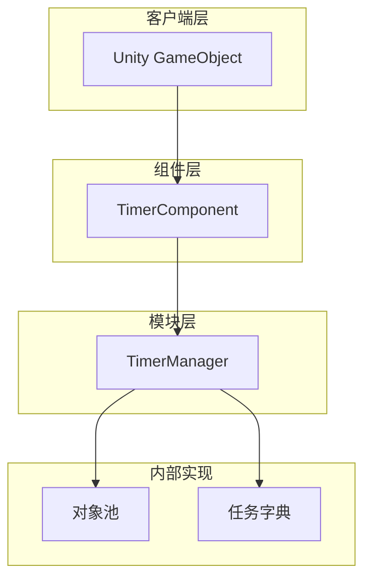

# クイックスタート

Timer コンポーネント是 GameFrameX フレームワーク提供的计时器機能モジュール，用于在 Unity プロジェクト中管理和执行定时任务。无论是周期性イベント、单次延迟执行还是每帧アップデート，Timer コンポーネント都能为您提供シンプル効率的的解決策。

## 概要

Timer コンポーネント提供以下コア機能：

- **定时任务**：以指定时间间隔重复执行的任务
- **单次任务**：延迟指定时间后执行一次的任务
- **帧アップデート任务**：每帧执行的任务，適しています〜する必要があります高频アップデート的シーン
- **任务管理**：確認任务是否存在、移除指定任务

该コンポーネント基于 GameFrameX フレームワークアーキテクチャ設計，自动集成到フレームワーク的モジュール系统中，サポート线程安全的操作和对象池最適化。

## アーキテクチャ

Timer コンポーネント采用分层アーキテクチャ設計，コアコンポーネント含みます：



**アーキテクチャ説明：**

- **TimerComponent**：Unity コンポーネント層，提供给開発者直接使用的インターフェース，継承自 `GameFrameworkComponent`
- **TimerManager**：コアモジュール层，継承自 `GameFrameworkModule`，実装 `ITimerManager` インターフェース，负责定时任务的调度和执行
- **对象池**：使用对象池モード管理 TimerItem，减少内存分配和 GC 压力
- **任务字典**：使用线程安全的字典存储任务，サポート动态追加和移除

## 基本使用

### 第1步：追加コンポーネント

在 Unity エディタ中，选择〜する必要があります使用计时器的 GameObject，点击 **Add Component**，検索 **Timer** 并追加：

> Source: [TimerComponent.cs](https://github.com/GameFrameX/com.gameframex.unity.timer/blob/main/Runtime/Timer/TimerComponent.cs#L11-L13)

```csharp
[DisallowMultipleComponent]
[AddComponentMenu("Game Framework/Timer")]
public class TimerComponent : GameFrameworkComponent
```

### 第2步：取得コンポーネントインスタンス

在脚本中取得 TimerComponent インスタンス：

```csharp
// 获取 TimerComponent 组件
var timerComponent = gameObject.GetComponent<TimerComponent>();
```

### 第3步：使用定时機能

#### 追加定时任务

每隔指定时间执行一次任务，可設定重复次数：

```csharp
// 每隔 1 秒执行一次，共执行 5 次
timerComponent.Add(1f, 5, (param) => {
    Debug.Log("定时任务执行");
});

// 每隔 2 秒执行，无限重复 (repeat = 0)
timerComponent.Add(2f, 0, (param) => {
    Debug.Log("无限重复任务");
});
```

> Source: [TimerComponent.cs](https://github.com/GameFrameX/com.gameframex.unity.timer/blob/main/Runtime/Timer/TimerComponent.cs#L37-L40)

#### 追加单次任务

延迟指定时间后执行一次：

```csharp
// 5 秒后执行一次
timerComponent.AddOnce(5f, (param) => {
    Debug.Log("单次任务执行");
});
```

> Source: [TimerComponent.cs](https://github.com/GameFrameX/com.gameframex.unity.timer/blob/main/Runtime/Timer/TimerComponent.cs#L48-L51)

#### 追加帧アップデート任务

每帧执行的任务，適しています〜する必要があります高频アップデート的シーン：

```csharp
// 每帧执行
timerComponent.AddUpdate((param) => {
    // 每帧执行的逻辑
});

// 带参数的版本
timerComponent.AddUpdate((param) => {
    int frameCount = (int)param;
    Debug.Log($"当前帧: {frameCount}");
}, 0);
```

> Source: [TimerComponent.cs](https://github.com/GameFrameX/com.gameframex.unity.timer/blob/main/Runtime/Timer/TimerComponent.cs#L57-L70)

#### 確認任务是否存在

```csharp
// 检查指定回调的任务是否存在
bool exists = timerComponent.Exists((param) => {
    Debug.Log("任务");
});

Debug.Log($"任务是否存在: {exists}");
```

> Source: [TimerComponent.cs](https://github.com/GameFrameX/com.gameframex.unity.timer/blob/main/Runtime/Timer/TimerComponent.cs#L77-L80)

#### 移除任务

```csharp
// 移除指定任务
timerComponent.Remove((param) => {
    Debug.Log("要移除的任务");
});
```

> Source: [TimerComponent.cs](https://github.com/GameFrameX/com.gameframex.unity.timer/blob/main/Runtime/Timer/TimerComponent.cs#L86-L89)

## 完全な例

以下は完全な的脚本例，表示了如何使用 TimerComponent：

```csharp
using UnityEngine;
using GameFrameX.Timer.Runtime;

public class TimerExample : MonoBehaviour
{
    private TimerComponent _timerComponent;
    private int _executeCount = 0;

    void Start()
    {
        // 获取 TimerComponent
        _timerComponent = gameObject.AddComponent<TimerComponent>();

        // 示例 1：每 1 秒执行一次，共执行 10 次
        _timerComponent.Add(1f, 10, OnTimerTick);

        // 示例 2：5 秒后执行一次
        _timerComponent.AddOnce(5f, OnDelayComplete);

        // 示例 3：每帧执行
        _timerComponent.AddUpdate(OnFrameUpdate);
    }

    void OnTimerTick(object param)
    {
        _executeCount++;
        Debug.Log($"定时任务执行次数: {_executeCount}");
    }

    void OnDelayComplete(object param)
    {
        Debug.Log("延迟任务执行完成");
        
        // 移除帧更新任务
        _timerComponent.Remove(OnFrameUpdate);
    }

    void OnFrameUpdate(object param)
    {
        // 每帧执行的逻辑
    }

    void OnDestroy()
    {
        // 清理所有任务
        if (_timerComponent != null)
        {
            _timerComponent.Remove(OnTimerTick);
            _timerComponent.Remove(OnDelayComplete);
            _timerComponent.Remove(OnFrameUpdate);
        }
    }
}
```

> Source: [TimerComponent.cs](https://github.com/GameFrameX/com.gameframex.unity.timer/blob/main/Runtime/Timer/TimerComponent.cs#L1-L91)

## 重要な説明

### 时间单位

Timer コンポーネント的时间パラメータ**以秒为单位**，而非毫秒：

- `interval = 1f` 表示间隔 1 秒
- `interval = 0.5f` 表示间隔 0.5 秒
- `interval = 0.001f` 表示间隔 1 毫秒（用于帧アップデート）

### 线程安全

TimerManager 内部使用 `lock` 机制確認してください线程安全，〜できます在多线程環境中安全使用。

### コールバック例外処理

〜できます通过設定 `TimerManager.CatchCallbackExceptions` 来控制是否捕获コールバック中的例外：

```csharp
// 捕获回调异常，避免异常终止定时器
TimerManager.CatchCallbackExceptions = true;
```

> Source: [TimerManager.cs](https://github.com/GameFrameX/com.gameframex.unity.timer/blob/main/Runtime/Timer/TimerManager.cs#L43)

## 関連リンク

- [機能特性](./1-overview.features) - 理解する更多 Timer コンポーネント的機能特性
- [インストールガイド](./2-installation) - 確認完全な的インストールステップ
- [追加定时任务](./4-core-functions.add-timer) - 定时任务的詳細用法
- [追加单次任务](./4-core-functions.add-once) - 单次任务的詳細用法
- [追加帧アップデート任务](./4-core-functions.add-update) - 帧アップデート任务的詳細用法
- [確認和移除任务](./4-core-functions.exists-remove) - 任务管理的詳細用法
- [API リファレンス - TimerComponent](./5-api-reference.timer-component) - TimerComponent 完全な API
- [API リファレンス - ITimerManager](./5-api-reference.itimer-manager) - ITimerManager インターフェース定義
- [API リファレンス - TimerManager](./5-api-reference.timer-manager) - TimerManager 実装细节
- [使用例](./6-samples) - 更多使用例
- [常见問題](./7-troubleshooting) - 常见問題解答
