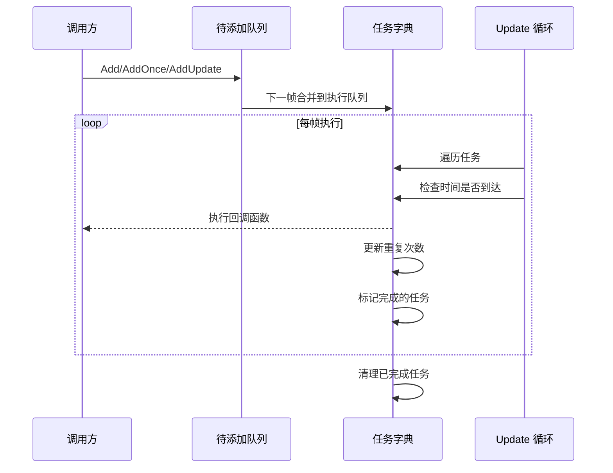

# 機能特性

Timer コンポーネント是 GameFrameX フレームワーク中的计时器モジュール，提供します一套完全な的时间调度解決策，サポート定时重复任务、单次延迟任务和帧アップデート任务的管理。

## 概要

Timer コンポーネント专为 Unity 游戏开发設計，提供高精度、可控的定时任务调度能力。该コンポーネント采用分层アーキテクチャ設計，上层通过 TimerComponent コンポーネント供 Unity シーン使用，下层通过 TimerManager 実装コア逻辑，ITimerManager インターフェース定義標準化的定时器服务。

## コア機能

### 1. 定时重复任务

定时重复任务（Add メソッド）允许開発者設定一个间隔时间和重复次数，任务将按指定间隔重复执行。

**機能特点：**
- サポート指定重复次数（0 表示无限重复）
- 精确的时间间隔控制（以秒为单位）
- 任务执行时传递自定義パラメータ

**典型应用シーン：**
- 周期性血量恢复
- 定时刷新游戏道具
- 周期性保存游戏数据

### 2. 单次延迟任务

单次任务（AddOnce メソッド）在指定延迟时间后执行一次，适合〜する必要があります延迟执行的シーン。

**機能特点：**
- 延迟时间精确可控
- 执行完成后自动移除，无需手动管理
- 与 Add(interval, 1, callback) 等效

**典型应用シーン：**
- 延迟几秒后显示对话框
- 倒计时结束后结束游戏
- 技能冷却完成ヒント

### 3. 帧アップデート任务

帧アップデート任务（AddUpdate メソッド）每帧都会执行，适合〜する必要があります高频アップデート的シーン。

**機能特点：**
- 最小间隔约为 0.001 秒（1 毫秒）
- 无限重复执行
- 常用于实时监控或持续性確認

**典型应用シーン：**
- 实时進捗条アップデート
- 动画ステータス机アップデート
- 持续检测条件是否满足

### 4. 任务存在性確認

Exists メソッド用于確認指定的コールバック函数是否すでに存在于任务队列中。

**機能特点：**
- 同時に確認待追加队列和执行队列
- 返す布尔值表示是否存在

**典型应用シーン：**
- 防止重复追加相同任务
- 在追加前検証任务ステータス

### 5. 任务移除

Remove メソッド用于移除指定的任务，停止其执行。

**機能特点：**
- サポート移除〜中等待的任务
- サポート移除〜中执行的任务（标记为削除）
- 自动回收リソース到对象池

**典型应用シーン：**
- プレイヤー死亡时停止所有战斗相关的定时任务
- 閉じる界面时清理相关的定时刷新
- 取消倒计时

## アーキテクチャ設計

```mermaid
graph TD
    subgraph Unity 层
        TC[TimerComponent<br/>Unity 组件]
    end

    subgraph 接口层
        ITM[ITimerManager<br/>定时器接口]
    end

    subgraph 实现层
        TM[TimerManager<br/>定时器管理器]
        GFM[GameFrameworkModule<br/>框架模块基类]
    end

    subgraph 内部实现
        Pool[对象池]
        Dict[任务字典]
    end

    TC --> ITM
    ITM <|.. TM
    TM --> GFM
    TM --> Pool
    TM --> Dict
```

**コンポーネント説明：**

| コンポーネント | 职责 | 层级 |
|------|------|------|
| TimerComponent | Unity コンポーネントカプセル化，提供シーン中的定时器機能 | Unity 层 |
| ITimerManager | 定義定时器的標準インターフェース，パッケージ含所有コアメソッド | インターフェース層 |
| TimerManager | 実装定时器コア逻辑，含みます任务调度和执行 | 実装層 |
| 对象池 | 复用 TimerItem 对象，减少内存分配 | 内部実装 |

## 任务执行フロー



## 技术特性

### 线程安全

TimerManager 内部使用 `lock` 关键字保护所有操作，確認してください在多线程環境下安全运行。

### 性能最適化

- **对象池モード**：使用 `_pool` 列表复用 TimerItem 对象，避免频繁 GC
- **延迟追加**：新任务追加到 `_toAdd` 队列，在下一帧 Update 时合并到主队列
- **增量时间処理**：処理时间漂移，任务完成后重置计时器

### 例外処理

通过 `TimerManager.CatchCallbackExceptions` 静态プロパティ控制是否捕获コールバック中的例外：
- `false`（デフォルト）：例外直接抛出，〜の可能性があります中断游戏循环
- `true`：捕获例外并输出警告ログ，任务标记为削除

## 使用方法

### 通过コンポーネント使用

在 Unity シーン中，将 TimerComponent 追加到游戏对象上つまり可使用：

```csharp
// 添加定时任务，每隔1秒执行一次，共执行10次
GetComponent<TimerComponent>().Add(1f, 10, OnTimerTick);

// 添加单次任务，5秒后执行
GetComponent<TimerComponent>().AddOnce(5f, OnDelayedExecute);

// 添加帧更新任务
GetComponent<TimerComponent>().AddUpdate(OnFrameUpdate);

// 检查任务是否存在
bool exists = GetComponent<TimerComponent>().Exists(OnTimerTick);

// 移除任务
GetComponent<TimerComponent>().Remove(OnTimerTick);
```

> Source: [TimerComponent.cs](https://github.com/GameFrameX/com.gameframex.unity.timer/blob/main/Runtime/Timer/TimerComponent.cs#L30-L89)

### 通过モジュール使用

在フレームワーク内部，〜できます通过 GameFrameworkEntry 取得 ITimerManager モジュール：

```csharp
var timerManager = GameFrameworkEntry.GetModule<ITimerManager>();
timerManager.Add(1f, 5, OnTick);
```

> Source: [TimerManager.cs](https://github.com/GameFrameX/com.gameframex.unity.timer/blob/main/Runtime/Timer/TimerManager.cs#L156-L188)

## コールバック函数定義

所有定时任务使用統一された的コールバック函数签名：

```csharp
void CallbackName(object param)
{
    // param 是传入的参数，可以是任意对象
    // 如果不需要参数，可以传入 null
}
```

> Source: [ITimerManager.cs](https://github.com/GameFrameX/com.gameframex.unity.timer/blob/main/Runtime/Timer/ITimerManager.cs#L18)

## パラメータ説明

| メソッド | パラメータ | タイプ | 説明 |
|------|------|------|------|
| Add | interval | float | 间隔时间（秒） |
| Add | repeat | int | 重复次数（0=无限） |
| Add | callback | Action\<object\> | コールバック函数 |
| Add | callbackParam | object | コールバックパラメータ |
| AddOnce | interval | float | 延迟时间（秒） |
| AddOnce | callback | Action\<object\> | コールバック函数 |
| AddOnce | callbackParam | object | コールバックパラメータ |
| AddUpdate | callback | Action\<object\> | コールバック函数 |
| AddUpdate | callbackParam | object | コールバックパラメータ |
| Exists | callback | Action\<object\> | 要確認的コールバック |
| Remove | callback | Action\<object\> | 要移除的コールバック |

## 関連リンク

- [Timer コンポーネント介绍](./1-overview.introduction)
- [インストールガイド](./2-installation)
- [快速开始](./3-getting-started)
- [コア機能 - 追加定时任务](./4-core-functions.add-timer)
- [コア機能 - 追加单次任务](./4-core-functions.add-once)
- [コア機能 - 追加帧アップデート任务](./4-core-functions.add-update)
- [コア機能 - 確認和移除任务](./4-core-functions.exists-remove)
- [API リファレンス - TimerComponent](./5-api-reference.timer-component)
- [API リファレンス - ITimerManager](./5-api-reference.itimer-manager)
- [API リファレンス - TimerManager](./5-api-reference.timer-manager)
