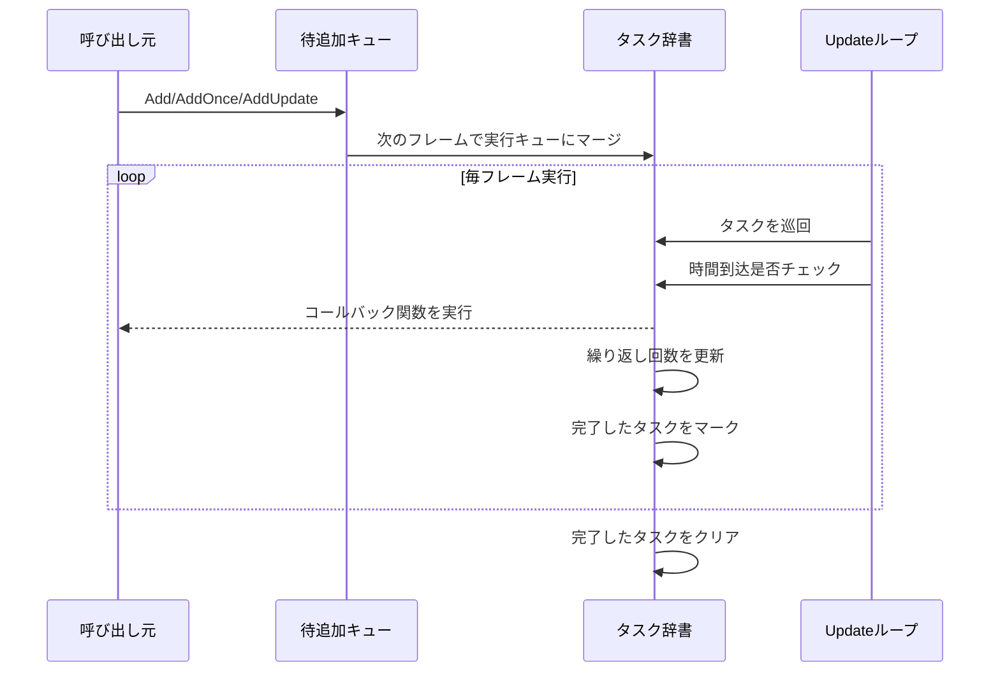

# 機能特性

Timerコンポーネントは、GameFrameXフレームワークのタイマーモジュールであり、定時繰り返しタスク、ワンショット遅延タスク、フレーム更新タスクの管理を含む、完全な時間スケジューリングソリューションを提供します。

## 概要

TimerコンポーネントはUnityゲーム開発向けに設計され、高精度で制御可能な定時タスクスケジューリング機能を提供します。このコンポーネントは階層型アーキテクチャ設計を採用し、上層はTimerComponentコンポーネントを通じてUnityシーンに使用され、下層はTimerManagerを通じて核心ロジックを実装し、ITimerManagerインターフェースは標準化されたタイマーサービスを定義します。

## コア機能

### 1. 定時繰り返しタスク

定時繰り返しタスク（Addメソッド）は、間隔時間と繰り返し回数を設定でき、タスクは指定間隔ごとに繰り返し実行します。

**機能特徴：**
- 繰り返し回数の指定をサポート（0は無限繰り返し）
- 精密な時間間隔制御（秒単位）
- タスク実行時のカスタムパラメータ渡し

**典型的な応用シナリオ：**
- 周期的なHP回復
- 定時的なゲームアイテムのリフレッシュ
- 周期的なセーブデータ保存

### 2. ワンショット遅延タスク

ワンショットタスク（AddOnceメソッド）は、指定遅延時間後に1回だけ実行され、遅延実行が必要なシナリオに適しています。

**機能特徴：**
- 遅延時間の精密な制御
- 実行完了後に自動的に削除され、手動管理不要
- Add(interval, 1, callback)と等価

**典型的な応用シナリオ：**
- 数秒後にダイアログボックスを表示
- カウントダウン終了後にゲームを終了
- スキルクールダウン完了通知

### 3. フレーム更新タスク

フレーム更新タスク（AddUpdateメソッド）は毎フレーム実行され、高頻度更新が必要なシナリオに適しています。

**機能特徴：**
- 最小間隔は約0.001秒（1ミリ秒）
- 無限繰り返し実行
- 常時使用リアルタイム監視や継続的なチェック

**典型的な応用シナリオ：**
- リアルタイム進捗バーの更新
- アニメーションステートマシンの更新
- 条件が満たされているかどうかの継続的な検出

### 4. タスク存在性チェック

Existsメソッドは、指定したコールバック関数がすでにタスクキューに存在するかをチェックするために使用されます。

**機能特徴：**
- 待追加キューと実行キューの両方を同時にチェック
- 存在するかどうかを示すブール値を返す

**典型的な応用シナリオ：**
- 同じタスクの繰り返し追加を防止
- 追加前にタスクステータスを検証

### 5. タスク削除

Removeメソッドは、指定したタスクを削除し、その実行を停止するために使用されます。

**機能特徴：**
- 待機中のタスクの削除をサポート
- 実行中のタスクの削除をサポート（削除としてマーク）
- オブジェクトプールへのリソース回收を自動実行

**典型的な応用シナリオ：**
- プレイヤーが死亡したときにすべての戦闘関連のタイマータスクを停止
- インターフェースを閉じるたびにに関連する定時リフレッシュをクリア
- カウントダウンのキャンセル

## アーキテクチャ設計

```mermaid
graph TD
    subgraph Unity層
        TC[TimerComponent<br/>Unityコンポーネント]
    end

    subgraph インターフェース層
        ITM[ITimerManager<br/>タイマーインターフェース]
    end

    subgraph 実装層
        TM[TimerManager<br/>タイマーマネージャー]
        GFM[GameFrameworkModule<br/>フレームワークモジュール基底クラス]
    end

    subgraph 内部実装
        Pool[オブジェクトプール]
        Dict[タスク辞書]
    end

    TC --> ITM
    ITM <|.. TM
    TM --> GFM
    TM --> Pool
    TM --> Dict
```

**コンポーネント説明：**

| コンポーネント | 役割 | 階層 |
|------|------|------|
| TimerComponent | Unityコンポーネントとしてシーンにタイマー機能を提供 | Unity層 |
| ITimerManager | タイマーの標準インターフェースを定義、すべてのコアメソッドを含む | インターフェース層 |
| TimerManager | タイマーの核心ロジックを実装、タスクスケジューリングと実行を含む | 実装層 |
| オブジェクトプール | TimerItemオブジェクトを再利用、メモリ割り当てを削減 | 内部実装 |

## タスク実行フロー



## 技術的特性

### スレッドセーフ

TimerManager内部は`lock`キーワードを使用してすべての操作を保護し、マルチスレッド環境での安全な実行を確保します。

### パフォーマンス最適化

- **オブジェクトプールモード**：`_pool`リストを使用してTimerItemオブジェクトを再利用し、頻繁なGCを回避
- **遅延追加**：新しいタスクを`_toAdd`キューに追加し、次のフレームUpdate時にメインキューにマージ
- **增量時間処理**：時間ドリフトを処理し、タスク完了後にタイマーをリセット

### 例外処理

`TimerManager.CatchCallbackExceptions`静的プロパティを通じて、コールバック例外処理の有無を制御します：
- `false`（デフォルト）：例外が直接スローされ、ゲームループが中断される可能性があります
- `true`：例外を捕獲して警告ログを出力し、タスクを削除としてマーク

## 使用方法

### コンポーネント経由でで使用

Unityシーンで、TimerComponentをゲームオブジェクトに追加して使用します：

```csharp
// 定時タスクを追加、毎秒1回実行、合計10回実行
GetComponent<TimerComponent>().Add(1f, 10, OnTimerTick);

// ワンショットタスクを追加、5秒後に実行
GetComponent<TimerComponent>().AddOnce(5f, OnDelayedExecute);

// フレーム更新タスクを追加
GetComponent<TimerComponent>().AddUpdate(OnFrameUpdate);

// タスクが存在するかをチェック
bool exists = GetComponent<TimerComponent>().Exists(OnTimerTick);

// タスクを削除
GetComponent<TimerComponent>().Remove(OnTimerTick);
```

> Source: [TimerComponent.cs](https://github.com/GameFrameX/com.gameframex.unity.timer/blob/main/Runtime/Timer/TimerComponent.cs#L30-L89)

### モジュール経由でで使用

フレームワーク内部では、GameFrameworkEntryを介してITimerManagerモジュールのインスタンスを取得できます：

```csharp
var timerManager = GameFrameworkEntry.GetModule<ITimerManager>();
timerManager.Add(1f, 5, OnTick);
```

> Source: [TimerManager.cs](https://github.com/GameFrameX/com.gameframex.unity.timer/blob/main/Runtime/Timer/TimerManager.cs#L156-L188)

## コールバック関数定義

すべての定時タスクは、统一されたコールバック関数署名を使用します：

```csharp
void CallbackName(object param)
{
    // paramは渡されたパラメータで、任意のオブジェクトできます
    // パラメータが不要な場合はnullを渡すことができます
}
```

> Source: [ITimerManager.cs](https://github.com/GameFrameX/com.gameframex.unity.timer/blob/main/Runtime/Timer/ITimerManager.cs#L18)

## パラメータ説明

| メソッド | パラメータ | 型 | 説明 |
|------|------|------|------|
| Add | interval | float | 間隔時間（秒） |
| Add | repeat | int | 繰り返し回数（0=無限） |
| Add | callback | Action\<object\> | コールバック関数 |
| Add | callbackParam | object | コールバックパラメータ |
| AddOnce | interval | float | 遅延時間（秒） |
| AddOnce | callback | Action\<object\> | コールバック関数 |
| AddOnce | callbackParam | object | コールバックパラメータ |
| AddUpdate | callback | Action\<object\> | コールバック関数 |
| AddUpdate | callbackParam | object | コールバックパラメータ |
| Exists | callback | Action\<object\> | チェックするコールバック |
| Remove | callback | Action\<object\> | 削除するコールバック |

## 関連リンク

- [Timerコンポーネント紹介](./1-overview.introduction)
- [インストールガイド](./2-installation)
- [クイックスタート](./3-getting-started)
- [コア機能 - タイマータスクの追加](./4-core-functions.add-timer)
- [コア機能 - ワンショット実行タスクの追加](./4-core-functions.add-once)
- [コア機能 - フレーム更新タスクの追加](./4-core-functions.add-update)
- [コア機能 - タスクのチェックと削除](./4-core-functions.exists-remove)
- [APIリファレンス - TimerComponent](./5-api-reference.timer-component)
- [APIリファレンス - ITimerManager](./5-api-reference.itimer-manager)
- [APIリファレンス - TimerManager](./5-api-reference.timer-manager)
