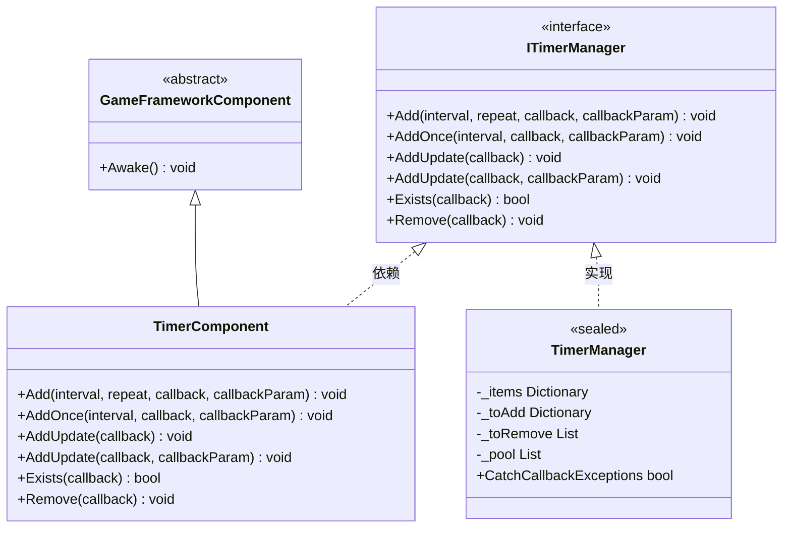
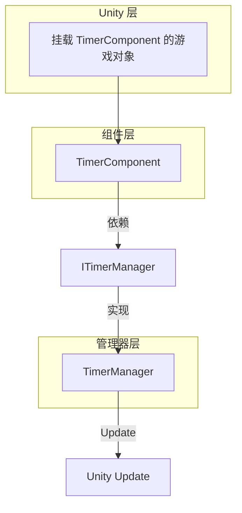
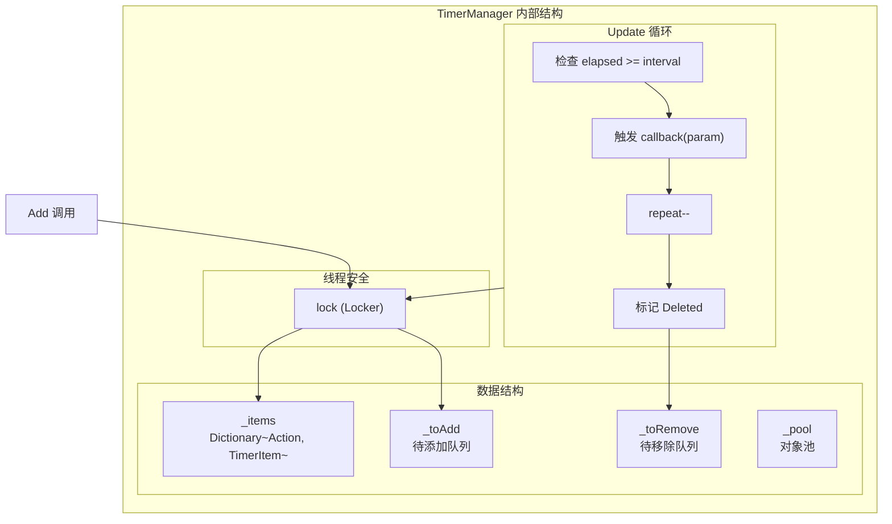

# TimerComponent

TimerComponent 是 Timer モジュール的 Unity コンポーネントカプセル化，提供定时任务管理機能。作为 GameFrameX フレームワーク的コアコンポーネント之一，它允许開発者追加各种定时执行的任务，含みます重复执行、单次执行和每帧アップデート执行的任务。

## 概要

TimerComponent 継承自 GameFrameworkComponent，は Unity コンポーネント（[DisallowMultipleComponent]），〜する必要があります挂载到 Unity 游戏对象上使用。该コンポーネント内部デリゲート ITimerManager（TimerManager 実装）来処理实际的定时任务逻辑，自身仅提供シンプル的 Unity API インターフェース。

**継承层次：**



## アーキテクチャ説明

TimerComponent 在アーキテクチャ中位于 **API 层**，为 Unity 開発者提供便捷的呼び出しインターフェース：



**工作フロー：**
1. 開発者在 Unity エディタ中将 TimerComponent 挂载到游戏对象
2. 呼び出し TimerComponent 的公开メソッド追加定时任务
3. TimerComponent 将请求转发给 TimerManager
4. TimerManager 在 Update 循环中检测并トリガー定时任务コールバック

## API リファレンス

### `Add(interval, repeat, callback, callbackParam)`

追加一个定时重复执行的任务。

```csharp
public void Add(float interval, int repeat, Action<object> callback, object callbackParam = null)
```
> Source: [TimerComponent.cs](https://github.com/GameFrameX/com.gameframex.unity.timer/blob/main/Runtime/Timer/TimerComponent.cs#L37-L40)

**パラメータ：**
| パラメータ名 | タイプ | 必填 | 説明 |
|--------|------|------|------|
| interval | float | 是 | 间隔时间（以秒为单位） |
| repeat | int | 是 | 重复次数，0 表示无限重复 |
| callback | Action\<object\> | 是 | 定时トリガー时执行的コールバック函数 |
| callbackParam | object | 否 | 传递给コールバック函数的パラメータ |

**戻り値：** 无

**使用例：**

```csharp
// 每隔1秒执行一次，共执行10次
timerComponent.Add(1f, 10, OnTimerTick, "tick data");

// 无限重复执行（每秒一次）
timerComponent.Add(1f, 0, OnTimerTick);
```

---

### `AddOnce(interval, callback, callbackParam)`

追加一个只执行一次的定时任务。

```csharp
public void AddOnce(float interval, Action<object> callback, object callbackParam = null)
```
> Source: [TimerComponent.cs](https://github.com/GameFrameX/com.gameframex.unity.timer/blob/main/Runtime/Timer/TimerComponent.cs#L48-L51)

**パラメータ：**
| パラメータ名 | タイプ | 必填 | 説明 |
|--------|------|------|------|
| interval | float | 是 | 延迟时间（以秒为单位），延迟后执行一次 |
| callback | Action\<object\> | 是 | 延迟到达时执行的コールバック函数 |
| callbackParam | object | 否 | 传递给コールバック函数的パラメータ |

**戻り値：** 无

**使用例：**

```csharp
// 5秒后执行一次
timerComponent.AddOnce(5f, OnDelayedAction, "delayed");

// 1秒后执行一次
timerComponent.AddOnce(1f, OnGameStart);
```

---

### `AddUpdate(callback)`

追加一个每帧アップデート执行的任务（无パラメータバージョン）。

```csharp
public void AddUpdate(Action<object> callback)
```
> Source: [TimerComponent.cs](https://github.com/GameFrameX/com.gameframex.unity.timer/blob/main/Runtime/Timer/TimerComponent.cs#L57-L60)

**パラメータ：**
| パラメータ名 | タイプ | 必填 | 説明 |
|--------|------|------|------|
| callback | Action\<object\> | 是 | 每帧执行的コールバック函数 |

**戻り値：** 无

**备注：** 内部実装为间隔 0.001 秒的无限重复任务，实际执行频率受 Unity Update 帧率影响。

**使用例：**

```csharp
// 每帧执行
timerComponent.AddUpdate(OnFrameUpdate);
```

---

### `AddUpdate(callback, callbackParam)`

追加一个每帧アップデート执行的任务（带パラメータバージョン）。

```csharp
public void AddUpdate(Action<object> callback, object callbackParam)
```
> Source: [TimerComponent.cs](https://github.com/GameFrameX/com.gameframex.unity.timer/blob/main/Runtime/Timer/TimerComponent.cs#L67-L70)

**パラメータ：**
| パラメータ名 | タイプ | 必填 | 説明 |
|--------|------|------|------|
| callback | Action\<object\> | 是 | 每帧执行的コールバック函数 |
| callbackParam | object | 是 | 传递给コールバック函数的パラメータ |

**戻り値：** 无

**使用例：**

```csharp
// 每帧执行并传递参数
timerComponent.AddUpdate(OnFrameUpdate, frameCounter);
```

---

### `Exists(callback)`

確認指定的任务是否存在。

```csharp
public bool Exists(Action<object> callback)
```
> Source: [TimerComponent.cs](https://github.com/GameFrameX/com.gameframex.unity.timer/blob/main/Runtime/Timer/TimerComponent.cs#L77-L80)

**パラメータ：**
| パラメータ名 | タイプ | 必填 | 説明 |
|--------|------|------|------|
| callback | Action\<object\> | 是 | 要確認的コールバック函数 |

**戻り値：** bool - 任务存在返す true，不存在返す false

**使用例：**

```csharp
if (timerComponent.Exists(OnTimerTick))
{
    Debug.Log("任务正在运行");
}
```

---

### `Remove(callback)`

移除指定的定时任务。

```csharp
public void Remove(Action<object> callback)
```
> Source: [TimerComponent.cs](https://github.com/GameFrameX/com.gameframex.unity.timer/blob/main/Runtime/Timer/TimerComponent.cs#L86-L89)

**パラメータ：**
| パラメータ名 | タイプ | 必填 | 説明 |
|--------|------|------|------|
| callback | Action\<object\> | 是 | 要移除的コールバック函数 |

**戻り値：** 无

**使用例：**

```csharp
// 移除指定任务
timerComponent.Remove(OnTimerTick);

// 移除所有帧更新任务
timerComponent.Remove(OnFrameUpdate);
```

---

## 内部実装机制

### TimerManager コア逻辑

TimerComponent 背后的实际処理由 TimerManager 完成。TimerManager 使用以下机制確認してください効率的和线程安全：



### 关键設計特点

1. **延迟追加/移除队列**：使用 `_toAdd` 和 `_toRemove` 队列避免在 Update 遍历过程中変更集合导致的問題
2. **对象池モード**：`_pool` 列表复用 TimerItem 对象，减少 GC 开销
3. **线程安全**：所有操作都通过 `lock (Locker)` 保护
4. **例外処理オプション**：通过 `TimerManager.CatchCallbackExceptions` 静态プロパティ控制是否捕获コールバック例外

## 常见使用モード

### 基本モード

```csharp
// 获取组件引用
var timer = GetComponent<TimerComponent>();

// 添加重复任务
timer.Add(1f, 5, OnTick, "data");

// 定义回调
void OnTick(object param)
{
    Debug.Log($"Timer tick: {param}");
}
```

### 游戏开发常见シーン

```csharp
// 延迟执行（单次）
timerComponent.AddOnce(3f, OnLevelStart);

// 持续效果（如中毒扣血）
timerComponent.Add(1f, 0, OnPoisonDamage, 10);

// 每帧检测
timerComponent.AddUpdate(OnCheckInput);

// 条件移除
if (timerComponent.Exists(myCallback))
{
    timerComponent.Remove(myCallback);
}
```

## 関連リンク

- [ITimerManager インターフェースリファレンス](./5-api-reference.itimer-manager)
- [TimerManager 実装リファレンス](./5-api-reference.timer-manager)
- [コア機能 - 追加定时任务](./4-core-functions.add-timer)
- [コア機能 - 追加单次任务](./4-core-functions.add-once)
- [コア機能 - 追加帧アップデート任务](./4-core-functions.add-update)
- [コア機能 - 確認和移除任务](./4-core-functions.exists-remove)
- [快速开始](./3-getting-started)
