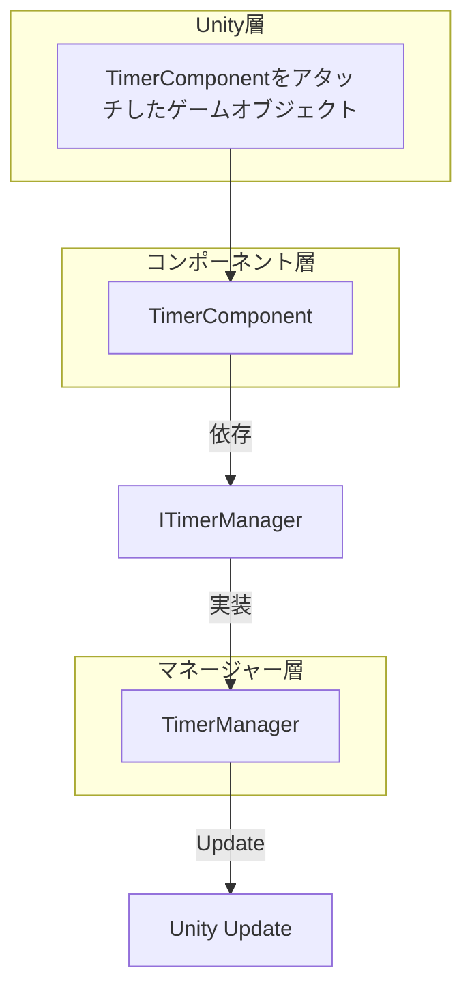
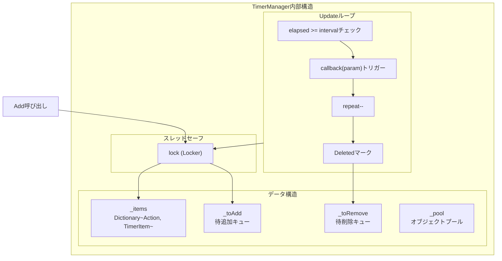

# TimerComponent

TimerComponentはTimerモジュールのUnityコンポーネント封装であり、定時タスク管理機能を提供します。GameFrameXフレームワークのコアコンポーネントの一つであり、繰り返し実行、ワンショット実行、毎フレーム更新実行などの定時実行タスクを追加できます。

## 概要

TimerComponentはGameFrameworkComponentを継承したUnityコンポーネント（[DisallowMultipleComponent]）であり、Unityのゲームオブジェクトにアタッチして使用します。このコンポーネントは内部でITimerManager（TimerManager実装）に委托して実際の定時タスクロジックを処理し、自身は簡潔なUnity APIインターフェースのみを提供します。

**継承階層：**


## アーキテクチャ説明

TimerComponentはアーキテクチャ中の**API層**に位置し、Unity開発者に便捷な呼び出しインターフェースを提供します：



**ワークフロー：**
1. 開発者がUnityエディタでTimerComponentをゲームオブジェクトにアタッチ
2. TimerComponentの公開メソッドを呼び出して定時タスクを追加
3. TimerComponentはリクエストをTimerManagerに転送
4. TimerManagerはUpdateループで定時タスクコールバックを検出およびトリガー

## APIリファレンス

### `Add(interval, repeat, callback, callbackParam)`

定時繰り返し実行タスクを追加します。

```csharp
public void Add(float interval, int repeat, Action<object> callback, object callbackParam = null)
```
> Source: [TimerComponent.cs](https://github.com/GameFrameX/com.gameframex.unity.timer/blob/main/Runtime/Timer/TimerComponent.cs#L37-L40)

**パラメータ：**
| パラメータ名 | 型 | 必須 | 説明 |
|--------|------|------|------|
| interval | float | ○ | 間隔時間（秒単位） |
| repeat | int | ○ | 繰り返し回数、0は無限繰り返し |
| callback | Action\<object\> | ○ | 定時トリガー時に実行されるコールバック関数 |
| callbackParam | object | × | コールバック関数に渡すパラメータ |

**戻り値：** なし

**使用例：**

```csharp
// 1秒ごとに実行、合計10回実行
timerComponent.Add(1f, 10, OnTimerTick, "tick data");

// 無限繰り返し実行（每秒1回）
timerComponent.Add(1f, 0, OnTimerTick);
```

---

### `AddOnce(interval, callback, callbackParam)`

ワンショット実行の定時タスクを追加します。

```csharp
public void AddOnce(float interval, Action<object> callback, object callbackParam = null)
```
> Source: [TimerComponent.cs](https://github.com/GameFrameX/com.gameframex.unity.timer/blob/main/Runtime/Timer/TimerComponent.cs#L48-L51)

**パラメータ：**
| パラメータ名 | 型 | 必須 | 説明 |
|--------|------|------|------|
| interval | float | ○ | 遅延時間（秒単位）、遅延後に1回実行 |
| callback | Action\<object\> | ○ | 遅延到達時に実行されるコールバック関数 |
| callbackParam | object | × | コールバック関数に渡すパラメータ |

**戻り値：** なし

**使用例：**

```csharp
// 5秒後に1回実行
timerComponent.AddOnce(5f, OnDelayedAction, "delayed");

// 1秒後に1回実行
timerComponent.AddOnce(1f, OnGameStart);
```

---

### `AddUpdate(callback)`

毎フレーム更新実行タスクを追加します（パラメータなしバージョン）。

```csharp
public void AddUpdate(Action<object> callback)
```
> Source: [TimerComponent.cs](https://github.com/GameFrameX/com.gameframex.unity.timer/blob/main/Runtime/Timer/TimerComponent.cs#L57-L60)

**パラメータ：**
| パラメータ名 | 型 | 必須 | 説明 |
|--------|------|------|------|
| callback | Action\<object\> | ○ | 毎フレーム実行されるコールバック関数 |

**戻り値：** なし

**備考：** 内部では間隔0.001秒の無限繰り返しタスクとして実装されており、実際の実行頻度はUnity Updateのフレームレートに影響されます。

**使用例：**

```csharp
// 毎フレーム実行
timerComponent.AddUpdate(OnFrameUpdate);
```

---

### `AddUpdate(callback, callbackParam)`

毎フレーム更新実行タスクを追加します（パラメータ付きバージョン）。

```csharp
public void AddUpdate(Action<object> callback, object callbackParam)
```
> Source: [TimerComponent.cs](https://github.com/GameFrameX/com.gameframex.unity.timer/blob/main/Runtime/Timer/TimerComponent.cs#L67-L70)

**パラメータ：**
| パラメータ名 | 型 | 必須 | 説明 |
|--------|------|------|------|
| callback | Action\<object\> | ○ | 毎フレーム実行されるコールバック関数 |
| callbackParam | object | ○ | コールバック関数に渡すパラメータ |

**戻り値：** なし

**使用例：**

```csharp
// 毎フレーム実行しパラメータを渡す
timerComponent.AddUpdate(OnFrameUpdate, frameCounter);
```

---

### `Exists(callback)`

指定したタスク是否存在かをチェックします。

```csharp
public bool Exists(Action<object> callback)
```
> Source: [TimerComponent.cs](https://github.com/GameFrameX/com.gameframex.unity.timer/blob/main/Runtime/Timer/TimerComponent.cs#L77-L80)

**パラメータ：**
| パラメータ名 | 型 | 必須 | 説明 |
|--------|------|------|------|
| callback | Action\<object\> | ○ | チェック対象のコールバック関数 |

**戻り値：** bool - タスクが存在する場合はtrue、不存在場合はfalse

**使用例：**

```csharp
if (timerComponent.Exists(OnTimerTick))
{
    Debug.Log("タスクが実行中");
}
```

---

### `Remove(callback)`

指定した定時タスクを削除します。

```csharp
public void Remove(Action<object> callback)
```
> Source: [TimerComponent.cs](https://github.com/GameFrameX/com.gameframex.unity.timer/blob/main/Runtime/Timer/TimerComponent.cs#L86-L89)

**パラメータ：**
| パラメータ名 | 型 | 必須 | 説明 |
|--------|------|------|------|
| callback | Action\<object\> | ○ | 削除対象のコールバック関数 |

**戻り値：** なし

**使用例：**

```csharp
// 指定タスクを削除
timerComponent.Remove(OnTimerTick);

// すべてのフレーム更新タスクを削除
timerComponent.Remove(OnFrameUpdate);
```

---

## 内部実装メカニズム

### TimerManager核心ロジック

TimerComponentの裏方の実際の処理はTimerManagerが完了します。TimerManagerは以下のメカニズムを使用して効率とスレッドセーフを確保します：



### 主要な設計特徴

1. **遅延追加/削除キュー**： `_toAdd`と`_toRemove`キューを使用して、Update巡回中にコレクションを変更することによる問題を回避
2. **オブジェクトプールモード**： `_pool`リストでTimerItemオブジェクトを再利用し、GCオーバーヘッドを削減
3. **スレッドセーフ**： すべての操作は`lock (Locker)`で保護
4. **例外処理オプション**： `TimerManager.CatchCallbackExceptions`静的プロパティを通じてコールバック例外の捕獲を制御

## 一般的な使用パターン

### 基本モード

```csharp
// コンポーネント参照を取得
var timer = GetComponent<TimerComponent>();

// 繰り返しタスクを追加
timer.Add(1f, 5, OnTick, "data");

// コールバックを定義
void OnTick(object param)
{
    Debug.Log($"Timer tick: {param}");
}
```

### ゲーム開発一般的なシーン

```csharp
// 遅延実行（ワンショット）
timerComponent.AddOnce(3f, OnLevelStart);

// 継続効果（毒ダメージなど）
timerComponent.Add(1f, 0, OnPoisonDamage, 10);

// 毎フレーム検出
timerComponent.AddUpdate(OnCheckInput);

// 条件削除
if (timerComponent.Exists(myCallback))
{
    timerComponent.Remove(myCallback);
}
```

## 関連リンク

- [ITimerManagerインターフェースリファレンス](./5-api-reference.itimer-manager)
- [TimerManager実装リファレンス](./5-api-reference.timer-manager)
- [コア機能 - タイマータスク追加](./4-core-functions.add-timer)
- [コア機能 - ワンショットタスク追加](./4-core-functions.add-once)
- [コア機能 - フレーム更新タスク追加](./4-core-functions.add-update)
- [コア機能 - タスクチェックと削除](./4-core-functions.exists-remove)
- [クイックスタート](./3-getting-started)
