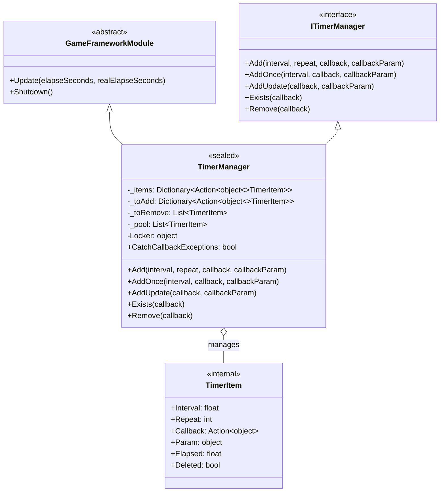
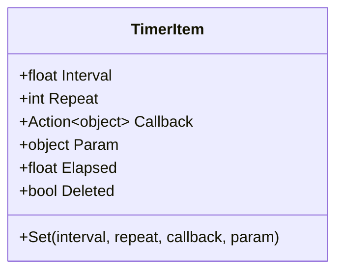

# TimerManager

TimerManagerはGameFrameXタイマーモジュールのコア実装クラスであり、定時タスクのスケジューリングと実行を担当します。`GameFrameworkModule`を継承し、`ITimerManager`インターフェースを実装し、正確な時間間隔制御、繰り返し回数管理、スレッドセーフな操作メカニズムを提供します。

## 概要

TimerManagerはタイマーシステム全体のコアエンジンであり、ゲーム実行時にすべての定時タスクのライフサイクルを管理します。このクラスはオブジェクトプールパターンを採用してゴミ回収の負荷を軽減し、双缓冲メカニズム（待追加/待削除リスト）を使用してUpdateループ中で安全にタスクを追加および削除し、同時にロックメカニズムでマルチスレッド環境でのスレッドセーフティを保証します。

GameFrameXフレームワークのコアモジュールとして、TimerManagerは各フレームのUpdateコールバックですべてのアクティブタスクを巡回し、トリガー条件是否满足をチェック、対応するコールバック関数を実行します。3種類の定時タスクをサポートしています：固定間隔繰り返しタスク、ワンショット遅延タスク、毎フレーム更新タスク。

### コア責務

- 定時タスクの追加、削除、実行を管理
- タスク実行の時間累積とトリガーロジックを維持
- オブジェクトプール再利用メカニズムを提供してパフォーマンスを最適化
- マルチスレッド環境での操作安全性を保証

### 設計特徴

TimerManagerは高性能と安定性を確保するために複数の最適化戦略を採用しています。まず、オブジェクトプール技術はTimerItemオブジェクトの频繁な作成と破棄を避け、GC（ゴミ回收）压力を显著に軽減します。次に、任務の双缓冲メカニズムは巡回プロセス中新任務の追加と削除マークを安全に行わせ、コレクション変更例外を引起こしません。最後に、スレッドロックはマルチスレッドアクセス時のデータ一貫性を確保します。



## コアフロー

TimerManagerのコア実行フローは各フレームのUpdateメソッドで発生します。このフローは定時任務が正確な時間間隔でトリガーされることを保証し、同時に任務の動的な追加と削除を処理します。

```mermaid
flowchart TD
    subgraph UpdateLoop["Updateループ"]
        Start([Update開始]) --> Lock["ロック Locker を取得"]
        Lock --> CheckItems{"_items 数量\n> 0?"}

        CheckItems -->|Yes| Iterate["_items コレクションを巡回"]
        CheckItems -->|No| CheckToRemove["_toRemove をチェック"]

        Iterate --> CheckDeleted{現在の TimerItem\n削除済み?}
        CheckDeleted -->|Yes| AddToRemove["_toRemove に追加"]
        CheckDeleted -->|No| UpdateElapsed["Elapsed を累積"]

        UpdateElapsed --> CheckInterval{Elapsed \n>= Interval?}
        CheckInterval -->|No| ContinueIterate["次へ進む"]
        CheckInterval -->|Yes| ResetElapsed["Elapsed をリセット"]

        ResetElapsed --> CheckRepeat{Repeat \n> 0?}
        CheckRepeat -->|Yes| DecrementRepeat["Repeat--"]
        DecrementRepeat --> CheckRepeatZero{Repeat == 0?}
        CheckRepeatZero -->|Yes| MarkDeleted["Deleted マーク"]
        CheckRepeatZero -->|No| ExecuteCallback["コールバックを実行"]

        MarkDeleted --> AddToRemove
        ExecuteCallback --> ContinueIterate

        AddToRemove --> ContinueIterate

        ContinueIterate --> HasNext{"まだ更多\n任務?}
        HasNext -->|Yes| Iterate
        HasNext -->|No| CheckToRemove

        CheckToRemove --> ProcessRemove{"_toRemove\n数量 > 0?"}
        ProcessRemove -->|Yes| RemoveItems["マーク付き任務を削除\nオブジェクトプールに返却"]
        ProcessRemove -->|No| CheckToAdd

        RemoveItems --> CheckToAdd
        CheckToAdd --> ProcessAdd{"_toAdd\n数量 > 0?"}
        ProcessAdd -->|Yes| AddNewItems["新任務を\n_items に追加"]
        ProcessAdd -->|No| Release["ロックを解放"]
        ProcessAdd -->|No| End([Update終了])

        AddNewItems --> Release
        Release --> End
    end
```

### フロー説明

Updateメソッドの実行フローは4つの主要段階に分かれます。まず任務巡回段階で、現在のすべてのアクティブ任務を巡回し、各任務の経過時間（Elapsed）を累積し、トリガー間隔是否到达をチェックします。次にコールバック実行段階で、任務がトリガー条件を満たした場合、绑定されたコールバック関数を実行し、Repeatパラメータに基づいて繰り返し回数を递减するかを決定します。3番目は削除処理段階で、削除マーク付きの任務をコレクションから削除し、オブジェクトプールに返却して再利用に供します。最後に追加処理段階で、待追加キュー中新任務をアクティブ任務コレクションにマージします。

この設計により、コールバック実行プロセス中に他の任務を追加または削除しても、巡回の正確性に影響しません、実際の追加と削除操作は巡回終了後にのみ実行されるためです。

## 内部クラス TimerItem

TimerItemはTimerManager内部のネストクラスであり、単一の定時任務の完全なステータス情報を存储するために使用されます。各TimerItemオブジェクトは任務の実行間隔、残り繰り返し回数、コールバック関数、コールバックパラメータ、内部ステータスフラグを含みます。



| プロパティ | 型 | 説明 |
|------|------|------|
| Interval | float | 任務トリガー間隔、秒単位 |
| Repeat | int | 残り繰り返し回数、0は無限繰り返し |
| Callback | Action\<object\> | 任務トリガー時に実行されるコールバック関数 |
| Param | object | コールバック関数に渡すパラメータ |
| Elapsed | float | 前回トリガーからの経過時間 |
| Deleted | bool | 任務が既に削除されたかをマーク |

## 使用例

### 基本用法

簡単な繰り返し定時任務を追加する方法を示します：

```csharp
// 定時任務を作成、1秒ごとに実行、合計10回実行
TimerManager.Instance.Add(1.0f, 10, callback: (param) =>
{
    Debug.Log($"定時任務実行、パラメータ: {param}");
}, callbackParam: "Hello Timer");
```
> Source: [TimerManager.cs](https://github.com/GameFrameX/com.gameframex.unity.timer/blob/main/Runtime/Timer/TimerManager.cs#L156-L188)

### ワンショット任務用法

AddOnceメソッドを使用して遅延実行のワンショット任務を追加します：

```csharp
// 5秒後に1回任務を実行
TimerManager.Instance.AddOnce(5.0f, callback: (param) =>
{
    Debug.Log("任務は1回だけ実行");
}, callbackParam: null);
```
> Source: [TimerManager.cs](https://github.com/GameFrameX/com.gameframex.unity.timer/blob/main/Runtime/Timer/TimerManager.cs#L197-L200)

### 毎フレーム更新任務

AddUpdateメソッドを使用して毎フレーム実行の軽量任務を追加します：

```csharp
// 毎フレーム実行の任務（間隔約0.001秒）
TimerManager.Instance.AddUpdate(callback: (param) =>
{
    // 毎フレーム実行のロジック
    transform.Rotate(Vector3.up, 10f * Time.deltaTime);
});
```
> Source: [TimerManager.cs](https://github.com/GameFrameX/com.gameframex.unity.timer/blob/main/Runtime/Timer/TimerManager.cs#L206-L219)

### 任務チェックと削除

ExistsとRemoveメソッドを使用して任務のライフサイクルを管理します：

```csharp
private Action<object> _myTimerCallback;

void Start()
{
    // 任務を追加しコールバック参照を保存
    _myTimerCallback = OnTimerTick;
    TimerManager.Instance.Add(1.0f, 5, _myTimerCallback, "test");
}

void OnTimerTick(object param)
{
    Debug.Log($"Tick: {param}");
}

// 他のメソッドでチェックと削除
void StopTimer()
{
    if (TimerManager.Instance.Exists(_myTimerCallback))
    {
        TimerManager.Instance.Remove(_myTimerCallback);
        Debug.Log("任務が削除されました");
    }
}
```
> Source: [TimerManager.cs](https://github.com/GameFrameX/com.gameframex.unity.timer/blob/main/Runtime/Timer/TimerManager.cs#L226-L264)

## APIリファレンス

### `TimerManager`

完全なクラス宣言は以下の通りです：

```csharp
public sealed class TimerManager : GameFrameworkModule, ITimerManager
```
> Source: [TimerManager.cs](https://github.com/GameFrameX/com.gameframex.unity.timer/blob/main/Runtime/Timer/TimerManager.cs#L12)

**継承関係：**
- 親クラス：GameFrameworkModule
- インターフェース：ITimerManager

---

### `CatchCallbackExceptions`

```csharp
public static bool CatchCallbackExceptions = false;
```
> Source: [TimerManager.cs](https://github.com/GameFrameX/com.gameframex.unity.timer/blob/main/Runtime/Timer/TimerManager.cs#L43)

**説明：** グローバル静的プロパティで、コールバック関数実行中に発生した例外を捕獲するかを制御します。

**デフォルト値：** false

**使用シーン：**
- `true`に設定すると、コールバック関数実行中に例外が発生すると捕獲され警告ログに記録され、任務は削除マーク付き
- `false`に設定すると、コールバック関数実行中の例外は直接スローされ、アプリケーションがクラッシュする可能性があります

---

### `Add(interval, repeat, callback, callbackParam)`

```csharp
public void Add(float interval, int repeat, Action<object> callback, object callbackParam = null)
```
> Source: [TimerManager.cs](https://github.com/GameFrameX/com.gameframex.unity.timer/blob/main/Runtime/Timer/TimerManager.cs#L156-L188)

**説明：** 定時繰り返し実行任務を追加します。

**パラメータ：**
| パラメータ名 | 型 | 必須 | デフォルト値 | 説明 |
|--------|------|------|--------|------|
| interval | float | ○ | - | 任務トリガー間隔時間、秒単位 |
| repeat | int | ○ | - | 繰り返し回数、0は無限繰り返し |
| callback | Action\<object\> | ○ | - | 任務トリガー時に実行されるコールバック関数 |
| callbackParam | object | × | null | コールバック関数に渡すパラメータ |

**戻り型：** void

**内部ロジック：**
1. コールバック関数が空かどうかをチェック、空の場合は警告ログを記録して戻る
2. 任務が既に存在するかどうかをチェック、存在する場合はパラメータを更新してステータスをリセット
3. オブジェクトプールから取得または新しいTimerItemを作成
4. 任務を待追加キューに追加、次のフレームでアクティブコレクションにマージ

**例外処理：**
- callbackがnullの場合、警告ログを記録するが例外はスローしない

---

### `AddOnce(interval, callback, callbackParam)`

```csharp
public void AddOnce(float interval, Action<object> callback, object callbackParam = null)
```
> Source: [TimerManager.cs](https://github.com/GameFrameX/com.gameframex.unity.timer/blob/main/Runtime/Timer/TimerManager.cs#L197-L200)

**説明：** ワンショット実行の定時任務を追加します。本質的にはrepeatパラメータが1のAdd呼び出しです。

**パラメータ：**
| パラメータ名 | 型 | 必須 | デフォルト値 | 説明 |
|--------|------|------|--------|------|
| interval | float | ○ | - | 遅延時間、秒単位 |
| callback | Action\<object\> | ○ | - | 任務トリガー時に実行されるコールバック関数 |
| callbackParam | object | × | null | コールバック関数に渡すパラメータ |

**戻り型：** void

**等価実装：**
```csharp
Add(interval, 1, callback, callbackParam);
```

---

### `AddUpdate(callback)`

```csharp
public void AddUpdate(Action<object> callback)
```
> Source: [TimerManager.cs](https://github.com/GameFrameX/com.gameframex.unity.timer/blob/main/Runtime/Timer/TimerManager.cs#L206-L209)

**説明：** 毎フレーム更新実行任務を追加します。

**パラメータ：**
| パラメータ名 | 型 | 必須 | 説明 |
|--------|------|------|------|
| callback | Action\<object\> | ○ | 毎フレーム実行されるコールバック関数 |

**戻り型：** void

**等価実装：**
```csharp
Add(0.001f, 0, callback);
```

**注意：** 間隔時間は0.001秒（毎フレームに相当）に設定され、repeatは0で無限繰り返しを示します。

---

### `AddUpdate(callback, callbackParam)`

```csharp
public void AddUpdate(Action<object> callback, object callbackParam)
```
> Source: [TimerManager.cs](https://github.com/GameFrameX/com.gameframex.unity.timer/blob/main/Runtime/Timer/TimerManager.cs#L216-L219)

**説明：** 毎フレーム更新実行任務を追加し、パラメータを渡します。

**パラメータ：**
| パラメータ名 | 型 | 必須 | 説明 |
|--------|------|------|------|
| callback | Action\<object\> | ○ | 毎フレーム実行されるコールバック関数 |
| callbackParam | object | ○ | コールバック関数に渡すパラメータ |

**戻り型：** void

**等価実装：**
```csharp
Add(0.001f, 0, callback, callbackParam);
```

---

### `Exists(callback)`

```csharp
public bool Exists(Action<object> callback)
```
> Source: [TimerManager.cs](https://github.com/GameFrameX/com.gameframex.unity.timer/blob/main/Runtime/Timer/TimerManager.cs#L226-L243)

**説明：** 指定したコールバック関数の任務是否存在かをチェックします。

**パラメータ：**
| パラメータ名 | 型 | 必須 | 説明 |
|--------|------|------|------|
| callback | Action\<object\> | ○ | チェック対象のコールバック関数 |

**戻り型：** bool

**戻り説明：**
- 任務が待追加キュー（_toAdd）に存在する場合、trueを返す
- 任務がアクティブキュー（_items）に存在し削除マークされていない場合、trueを返す
- その他はfalseを返す

**スレッドセーフ：** このメソッド内部はスレッドセーフを保証するためにロックを取得します。

---

### `Remove(callback)`

```csharp
public void Remove(Action<object> callback)
```
> Source: [TimerManager.cs](https://github.com/GameFrameX/com.gameframex.unity.timer/blob/main/Runtime/Timer/TimerManager.cs#L249-L264)

**説明：** 指定したコールバック関数に対応する任務を削除します。

**パラメータ：**
| パラメータ名 | 型 | 必須 | 説明 |
|--------|------|------|------|
| callback | Action\<object\> | ○ | 削除対象のコールバック関数 |

**戻り型：** void

**内部ロジック：**
1. 任務が待追加キューにあるかどうかをチェック、存在する場合はキューから削除してオブジェクトプールに返却
2. 任務がアクティブキューにあるかどうかをチェック、存在する場合はDeletedステータスにマーク、次のフレームで削除

**注意：** 任務がコールバック実行プロセス中に削除された場合、コールバックは完了まで実行され、その後清理されます。

---

### `Update(elapseSeconds, realElapseSeconds)`

```csharp
protected override void Update(float elapseSeconds, float realElapseSeconds)
```
> Source: [TimerManager.cs](https://github.com/GameFrameX/com.gameframex.unity.timer/blob/main/Runtime/Timer/TimerManager.cs#L45-L137)

**説明：** フレームワーク更新メソッドで、GameFrameXフレームワークが毎フレーム自動的に呼び出します。

**パラメータ：**
| パラメータ名 | 型 | 説明 |
|--------|------|------|
| elapseSeconds | float | ゲームロジックが経過した時間（時間スケール影響の可能性あり） |
| realElapseSeconds | float | 実際の経過時間 |

**戻り型：** void

**内部ロジック：**
1. ロックを取得してスレッドセーフを確保
2. すべてのアクティブ任務を巡回、時間を累積してトリガー条件をチェック
3. 条件を満たすコールバック関数を実行
4. 任務削除と追加を処理
5. ロックを解放

**注意：** これはフレームワーク内部メソッドであり、通常は直接呼び出す必要はありません。

---

### `Shutdown()`

```csharp
protected override void Shutdown()
```
> Source: [TimerManager.cs](https://github.com/GameFrameX/com.gameframex.unity.timer/blob/main/Runtime/Timer/TimerManager.cs#L139-L147)

**説明：** フレームワークシャットダウンメソッドで、GameFrameXフレームワークがシステムシャットダウン時に呼び出します。

**戻り型：** void

**内部ロジック：**
1. ロックを取得してスレッドセーフを確保
2. 待削除キュー、待追加キュー、アクティブ任務コレクションを空にする

**注意：** これはフレームワーク内部メソッドであり、通常は直接呼び出す必要はありません。

---

### 内部メソッド

#### `GetFromPool()`

```csharp
private TimerItem GetFromPool()
```
> Source: [TimerManager.cs](https://github.com/GameFrameX/com.gameframex.unity.timer/blob/main/Runtime/Timer/TimerManager.cs#L266-L283)

**説明：** オブジェクトプールからTimerItemインスタンスを取得します。

**戻り型：** TimerItem

**内部ロジック：**
1. オブジェクトプールに使用可能なインスタンスがあるかどうかをチェック
2. ある場合は、再利用してステータスをリセット
3. ない場合は、新しいインスタンスを作成

---

#### `ReturnToPool(timerItem)`

```csharp
private void ReturnToPool(TimerItem timerItem)
```
> Source: [TimerManager.cs](https://github.com/GameFrameX/com.gameframex.unity.timer/blob/main/Runtime/Timer/TimerManager.cs#L285-L289)

**説明：** TimerItemインスタンスをオブジェクトプールに戻します。

**パラメータ：**
| パラメータ名 | 型 | 説明 |
|--------|------|------|
| timerItem | TimerItem | 戻すインスタンス |

**戻り型：** void

---

## 関連リンク

- [TimerComponent](./5-api-reference.timer-component) - Unityコンポーネント封装
- [ITimerManager](./5-api-reference.itimer-manager) - タイマーインターフェース定義
- [クイックスタート](./3-getting-started) - クイックスタートガイド
- [コア機能](./4-core-functions.add-timer) - 定時任務操作の詳細
- [使用例](./6-samples) - 更多使用ケース
