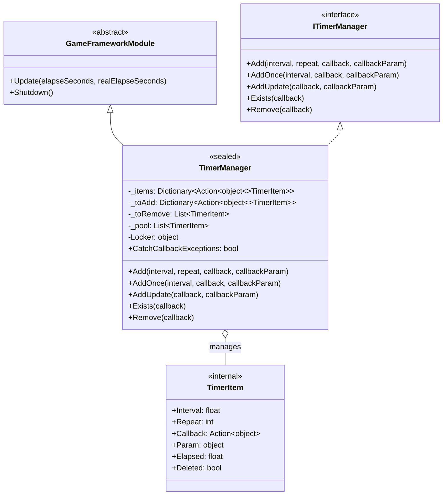
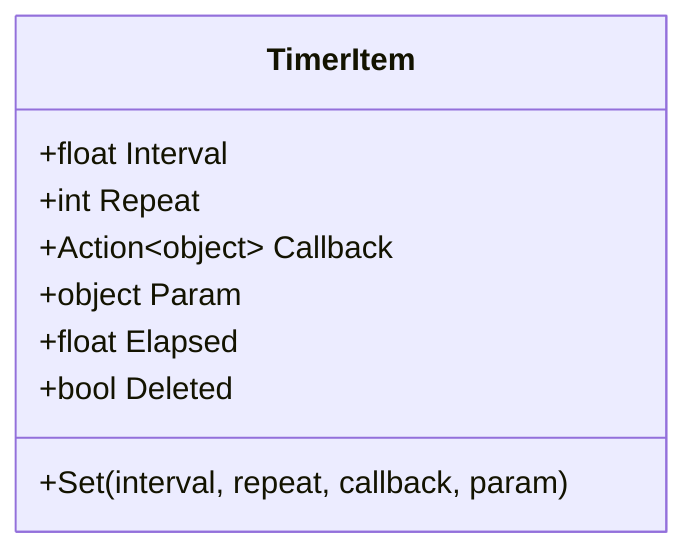

# TimerManager

TimerManager 是 GameFrameX 计时器モジュール的コア実装类，负责定时任务的调度与执行。它継承自 `GameFrameworkModule` 并実装 `ITimerManager` インターフェース，提供精确的时间间隔控制、重复次数管理および线程安全的操作机制。

## 概要

TimerManager 是整个计时器系统的コア引擎，负责在游戏ランタイム管理所有定时任务的ライフサイクル。このクラス采用对象池モード减少垃圾回收压力，使用双缓冲机制（待追加/待移除列表）確認してください在 Update 循环中安全地追加和削除任务，同時に通过锁机制保证多线程環境下的线程安全性。

作为 GameFrameX フレームワーク的コアモジュール，TimerManager 在每一帧的 Update コールバック中遍历所有活动任务，確認是否满足トリガー条件，并执行相应的コールバック函数。它サポート三种タイプ的定时任务：固定间隔重复任务、单次延迟任务および每帧アップデート任务。

### コア职责

- 管理定时任务的追加、移除和执行
- 维护任务执行的时间累加和トリガー逻辑
- 提供对象池复用机制最適化性能
- 保证多线程環境下的操作安全性

### 設計特点

TimerManager 在設計上采用了多个最適化策略以確認してください高性能和稳定性。まず，对象池技术避免了频繁作成和破棄 TimerItem 对象，显著减少了 GC（垃圾回收）压力。其次，任务的双缓冲机制允许在遍历过程中安全地追加新任务和标记削除任务，而不会导致集合変更例外。最後に，线程锁確認してください了在多线程访问时的数据一致性。



## コアフロー

TimerManager 的コア执行フロー发生在每一帧的 Update メソッド中。このフロー確認してください了定时任务能够按照精确的时间间隔トリガー，同時に処理任务的动态追加和移除。

```mermaid
flowchart TD
    subgraph UpdateLoop["Update 循环"]
        Start([开始 Update]) --> Lock["获取锁 Locker"]
        Lock --> CheckItems{"_items 数量\n> 0?"}
        
        CheckItems -->|Yes| Iterate["遍历 _items 集合"]
        CheckItems -->|No| CheckToRemove["检查 _toRemove"]
        
        Iterate --> CheckDeleted{当前 TimerItem\n已删除?}
        CheckDeleted -->|Yes| AddToRemove["添加到 _toRemove"]
        CheckDeleted -->|No| UpdateElapsed["累加 Elapsed"]
        
        UpdateElapsed --> CheckInterval{Elapsed \n>= Interval?}
        CheckInterval -->|No| ContinueIterate["继续下一个"]
        CheckInterval -->|Yes| ResetElapsed["重置 Elapsed"]
        
        ResetElapsed --> CheckRepeat{Repeat \n> 0?}
        CheckRepeat -->|Yes| DecrementRepeat["Repeat--"]
        DecrementRepeat --> CheckRepeatZero{Repeat == 0?}
        CheckRepeatZero -->|Yes| MarkDeleted["标记 Deleted"]
        CheckRepeatZero -->|No| ExecuteCallback["执行回调"]
        
        MarkDeleted --> AddToRemove
        ExecuteCallback --> ContinueIterate
        
        AddToRemove --> ContinueIterate
        
        ContinueIterate --> HasNext{"还有更多\n任务?"}
        HasNext -->|Yes| Iterate
        HasNext -->|No| CheckToRemove
        
        CheckToRemove --> ProcessRemove{"_toRemove\n数量 > 0?"}
        ProcessRemove -->|Yes| RemoveItems["移除已标记的任务\n并归还到对象池"]
        ProcessRemove -->|No| CheckToAdd
        
        RemoveItems --> CheckToAdd
        CheckToAdd --> ProcessAdd{"_toAdd\n数量 > 0?"}
        ProcessAdd -->|Yes| AddNewItems["将新任务\n添加到 _items"]
        ProcessAdd -->|No| Release["释放锁"]
        ProcessAdd -->|No| End([结束 Update])
        
        AddNewItems --> Release
        Release --> End
    end
```



### フロー説明

Update メソッド的执行フロー分为四个主なフェーズ。まず是任务遍历フェーズ，遍历当前所有活动任务，累加每个任务的已用时间（Elapsed），確認是否达到トリガー间隔。其次是コールバック执行フェーズ，当任务满足トリガー条件时，执行其绑定的コールバック函数，并根据 Repeat パラメータ决定是否递减重复次数。第3是移除処理フェーズ，将已标记为削除的任务从集合中移除，归还到对象池以供复用。最後に是追加処理フェーズ，将待追加队列中的新任务合并到活动任务集合中。

这种設計確認してください了つまり使在コールバック执行过程中追加或移除其他任务，也不会影响遍历的正确性，因为实际的追加和移除操作都在遍历结束后才执行。

## 内部类 TimerItem

TimerItem 是 TimerManager 内部的嵌套类，用于存储单个定时任务的完全なステータス情報。每个 TimerItem 对象パッケージ含任务的执行间隔、剩余重复次数、コールバック函数、コールバックパラメータおよび内部ステータス标志。



| プロパティ | タイプ | 説明 |
|------|------|------|
| Interval | float | 任务トリガー间隔，单位为秒 |
| Repeat | int | 剩余重复次数，0 表示无限重复 |
| Callback | Action\<object\> | 任务トリガー时执行的コールバック函数 |
| Param | object | 传递给コールバック函数的パラメータ |
| Elapsed | float | 自上次トリガー以来经过的时间 |
| Deleted | bool | 标记任务是否已被削除 |

## 使用例

### 基本用法

以下例表示如何追加一个シンプル的重复定时任务：

```csharp
// 创建一个定时任务，每隔1秒执行一次，共执行10次
TimerManager.Instance.Add(1.0f, 10, callback: (param) => 
{
    Debug.Log($"定时任务执行，参数: {param}");
}, callbackParam: "Hello Timer");
```
> Source: [TimerManager.cs](https://github.com/GameFrameX/com.gameframex.unity.timer/blob/main/Runtime/Timer/TimerManager.cs#L156-L188)

### 单次任务用法

使用 AddOnce メソッド追加一个延迟执行一次的任务：

```csharp
// 5秒后执行一次任务
TimerManager.Instance.AddOnce(5.0f, callback: (param) => 
{
    Debug.Log("任务只执行一次");
}, callbackParam: null);
```
> Source: [TimerManager.cs](https://github.com/GameFrameX/com.gameframex.unity.timer/blob/main/Runtime/Timer/TimerManager.cs#L197-L200)

### 每帧アップデート任务

使用 AddUpdate メソッド追加每帧执行的轻量级任务：

```csharp
// 每帧执行的任务（间隔约0.001秒）
TimerManager.Instance.AddUpdate(callback: (param) => 
{
    // 每帧执行的逻辑
    transform.Rotate(Vector3.up, 10f * Time.deltaTime);
});
```
> Source: [TimerManager.cs](https://github.com/GameFrameX/com.gameframex.unity.timer/blob/main/Runtime/Timer/TimerManager.cs#L206-L219)

### 任务確認与移除

使用 Exists 和 Remove メソッド管理任务的ライフサイクル：

```csharp
private Action<object> _myTimerCallback;

void Start()
{
    // 添加任务并保存回调引用
    _myTimerCallback = OnTimerTick;
    TimerManager.Instance.Add(1.0f, 5, _myTimerCallback, "test");
}

void OnTimerTick(object param)
{
    Debug.Log($"Tick: {param}");
}

// 在其他方法中检查和移除
void StopTimer()
{
    if (TimerManager.Instance.Exists(_myTimerCallback))
    {
        TimerManager.Instance.Remove(_myTimerCallback);
        Debug.Log("任务已移除");
    }
}
```
> Source: [TimerManager.cs](https://github.com/GameFrameX/com.gameframex.unity.timer/blob/main/Runtime/Timer/TimerManager.cs#L226-L264)

## API リファレンス

### `TimerManager`

完全な类声明如下：

```csharp
public sealed class TimerManager : GameFrameworkModule, ITimerManager
```
> Source: [TimerManager.cs](https://github.com/GameFrameX/com.gameframex.unity.timer/blob/main/Runtime/Timer/TimerManager.cs#L12)

**継承关系：**
- 父类：GameFrameworkModule
- インターフェース：ITimerManager

---

### `CatchCallbackExceptions`

```csharp
public static bool CatchCallbackExceptions = false;
```
> Source: [TimerManager.cs](https://github.com/GameFrameX/com.gameframex.unity.timer/blob/main/Runtime/Timer/TimerManager.cs#L43)

**説明：** 全局静态プロパティ，控制是否捕获コールバック函数执行过程中发生的例外。

**デフォルト值：** false

**使用シーン：**
- 当設定为 `true` 时，コールバック函数执行发生例外会被捕获并记录警告ログ，任务会被标记为削除
- 当設定为 `false` 时，コールバック函数执行发生的例外会直接抛出，〜の可能性があります导致应用程序崩溃

---

### `Add(interval, repeat, callback, callbackParam)`

```csharp
public void Add(float interval, int repeat, Action<object> callback, object callbackParam = null)
```
> Source: [TimerManager.cs](https://github.com/GameFrameX/com.gameframex.unity.timer/blob/main/Runtime/Timer/TimerManager.cs#L156-L188)

**説明：** 追加一个定时重复执行的任务。

**パラメータ：**
| パラメータ名 | タイプ | 必填 | デフォルト值 | 説明 |
|--------|------|------|--------|------|
| interval | float | 是 | - | 任务トリガー间隔时间，单位为秒 |
| repeat | int | 是 | - | 重复次数，0 表示无限重复 |
| callback | Action\<object\> | 是 | - | 任务トリガー时执行的コールバック函数 |
| callbackParam | object | 否 | null | 传递给コールバック函数的パラメータ |

**返すタイプ：** void

**内部逻辑：**
1. 確認コールバック函数是否为空，为空则记录警告ログ并返す
2. 確認任务是否已存在，存在则アップデートパラメータ并重置ステータス
3. 从对象池取得或作成新的 TimerItem
4. 将任务追加到待追加队列，等待下一帧合并到活动集合

**例外処理：**
- 当 callback 为 null 时，记录警告ログ但不抛出例外

---

### `AddOnce(interval, callback, callbackParam)`

```csharp
public void AddOnce(float interval, Action<object> callback, object callbackParam = null)
```
> Source: [TimerManager.cs](https://github.com/GameFrameX/com.gameframex.unity.timer/blob/main/Runtime/Timer/TimerManager.cs#L197-L200)

**説明：** 追加一个只执行一次的定时任务。本质上是 repeat パラメータ为 1 的 Add 呼び出し。

**パラメータ：**
| パラメータ名 | タイプ | 必填 | デフォルト值 | 説明 |
|--------|------|------|--------|------|
| interval | float | 是 | - | 延迟时间，单位为秒 |
| callback | Action\<object\> | 是 | - | 任务トリガー时执行的コールバック函数 |
| callbackParam | object | 否 | null | 传递给コールバック函数的パラメータ |

**返すタイプ：** void

**等价実装：**
```csharp
Add(interval, 1, callback, callbackParam);
```

---

### `AddUpdate(callback)`

```csharp
public void AddUpdate(Action<object> callback)
```
> Source: [TimerManager.cs](https://github.com/GameFrameX/com.gameframex.unity.timer/blob/main/Runtime/Timer/TimerManager.cs#L206-L209)

**説明：** 追加一个每帧アップデート执行的任务。

**パラメータ：**
| パラメータ名 | タイプ | 必填 | 説明 |
|--------|------|------|------|
| callback | Action\<object\> | 是 | 每帧执行的コールバック函数 |

**返すタイプ：** void

**等价実装：**
```csharp
Add(0.001f, 0, callback);
```

**注意：** 间隔时间設定为 0.001 秒（约等于每帧），repeat 为 0 表示无限重复。

---

### `AddUpdate(callback, callbackParam)`

```csharp
public void AddUpdate(Action<object> callback, object callbackParam)
```
> Source: [TimerManager.cs](https://github.com/GameFrameX/com.gameframex.unity.timer/blob/main/Runtime/Timer/TimerManager.cs#L216-L219)

**説明：** 追加一个每帧アップデート执行的任务，并传递パラメータ。

**パラメータ：**
| パラメータ名 | タイプ | 必填 | 説明 |
|--------|------|------|------|
| callback | Action\<object\> | 是 | 每帧执行的コールバック函数 |
| callbackParam | object | 是 | 传递给コールバック函数的パラメータ |

**返すタイプ：** void

**等价実装：**
```csharp
Add(0.001f, 0, callback, callbackParam);
```

---

### `Exists(callback)`

```csharp
public bool Exists(Action<object> callback)
```
> Source: [TimerManager.cs](https://github.com/GameFrameX/com.gameframex.unity.timer/blob/main/Runtime/Timer/TimerManager.cs#L226-L243)

**説明：** 確認指定コールバック函数的任务是否存在。

**パラメータ：**
| パラメータ名 | タイプ | 必填 | 説明 |
|--------|------|------|------|
| callback | Action\<object\> | 是 | 要確認的コールバック函数 |

**返すタイプ：** bool

**返す説明：**
- もし任务在待追加队列（_toAdd）中存在，返す true
- もし任务在活动队列（_items）中存在且未被标记为削除，返す true
- 其他情况返す false

**线程安全：** 该メソッド内部会取得锁以保证线程安全。

---

### `Remove(callback)`

```csharp
public void Remove(Action<object> callback)
```
> Source: [TimerManager.cs](https://github.com/GameFrameX/com.gameframex.unity.timer/blob/main/Runtime/Timer/TimerManager.cs#L249-L264)

**説明：** 移除指定コールバック函数对应的任务。

**パラメータ：**
| パラメータ名 | タイプ | 必填 | 説明 |
|--------|------|------|------|
| callback | Action\<object\> | 是 | 要移除的コールバック函数 |

**返すタイプ：** void

**内部逻辑：**
1. 確認任务是否在待追加队列中，存在则从队列移除并归还到对象池
2. 確認任务是否在活动队列中，存在则标记为 Deleted ステータス，等待下一帧移除

**注意：** もし任务〜中执行コールバック过程中被移除，コールバック仍会执行完成，只是之后会被清理。

---

### `Update(elapseSeconds, realElapseSeconds)`

```csharp
protected override void Update(float elapseSeconds, float realElapseSeconds)
```
> Source: [TimerManager.cs](https://github.com/GameFrameX/com.gameframex.unity.timer/blob/main/Runtime/Timer/TimerManager.cs#L45-L137)

**説明：** フレームワークアップデートメソッド，由 GameFrameX フレームワーク在每帧自动呼び出し。

**パラメータ：**
| パラメータ名 | タイプ | 説明 |
|--------|------|------|
| elapseSeconds | float | 游戏逻辑经过的时间（〜の可能性があります受时间缩放影响） |
| realElapseSeconds | float | 实际经过的真实时间 |

**返すタイプ：** void

**内部逻辑：**
1. 取得锁確認してください线程安全
2. 遍历所有活动任务，累加时间并確認トリガー条件
3. 执行满足条件的コールバック函数
4. 処理任务削除和追加
5. 解放锁

**注意：** 这是フレームワーク内部メソッド，通常不〜する必要があります直接呼び出し。

---

### `Shutdown()`

```csharp
protected override void Shutdown()
```
> Source: [TimerManager.cs](https://github.com/GameFrameX/com.gameframex.unity.timer/blob/main/Runtime/Timer/TimerManager.cs#L139-L147)

**説明：** フレームワーク閉じるメソッド，由 GameFrameX フレームワーク在系统閉じる时呼び出し。

**返すタイプ：** void

**内部逻辑：**
1. 取得锁確認してください线程安全
2. 清空待移除队列、待追加队列和活动任务集合

**注意：** 这是フレームワーク内部メソッド，通常不〜する必要があります直接呼び出し。

---

### 内部メソッド

#### `GetFromPool()`

```csharp
private TimerItem GetFromPool()
```
> Source: [TimerManager.cs](https://github.com/GameFrameX/com.gameframex.unity.timer/blob/main/Runtime/Timer/TimerManager.cs#L266-L283)

**説明：** 从对象池取得一个 TimerItem インスタンス。

**返すタイプ：** TimerItem

**内部逻辑：**
1. 確認对象池中是否有可用インスタンス
2. もし有，复用并重置ステータス
3. もし没有，作成新的インスタンス

---

#### `ReturnToPool(timerItem)`

```csharp
private void ReturnToPool(TimerItem timerItem)
```
> Source: [TimerManager.cs](https://github.com/GameFrameX/com.gameframex.unity.timer/blob/main/Runtime/Timer/TimerManager.cs#L285-L289)

**説明：** 将 TimerItem インスタンス归还到对象池。

**パラメータ：**
| パラメータ名 | タイプ | 説明 |
|--------|------|------|
| timerItem | TimerItem | 要归还的インスタンス |

**返すタイプ：** void

---

## 関連リンク

- [TimerComponent](./5-api-reference.timer-component) - Unity コンポーネントカプセル化
- [ITimerManager](./5-api-reference.itimer-manager) - 计时器インターフェース定義
- [快速开始](./3-getting-started) - 快速入门ガイド
- [コア機能](./4-core-functions.add-timer) - 定时任务操作详解
- [使用例](./6-samples) - 更多使用案例
