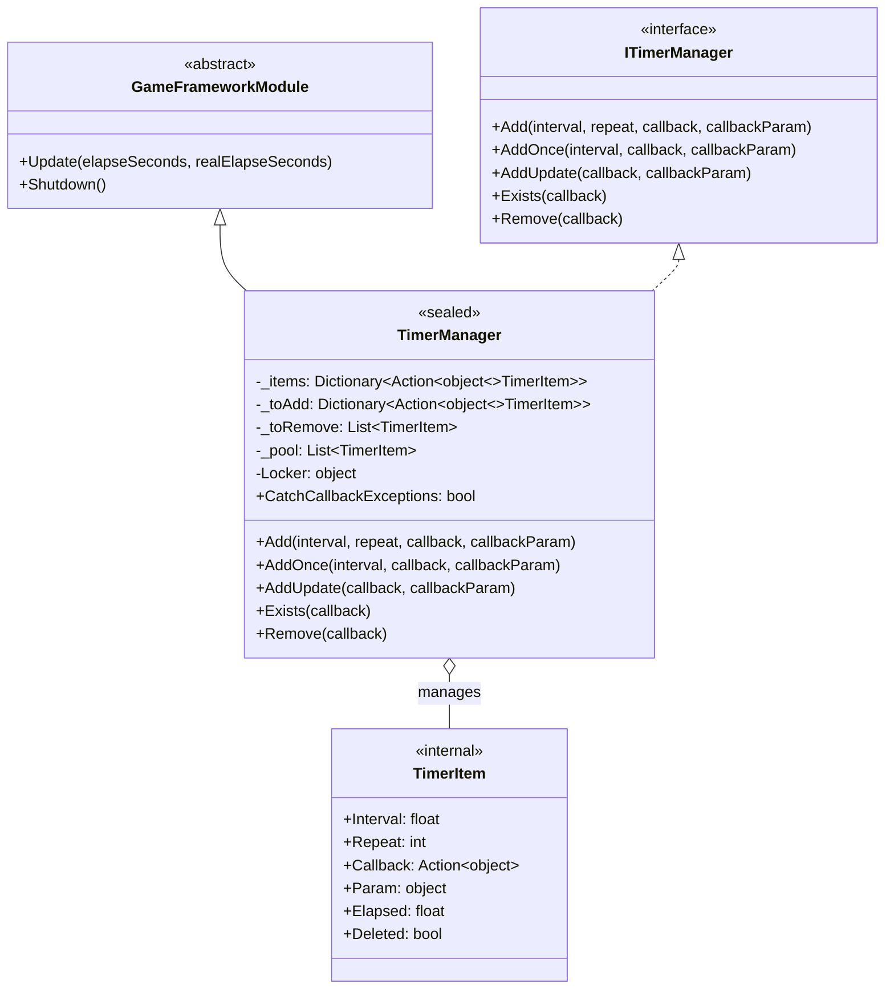
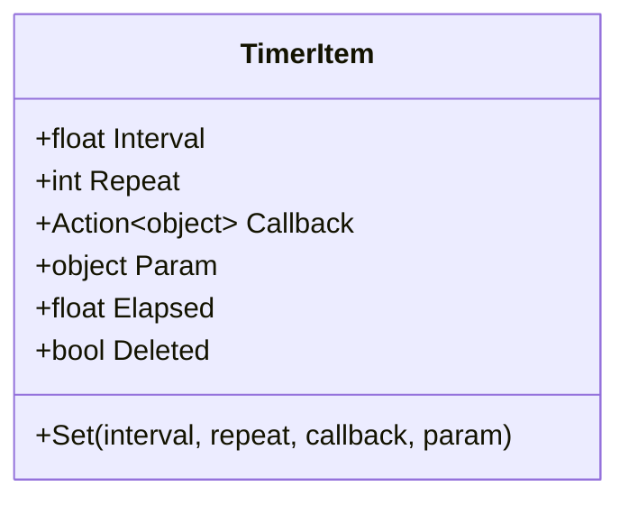

# TimerManager

TimerManager 是 GameFrameX タイマー模块的コア実装クラス，负责定时任务的调度与执行。它を継承 `GameFrameworkModule` 并実装 `ITimerManager` インターフェース，提供精确的时间间隔控制、重复次数管理以及线程安全的操作机制。

## 概要

TimerManager 是整个タイマー系统的コア引擎，负责在ゲーム运行时管理所有定时任务的生命周期。该クラス采用オブジェクトプール模式减少垃圾回收压力，使用双缓冲机制（待添加/待移除列表）确保在 Update 循环中安全地添加和删除任务，同时を通じて锁机制保证多线程环境下的线程安全性。

作为 GameFrameX フレームワーク的コア模块，TimerManager 在每一帧的 Update 回调中遍历所有活动任务，检查是否满足触发条件，并执行相应的回调函数。它サポート三种クラス型的定时任务：固定间隔重复任务、单次延迟任务以及每帧更新任务。

### コア职责

- 管理定时任务的添加、移除和执行
- 维护任务执行的时间累加和触发逻辑
- 提供オブジェクトプール复用机制优化性能
- 保证多线程环境下的操作安全性

### 设计特点

TimerManager 在设计上采用了多个优化策略以确保高性能和稳定性。首先，オブジェクトプール技术避免了频繁作成和销毁 TimerItem 对象，显著减少了 GC（垃圾回收）压力。其次，任务的双缓冲机制允许在遍历过程中安全地添加新任务和标记删除任务，而不会导致集合修改異常。最后，线程锁确保了在多线程访问时的数据一致性。



## コアフロー

TimerManager 的コア执行フロー发生在每一帧的 Update メソッド中。该フロー确保了定时任务能够按照精确的时间间隔触发，同时处理任务的动态添加和移除。

```mermaid
flowchart TD
    subgraph UpdateLoop["Update 循环"]
        Start([开始 Update]) --> Lock["取得锁 Locker"]
        Lock --> CheckItems{"_items 数量\n> 0?"}
        
        CheckItems -->|Yes| Iterate["遍历 _items 集合"]
        CheckItems -->|No| CheckToRemove["检查 _toRemove"]
        
        Iterate --> CheckDeleted{当前 TimerItem\n已删除?}
        CheckDeleted -->|Yes| AddToRemove["添加到 _toRemove"]
        CheckDeleted -->|No| UpdateElapsed["累加 Elapsed"]
        
        UpdateElapsed --> CheckInterval{Elapsed \n>= Interval?}
        CheckInterval -->|No| ContinueIterate["继续下一个"]
        CheckInterval -->|Yes| ResetElapsed["重置 Elapsed"]
        
        ResetElapsed --> CheckRepeat{Repeat \n> 0?}
        CheckRepeat -->|Yes| DecrementRepeat["Repeat--"]
        DecrementRepeat --> CheckRepeatZero{Repeat == 0?}
        CheckRepeatZero -->|Yes| MarkDeleted["标记 Deleted"]
        CheckRepeatZero -->|No| ExecuteCallback["执行回调"]
        
        MarkDeleted --> AddToRemove
        ExecuteCallback --> ContinueIterate
        
        AddToRemove --> ContinueIterate
        
        ContinueIterate --> HasNext{"还有更多\n任务?"}
        HasNext -->|Yes| Iterate
        HasNext -->|No| CheckToRemove
        
        CheckToRemove --> ProcessRemove{"_toRemove\n数量 > 0?"}
        ProcessRemove -->|Yes| RemoveItems["移除已标记的任务\n并归还到オブジェクトプール"]
        ProcessRemove -->|No| CheckToAdd
        
        RemoveItems --> CheckToAdd
        CheckToAdd --> ProcessAdd{"_toAdd\n数量 > 0?"}
        ProcessAdd -->|Yes| AddNewItems["将新任务\n添加到 _items"]
        ProcessAdd -->|No| Release["释放锁"]
        ProcessAdd -->|No| End([结束 Update])
        
        AddNewItems --> Release
        Release --> End
    end
```



### フロー説明

Update メソッド的执行フロー分为四个主要阶段。首先是任务遍历阶段，遍历当前所有活动任务，累加每个任务的已用时间（Elapsed），检查是否达到触发间隔。其次是回调执行阶段，当任务满足触发条件时，执行其绑定的回调函数，并に基づいて Repeat 参数决定是否递减重复次数。第三是移除处理阶段，将已标记为删除的任务从集合中移除，归还到オブジェクトプール以供复用。最后是添加处理阶段，将待添加队列中的新任务合并到活动任务集合中。

这种设计确保了即使在回调执行过程中添加或移除其他任务，也不会影响遍历的正确性，因为实际的添加和移除操作都在遍历结束后才执行。

## 内部クラス TimerItem

TimerItem 是 TimerManager 内部的嵌套クラス，に使用存储单个定时任务的完整ステータス信息。每个 TimerItem 对象包含任务的执行间隔、剩余重复次数、回调函数、回调参数以及内部ステータス标志。



| プロパティ | クラス型 | 説明 |
|------|------|------|
| Interval | float | 任务触发间隔，单位为秒 |
| Repeat | int | 剩余重复次数，0 表示无限重复 |
| Callback | Action\<object\> | 任务触发时执行的回调函数 |
| Param | object | 传递给回调函数的参数 |
| Elapsed | float | 自上次触发以来经过的时间 |
| Deleted | bool | 标记任务是否已被删除 |

## 使用例

### 基本用法

以下示例展示如何添加一个简单的重复定时任务：

```csharp
// 作成一个定时任务，每隔1秒执行一次，共执行10次
TimerManager.Instance.Add(1.0f, 10, callback: (param) => 
{
    Debug.Log($"定时任务执行，参数: {param}");
}, callbackParam: "Hello Timer");
```
> Source: [TimerManager.cs](https://github.com/GameFrameX/com.gameframex.unity.timer/blob/main/Runtime/Timer/TimerManager.cs#L156-L188)

### 单次任务用法

使用 AddOnce メソッド添加一个延迟执行一次的任务：

```csharp
// 5秒后执行一次任务
TimerManager.Instance.AddOnce(5.0f, callback: (param) => 
{
    Debug.Log("任务只执行一次");
}, callbackParam: null);
```
> Source: [TimerManager.cs](https://github.com/GameFrameX/com.gameframex.unity.timer/blob/main/Runtime/Timer/TimerManager.cs#L197-L200)

### 每帧更新任务

使用 AddUpdate メソッド添加每帧执行的轻量级任务：

```csharp
// 每帧执行的任务（间隔约0.001秒）
TimerManager.Instance.AddUpdate(callback: (param) => 
{
    // 每帧执行的逻辑
    transform.Rotate(Vector3.up, 10f * Time.deltaTime);
});
```
> Source: [TimerManager.cs](https://github.com/GameFrameX/com.gameframex.unity.timer/blob/main/Runtime/Timer/TimerManager.cs#L206-L219)

### 任务检查与移除

使用 Exists 和 Remove メソッド管理任务的生命周期：

```csharp
private Action<object> _myTimerCallback;

void Start()
{
    // 添加任务并保存回调引用
    _myTimerCallback = OnTimerTick;
    TimerManager.Instance.Add(1.0f, 5, _myTimerCallback, "test");
}

void OnTimerTick(object param)
{
    Debug.Log($"Tick: {param}");
}

// 在其他メソッド中检查和移除
void StopTimer()
{
    if (TimerManager.Instance.Exists(_myTimerCallback))
    {
        TimerManager.Instance.Remove(_myTimerCallback);
        Debug.Log("任务已移除");
    }
}
```
> Source: [TimerManager.cs](https://github.com/GameFrameX/com.gameframex.unity.timer/blob/main/Runtime/Timer/TimerManager.cs#L226-L264)

## API 参考

### `TimerManager`

完整クラス声明如下：

```csharp
public sealed class TimerManager : GameFrameworkModule, ITimerManager
```
> Source: [TimerManager.cs](https://github.com/GameFrameX/com.gameframex.unity.timer/blob/main/Runtime/Timer/TimerManager.cs#L12)

**继承关系：**
- 父クラス：GameFrameworkModule
- インターフェース：ITimerManager

---

### `CatchCallbackExceptions`

```csharp
public static bool CatchCallbackExceptions = false;
```
> Source: [TimerManager.cs](https://github.com/GameFrameX/com.gameframex.unity.timer/blob/main/Runtime/Timer/TimerManager.cs#L43)

**説明：** 全局静态プロパティ，控制是否捕获回调函数执行过程中发生的異常。

**默认值：** false

**使用シーン：**
- 当設定为 `true` 时，回调函数执行发生異常会被捕获并记录警告日志，任务会被标记为删除
- 当設定为 `false` 时，回调函数执行发生的異常会直接抛出，可能导致应用程序崩溃

---

### `Add(interval, repeat, callback, callbackParam)`

```csharp
public void Add(float interval, int repeat, Action<object> callback, object callbackParam = null)
```
> Source: [TimerManager.cs](https://github.com/GameFrameX/com.gameframex.unity.timer/blob/main/Runtime/Timer/TimerManager.cs#L156-L188)

**説明：** 添加一个定时重复执行的任务。

**参数：**
| 参数名 | クラス型 | 必填 | 默认值 | 説明 |
|--------|------|------|--------|------|
| interval | float | 是 | - | 任务触发间隔时间，单位为秒 |
| repeat | int | 是 | - | 重复次数，0 表示无限重复 |
| callback | Action\<object\> | 是 | - | 任务触发时执行的回调函数 |
| callbackParam | object | 否 | null | 传递给回调函数的参数 |

**返回クラス型：** void

**内部逻辑：**
1. 检查回调函数是否为空，为空则记录警告日志并返回
2. 检查任务是否已存在，存在则更新参数并重置ステータス
3. 从オブジェクトプール取得或作成新的 TimerItem
4. 将任务添加到待添加队列，等待下一帧合并到活动集合

**異常处理：**
- 当 callback 为 null 时，记录警告日志但不抛出異常

---

### `AddOnce(interval, callback, callbackParam)`

```csharp
public void AddOnce(float interval, Action<object> callback, object callbackParam = null)
```
> Source: [TimerManager.cs](https://github.com/GameFrameX/com.gameframex.unity.timer/blob/main/Runtime/Timer/TimerManager.cs#L197-L200)

**説明：** 添加一个只执行一次的定时任务。本质上是 repeat 参数为 1 的 Add 呼び出し。

**参数：**
| 参数名 | クラス型 | 必填 | 默认值 | 説明 |
|--------|------|------|--------|------|
| interval | float | 是 | - | 延迟时间，单位为秒 |
| callback | Action\<object\> | 是 | - | 任务触发时执行的回调函数 |
| callbackParam | object | 否 | null | 传递给回调函数的参数 |

**返回クラス型：** void

**等价実装：**
```csharp
Add(interval, 1, callback, callbackParam);
```

---

### `AddUpdate(callback)`

```csharp
public void AddUpdate(Action<object> callback)
```
> Source: [TimerManager.cs](https://github.com/GameFrameX/com.gameframex.unity.timer/blob/main/Runtime/Timer/TimerManager.cs#L206-L209)

**説明：** 添加一个每帧更新执行的任务。

**参数：**
| 参数名 | クラス型 | 必填 | 説明 |
|--------|------|------|------|
| callback | Action\<object\> | 是 | 每帧执行的回调函数 |

**返回クラス型：** void

**等价実装：**
```csharp
Add(0.001f, 0, callback);
```

**注意：** 间隔时间設定为 0.001 秒（约等于每帧），repeat 为 0 表示无限重复。

---

### `AddUpdate(callback, callbackParam)`

```csharp
public void AddUpdate(Action<object> callback, object callbackParam)
```
> Source: [TimerManager.cs](https://github.com/GameFrameX/com.gameframex.unity.timer/blob/main/Runtime/Timer/TimerManager.cs#L216-L219)

**説明：** 添加一个每帧更新执行的任务，并传递参数。

**参数：**
| 参数名 | クラス型 | 必填 | 説明 |
|--------|------|------|------|
| callback | Action\<object\> | 是 | 每帧执行的回调函数 |
| callbackParam | object | 是 | 传递给回调函数的参数 |

**返回クラス型：** void

**等价実装：**
```csharp
Add(0.001f, 0, callback, callbackParam);
```

---

### `Exists(callback)`

```csharp
public bool Exists(Action<object> callback)
```
> Source: [TimerManager.cs](https://github.com/GameFrameX/com.gameframex.unity.timer/blob/main/Runtime/Timer/TimerManager.cs#L226-L243)

**説明：** 检查指定回调函数的任务是否存在。

**参数：**
| 参数名 | クラス型 | 必填 | 説明 |
|--------|------|------|------|
| callback | Action\<object\> | 是 | 要检查的回调函数 |

**返回クラス型：** bool

**返回説明：**
- 如果任务在待添加队列（_toAdd）中存在，返回 true
- 如果任务在活动队列（_items）中存在且未被标记为删除，返回 true
- 其他情况返回 false

**线程安全：** 该メソッド内部会取得锁以保证线程安全。

---

### `Remove(callback)`

```csharp
public void Remove(Action<object> callback)
```
> Source: [TimerManager.cs](https://github.com/GameFrameX/com.gameframex.unity.timer/blob/main/Runtime/Timer/TimerManager.cs#L249-L264)

**説明：** 移除指定回调函数对应的任务。

**参数：**
| 参数名 | クラス型 | 必填 | 説明 |
|--------|------|------|------|
| callback | Action\<object\> | 是 | 要移除的回调函数 |

**返回クラス型：** void

**内部逻辑：**
1. 检查任务是否在待添加队列中，存在则从队列移除并归还到オブジェクトプール
2. 检查任务是否在活动队列中，存在则标记为 Deleted ステータス，等待下一帧移除

**注意：** 如果任务正在执行回调过程中被移除，回调仍会执行完成，只是之后会被清理。

---

### `Update(elapseSeconds, realElapseSeconds)`

```csharp
protected override void Update(float elapseSeconds, float realElapseSeconds)
```
> Source: [TimerManager.cs](https://github.com/GameFrameX/com.gameframex.unity.timer/blob/main/Runtime/Timer/TimerManager.cs#L45-L137)

**説明：** フレームワーク更新メソッド，由 GameFrameX フレームワーク在每帧自动呼び出し。

**参数：**
| 参数名 | クラス型 | 説明 |
|--------|------|------|
| elapseSeconds | float | ゲーム逻辑经过的时间（可能受时间缩放影响） |
| realElapseSeconds | float | 实际经过的真实时间 |

**返回クラス型：** void

**内部逻辑：**
1. 取得锁确保线程安全
2. 遍历所有活动任务，累加时间并检查触发条件
3. 执行满足条件的回调函数
4. 处理任务删除和添加
5. 释放锁

**注意：** 这是フレームワーク内部メソッド，通常不必要直接呼び出し。

---

### `Shutdown()`

```csharp
protected override void Shutdown()
```
> Source: [TimerManager.cs](https://github.com/GameFrameX/com.gameframex.unity.timer/blob/main/Runtime/Timer/TimerManager.cs#L139-L147)

**説明：** フレームワーク关闭メソッド，由 GameFrameX フレームワーク在系统关闭时呼び出し。

**返回クラス型：** void

**内部逻辑：**
1. 取得锁确保线程安全
2. 清空待移除队列、待添加队列和活动任务集合

**注意：** 这是フレームワーク内部メソッド，通常不必要直接呼び出し。

---

### 内部メソッド

#### `GetFromPool()`

```csharp
private TimerItem GetFromPool()
```
> Source: [TimerManager.cs](https://github.com/GameFrameX/com.gameframex.unity.timer/blob/main/Runtime/Timer/TimerManager.cs#L266-L283)

**説明：** 从オブジェクトプール取得一个 TimerItem インスタンス。

**返回クラス型：** TimerItem

**内部逻辑：**
1. 检查オブジェクトプール中是否有可用インスタンス
2. 如果有，复用并重置ステータス
3. 如果没有，作成新的インスタンス

---

#### `ReturnToPool(timerItem)`

```csharp
private void ReturnToPool(TimerItem timerItem)
```
> Source: [TimerManager.cs](https://github.com/GameFrameX/com.gameframex.unity.timer/blob/main/Runtime/Timer/TimerManager.cs#L285-L289)

**説明：** 将 TimerItem インスタンス归还到オブジェクトプール。

**参数：**
| 参数名 | クラス型 | 説明 |
|--------|------|------|
| timerItem | TimerItem | 要归还的インスタンス |

**返回クラス型：** void

---

## 関連リンク

- [TimerComponent](./5-api-reference.timer-component) - Unity コンポーネント封装
- [ITimerManager](./5-api-reference.itimer-manager) - タイマーインターフェース定义
- [快速开始](./3-getting-started) - 快速入门指南
- [コア機能](./4-core-functions.add-timer) - 定时任务操作详解
- [使用示例](./6-samples) - 更多使用案例
