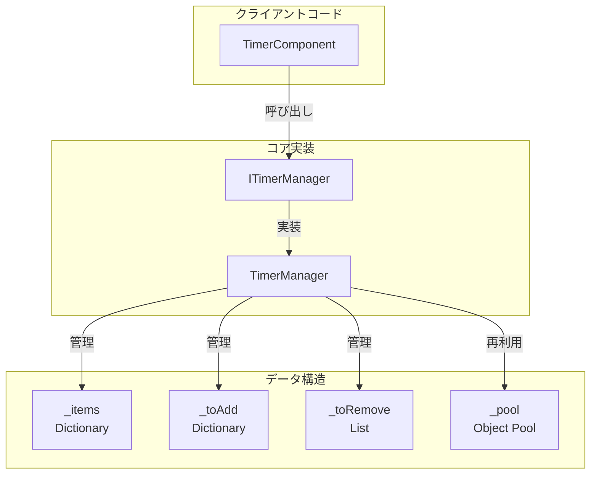
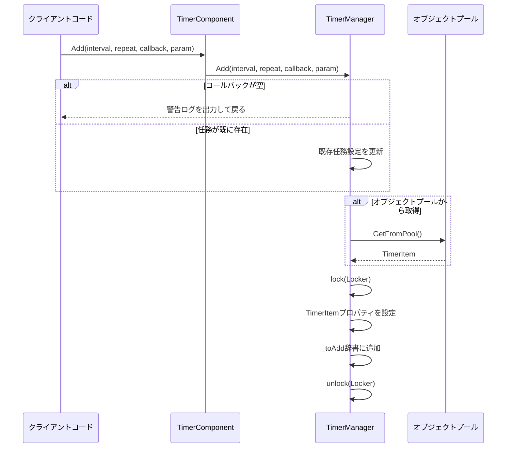

# タイマータスクの追加

このドキュメントでは、GameFrameX Timerコンポーネントで各类定時任務を追加する方法を説明します。

## 概要

Timerコンポーネントは定時任務を追加する3つの方法を提供します：

1. **Addメソッド** - 繰り返し実行可能な定時任務を追加
2. **AddOnceメソッド** - 1回だけ実行する任務を追加
3. **AddUpdateメソッド** - 毎フレーム実行する任務を追加

すべての任務はTimerComponentを通じてUnityコンポーネントに使用され、内部はTimerManagerが具体的な定時ロジックを実装します。

## コアコンセプト

### 定時任務パラメータ

| パラメータ | 型 | 説明 |
|------|------|------|
| interval | float | 間隔時間（秒） |
| repeat | int | 繰り返し回数（0は無限繰り返し） |
| callback | Action\<object\> | コールバック関数 |
| callbackParam | object | コールバックに渡すパラメータ（オプション） |

### 任務ステータス管理

TimerManagerは以下のデータ構造を使用して任務を管理します：

- `_items` - 実行中の任務辞書
- `_toAdd` - 実行キューに追加待ちの任務
- `_toRemove` - 削除待ちの任務
- `_pool` - オブジェクトプール、TimerItemオブジェクトの再利用に使用



## 任務追加フロー



### 任務実行フロー

```mermaid
flowchart TD
    Start([Update呼び出し]) --> CheckItems{任務が実行中?}

    CheckItems -->|いいえ| End([戻る])
    CheckItems -->|はい| Iterate[任務を巡回]

    Iterate --> CheckDeleted{削除済み?}
    CheckDeleted -->|はい| AddToRemove[待削除リストに追加]
    CheckDeleted -->|いいえ| UpdateElapsed[経過時間を更新]

    AddToRemove --> NextTask
    UpdateElapsed --> CheckTime{時間到达?}
    CheckTime -->|いいえ| NextTask
    CheckTime -->|はい| Execute[コールバックを実行]
    Execute --> DecRepeat{繰り返し回数>0?}
    DecRepeat -->|はい| Decrement[カウント減少]
    DecRepeat -->|いいえ| SetInfinite[無限を維持}

    Decrement --> CheckZero{カウント=0?}
    CheckZero -->|はい| MarkDeleted[削除マーク]
    CheckZero -->|いいえ| NextTask
    SetInfinite --> NextTask

    MarkDeleted --> AddToRemove
    NextTask --> Iterate

    subgraph Cleanup["清理段階"]
        AddToRemove --> ProcessRemove[待削除を処理]
        ProcessRemove --> RemoveFromItems[辞書から削除]
        RemoveFromItems --> ReturnToPool[オブジェクトプールに返却]
    end

    ReturnToPool --> AddPending{追加待ちあり?}
    AddPending -->|はい| ProcessAdd[追加待ちを処理]
    AddPending -->|いいえ| End
    ProcessAdd --> End
```

## 使用例

### 基本定時任務

1秒ごとに実行、合計10回実行する任務を追加します：

```csharp
// TimerComponentを通じて定時任務を追加
var timerComponent = gameObject.GetComponent<TimerComponent>();
timerComponent.Add(1.0f, 10, callback, null);

void callback(object param)
{
    Debug.Log("定時任務実行!");
}
```

> Source: [TimerComponent.cs](https://github.com/GameFrameX/com.gameframex.unity.timer/blob/main/Runtime/Timer/TimerComponent.cs#L37-L40)

### 無限繰り返し任務

2秒ごとに実行する無限ループ任務を追加します（repeat = 0は無限）：

```csharp
// repeatが0は無限繰り返し実行
timerComponent.Add(2.0f, 0, onInfiniteTick, "myData");

void onInfiniteTick(object param)
{
    string data = param as string;
    Debug.Log($"無限任務実行、データ: {data}");
}
```

> Source: [TimerManager.cs](https://github.com/GameFrameX/com.gameframex.unity.timer/blob/main/Runtime/Timer/TimerManager.cs#L156-L188)

### パラメータ付き任務

callbackParamを通じてカスタムデータを渡します：

```csharp
// 複雑なデータオブジェクトを渡す
var myData = new { Name = "Player", Score = 100 };
timerComponent.Add(1.0f, 5, onScoreUpdate, myData);

void onScoreUpdate(object param)
{
    var data = param as dynamic;
    Debug.Log($"プレイヤー: {data.Name}, スコア: {data.Score}");
}
```

> Source: [TimerManager.cs](https://github.com/GameFrameX/com.gameframex.unity.timer/blob/main/Runtime/Timer/TimerManager.cs#L24-L30)

## 内部実装詳細

### TimerItemデータ構造

```csharp
class TimerItem
{
    public float Interval;      // 間隔時間
    public int Repeat;           // 残り繰り返し回数
    public Action<object> Callback;  // コールバック関数
    public object Param;        // コールバックパラメータ

    public float Elapsed;       // 経過時間
    public bool Deleted;        // 削除マーク
}
```

> Source: [TimerManager.cs](https://github.com/GameFrameX/com.gameframex.unity.timer/blob/main/Runtime/Timer/TimerManager.cs#L14-L31)

### 時間精度処理

TimerManagerはUpdate中で時間累積を処理します：

```csharp
timerItem.Elapsed += realElapseSeconds;
if (timerItem.Elapsed < timerItem.Interval)
{
    continue;  // 時間が到达していない、スキップ
}

timerItem.Elapsed -= timerItem.Interval;
// 時間ドリフトを処理：elapsedが大きすぎまたは小さすぎる場合はリセット
if (timerItem.Elapsed < 0 || timerItem.Elapsed > 0.03f)
    timerItem.Elapsed = 0;
```

この設計は以下を保証します：
- 任務が正確な間隔後に実行
- 累積した時間誤差が自動修正
- フレームレート変動でも相対的に正確を維持

> Source: [TimerManager.cs](https://github.com/GameFrameX/com.gameframex.unity.timer/blob/main/Runtime/Timer/TimerManager.cs#L63-L71)

### オブジェクトプールメカニズム

ゴミ回收压力を减轻するために、TimerManagerはオブジェクトプールを実装しました：

```csharp
private TimerItem GetFromPool()
{
    if (_pool.Count > 0)
    {
        var item = _pool[_pool.Count - 1];
        _pool.RemoveAt(_pool.Count - 1);
        item.Deleted = false;
        item.Elapsed = 0;
        return item;
    }
    return new TimerItem();
}

private void ReturnToPool(TimerItem t)
{
    t.Callback = null;
    _pool.Add(t);
}
```

> Source: [TimerManager.cs](https://github.com/GameFrameX/com.gameframex.unity.timer/blob/main/Runtime/Timer/TimerManager.cs#L266-L289)

### スレッドセーフ

すべての任務辞書操作はlockで保護されています：

```csharp
private static readonly object Locker = new object();

public void Add(float interval, int repeat, Action<object> callback, object callbackParam = null)
{
    lock (Locker)
    {
        // ... 任務追加ロジック
    }
}
```

> Source: [TimerManager.cs](https://github.com/GameFrameX/com.gameframex.unity.timer/blob/main/Runtime/Timer/TimerManager.cs#L38)

## 例外処理

TimerManagerはコールバック例外処理を制御する静的設定を提供します：

```csharp
// デフォルトでは例外を捕獲せず、例外は直接スロー
public static bool CatchCallbackExceptions = false;

// 例外捕獲を有効化
TimerManager.CatchCallbackExceptions = true;
```

有効にすると、例外は捕獲されて警告ログに記録され、任務は自動削除されます。

> Source: [TimerManager.cs](https://github.com/GameFrameX/com.gameframex.unity.timer/blob/main/Runtime/Timer/TimerManager.cs#L42-L43)

## 関連リンク

- [ワンショット任務追加](./4-core-functions.add-once) - AddOnceメソッドの詳細
- [フレーム更新任務追加](./4-core-functions.add-update) - AddUpdateメソッドの詳細
- [任務チェックと削除](./4-core-functions.exists-remove) - 任務のチェックと削除方法
- [TimerComponent APIリファレンス](./5-api-reference.timer-component) - 完全なAPIドキュメント
- [ITimerManagerインターフェース](./5-api-reference.itimer-manager) - インターフェース定義
- [TimerManager実装](./5-api-reference.timer-manager) - 内部実装詳細
