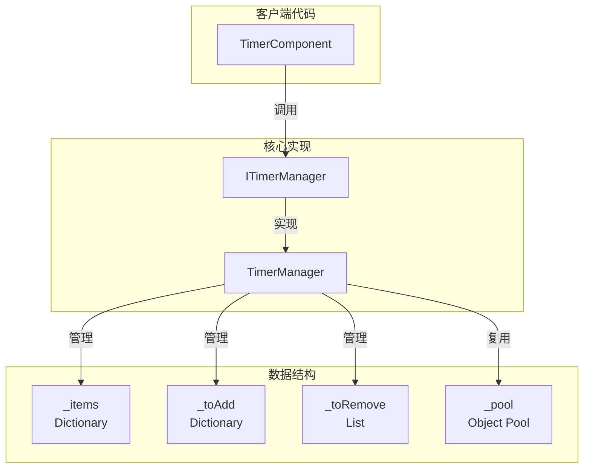
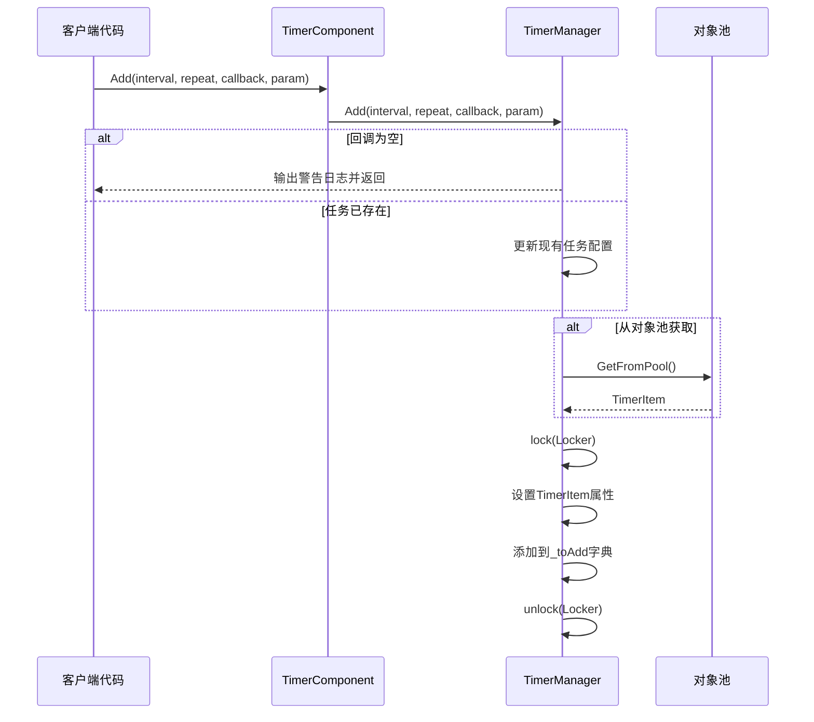
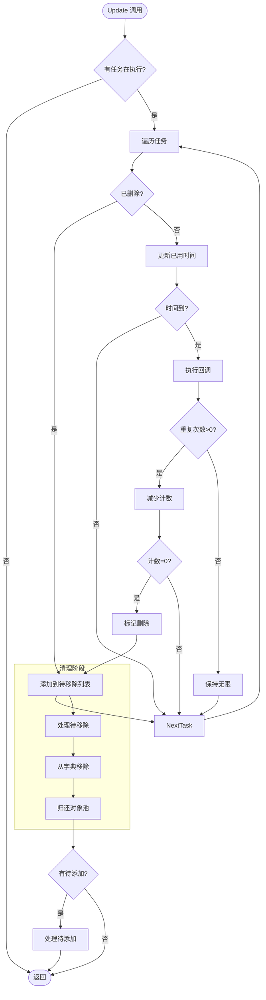

# 追加定时任务

このドキュメント介绍如何在 GameFrameX Timer コンポーネント中追加各类定时任务。

## 概要

Timer コンポーネント提供します三种追加定时任务的方法：

1. **Add メソッド** - 追加可重复执行的定时任务
2. **AddOnce メソッド** - 追加仅执行一次的任务
3. **AddUpdate メソッド** - 追加每帧执行的任务

所有任务都通过 TimerComponent 暴露给 Unity コンポーネント使用，内部由 TimerManager 実装具体的定时逻辑。

## コアコンセプト

### 定时任务パラメータ

| パラメータ | タイプ | 説明 |
|------|------|------|
| interval | float | 间隔时间（秒） |
| repeat | int | 重复次数（0 表示无限重复） |
| callback | Action\<object\> | コールバック函数 |
| callbackParam | object | 传递给コールバック的パラメータ（可选） |

### 任务ステータス管理

TimerManager 使用以下数据结构管理任务：

- `_items` - 〜中执行的任务字典
- `_toAdd` - 等待追加到执行队列的任务
- `_toRemove` - 等待移除的任务
- `_pool` - 对象池，用于复用 TimerItem 对象



## 任务追加フロー



### 任务执行フロー



## 使用例

### 基本定时任务

追加一个每 1 秒执行一次，共执行 10 次的任务：

```csharp
// 通过 TimerComponent 添加定时任务
var timerComponent = gameObject.GetComponent<TimerComponent>();
timerComponent.Add(1.0f, 10, callback, null);

void callback(object param)
{
    Debug.Log("定时任务执行!");
}
```

> Source: [TimerComponent.cs](https://github.com/GameFrameX/com.gameframex.unity.timer/blob/main/Runtime/Timer/TimerComponent.cs#L37-L40)

### 无限重复任务

追加一个每 2 秒执行一次的无限循环任务（repeat = 0 表示无限）：

```csharp
// repeat 为 0 表示无限重复执行
timerComponent.Add(2.0f, 0, onInfiniteTick, "myData");

void onInfiniteTick(object param)
{
    string data = param as string;
    Debug.Log($"无限任务执行, 数据: {data}");
}
```

> Source: [TimerManager.cs](https://github.com/GameFrameX/com.gameframex.unity.timer/blob/main/Runtime/Timer/TimerManager.cs#L156-L188)

### 带パラメータ的任务

通过 callbackParam 传递自定義数据：

```csharp
// 传递复杂数据对象
var myData = new { Name = "Player", Score = 100 };
timerComponent.Add(1.0f, 5, onScoreUpdate, myData);

void onScoreUpdate(object param)
{
    var data = param as dynamic;
    Debug.Log($"玩家: {data.Name}, 分数: {data.Score}");
}
```

> Source: [TimerManager.cs](https://github.com/GameFrameX/com.gameframex.unity.timer/blob/main/Runtime/Timer/TimerManager.cs#L24-L30)

## 内部実装详解

### TimerItem 数据结构

```csharp
class TimerItem
{
    public float Interval;      // 间隔时间
    public int Repeat;           // 剩余重复次数
    public Action<object> Callback;  // 回调函数
    public object Param;        // 回调参数
    
    public float Elapsed;       // 已用时间
    public bool Deleted;        // 删除标记
}
```

> Source: [TimerManager.cs](https://github.com/GameFrameX/com.gameframex.unity.timer/blob/main/Runtime/Timer/TimerManager.cs#L14-L31)

### 时间精度処理

TimerManager 在 Update 中処理时间累积：

```csharp
timerItem.Elapsed += realElapseSeconds;
if (timerItem.Elapsed < timerItem.Interval)
{
    continue;  // 时间未到，跳过
}

timerItem.Elapsed -= timerItem.Interval;
// 处理时间漂移：如果 elapsed 太小或太大则重置
if (timerItem.Elapsed < 0 || timerItem.Elapsed > 0.03f)
    timerItem.Elapsed = 0;
```

这种設計確認してください了：
- 任务在精确的间隔后执行
- 累积的时间误差被自动修正
- つまり使帧率波动也能保持相对准确

> Source: [TimerManager.cs](https://github.com/GameFrameX/com.gameframex.unity.timer/blob/main/Runtime/Timer/TimerManager.cs#L63-L71)

### 对象池机制

为减少垃圾回收压力，TimerManager 実装了对象池：

```csharp
private TimerItem GetFromPool()
{
    if (_pool.Count > 0)
    {
        var item = _pool[_pool.Count - 1];
        _pool.RemoveAt(_pool.Count - 1);
        item.Deleted = false;
        item.Elapsed = 0;
        return item;
    }
    return new TimerItem();
}

private void ReturnToPool(TimerItem t)
{
    t.Callback = null;
    _pool.Add(t);
}
```

> Source: [TimerManager.cs](https://github.com/GameFrameX/com.gameframex.unity.timer/blob/main/Runtime/Timer/TimerManager.cs#L266-L289)

### 线程安全

所有对任务字典的操作都使用 lock 保护：

```csharp
private static readonly object Locker = new object();

public void Add(float interval, int repeat, Action<object> callback, object callbackParam = null)
{
    lock (Locker)
    {
        // ... 添加任务逻辑
    }
}
```

> Source: [TimerManager.cs](https://github.com/GameFrameX/com.gameframex.unity.timer/blob/main/Runtime/Timer/TimerManager.cs#L38)

## 例外処理

TimerManager 提供します静态設定来控制コールバック例外処理：

```csharp
// 默认情况下不捕获异常，异常会直接抛出
public static bool CatchCallbackExceptions = false;

// 开启异常捕获
TimerManager.CatchCallbackExceptions = true;
```

开启后，例外会被捕获并记录警告ログ，任务会被自动削除。

> Source: [TimerManager.cs](https://github.com/GameFrameX/com.gameframex.unity.timer/blob/main/Runtime/Timer/TimerManager.cs#L42-L43)

## 関連リンク

- [追加单次任务](./4-core-functions.add-once) - 詳細理解する AddOnce メソッド
- [追加帧アップデート任务](./4-core-functions.add-update) - 詳細理解する AddUpdate メソッド
- [確認和移除任务](./4-core-functions.exists-remove) - 理解する如何確認和移除任务
- [TimerComponent API リファレンス](./5-api-reference.timer-component) - 完全な的 API ドキュメント
- [ITimerManager インターフェース](./5-api-reference.itimer-manager) - インターフェース定義
- [TimerManager 実装](./5-api-reference.timer-manager) - 内部実装细节
