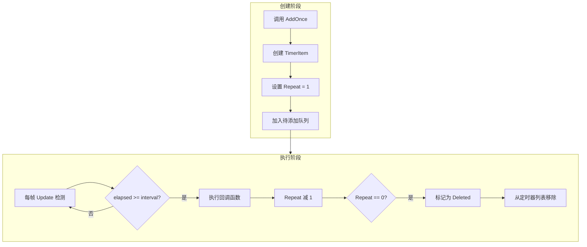

# 追加单次任务

追加单次任务機能允许開発者追加一个只执行一次的定时任务，適しています延迟执行、一次性イベントトリガー等シーン。

## 概要

`AddOnce` 是 Timer コンポーネント提供的コアメソッド之一，用于追加一个只执行一次的定时任务。该メソッド会在指定的延迟时间后トリガーコールバック函数，执行完成后自动从定时器列表中移除。

**使用シーン：**
- 延迟执行某个操作（如几秒后显示ヒント）
- 一次性イベントトリガー（如游戏开始倒计时）
- 延迟初期化某些コンポーネント
- 定时提醒機能

## コア実装

`AddOnce` メソッド的内部実装非常シンプル，它复用 `Add` メソッド，将重复次数設定为 1：

```csharp
// TimerManager.cs 第 197-200 行
public void AddOnce(float interval, Action<object> callback, object callbackParam = null)
{
    Add(interval, 1, callback, callbackParam);
}
```

> Source: [TimerManager.cs](https://github.com/GameFrameX/com.gameframex.unity.timer/blob/main/Runtime/Timer/TimerManager.cs#L197-L200)

**設計意图：** 通过复用 `Add` メソッド，コード更加シンプル，同時に利用已有的对象池和线程安全机制，减少重复コード和潜在 bug。

## 工作原理



## 使用例

### 基本用法

追加一个 3 秒后执行的任务：

```csharp
// 获取 TimerComponent 组件
var timerComponent = GetComponent<TimerComponent>();

// 添加一个 3 秒后执行一次的任务
timerComponent.AddOnce(3f, OnTimerComplete);

// 回调方法
private void OnTimerComplete(object param)
{
    Debug.Log("定时任务执行完成！");
}
```

> Source: [README.md](https://github.com/GameFrameX/com.gameframex.unity.timer/blob/main/README.md#L44-L52)

### 传递パラメータ

〜できます为コールバック函数传递自定義パラメータ：

```csharp
// 添加带参数的单次任务
timerComponent.AddOnce(5f, OnDelayedAction, "自定义参数");

// 回调方法接收参数
private void OnDelayedAction(object param)
{
    string message = param as string;
    Debug.Log($"收到参数: {message}");
}
```

### 在マネージャー级别使用

直接使用 `ITimerManager` インターフェース：

```csharp
// 获取 TimerManager 模块
var timerManager = GameFrameworkEntry.GetModule<ITimerManager>();

// 添加单次任务
timerManager.AddOnce(2f, OnManagerTimer, null);
```

> Source: [ITimerManager.cs](https://github.com/GameFrameX/com.gameframex.unity.timer/blob/main/Runtime/Timer/ITimerManager.cs#L26)

## API リファレンス

### `TimerComponent.AddOnce`

```csharp
public void AddOnce(float interval, Action<object> callback, object callbackParam = null)
```

**機能説明：** 追加一个只执行一次的定时任务。

**パラメータ説明：**

| パラメータ | タイプ | 必填 | デフォルト值 | 説明 |
|------|------|------|--------|------|
| `interval` | float | 是 | - | 延迟时间，以秒为单位 |
| `callback` | Action\<object\> | 是 | - | 任务トリガー时执行的コールバック函数 |
| `callbackParam` | object | 否 | null | 传递给コールバック函数的パラメータ |

**呼び出し例：**

```csharp
timerComponent.AddOnce(3f, MyCallback, "test");
```

### `ITimerManager.AddOnce`

```csharp
void AddOnce(float interval, Action<object> callback, object callbackParam = null);
```

**機能説明：** 在定时器マネージャー级别追加单次任务。

**詳細説明：** 请参照 [TimerComponent.AddOnce](#timercomponentaddonce) 的パラメータ説明，两者签名完全一致。

> Source: [ITimerManager.cs](https://github.com/GameFrameX/com.gameframex.unity.timer/blob/main/Runtime/Timer/ITimerManager.cs#L20-L26)

## 注意事项

1. **时间单位**：パラメータ `interval` 的单位是**秒**（秒），而非毫秒。例えば，传入 `5f` 表示 5 秒后执行。

2. **コールバック签名**：コールバック函数〜しなければなりません接受一个 `object` タイプ的パラメータ，つまり使不使用パラメータ也〜しなければなりません声明：

   ```csharp
   // 正确
   void MyCallback(object param) { }
   
   // 错误 - 签名不匹配
   void MyCallback() { }
   ```

3. **自动移除**：任务执行完成后会自动从定时器列表中移除，无需手动呼び出し `Remove`。

4. **重复追加**：もし使用相同的コールバック函数再次呼び出し `AddOnce`，会アップデート现有任务的パラメータ（间隔时间和コールバックパラメータ）。

5. **线程安全**：`AddOnce` メソッド内部使用了锁机制，〜できます安全地在多线程環境中呼び出し。

## 関連リンク

- [追加定时任务](./4-core-functions.add-timer) - 理解する如何追加重复执行的定时任务
- [追加帧アップデート任务](./4-core-functions.add-update) - 理解する如何追加每帧执行的任务
- [確認和移除任务](./4-core-functions.exists-remove) - 理解する如何確認和移除任务
- [TimerComponent API リファレンス](./5-api-reference.timer-component) - 完全な的 TimerComponent API ドキュメント
- [ITimerManager API リファレンス](./5-api-reference.itimer-manager) - 完全な的 ITimerManager インターフェースドキュメント
- [TimerManager API リファレンス](./5-api-reference.timer-manager) - 完全な的 TimerManager 実装ドキュメント
