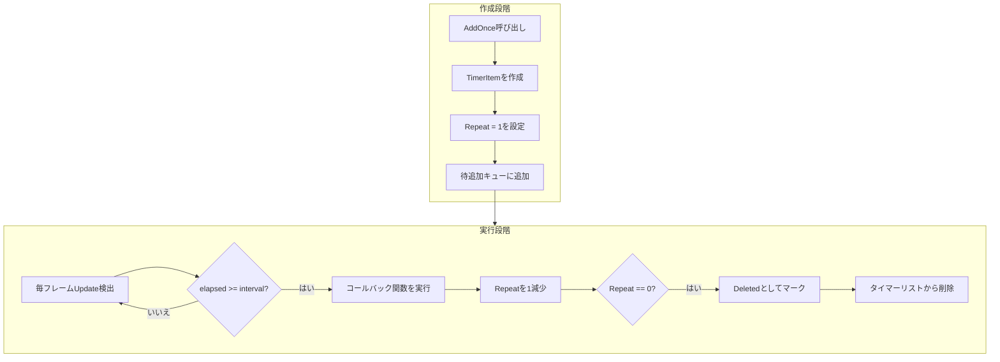

# ワンショット任務の追加

ワンショット任務追加機能は、開発者が1回だけ実行する定時任務を追加できるようにし、遅延実行、ワンショットイベントトリガーなどのシーンに適合します。

## 概要

`AddOnce`はTimerコンポーネントが提供するコアメソッドの一つであり、1回だけ実行する定時任務を追加します。このメソッドは指定した遅延時間後にコールバック関数をトリガーし、実行完了後にタイマーリストから自動的に削除します。

**使用シーン：**
- 操作的遅延実行（数秒後にヒントを表示など）
- ワンショットイベントトリガー（ゲーム開始カウントダウンなど）
- コンポーネントの遅延初期化
- 定时提醒機能

## コア実装

`AddOnce`メソッドの内部実装は非常にシンプルで、`Add`メソッドを再利用し、繰り返し回数を1に設定します：

```csharp
// TimerManager.cs 第197-200行
public void AddOnce(float interval, Action<object> callback, object callbackParam = null)
{
    Add(interval, 1, callback, callbackParam);
}
```

> Source: [TimerManager.cs](https://github.com/GameFrameX/com.gameframex.unity.timer/blob/main/Runtime/Timer/TimerManager.cs#L197-L200)

**設計意図：** `Add`メソッドを再利用することで、コードが簡潔になり、既存のオブジェクトプールとスレッドセーフメカニズムを活用し、重複コードと潜在的なバグを軽減します。

## 動作原理



## 使用例

### 基本用法

3秒後に実行する任務を追加します：

```csharp
// TimerComponentコンポーネントを取得
var timerComponent = GetComponent<TimerComponent>();

// 3秒後に1回実行する任務を追加
timerComponent.AddOnce(3f, OnTimerComplete);

// コールバックメソッド
private void OnTimerComplete(object param)
{
    Debug.Log("定時任務実行完了！");
}
```

> Source: [README.md](https://github.com/GameFrameX/com.gameframex.unity.timer/blob/main/README.md#L44-L52)

### パラメータを渡す

コールバック関数にカスタムパラメータを渡せます：

```csharp
// パラメータ付きワンショット任務を追加
timerComponent.AddOnce(5f, OnDelayedAction, "カスタムパラメータ");

// コールバックメソッドでパラメータを受け取る
private void OnDelayedAction(object param)
{
    string message = param as string;
    Debug.Log($"パラメータ受領: {message}");
}
```

### マネージャーレベルで使用

直接`ITimerManager`インターフェースを使用します：

```csharp
// TimerManagerモジュールを取得
var timerManager = GameFrameworkEntry.GetModule<ITimerManager>();

// ワンショット任務を追加
timerManager.AddOnce(2f, OnManagerTimer, null);
```

> Source: [ITimerManager.cs](https://github.com/GameFrameX/com.gameframex.unity.timer/blob/main/Runtime/Timer/ITimerManager.cs#L26)

## APIリファレンス

### `TimerComponent.AddOnce`

```csharp
public void AddOnce(float interval, Action<object> callback, object callbackParam = null)
```

**機能説明：** 1回だけ実行する定時任務を追加します。

**パラメータ説明：**

| パラメータ | 型 | 必須 | デフォルト値 | 説明 |
|------|------|------|--------|------|
| `interval` | float | ○ | - | 遅延時間、秒単位 |
| `callback` | Action\<object\> | ○ | - | 任務トリガー時に実行されるコールバック関数 |
| `callbackParam` | object | × | null | コールバック関数に渡すパラメータ |

**呼び出し例：**

```csharp
timerComponent.AddOnce(3f, MyCallback, "test");
```

### `ITimerManager.AddOnce`

```csharp
void AddOnce(float interval, Action<object> callback, object callbackParam = null);
```

**機能説明：** タイマーマネージャーレベルでワンショット任務を追加します。

**詳細説明：** [TimerComponent.AddOnce](#timercomponentaddonce)のンパラメータ説明を参照，两者シグネチャは完全に一致します。

> Source: [ITimerManager.cs](https://github.com/GameFrameX/com.gameframex.unity.timer/blob/main/Runtime/Timer/ITimerManager.cs#L20-L26)

## 注意事項

1. **時間単位**：パラメータ`interval`の単位は**秒**であり、ミリ秒ではありません。例えば、`5f`を渡すと5秒後に実行されます。

2. **コールバック署名**：コールバック関数は`object`型の変数を1つ受け取る必要があり、パラメータを使用しない場合でも宣言は必須です：

   ```csharp
   // 正しい
   void MyCallback(object param) { }

   // 間違い - 署名が一致しない
   void MyCallback() { }
   ```

3. **自動削除**：任務実行完了後にタイマーリストから自動的に削除され、手動で`Remove`を呼び出す必要はありません。

4. **重複追加**：同じコールバック関数で再度`AddOnce`を呼び出すと、既存任務のパラメータ（間隔時間とコールバックパラメータ）が更新されます。

5. **スレッドセーフ**：`AddOnce`メソッド内部はロックメカニズムを使用しており、マルチスレッド環境でも安全に呼び出せます。

## 関連リンク

- [タイマータスク追加](./4-core-functions.add-timer) - 繰り返し実行定時任務の追加方法
- [フレーム更新任務追加](./4-core-functions.add-update) - 毎フレーム実行任務の追加方法
- [任務チェックと削除](./4-core-functions.exists-remove) - 任務のチェックと削除方法
- [TimerComponent APIリファレンス](./5-api-reference.timer-component) - 完全なTimerComponent APIドキュメント
- [ITimerManager APIリファレンス](./5-api-reference.itimer-manager) - 完全なITimerManagerインターフェースドキュメント
- [TimerManager APIリファレンス](./5-api-reference.timer-manager) - 完全なTimerManager実装ドキュメント
