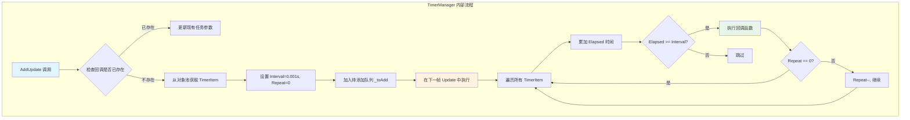
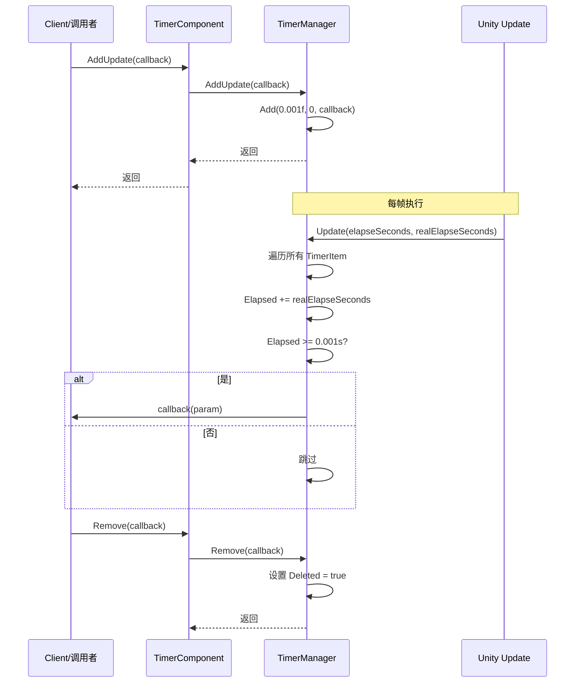

# 追加帧アップデート任务

追加帧アップデート任务是 Timer コンポーネント的コア機能之一，用于登録一个在每一帧都会执行的コールバック函数。与定时任务和单次任务不同，帧アップデート任务适合〜する必要があります持续高频执行的操作，例えば游戏中的输入检测、动画アップデート、或〜する必要があります每帧都执行的逻辑。

## 概要

帧アップデート任务（AddUpdate）は一種の特殊的定时任务，其内部実装是将间隔时间設定为极小值（0.001秒），重复次数設定为无限（0表示无限重复）。这意味着登録的コールバック函数将在 Unity 的每一帧アップデート中被呼び出し。



### コア特性

- **无限执行**：repeat パラメータ为 0，表示任务会持续执行直到手动移除
- **高频呼び出し**：每帧执行（约每 16ms 一次，取决于帧率）
- **パラメータサポート**：サポート传递自定義パラメータ到コールバック函数
- **重复登録检测**：もし相同的コールバック已存在，会自动アップデートパラメータ而不是作成新任务

## 工作原理

### 内部実装

帧アップデート任务本质上は特殊的定时任务，通过以下方法実装每帧执行：

> Source: [TimerManager.cs#L206-L219](https://github.com/GameFrameX/com.gameframex.unity.timer/blob/main/Runtime/Timer/TimerManager.cs#L206-L219)

```csharp
/// <summary>
/// 添加一个每帧更新执行的任务
/// </summary>
/// <param name="callback">要执行的回调函数</param>
public void AddUpdate(Action<object> callback)
{
    Add(0.001f, 0, callback);
}

/// <summary>
/// 添加一个每帧更新执行的任务
/// </summary>
/// <param name="callback">要执行的回调函数</param>
/// <param name="callbackParam">回调函数的参数</param>
public void AddUpdate(Action<object> callback, object callbackParam)
{
    Add(0.001f, 0, callback, callbackParam);
}
```

コア逻辑解析：
1. **Interval = 0.001f**：設定极短的间隔时间（约1毫秒），確認してください每帧都能トリガー
2. **Repeat = 0**：設定为0表示无限重复，任务不会自动移除
3. **Add メソッド**：复用现有的定时任务追加逻辑，統一された管理

### 执行フロー



## 使用例

### 基本用法

以下例表示如何在游戏循环中每帧执行一个メソッド：

```csharp
using GameFrameX.Timer.Runtime;
using UnityEngine;

public class PlayerController : MonoBehaviour
{
    private TimerComponent _timerComponent;
    
    private void Start()
    {
        // 获取 TimerComponent 组件
        _timerComponent = GetComponent<TimerComponent>();
        
        // 注册每帧执行的任务
        _timerComponent.AddUpdate(OnEveryFrame);
    }
    
    private void OnEveryFrame(object param)
    {
        // 每帧执行的逻辑
        // 例如：处理输入、更新动画状态等
        Debug.Log("每帧执行");
    }
    
    private void OnDestroy()
    {
        // 移除帧更新任务，避免内存泄漏
        if (_timerComponent != null)
        {
            _timerComponent.Remove(OnEveryFrame);
        }
    }
}
```

### 传递パラメータ的用法

もし〜する必要があります在コールバック中传递自定義パラメータ，〜できます使用带パラメータ的オーバーロード：

```csharp
public class GameManager : MonoBehaviour
{
    private TimerComponent _timerComponent;
    private int _frameCount = 0;
    
    private void Start()
    {
        _timerComponent = GetComponent<TimerComponent>();
        
        // 传递当前对象作为参数
        _timerComponent.AddUpdate(OnUpdateWithParam, this);
    }
    
    private void OnUpdateWithParam(object param)
    {
        // 将参数转换回原始类型
        var gameManager = param as GameManager;
        if (gameManager != null)
        {
            gameManager._frameCount++;
            if (gameManager._frameCount % 60 == 0)
            {
                Debug.Log($"已运行 {gameManager._frameCount} 帧");
            }
        }
    }
}
```

### 使用 Lambda 表达式

对于シンプル的逻辑，〜できます使用 Lambda 表达式簡素化コード：

```csharp
private TimerComponent _timerComponent;

private void Start()
{
    _timerComponent = GetComponent<TimerComponent>();
    
    // 使用 Lambda 表达式
    _timerComponent.AddUpdate(param => 
    {
        var deltaTime = (float)param;
        // 执行基于帧的逻辑
    }, Time.deltaTime);
}
```

### 確認任务是否存在

在追加帧アップデート任务前，〜できます先確認是否已存在相同的コールバック：

```csharp
private void Start()
{
    _timerComponent = GetComponent<TimerComponent>();
    
    // 检查任务是否存在
    if (!_timerComponent.Exists(OnEveryFrame))
    {
        _timerComponent.AddUpdate(OnEveryFrame);
    }
}

private void OnEveryFrame(object param)
{
    // 业务逻辑
}
```

## API リファレンス

### `TimerComponent.AddUpdate`

> See [TimerComponent API Reference](./5-api-reference.timer-component) for full details

### `ITimerManager.AddUpdate`

> See [ITimerManager API Reference](./5-api-reference.itimer-manager) for full details

### `TimerManager.AddUpdate`

> See [TimerManager API Reference](./5-api-reference.timer-manager) for full details

## 注意事项

1. **性能考虑**：每帧执行的コールバック应当保持シンプル，避免执行耗时操作
2. **及时移除**：当不再〜する必要があります帧アップデート任务时，〜しなければなりません呼び出し `Remove()` メソッド手动移除，否则会导致内存泄漏和持续的性能消耗
3. **重复登録**：系统会自动処理重复登録（アップデート现有任务パラメータ），但お勧め在追加前使用 `Exists()` 確認
4. **帧率依赖**：任务的执行频率依赖于游戏的帧率，在低帧率情况下执行频率会降低

## ベストプラクティス

| シーン | 推奨做法 |
|------|----------|
| 输入检测 | 使用 AddUpdate，每帧確認输入ステータス |
| 动画ステータス机 | 使用 AddUpdate，アップデート动画パラメータ |
| 长时间运行的任务 | 定期確認并适时呼び出し Remove() |
| 条件トリガー | 结合 Exists() メソッド管理任务ライフサイクル |

## 関連リンク

- [追加定时任务](./4-core-functions.add-timer)
- [追加单次任务](./4-core-functions.add-once)
- [確認和移除任务](./4-core-functions.exists-remove)
- [TimerComponent API リファレンス](./5-api-reference.timer-component)
- [ITimerManager API リファレンス](./5-api-reference.itimer-manager)
- [TimerManager API リファレンス](./5-api-reference.timer-manager)
