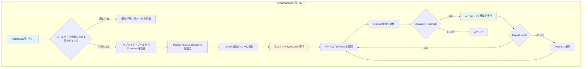
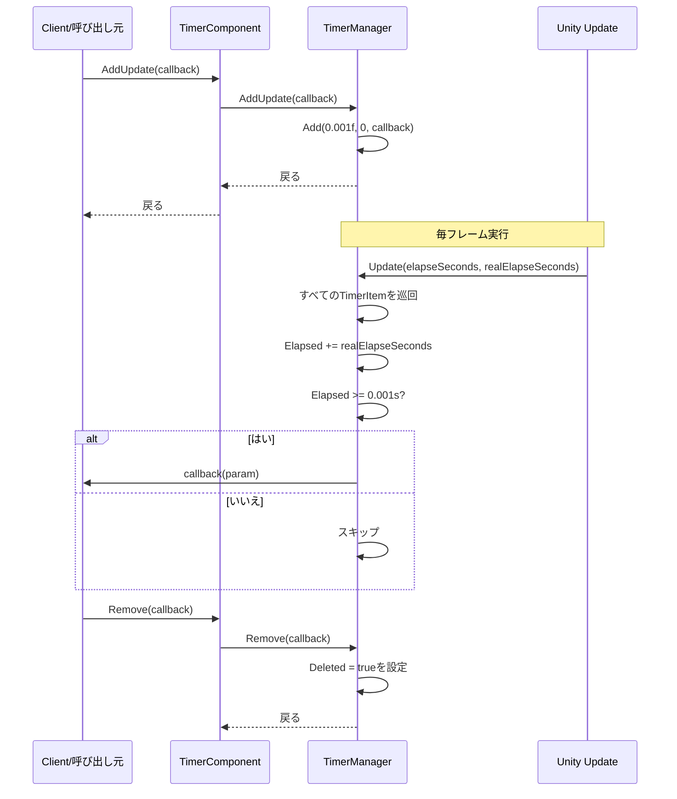

# フレーム更新任務の追加

フレーム更新任務の追加はTimerコンポーネントのコア機能の一つであり、毎フレーム実行されるコールバック関数を登録するために使用されます。定時任務やワンショット任務とは異なり、フレーム更新任務は継続的な高頻度実行が必要な操作に適合し、ゲーム内の入力検出、アニメーション更新、または毎フレーム実行が必要なロジックなどが含まれます。

## 概要

フレーム更新任務（AddUpdate）は特殊な定時任務であり、内部実装では間隔時間を極小値（0.001秒）に設定し、繰り返し回数を無限（0は無限繰り返し）に設定します。这意味着登録されたコールバック関数はUnityの各フレーム更新で呼び出されます。



### コア機能

- **無限実行**：repeatパラメータが0で、任務が手動削除されるまで継続実行
- **高頻度呼び出し**：毎フレーム実行（約16msごと、フレームレートに依存）
- **パラメータサポート**：コールバック関数へのカスタムパラメータ渡をサポート
- **重複登録検出**：同じコールバックが既に存在する場合、新任務を作成せずにパラメータを自動更新

## 動作原理

### 内部実装

フレーム更新任務は本质的には特殊な定時任務であり、以下の方法で毎フレーム実行を実装します：

> Source: [TimerManager.cs#L206-L219](https://github.com/GameFrameX/com.gameframex.unity.timer/blob/main/Runtime/Timer/TimerManager.cs#L206-L219)

```csharp
/// <summary>
/// 毎フレーム更新実行任務を追加
/// </summary>
/// <param name="callback">実行するコールバック関数</param>
public void AddUpdate(Action<object> callback)
{
    Add(0.001f, 0, callback);
}

/// <summary>
/// 毎フレーム更新実行任務を追加
/// </summary>
/// <param name="callback">実行するコールバック関数</param>
/// <param name="callbackParam">コールバック関数のパラメータ</param>
public void AddUpdate(Action<object> callback, object callbackParam)
{
    Add(0.001f, 0, callback, callbackParam);
}
```

コアロジック解析：
1. **Interval = 0.001f**：極めて短い間隔時間を設定（約1ミリ秒）、毎フレームトリガーを確保
2. **Repeat = 0**：0に設定は無限繰り返しを示し、任務は自動削除されない
3. **Addメソッド**：既存の定時任務追加ロジックを再利用、统一管理

### 実行フロー



## 使用例

### 基本用法

以下の例はゲームループで毎フレームメソッドを実行する方法を示します：

```csharp
using GameFrameX.Timer.Runtime;
using UnityEngine;

public class PlayerController : MonoBehaviour
{
    private TimerComponent _timerComponent;

    private void Start()
    {
        // TimerComponentコンポーネントを取得
        _timerComponent = GetComponent<TimerComponent>();

        // 毎フレーム実行する任務を登録
        _timerComponent.AddUpdate(OnEveryFrame);
    }

    private void OnEveryFrame(object param)
    {
        // 毎フレーム実行のロジック
        // 例：入力を処理、アニメーションステータスを更新など
        Debug.Log("毎フレーム実行");
    }

    private void OnDestroy()
    {
        // フレーム更新任務を削除、メモリリークを回避
        if (_timerComponent != null)
        {
            _timerComponent.Remove(OnEveryFrame);
        }
    }
}
```

### パラメータ渡しの用法

コールバックでカスタムパラメータを渡す必要がある場合、パラメータ付きオーバーロードを使用できます：

```csharp
public class GameManager : MonoBehaviour
{
    private TimerComponent _timerComponent;
    private int _frameCount = 0;

    private void Start()
    {
        _timerComponent = GetComponent<TimerComponent>();

        // 現在のオブジェクトをパラメータとして渡す
        _timerComponent.AddUpdate(OnUpdateWithParam, this);
    }

    private void OnUpdateWithParam(object param)
    {
        // パラメータを元の型に変換
        var gameManager = param as GameManager;
        if (gameManager != null)
        {
            gameManager._frameCount++;
            if (gameManager._frameCount % 60 == 0)
            {
                Debug.Log($"実行済み {gameManager._frameCount} フレーム");
            }
        }
    }
}
```

### Lambda式を使用

単純なロジックの場合、Lambda式でコードを簡略化できます：

```csharp
private TimerComponent _timerComponent;

private void Start()
{
    _timerComponent = GetComponent<TimerComponent>();

    // Lambda式を使用
    _timerComponent.AddUpdate(param =>
    {
        var deltaTime = (float)param;
        // フレームベースのロジックを実行
    }, Time.deltaTime);
}
```

### 任務是否存在かをチェック

フレーム更新任務を追加する前に、同じコールバックが既に存在するかを先にチェックできます：

```csharp
private void Start()
{
    _timerComponent = GetComponent<TimerComponent>();

    // 任務が存在するかチェック
    if (!_timerComponent.Exists(OnEveryFrame))
    {
        _timerComponent.AddUpdate(OnEveryFrame);
    }
}

private void OnEveryFrame(object param)
{
    // ビジネスロジック
}
```

## APIリファレンス

### `TimerComponent.AddUpdate`

> 完全な詳細については[TimerComponent API Reference](./5-api-reference.timer-component)を参照してください

### `ITimerManager.AddUpdate`

> 完全な詳細については[ITimerManager API Reference](./5-api-reference.itimer-manager)を参照してください

### `TimerManager.AddUpdate`

> 完全な詳細については[TimerManager API Reference](./5-api-reference.timer-manager)を参照してください

## 注意事項

1. **パフォーマンス考慮**：毎フレーム実行するコールバックは簡潔に保ち、重量な操作の実行を避けてください
2. **適時に削除**：フレーム更新任務が不要になったら、`Remove()`メソッドを呼び出して手動で削除する必要があります、さもなくばメモリリークと継続的なパフォーマンス消費が発生します
3. **重複登録**：システムは自動的に重複登録を処理します（既存任務パラメータを更新）が、追加前に`Exists()`でチェックすることをお勧めします
4. **フレームレート依存**：任務の実行頻度はゲームのフレームレートに依存し、低フレームレート情況では実行頻度も低下します

## ベストプラクティス

| シーン | 推奨方法 |
|------|----------|
| 入力検出 | AddUpdateを使用、毎フレーム入力ステータスをチェック |
| アニメーションステートマシン | AddUpdateを使用、アニメーションパラメータを更新 |
| 長時間実行任務 | 定期的にチェックし、適時にRemove()を呼び出す |
| 条件トリガー | Exists()メソッドを組み合わせて任務ライフサイクルを管理 |

## 関連リンク

- [タイマータスク追加](./4-core-functions.add-timer)
- [ワンショット任務追加](./4-core-functions.add-once)
- [任務チェックと削除](./4-core-functions.exists-remove)
- [TimerComponent APIリファレンス](./5-api-reference.timer-component)
- [ITimerManager APIリファレンス](./5-api-reference.itimer-manager)
- [TimerManager APIリファレンス](./5-api-reference.timer-manager)
