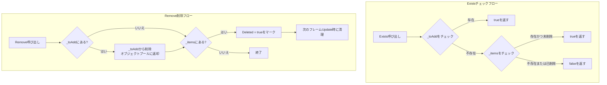

# 任務のチェックと削除

Timerタイマーコンポーネントでは、定時任務を追加する他に、任務が存在するかのチェックと任務を削除する機能も提供されます。これらの機能は定時任務の動的管理、重複追加回避、特定条件下での任務キャンセルに非常に便利です。

## 概要

TimerComponentは任務のチェックと削除に使用される2つのコアメソッドを提供します：

- **Exists** - 指定したコールバック関数に対応する任務是否存在かをチェック
- **Remove** - 指定したコールバック関数に対応する任務を削除（キャンセル）

这两个メソッドはどちらもコールバック関数の参照（`Action<object>`）を通じて任務を識別して操作するため、同じ делегатインスタンスが渡されていることを確認する必要があります。

## コア機能

### 任務是否存在かをチェック

`Exists`メソッドは指定したコールバック関数が有効な定時任務に対応するかをチェックするために使用されます。

```csharp
public bool Exists(Action<object> callback)
```

**実装原理：**

> Source: [TimerManager.cs](https://github.com/GameFrameX/com.gameframex.unity.timer/blob/main/Runtime/Timer/TimerManager.cs#L226-L243)

```csharp
public bool Exists(Action<object> callback)
{
    lock (Locker)
    {
        // 第一ステップ：待追加リストをチェック
        if (_toAdd.ContainsKey(callback))
        {
            return true;
        }

        // 第二ステップ：アクティブ任務リストをチェック
        if (_items.TryGetValue(callback, out var at))
        {
            // 削除マークされていない任務のみ存在と見なす
            return !at.Deleted;
        }

        return false;
    }
}
```

**チェックロジック説明：**

1. **待追加リスト（`_toAdd`）**：任務が待追加キュー内で作成されたがまだ有効でないかをチェック
2. **アクティブ任務リスト（`_items`）**：任務が現在のアクティブ任務リストに存在するかをチェック
3. **削除マーク（`Deleted`）**：削除マークされていない任務のみtrueを返す

### 指定任務を削除

`Remove`メソッドは指定した定時任務を削除（キャンセル）するために使用されます。このメソッドは遅延削除メカニズムを採用しており、辞書から即座に削除せず、次のフレームUpdate時に清理します。

```csharp
public void Remove(Action<object> callback)
```

**実装原理：**

> Source: [TimerManager.cs](https://github.com/GameFrameX/com.gameframex.unity.timer/blob/main/Runtime/Timer/TimerManager.cs#L249-L264)

```csharp
public void Remove(Action<object> callback)
{
    lock (Locker)
    {
        // 任務がまだ待追加キューにある場合、直接キャンセルしてオブジェクトプールに返却
        if (_toAdd.TryGetValue(callback, out var t))
        {
            _toAdd.Remove(callback);
            ReturnToPool(t);
        }

        // 任務が既にアクティブリストにある場合、削除としてマーク
        if (_items.TryGetValue(callback, out t))
        {
            t.Deleted = true;
        }
    }
}
```

**削除ロジック説明：**

1. **待追加キュー**：任務がまだ実行を開始していない（`_toAdd`にある）場合、キューから直接削除してオブジェクトプールに返却
2. **アクティブリスト**：任務がアクティブリストで実行中の場合、`Deleted = true`としてマーク
3. **遅延清理**：次のフレーム`Update()`ループで、Deletedとしてマークされたすべての任務が自動清理

## ワークフローチャート



## 使用例

### 基本用法

```csharp
using GameFrameX.Timer.Runtime;
using UnityEngine;

public class TimerExample : MonoBehaviour
{
    private TimerComponent _timer;

    private void Start()
    {
        _timer = GetComponent<TimerComponent>();

        // コールバックメソッドを定義
        void OnTick(object param)
        {
            Debug.Log($"Tick at {Time.time}");
        }

        // 定時任務を追加、毎秒実行
        _timer.Add(1.0f, 0, OnTick);

        // 任務が存在するかチェック
        bool exists = _timer.Exists(OnTick);
        Debug.Log($"任務是否存在: {exists}"); // 出力: True

        // 任務を削除
        _timer.Remove(OnTick);

        // 再度チェック
        exists = _timer.Exists(OnTick);
        Debug.Log($"任務是否存在: {exists}"); // 出力: False
    }
}
```

> Source: [TimerComponent.cs](https://github.com/GameFrameX/com.gameframex.unity.timer/blob/main/Runtime/Timer/TimerComponent.cs#L72-L89)

### 動的管理任務

実際の応用では、ゲームステータスに基づいて動的に任務を追加および削除する必要がある場合があります：

```csharp
public class GameTimerManager : MonoBehaviour
{
    private TimerComponent _timer;
    private Action<object> _gameLoopTask;

    private void Start()
    {
        _timer = GetComponent<TimerComponent>();
        _gameLoopTask = OnGameLoop;
    }

    // ゲーム一時停止時にループ任務を停止
    public void PauseGame()
    {
        if (_timer.Exists(_gameLoopTask))
        {
            _timer.Remove(_gameLoopTask);
            Debug.Log("ゲームループ任務が一時停止されました");
        }
    }

    // ゲーム再開時にループ任務を再開
    public void ResumeGame()
    {
        if (!_timer.Exists(_gameLoopTask))
        {
            _timer.AddUpdate(_gameLoopTask);
            Debug.Log("ゲームループ任務が再開されました");
        }
    }

    private void OnGameLoop(object param)
    {
        // ゲームループロジック
    }
}
```

### Lambda式の注意事項

Lambda式を使用する際は特に注意が必要で、每次Lambda式は新しい делегатインスタンスを作成し、任務を正しくマッチングして削除できなくなります：

```csharp
// ❌ 間違いの例：Lambda式は每次新しいインスタンスを作成
_timer.Add(1.0f, 5, (param) => Debug.Log("Tick"));
_timer.Exists((param) => Debug.Log("Tick")); // Falseを返す、異なる делегатインスタンスのため
_timer.Remove((param) => Debug.Log("Tick"));  // 削除できない、異なる делегатインスタンスのため

// ✅ 正しい例：具名メソッドを使用または делегат参照を保存
Action<object> myTick = (param) => Debug.Log("Tick");
_timer.Add(1.0f, 5, myTick);
_timer.Exists(myTick);  // Trueを返す
_timer.Remove(myTick);   // 正しく削除
```

## スレッドセーフティ

`Exists`と`Remove`メソッドはどちらも`lock (Locker)`を使用してスレッドセーフティを保証します。TimerManagerのUpdateメソッドもロック内で操作を実行するため、これらのメソッドは任意のスレッドで安全に呼び出せます。

> Source: [TimerManager.cs](https://github.com/GameFrameX/com.gameframex.unity.timer/blob/main/Runtime/Timer/TimerManager.cs#L38)

```csharp
private static readonly object Locker = new object();
```

## APIリファレンス

### TimerComponent

#### `Exists(callback: Action<object>): bool`

指定した任務是否存在かをチェックします。

**パラメータ：**
- `callback` (`Action<object>`): チェック対象のコールバック関数

**戻り値：**
- `bool`: 任務が存在し削除マークされていない場合はtrue、それ以外の場合はfalse

#### `Remove(callback: Action<object>): void`

指定した任務を削除します。

**パラメータ：**
- `callback` (`Action<object>`): 削除対象のコールバック関数

**説明：**
- 任務が待追加キューにある場合、即座に削除されます
- 任務がアクティブリストにある場合、削除としてマークされ、次のフレームで清理されます

### ITimerManager

> Source: [ITimerManager.cs](https://github.com/GameFrameX/com.gameframex.unity.timer/blob/main/Runtime/Timer/ITimerManager.cs#L41-L52)

インターフェース定義は完全に同じです：

```csharp
bool Exists(Action<object> callback);
void Remove(Action<object> callback);
```

## よくある質問

### Remove後にExistsがまだtrueを返すのはなぜですか？

Remove呼び出し直後にExistsを呼び出すと、仍在trueを返す可能性があります，因為：
1. 任務がDeletedとしてマークされたが、次のフレームUpdateでまだ清理されていない
2. 解決策：Remove後に1フレーム待つ、または他のメカニズムで確認

### Lambda式で任務をマッチングできない怎么办？

前述のように、每次Lambda式は新しい делегатインスタンスを作成します。解決策は：
1. 具名メソッドを使用してLambdaの代わりに
2. делегат参照を保存して再利用可能に

### Removeを複数回呼び出すと問題がありますか？

ありません。Removeメソッドは幂等操作として設計されており、複数回呼び出してもエラーが発生しません。任務が存在しない場合、メソッドは警告もなく戻ります。

## 関連リンク

- [Timerコンポーネント紹介](../1-overview.introduction)
- [機能特性](../1-overview.features)
- [タイマータスク追加](./4-core-functions.add-timer)
- [ワンショット任務追加](./4-core-functions.add-once)
- [フレーム更新任務追加](./4-core-functions.add-update)
- [APIリファレンス - TimerComponent](./5-api-reference.timer-component)
- [APIリファレンス - ITimerManager](./5-api-reference.itimer-manager)
