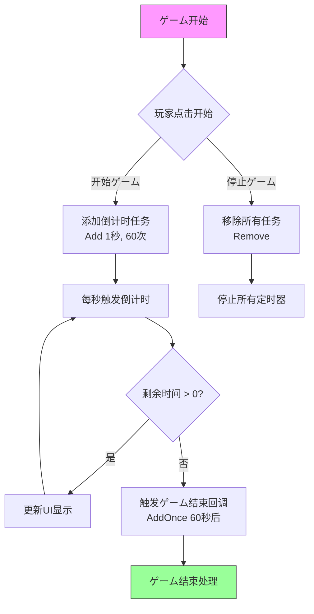

# 使用例

本章节提供 Timer タイマーコンポーネント的完整使用示例，展示如何在 Unity プロジェクト中实际应用各种定时任务機能。

## 概要

Timer コンポーネント提供します一套完整的定时任务解決策，サポート以下几种定时模式：
- **循环定时任务**：按固定间隔重复执行
- **单次定时任务**：延迟指定时间后执行一次
- **帧更新任务**：每帧执行一次，适に使用必要持续监控的シーン

这些示例基づく实际的源代码编写，可能直接在你的プロジェクト中使用。

## 基础使用示例

### 添加循环定时任务

以下示例展示如何作成一个每间隔 1 秒执行一次，总共执行 5 次的定时任务：

```csharp
using GameFrameX.Timer.Runtime;
using UnityEngine;

public class TimerExample : MonoBehaviour
{
    private TimerComponent _timerComponent;

    private void Start()
    {
        // 取得 TimerComponent コンポーネント
        _timerComponent = GetComponent<TimerComponent>();
        
        // 添加定时任务：间隔1秒，执行5次
        _timerComponent.Add(1f, 5, OnTimerTick, "Hello Timer");
    }

    private void OnTimerTick(object param)
    {
        Debug.Log($"定时任务触发，参数: {param}");
    }
}
```
> Source: [TimerComponent.cs](https://github.com/GameFrameX/com.gameframex.unity.timer/blob/main/Runtime/Timer/TimerComponent.cs#L37-L40)

### 添加单次定时任务

使用 `AddOnce` メソッド添加延迟执行一次的任务：

```csharp
using GameFrameX.Timer.Runtime;
using UnityEngine;

public class DelayedTaskExample : MonoBehaviour
{
    private TimerComponent _timerComponent;

    private void Start()
    {
        _timerComponent = GetComponent<TimerComponent>();
        
        // 5秒后执行一次
        _timerComponent.AddOnce(5f, OnDelayedExecute, "延迟任务完成");
    }

    private void OnDelayedExecute(object param)
    {
        Debug.Log($"延迟任务执行: {param}");
        // 可能在这里执行延迟后的逻辑，如显示结算界面等
    }
}
```
> Source: [TimerComponent.cs](https://github.com/GameFrameX/com.gameframex.unity.timer/blob/main/Runtime/Timer/TimerComponent.cs#L48-L51)

### 添加帧更新任务

使用 `AddUpdate` 添加每帧执行的任务：

```csharp
using GameFrameX.Timer.Runtime;
using UnityEngine;

public class FrameUpdateExample : MonoBehaviour
{
    private TimerComponent _timerComponent;
    private int _frameCount = 0;

    private void Start()
    {
        _timerComponent = GetComponent<TimerComponent>();
        
        // 每帧执行一次任务
        _timerComponent.AddUpdate(OnFrameUpdate, null);
    }

    private void OnFrameUpdate(object param)
    {
        _frameCount++;
        if (_frameCount % 60 == 0) // 每60帧打印一次
        {
            Debug.Log($"已运行 {_frameCount} 帧");
        }
    }
}
```
> Source: [TimerComponent.cs](https://github.com/GameFrameX/com.gameframex.unity.timer/blob/main/Runtime/Timer/TimerComponent.cs#L57-L70)

## 检查和移除任务

### 检查任务是否存在

在实际应用中，可能必要检查某个定时任务是否仍在运行：

```csharp
using GameFrameX.Timer.Runtime;
using UnityEngine;

public class CheckTimerExample : MonoBehaviour
{
    private TimerComponent _timerComponent;
    private Action<object> _myTimerCallback;

    private void Start()
    {
        _timerComponent = GetComponent<TimerComponent>();
        
        // 保存回调引用以便后续检查
        _myTimerCallback = OnTimerTick;
        
        // 添加定时任务
        _timerComponent.Add(1f, 10, _myTimerCallback, null);
        
        // 检查任务是否存在
        bool exists = _timerComponent.Exists(_myTimerCallback);
        Debug.Log($"任务是否存在: {exists}");
    }

    private void OnTimerTick(object param)
    {
        Debug.Log("定时任务执行中...");
    }
}
```
> Source: [TimerComponent.cs](https://github.com/GameFrameX/com.gameframex.unity.timer/blob/main/Runtime/Timer/TimerComponent.cs#L77-L80)

### 移除指定任务

可能を通じて回调函数引用来移除定时任务：

```csharp
using GameFrameX.Timer.Runtime;
using UnityEngine;

public class RemoveTimerExample : MonoBehaviour
{
    private TimerComponent _timerComponent;
    private Action<object> _repeatTimerCallback;
    private bool _shouldStop = false;

    private void Start()
    {
        _timerComponent = GetComponent<TimerComponent>();
        
        // 作成必要移除的回调
        _repeatTimerCallback = OnRepeatTick;
        
        // 添加无限重复的定时任务
        _timerComponent.Add(1f, 0, _repeatTimerCallback, null);
        
        // 10秒后移除任务
        _timerComponent.AddOnce(10f, OnStopTimer, null);
    }

    private void OnRepeatTick(object param)
    {
        if (_shouldStop) return;
        Debug.Log("重复任务执行中...");
    }

    private void OnStopTimer(object param)
    {
        _shouldStop = true;
        // 移除定时任务
        _timerComponent.Remove(_repeatTimerCallback);
        Debug.Log("定时任务已移除");
    }
}
```
> Source: [TimerComponent.cs](https://github.com/GameFrameX/com.gameframex.unity.timer/blob/main/Runtime/Timer/TimerComponent.cs#L86-L89)

## 完整使用示例

以下は更完整的示例，展示如何在ゲーム开发中实际应用 Timer コンポーネント：

```csharp
using GameFrameX.Timer.Runtime;
using UnityEngine;
using UnityEngine.UI;

public class GameTimerController : MonoBehaviour
{
    [Header("UI コンポーネント")]
    public Text timerText;
    public Button startButton;
    public Button stopButton;

    private TimerComponent _timerComponent;
    private int _remainingSeconds;
    private Action<object> _countdownCallback;
    private Action<object> _gameOverCallback;

    private void Awake()
    {
        _timerComponent = GetComponent<TimerComponent>();
        
        // 初期化回调引用
        _countdownCallback = OnCountdownTick;
        _gameOverCallback = OnGameOver;
    }

    private void Start()
    {
        // 绑定按钮イベント
        startButton.onClick.AddListener(StartGame);
        stopButton.onClick.AddListener(StopGame);
        
        UpdateTimerDisplay(0);
    }

    private void StartGame()
    {
        // 倒计时：每秒执行一次，共60秒
        _remainingSeconds = 60;
        _timerComponent.Add(1f, 60, _countdownCallback, null);
        
        // ゲーム结束时触发
        _timerComponent.AddOnce(60f, _gameOverCallback, "时间到！");
    }

    private void StopGame()
    {
        // 停止所有定时任务
        _timerComponent.Remove(_countdownCallback);
        _timerComponent.Remove(_gameOverCallback);
        Debug.Log("ゲーム已停止");
    }

    private void OnCountdownTick(object param)
    {
        _remainingSeconds--;
        UpdateTimerDisplay(_remainingSeconds);
    }

    private void OnGameOver(object param)
    {
        Debug.Log(param);
        UpdateTimerDisplay(0);
        // ゲーム结束处理逻辑
    }

    private void UpdateTimerDisplay(int seconds)
    {
        if (timerText != null)
        {
            int minutes = seconds / 60;
            int secs = seconds % 60;
            timerText.text = $"{minutes:D2}:{secs:D2}";
        }
    }
}
```

### 任务フロー图



## 異常处理

TimerManager 提供します全局異常捕获機能，可能防止定时任务中的異常导致ゲーム崩溃：

```csharp
using GameFrameX.Timer.Runtime;
using UnityEngine;

public class ExceptionHandlingExample : MonoBehaviour
{
    private TimerComponent _timerComponent;

    private void Start()
    {
        _timerComponent = GetComponent<TimerComponent>();
        
        // 启用異常捕获
        TimerManager.CatchCallbackExceptions = true;
        
        // 添加可能会抛出異常的定时任务
        _timerComponent.Add(2f, 3, OnRiskyTask, null);
    }

    private void OnRiskyTask(object param)
    {
        // 模拟可能发生的異常
        if (Random.value > 0.5f)
        {
            throw new System.Exception("模拟的定时任务異常");
        }
        Debug.Log("任务安全执行");
    }
}
```
> Source: [TimerManager.cs](https://github.com/GameFrameX/com.gameframex.unity.timer/blob/main/Runtime/Timer/TimerManager.cs#L43)

## 传递参数示例

所有定时任务都サポート传递参数，可能在回调中接收：

```csharp
using GameFrameX.Timer.Runtime;
using UnityEngine;

public class ParameterExample : MonoBehaviour
{
    private TimerComponent _timerComponent;

    private void Start()
    {
        _timerComponent = GetComponent<TimerComponent>();
        
        // 传递自定义参数对象
        var gameData = new GameTimerData 
        { 
            levelId = 1, 
            score = 1000 
        };
        
        _timerComponent.Add(1f, 5, OnGameTimerTick, gameData);
    }

    private void OnGameTimerTick(object param)
    {
        if (param is GameTimerData data)
        {
            Debug.Log($"关卡: {data.levelId}, 分数: {data.score}");
            data.score += 100;
        }
    }
}

public class GameTimerData
{
    public int levelId;
    public int score;
}
```
> Source: [TimerComponent.cs](https://github.com/GameFrameX/com.gameframex.unity.timer/blob/main/Runtime/Timer/TimerComponent.cs#L37-L40)

## 使用シーン汇总

| シーン | 推荐メソッド | 説明 |
|------|----------|------|
| 定时刷新数据 | Add | 按固定间隔循环执行 |
| 延迟执行 | AddOnce | 延迟指定时间后执行一次 |
| 每帧检测 | AddUpdate | 适に使用输入检测、ステータス监控 |
| 倒计时機能 | Add + AddOnce | 循环显示倒计时，结束时触发结束回调 |
| 技能冷却 | Add | 周期性检查冷却时间 |
| 动画播放 | AddOnce | 延迟播放或序列帧动画 |

## 関連リンク

- [Timer コンポーネント介绍](../1-overview.introduction)
- [機能特性](../1-overview.features)
- [添加定时任务](../4-core-functions.add-timer)
- [添加单次任务](../4-core-functions.add-once)
- [添加帧更新任务](../4-core-functions.add-update)
- [检查和移除任务](../4-core-functions.exists-remove)
- [TimerComponent API 参考](../5-api-reference.timer-component)
- [ITimerManager API 参考](../5-api-reference.itimer-manager)
- [TimerManager API 参考](../5-api-reference.timer-manager)
- [常见问题](../7-troubleshooting)
