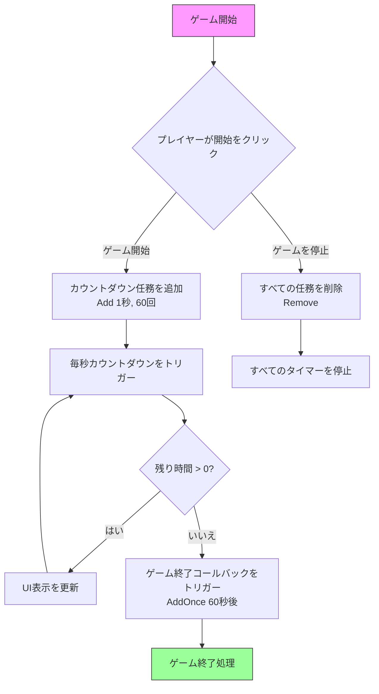

# 使用例

この章ではTimerタイマーコンポーネントの完全な使用例を提供し、Unityプロジェクトで 각종定時任務機能を実際に応用する方法を示します。

## 概要

Timerコンポーネントは完全な定時任務ソリューションを提供し、以下の定時モードをサポートしています：
- **ループ定時任務**：固定間隔で繰り返し実行
- **ワンショット定時任務**：指定時間遅延後に1回実行
- **フレーム更新任務**：毎フレーム実行、継続的な監視が必要なシーンに適合

これらの例は実際のソースコードに基づいており、プロジェクトで直接使用できます。

## 基礎使用例

### ループ定時任務を追加

以下の例は1秒間隔で実行、总计5回実行する定時任務を作成する方法を示します：

```csharp
using GameFrameX.Timer.Runtime;
using UnityEngine;

public class TimerExample : MonoBehaviour
{
    private TimerComponent _timerComponent;

    private void Start()
    {
        // TimerComponentコンポーネントを取得
        _timerComponent = GetComponent<TimerComponent>();

        // 定時任務を追加：間隔1秒、5回実行
        _timerComponent.Add(1f, 5, OnTimerTick, "Hello Timer");
    }

    private void OnTimerTick(object param)
    {
        Debug.Log($"定時任務トリガー、パラメータ: {param}");
    }
}
```
> Source: [TimerComponent.cs](https://github.com/GameFrameX/com.gameframex.unity.timer/blob/main/Runtime/Timer/TimerComponent.cs#L37-L40)

### ワンショット定時任務を追加

`AddOnce`メソッドを使用して遅延実行のワンショット任務を追加します：

```csharp
using GameFrameX.Timer.Runtime;
using UnityEngine;

public class DelayedTaskExample : MonoBehaviour
{
    private TimerComponent _timerComponent;

    private void Start()
    {
        _timerComponent = GetComponent<TimerComponent>();

        // 5秒後に1回実行
        _timerComponent.AddOnce(5f, OnDelayedExecute, "遅延任務完了");
    }

    private void OnDelayedExecute(object param)
    {
        Debug.Log($"遅延任務実行: {param}");
        // ここに遅延後のロジックを実行、例：結果画面を表示など
    }
}
```
> Source: [TimerComponent.cs](https://github.com/GameFrameX/com.gameframex.unity.timer/blob/main/Runtime/Timer/TimerComponent.cs#L48-L51)

### フレーム更新任務を追加

`AddUpdate`を使用して毎フレーム実行する任務を追加します：

```csharp
using GameFrameX.Timer.Runtime;
using UnityEngine;

public class FrameUpdateExample : MonoBehaviour
{
    private TimerComponent _timerComponent;
    private int _frameCount = 0;

    private void Start()
    {
        _timerComponent = GetComponent<TimerComponent>();

        // 毎フレーム1回任務を実行
        _timerComponent.AddUpdate(OnFrameUpdate, null);
    }

    private void OnFrameUpdate(object param)
    {
        _frameCount++;
        if (_frameCount % 60 == 0) // 毎60フレームで1回打印
        {
            Debug.Log($"実行済み {_frameCount} フレーム");
        }
    }
}
```
> Source: [TimerComponent.cs](https://github.com/GameFrameX/com.gameframex.unity.timer/blob/main/Runtime/Timer/TimerComponent.cs#L57-L70)

## 任務のチェックと削除

### 任務是否存在かをチェック

実際の応用では、特定の定時任務がまだ実行中かどうかをチェックする必要がある場合があります：

```csharp
using GameFrameX.Timer.Runtime;
using UnityEngine;

public class CheckTimerExample : MonoBehaviour
{
    private TimerComponent _timerComponent;
    private Action<object> _myTimerCallback;

    private void Start()
    {
        _timerComponent = GetComponent<TimerComponent>();

        // コールバック参照を保存して后续チェックに使用
        _myTimerCallback = OnTimerTick;

        // 定時任務を追加
        _timerComponent.Add(1f, 10, _myTimerCallback, null);

        // 任務是否存在かをチェック
        bool exists = _timerComponent.Exists(_myTimerCallback);
        Debug.Log($"任務是否存在: {exists}");
    }

    private void OnTimerTick(object param)
    {
        Debug.Log("定時任務実行中...");
    }
}
```
> Source: [TimerComponent.cs](https://github.com/GameFrameX/com.gameframex.unity.timer/blob/main/Runtime/Timer/TimerComponent.cs#L77-L80)

### 指定任務を削除

コールバック関数参照を通じて定時任務を削除できます：

```csharp
using GameFrameX.Timer.Runtime;
using UnityEngine;

public class RemoveTimerExample : MonoBehaviour
{
    private TimerComponent _timerComponent;
    private Action<object> _repeatTimerCallback;
    private bool _shouldStop = false;

    private void Start()
    {
        _timerComponent = GetComponent<TimerComponent>();

        // 削除する必要があるコールバックを作成
        _repeatTimerCallback = OnRepeatTick;

        // 無限繰り返しの定時任務を追加
        _timerComponent.Add(1f, 0, _repeatTimerCallback, null);

        // 10秒後に任務を削除
        _timerComponent.AddOnce(10f, OnStopTimer, null);
    }

    private void OnRepeatTick(object param)
    {
        if (_shouldStop) return;
        Debug.Log("繰り返し任務実行中...");
    }

    private void OnStopTimer(object param)
    {
        _shouldStop = true;
        // 定時任務を削除
        _timerComponent.Remove(_repeatTimerCallback);
        Debug.Log("定時任務が削除されました");
    }
}
```
> Source: [TimerComponent.cs](https://github.com/GameFrameX/com.gameframex.unity.timer/blob/main/Runtime/Timer/TimerComponent.cs#L86-L89)

## 完全な使用例

以下はより完全な例であり、ゲーム開発でTimerコンポーネントを実際に応用する方法を示します：

```csharp
using GameFrameX.Timer.Runtime;
using UnityEngine;
using UnityEngine.UI;

public class GameTimerController : MonoBehaviour
{
    [Header("UIコンポーネント")]
    public Text timerText;
    public Button startButton;
    public Button stopButton;

    private TimerComponent _timerComponent;
    private int _remainingSeconds;
    private Action<object> _countdownCallback;
    private Action<object> _gameOverCallback;

    private void Awake()
    {
        _timerComponent = GetComponent<TimerComponent>();

        // コールバック参照を初期化
        _countdownCallback = OnCountdownTick;
        _gameOverCallback = OnGameOver;
    }

    private void Start()
    {
        // ボタンイベントをバインド
        startButton.onClick.AddListener(StartGame);
        stopButton.onClick.AddListener(StopGame);

        UpdateTimerDisplay(0);
    }

    private void StartGame()
    {
        // カウントダウン：毎秒実行、合計60秒
        _remainingSeconds = 60;
        _timerComponent.Add(1f, 60, _countdownCallback, null);

        // ゲーム終了時にトリガー
        _timerComponent.AddOnce(60f, _gameOverCallback, "時間到！");
    }

    private void StopGame()
    {
        // すべての定時任務を停止
        _timerComponent.Remove(_countdownCallback);
        _timerComponent.Remove(_gameOverCallback);
        Debug.Log("ゲームが停止されました");
    }

    private void OnCountdownTick(object param)
    {
        _remainingSeconds--;
        UpdateTimerDisplay(_remainingSeconds);
    }

    private void OnGameOver(object param)
    {
        Debug.Log(param);
        UpdateTimerDisplay(0);
        // ゲーム終了処理ロジック
    }

    private void UpdateTimerDisplay(int seconds)
    {
        if (timerText != null)
        {
            int minutes = seconds / 60;
            int secs = seconds % 60;
            timerText.text = $"{minutes:D2}:{secs:D2}";
        }
    }
}
```

### 任務フローチャート



## 例外処理

TimerManagerはグローバル例外捕獲機能を提供し、定時任務内の例外によるゲームのクラッシュを防止できます：

```csharp
using GameFrameX.Timer.Runtime;
using UnityEngine;

public class ExceptionHandlingExample : MonoBehaviour
{
    private TimerComponent _timerComponent;

    private void Start()
    {
        _timerComponent = GetComponent<TimerComponent>();

        // 例外捕獲を有効化
        TimerManager.CatchCallbackExceptions = true;

        // 例外が発生する可能性がある定時任務を追加
        _timerComponent.Add(2f, 3, OnRiskyTask, null);
    }

    private void OnRiskyTask(object param)
    {
        // 発生する可能性のある例外をシミュレート
        if (Random.value > 0.5f)
        {
            throw new System.Exception("シミュレートされた定時任務例外");
        }
        Debug.Log("任務安全に実行");
    }
}
```
> Source: [TimerManager.cs](https://github.com/GameFrameX/com.gameframex.unity.timer/blob/main/Runtime/Timer/TimerManager.cs#L43)

## パラメータ渡し例

すべての定時任務はパラメータ渡りをサポートしており、コールバックで受け取れます：

```csharp
using GameFrameX.Timer.Runtime;
using UnityEngine;

public class ParameterExample : MonoBehaviour
{
    private TimerComponent _timerComponent;

    private void Start()
    {
        _timerComponent = GetComponent<TimerComponent>();

        // カスタムパラメータオブジェクトを渡す
        var gameData = new GameTimerData
        {
            levelId = 1,
            score = 1000
        };

        _timerComponent.Add(1f, 5, OnGameTimerTick, gameData);
    }

    private void OnGameTimerTick(object param)
    {
        if (param is GameTimerData data)
        {
            Debug.Log($"レベル: {data.levelId}, スコア: {data.score}");
            data.score += 100;
        }
    }
}

public class GameTimerData
{
    public int levelId;
    public int score;
}
```
> Source: [TimerComponent.cs](https://github.com/GameFrameX/com.gameframex.unity.timer/blob/main/Runtime/Timer/TimerComponent.cs#L37-L40)

## 使用シーン一覧

| シーン | 推奨メソッド | 説明 |
|------|----------|------|
| 定时 свежи данных | Add | 固定間隔でループ実行 |
| 遅延実行 | AddOnce | 指定時間遅延後に1回実行 |
| 毎フレーム検出 | AddUpdate | 入力検出、ステータス監視に適合 |
| カウントダウン機能 | Add + AddOnce | ループでカウントダウンを表示、終了時に終了コールバックをトリガー |
| スキルクールダウン | Add | クールダウン時間を定期的にチェック |
| アニメーション再生 | AddOnce | 遅延再生またはシーケンスフレームアニメーション |

## 関連リンク

- [Timerコンポーネント紹介](../1-overview.introduction)
- [機能特性](../1-overview.features)
- [タイマータスク追加](../4-core-functions.add-timer)
- [ワンショット任務追加](../4-core-functions.add-once)
- [フレーム更新任務追加](../4-core-functions.add-update)
- [任務チェックと削除](../4-core-functions.exists-remove)
- [TimerComponent APIリファレンス](../5-api-reference.timer-component)
- [ITimerManager APIリファレンス](../5-api-reference.itimer-manager)
- [TimerManager APIリファレンス](../5-api-reference.timer-manager)
- [よくある質問](../7-troubleshooting)
