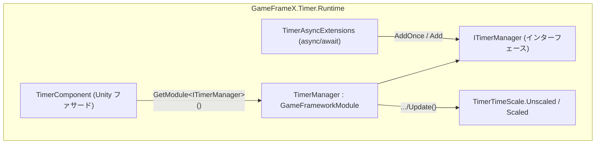

# 概要:GameFrameX Timer でできること

GameFrameX Timer は Unity の軽量なタイマー/タスクスケジューリングモジュールです。1 行のコードで遅延呼び出し、繰り返し呼び出し、毎フレーム更新、async/await 待機を登録でき、ID/コールバック/タグによるライフサイクル管理をサポートし、一時停止/再開、残り時間の照会、timeScale 互換モードを提供します。ランタイムの中核は `TimerManager`(モジュール実装)、`TimerComponent`(Unity コンポーネントのファサード)、`TimerAsyncExtensions`(async 拡張)で構成されます。

## クイックスタート

1. プロジェクトに本パッケージ(`com.gameframex.unity.timer`)がインストール済みであることを確認します。アセンブリは `GameFrameX.Timer.Runtime` です。
2. シーンに GameFrameX の基本コンポーネントが既に存在する場合、`TimerComponent` は `GameFrameworkEntry.GetModule<ITimerManager>()` を通じて自動的にマネージャーを取得します。メニュー `GameFrameX/Timer` から手動でアタッチすることもできます(`[DisallowMultipleComponent]` が付与されており、シーン内で 1 つのみ許可されます)。

   ```csharp
   // TimerComponent.Awake の組み立てロジック
   [DisallowMultipleComponent]
   [AddComponentMenu("GameFrameX/Timer")]
   [GameFrameXAutoComponent(-5000)]
   public class TimerComponent : GameFrameworkComponent
   {
       ITimerManager _timerManager;

       protected override void Awake()
       {
           ImplementationComponentType = Utility.Assembly.GetType(componentType);
           InterfaceComponentType = typeof(ITimerManager);
           base.Awake();
           _timerManager = GameFrameworkEntry.GetModule<ITimerManager>();
           if (_timerManager == null)
           {
               Log.Fatal("Timer manager is invalid.");
               return;
           }
       }
   }
   ```

   ソース: [Runtime/Timer/TimerComponent.cs](https://github.com/GameFrameX/com.gameframex.unity.timer/blob/main/Runtime/Timer/TimerComponent.cs#L12-L31)

3. 業務スクリプトで `TimerComponent` を取得し、最初のタイマーを登録します:

   ```csharp
   // 3 秒後に 1 回実行し、パラメータを 1 つ渡す
   int id = timerComponent.AddOnce(3f, param => Debug.Log($"done: {param}"), "hello");

   // 1 秒ごとに 5 回繰り返す。タグを付けて一括管理しやすくする。Unscaled は Time.timeScale の影響を受けないことを示す
   timerComponent.Add(1f, 5, _ => Debug.Log("tick"), null, "battle", TimerTimeScale.Unscaled, onComplete: () => Debug.Log("finished"));
   ```

4. 必要に応じてタイマーを管理します:

   ```csharp
   timerComponent.Pause(id);      // 一時停止(停止中は時間が蓄積されない)
   timerComponent.Resume(id);     // 再開
   float left = timerComponent.GetRemaining(id); // 残り秒数。存在しない場合は -1 を返す
   timerComponent.Remove(id);     // ID で削除
   timerComponent.RemoveByTag("battle"); // タグで一括削除
   ```

   上記の API はいずれも `TimerComponent` 上の実際のシグネチャです(例: `public int Add(float interval, int repeat, Action<object> callback, object callbackParam = null, string tag = null, TimerTimeScale timeScale = TimerTimeScale.Unscaled, Action onComplete = null))。詳細は [Runtime/Timer/TimerComponent.cs](https://github.com/GameFrameX/com.gameframex.unity.timer/blob/main/Runtime/Timer/TimerComponent.cs#L44-L69) を参照してください。

## 機能早見表

| 機能 | エントリ API | 説明 |
|------|----------|------|
| 遅延 1 回実行 | `AddOnce(interval, callback, callbackParam)` | 時間に到達すると 1 回実行された後、自動的に削除 |
| 繰り返し呼び出し | `Add(interval, repeat, callback, ...)` | `repeat = 0` は無限繰り返しを表す |
| 毎フレーム更新 | `AddUpdate(callback)` / `AddUpdate(callback, callbackParam)` | interval を 0 とみなし、毎フレーム発火 |
| async 待機 | `WaitForSecondsAsync` / `WaitForNextFrameAsync` / `WaitForFramesAsync` | メインスレッドで完了、`CancellationToken` 対応 |
| 一時停止/再開 | `Pause(id)` / `Resume(id)` / `IsPaused(id)` | タグでの操作も可能:`PauseByTag` / `ResumeByTag` |
| 状態照会 | `Exists(id|callback)` / `HasTag(tag)` / `GetRemaining` / `GetElapsed` / `GetRepeatLeft` | タイマーが存在しない場合、数値は `-1` を返す |
| 一括削除 | `Remove(id|callback)` / `RemoveByTag(tag)` | 完了時に `onComplete` を発火 |
| タイムスケール | `TimerTimeScale.Unscaled` / `Scaled` | デフォルトは `Unscaled`(`Time.timeScale` の影響を受けない)|

## 動作原理の概要



毎フレーム、`TimerManager.Update(elapseSeconds, realElapseSeconds)` はロック内でタイマー項目を走査します。`TimeScaleMode` に応じて `elapseSeconds`(Scaled)または `realElapseSeconds`(Unscaled)を加算します。`interval <= 0` の項目は毎フレーム発火とみなされます。期限が到来した項目のコールバックは、まず `_pendingCallbacks` リストに収集され、その後一括でディスパッチされます。これにより、辞書の走査中にコレクションが変更されるのを防いでいます。データ構造としては、`Dictionary<Action<object>, TimerItem>` でアクティブな項目を保持し、`Dictionary<int, Action<object>>` で ID マッピングを、`Dictionary<string, List<int>>` でタグインデックスを実現し、`Stack<TimerItem>` で項目をプールして再利用します。詳細は [Runtime/Timer/TimerManager.cs](https://github.com/GameFrameX/com.gameframex.unity.timer/blob/main/Runtime/Timer/TimerManager.cs#L42-L49) を参照してください。

`TimerTimeScale` は 2 値の列挙型です。`Unscaled = 0` がデフォルト値で、既存の動作と互換性があります。`Scaled = 1` の場合のみ `UnityEngine.Time.timeScale` の影響を受けます。詳細は [Runtime/Timer/TimerTimeScale.cs](https://github.com/GameFrameX/com.gameframex.unity.timer/blob/main/Runtime/Timer/TimerTimeScale.cs#L6-L13) を参照してください。

## 次のステップ

- タイマーの作成/削除/一時停止に関する完全なパラメータ説明とよくあるバリエーションは、タスクページ「タイマーの使い方」を参照してください。
- async/await の使用方法(`WaitForSecondsAsync` など 3 つの拡張の実装は [Runtime/Timer/TimerAsyncExtensions.cs](https://github.com/GameFrameX/com.gameframex.unity.timer/blob/main/Runtime/Timer/TimerAsyncExtensions.cs#L20-L37) を参照)。
- タイマーが発火しない、コールバック引数が失われるなどの問題の切り分けについては、トラブルシューティングページ「タイマーが動作しない場合の対処法」を参照してください。
- エディタ拡張(Inspector デバッグビュー)は [Editor/Inspector/TimerComponentInspector.cs](https://github.com/GameFrameX/com.gameframex.unity.timer/blob/main/Editor/Inspector/TimerComponentInspector.cs) を参照してください。
- バージョン履歴は [CHANGELOG.md](https://github.com/GameFrameX/com.gameframex.unity.timer/blob/main/CHANGELOG.md) を参照してください。