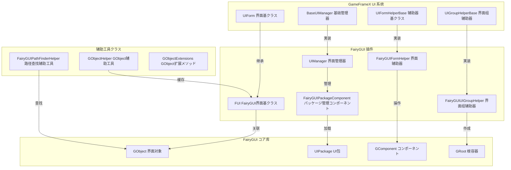

# 插件介绍

GameFrameX 的 UI FairyGUI コンポーネント是 GameFrameX フレームワーク的官方 UI 扩展插件，专门为 Unity プロジェクト提供 FairyGUI 界面系统的集成サポート。该插件封装了 FairyGUI 的コア機能，使其能够无缝接入 GameFrameX 的 UI 管理子系统，実装界面的加载、显示、隐藏、层级管理等完整生命周期管理。

## 概要

FairyGUI 是一款機能强大的 Unity 跨平台 UI 编辑器，相比传统的代码编写 UI 方法，FairyGUI 提供します可视化的 UI 编辑器，サポート多平台导出（iOS、Android、Windows、Web 等），并且具有高性能的渲染效率。GameFrameX UI FairyGUI コンポーネント在此基础上，提供します与 GameFrameX フレームワーク其他模块（如リソース管理、イベント系统、オブジェクトプール等）的深度集成，使開発者能够更高效地开发基づく FairyGUI 的ゲーム界面。

该插件的コア设计理念是将 FairyGUI 的界面对象（GObject）与 GameFrameX 的界面抽象（IUIForm）进行桥接，既保留了 FairyGUI 强大的 UI 编辑能力，又充分利用了 GameFrameX フレームワーク提供的统一界面管理机制。を通じて本插件，開発者可能実装界面的异步加载、オブジェクトプール复用、自动リソース释放、界面组层级管理等機能。

## アーキテクチャ設計



如上图所示，插件的アーキテクチャ設計遵循了清晰的层次划分。最上层是 GameFrameX フレームワーク定义的 UI 系统インターフェース层，包括界面基クラス、界面管理器基クラス、界面辅助器基クラス和界面组辅助器基クラス。这些抽象インターフェース定义了 UI 系统的标准行为和扩展点。

中间层是 FairyGUI 插件的具体実装层。`FUI` クラスを継承 GameFrameX 的 `UIForm` 基クラス，実装了 FairyGUI 特定的界面機能；`UIManager` を継承 `BaseUIManager`，実装了界面的打开和关闭逻辑；`FairyGUIFormHelper` を継承 `UIFormHelperBase`，负责界面的インスタンス化、作成和释放；`FairyGUIUIGroupHelper` を継承 `UIGroupHelperBase`，负责界面组的作成和深度管理。

最底层是 FairyGUI 的コア库，包括 GObject、UIPackage、GComponent 和 GRoot 等クラス，这些是 FairyGUI 提供的底层 UI 对象和容器。插件を通じて与这些底层クラス的交互，実装了完整的 UI 機能。

此外，插件还提供します多个辅助工具クラス，包括 `GObjectHelper`（に使用 FUI 对象的缓存和管理）、`FairyGUIPathFinderHelper`（に使用 UI 对象路径的查找和解析）和 `GObjectExtensions`（GObject 的扩展メソッド）。

## コアコンポーネント

### FUI 界面基クラス

`FUI` 是所有 FairyGUI 界面的基クラス，を継承 GameFrameX 的 `UIForm` 基クラス。它封装了 FairyGUI 的 GObject，提供します界面显示、隐藏、可见性ステータス管理等コア機能。

```csharp
public class FUI : UIForm
{
    public GObject GObject { get; private set; }
    public Action<bool> OnVisibleChanged { get; set; }
    
    public override void Show(IUIFormShowHandler handler, Action complete);
    public override void Hide(IUIFormHideHandler handler, Action complete);
    protected override void InternalSetVisible(bool value);
    public override bool Visible { get; protected set; }
    protected override void MakeFullScreen();
    
    public FUI(GObject gObject, bool isRoot = false);
    public void SetGObject(GObject gObject);
}
```

> Source: [FUI.cs](https://github.com/GameFrameX/com.gameframex.unity.ui.fairygui/blob/main/Runtime/FUI.cs#L42-L197)

### UIManager 界面管理器

`UIManager` 负责管理所有界面的生命周期，包括界面的打开、关闭、加载、卸载等操作。它を継承 `BaseUIManager`，実装了 GameFrameX 定义的 UI 管理インターフェース。

```csharp
internal sealed partial class UIManager : BaseUIManager
{
    private FairyGUIPackageComponent FairyGuiPackage { get; set; }
    
    public override void SetResourceManager(IAssetManager assetManager);
}
```

> Source: [UIManager.cs](https://github.com/GameFrameX/com.gameframex.unity.ui.fairygui/blob/main/Runtime/UIManager.cs#L43-L93)

### FairyGUIPackageComponent パッケージ管理コンポーネント

`FairyGUIPackageComponent` 是 FairyGUI パッケージ管理コンポーネント，负责管理所有 UI 包的加载、缓存和卸载。它は Unity コンポーネント，可能挂载到ゲーム对象上。

```csharp
public sealed class FairyGUIPackageComponent : GameFrameworkComponent
{
    private readonly Dictionary<string, UIPackageData> m_UILoadedPackages = new Dictionary<string, UIPackageData>(32);
    private readonly Dictionary<string, TaskCompletionSource<UIPackage>> m_UIPackageLoading = new Dictionary<string, TaskCompletionSource<UIPackage>>(32);
    
    public Task<UIPackage> AddPackageAsync(string descFilePath, bool isLoadAsset = true);
    public void AddPackageSync(string descFilePath, bool isLoadAsset = true);
    public void RemovePackage(string packageName);
    public void RemoveAllPackages();
    public bool Has(string uiPackageName);
    public UIPackage Get(string uiPackageName);
}
```

> Source: [FairyGUIPackageComponent.cs](https://github.com/GameFrameX/com.gameframex.unity.ui.fairygui/blob/main/Runtime/FairyGUIPackageComponent.cs#L48-L307)

### FairyGUIFormHelper 界面辅助器

`FairyGUIFormHelper` を継承 `UIFormHelperBase`，负责界面的インスタンス化、作成和释放。它是连接 GameFrameX UI 系统和 FairyGUI コア库的桥梁。

```csharp
public class FairyGUIFormHelper : UIFormHelperBase
{
    public override object InstantiateUIForm(object uiFormAsset);
    public override IUIForm CreateUIForm(object uiFormInstance, Type uiFormType, object userData);
    public override void ReleaseUIForm(object uiFormAsset, object uiFormInstance, object assetHandle, string uiFormAssetPath, string uiFormAssetName);
}
```

> Source: [FairyGUIFormHelper.cs](https://github.com/GameFrameX/com.gameframex.unity.ui.fairygui/blob/main/Runtime/FairyGUIFormHelper.cs#L47-L232)

### FairyGUIUIGroupHelper 界面组辅助器

`FairyGUIUIGroupHelper` を継承 `UIGroupHelperBase`，负责界面组的作成和深度管理。它使用 FairyGUI 的 GComponent 来実装界面组的容器機能。

```csharp
public sealed class FairyGUIUIGroupHelper : UIGroupHelperBase
{
    public override int Depth { get; protected set; }
    public override void SetDepth(int depth);
    public override IUIGroupHelper Handler(Transform root, string groupName, string uiGroupHelperTypeName, IUIGroupHelper customUIGroupHelper, int depth = 0);
}
```

> Source: [FairyGUIUIGroupHelper.cs](https://github.com/GameFrameX/com.gameframex.unity.ui.fairygui/blob/main/Runtime/FairyGUIUIGroupHelper.cs#L43-L97)

### GObjectHelper 辅助工具クラス

`GObjectHelper` は静态辅助クラス，提供 FUI 对象的缓存和管理機能。を通じて它可能実装 GObject 到 FUI 的映射和查找。

```csharp
public static class GObjectHelper
{
    private static readonly Dictionary<GObject, FUI> s_GObjectToFuiMap = new Dictionary<GObject, FUI>();
    
    public static void ClearAll();
    public static T Get<T>(this GObject self) where T : FUI;
    public static void Add(this GObject self, FUI fui);
    public static FUI Remove(this GObject self);
}
```

> Source: [GObjectHelper.cs](https://github.com/GameFrameX/com.gameframex.unity.ui.fairygui/blob/main/Runtime/GObjectHelper.cs#L42-L115)

### FairyGUIPathFinderHelper 路径查找辅助工具

`FairyGUIPathFinderHelper` 提供 UI 对象路径的查找和解析機能，サポートを通じて路径字符串快速定位 UI 元素。

```csharp
public static class FairyGUIPathFinderHelper
{
    public static string GetUIPath(GObject o);
    public static GObject GetUIFromPath(string path);
    public static bool SearchPathInclude(string path, GObject gObject);
}

public static class GObjectExtensions
{
    public static string GetUIPath(this GObject self);
}
```

> Source: [FairyGUIPathFinderHelper.cs](https://github.com/GameFrameX/com.gameframex.unity.ui.fairygui/blob/main/Runtime/FairyGUIPathFinderHelper.cs#L43-L278)

## 界面打开フロー

```mermaid
sequenceDiagram
    participant Client as 客户端代码
    participant UIMgr as UIManager
    party Package as FairyGUIPackageComponent
    party FormHelper as FairyGUIFormHelper
    party FUI as FUI界面
    party GComp as GComponent

    Client->>UIMgr: OpenUIFormAsync()
    UIMgr->>UIMgr: InnerOpenUIFormAsync()
    
    alt オブジェクトプール存在
        UIMgr->>UIMgr: 从オブジェクトプール取得
    else オブジェクトプール不存在
        UIMgr->>Package: 检查UI包是否已加载
        alt 包未加载
            alt 同步加载
                Package->>Package: AddPackageSync()
            else 异步加载
                Package->>Package: AddPackageAsync()
            end
        end
        
        UIMgr->>FormHelper: InstantiateUIForm()
        FormHelper->>GComp: UIPackage.CreateObject()
        GComp-->>FormHelper: 返回GComponentインスタンス
    end
    
    FormHelper->>FUI: CreateUIForm()
    
    alt 界面クラス型标记
        FUI->>FUI: 应用ShowAnimationプロパティ
        FUI->>FUI: 应用HideAnimationプロパティ
    end
    
    FUI->>GComp: AddChild()
    FUI->>FUI: OnOpen()
    FUI->>FUI: BindEvent()
    FUI->>FUI: LoadData()
    
    alt 启用显示动画
        FUI->>FUI: Show()
    end
    
    UIMgr-->>Client: 返回IUIFormインスタンス
```

如上图所示，界面的打开フロー涉及多个コンポーネント的协作。当客户端呼び出し `OpenUIFormAsync` メソッド打开界面时，UIManager 首先检查オブジェクトプール中是否存在可复用的界面インスタンス。如果存在，直接从オブジェクトプール取得；如果不存在，则进入加载フロー。

在加载フロー中，UIManager 会先检查 FairyGUI 包是否已经加载。如果没有加载，に基づいて配置选择同步或异步方法加载 UI 包。包加载完成后，を通じて FairyGUIFormHelper 作成界面インスタンス。

界面インスタンス作成完成后，会进行一系列初期化操作，包括应用界面组、应用动画プロパティ、绑定イベント、加载数据等。最后，如果启用了显示动画，会执行动画效果。

## リソース管理策略

插件采用多种リソース管理策略来优化内存使用和加载性能：

1. **包缓存机制**：FairyGUIPackageComponent 维护已加载包的缓存，避免重复加载相同的 UI 包。

2. **オブジェクトプール复用**：UIManager 使用オブジェクトプール管理界面インスタンス，关闭的界面不会立即销毁，而是回收到オブジェクトプール中供下次打开时复用。

3. **异步リソース加载**：サポート异步加载 UI 包和界面リソース，避免阻塞主线程。

4. **自动リソース释放**：当界面关闭且不再必要时，辅助器会自动释放関連的リソース句柄。

## 与 GameFrameX フレームワーク的集成

插件深度集成了 GameFrameX フレームワーク的多个コア模块：

- **リソース管理**：を通じて IAssetManager インターフェース加载界面リソース，サポート YooAsset リソース系统
- **イベント系统**：を通じて EventSubscriber 发布界面可见性变化イベント
- **参照プール**：使用 ReferencePool 管理临时对象，减少 GC 压力
- **路径助手**：使用 PathHelper 处理リソース路径

## 関連リンク

- [機能特性](./1-overview.2-features)
- [システム要件](./1-overview.3-requirements)
- [安装指南](../2-installation.1-install-methods)
- [依赖配置](../2-installation.2-dependencies)
- [FUI 界面基クラス](../4-core-concepts.1-fui-base-class)
- [界面管理器](../4-core-concepts.2-ui-manager)
- [パッケージ管理器](../4-core-concepts.3-package-manager)
- [界面辅助器](../4-core-concepts.4-form-helper)
- [界面组辅助器](../4-core-concepts.5-ui-group-helper)
