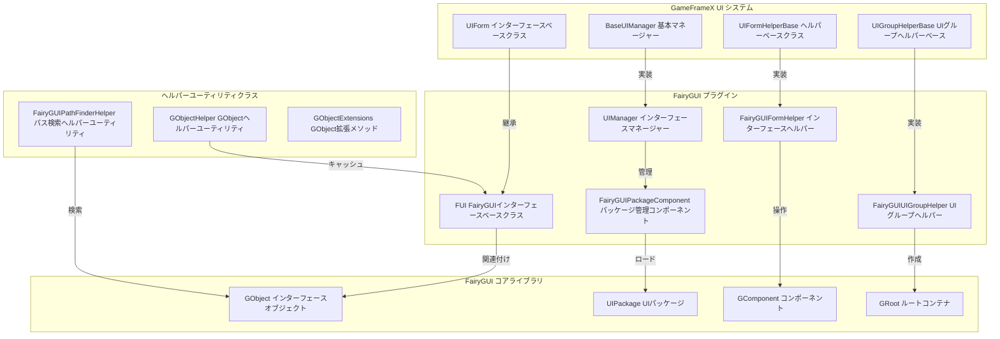

# プラグイン紹介

GameFrameX の UI FairyGUI コンポーネントは、GameFrameX フレームワークの公式 UI 拡張プラグインであり、Unity プロジェクト向けに FairyGUI インターフェースシステムの統合サポートを提供します。このプラグインは FairyGUI のコア機能をラップし、GameFrameX の UI 管理サブシステムにシームレスに統合し、インターフェースのロード、表示、非表示、レイヤー管理などの完全なライフサイクル管理を実現します。

## 概要

FairyGUI は、Unity 向けの強力なクロスプラットフォーム UI エディターです。従来のコード記述による UI 作成方法と比較して、FairyGUI はビジュアル UI エディターを提供し、複数のプラットフォームへのエクスポート（iOS、Android、Windows、Web など）をサポートし、高いパフォーマンスのレンダリング効率を持っています。GameFrameX UI FairyGUI コンポーネントは、この基盤の上に、GameFrameX フレームワークの他のモジュール（リソース管理、イベントシステム、オブジェクトプールなど）との深い統合を提供し、FairyGUI ベースのゲームインターフェースを効率的に開発できるようにします。

このプラグインのコア設計理念は、FairyGUI のインターフェースオブジェクト（GObject）と GameFrameX のインターフェース抽象（IUIForm）をブリッジすることです。FairyGUI の強力な UI 編集能力を保持しながら、GameFrameX フレームワークが提供する統一されたインターフェース管理メカニズムを十分に活用します。このプラグインを通じて、開発者はインターフェースの非同期ロード、オブジェクトプール再利用、自動リソース解放、インターフェースグループレイヤー管理などの機能を実装できます。

## アーキテクチャ設計



上記の図に示すように、プラグインのアーキテクチャ設計は明確なレイヤー分割に従っています。最上位層は、GameFrameX フレームワークが定義する UI システムインターフェース層であり、インターフェースベースクラス、インターフェースマネージャーベースクラス、インターフェースヘルパーベースクラス、インターフェースグループヘルパーベースクラスを含みます。これらの抽象インターフェースは、UI システムの標準動作と拡張ポイントを定義します。

中間層は、FairyGUI プラグインの具体的な実装層です。`FUI` クラスは GameFrameX の `UIForm` ベースクラスを継承し、FairyGUI 固有のインターフェース機能を実装します。`UIManager` は `BaseUIManager` を継承し、インターフェースのオープンとクローズロジックを実装します。`FairyGUIFormHelper` は `UIFormHelperBase` を継承し、インターフェースのインスタンス化、作成、解放を担当します。`FairyGUIUIGroupHelper` は `UIGroupHelperBase` を継承し、インターフェースグループの作成と深い管理を担当します。

最下位層は FairyGUI のコアライブラリであり、GObject、UIPackage、GComponent、GRoot などのクラスを含みます。これらは FairyGUI が提供する下位層の UI オブジェクトとコンテナです。プラグインはこれらの下位クラスとの相互作用を通じて、完全な UI 機能を実装します。

さらに、プラグインは `GObjectHelper`（FUI オブジェクトのキャッシュと管理用）、`FairyGUIPathFinderHelper`（UI オブジェクトパスの検索と解析用）、`GObjectExtensions`（GObject の拡張メソッド）などの複数のヘルパーユーティリティクラスを提供します。

## コアコンポーネント

### FUI インターフェースベースクラス

`FUI` はすべての FairyGUI インターフェースのベースクラスであり、GameFrameX の `UIForm` ベースクラスを継承します。FairyGUI の GObject をラップし、インターフェース表示、非表示、可視性状態管理などのコア機能を提供します。

```csharp
public class FUI : UIForm
{
    public GObject GObject { get; private set; }
    public Action<bool> OnVisibleChanged { get; set; }

    public override void Show(IUIFormShowHandler handler, Action complete);
    public override void Hide(IUIFormHideHandler handler, Action complete);
    protected override void InternalSetVisible(bool value);
    public override bool Visible { get; protected set; }
    protected override void MakeFullScreen();

    public FUI(GObject gObject, bool isRoot = false);
    public void SetGObject(GObject gObject);
}
```

> Source: [FUI.cs](https://github.com/GameFrameX/com.gameframex.unity.ui.fairygui/blob/main/Runtime/FUI.cs#L42-L197)

### UIManager インターフェースマネージャー

`UIManager` はすべてのインターフェースのライフサイクルを管理し、インターフェースのオープン、クローズ、ロード、アンロードなどの操作を担当します。GameFrameX が定義する UI 管理インターフェースを実装する `BaseUIManager` を継承します。

```csharp
internal sealed partial class UIManager : BaseUIManager
{
    private FairyGUIPackageComponent FairyGuiPackage { get; set; }

    public override void SetResourceManager(IAssetManager assetManager);
}
```

> Source: [UIManager.cs](https://github.com/GameFrameX/com.gameframex.unity.ui.fairygui/blob/main/Runtime/UIManager.cs#L43-L93)

### FairyGUIPackageComponent パッケージ管理コンポーネント

`FairyGUIPackageComponent` は FairyGUI パッケージ管理コンポーネントであり、すべての UI パッケージのロード、キャッシュ、アンロードを管理します。Unity コンポーネントであり、ゲームオブジェクトにアタッチできます。

```csharp
public sealed class FairyGUIPackageComponent : GameFrameworkComponent
{
    private readonly Dictionary<string, UIPackageData> m_UILoadedPackages = new Dictionary<string, UIPackageData>(32);
    private readonly Dictionary<string, TaskCompletionSource<UIPackage>> m_UIPackageLoading = new Dictionary<string, TaskCompletionSource<UIPackage>>(32);

    public Task<UIPackage> AddPackageAsync(string descFilePath, bool isLoadAsset = true);
    public void AddPackageSync(string descFilePath, bool isLoadAsset = true);
    public void RemovePackage(string packageName);
    public void RemoveAllPackages();
    public bool Has(string uiPackageName);
    public UIPackage Get(string uiPackageName);
}
```

> Source: [FairyGUIPackageComponent.cs](https://github.com/GameFrameX/com.gameframex.unity.ui.fairygui/blob/main/Runtime/FairyGUIPackageComponent.cs#L48-L307)

### FairyGUIFormHelper インターフェースヘルパー

`FairyGUIFormHelper` は `UIFormHelperBase` を継承し、インターフェースのインスタンス化、作成、解放を担当します。GameFrameX UI システムと FairyGUI コアライブラリの橋渡し役です。

```csharp
public class FairyGUIFormHelper : UIFormHelperBase
{
    public override object InstantiateUIForm(object uiFormAsset);
    public override IUIForm CreateUIForm(object uiFormInstance, Type uiFormType, object userData);
    public override void ReleaseUIForm(object uiFormAsset, object uiFormInstance, object assetHandle, string uiFormAssetPath, string uiFormAssetName);
}
```

> Source: [FairyGUIFormHelper.cs](https://github.com/GameFrameX/com.gameframex.unity.ui.fairygui/blob/main/Runtime/FairyGUIFormHelper.cs#L47-L232)

### FairyGUIUIGroupHelper UIグループヘルパー

`FairyGUIUIGroupHelper` は `UIGroupHelperBase` を継承し、UI グループの作成と深い管理を担当します。FairyGUI の GComponent を使用して UI グループのコンテナ機能を実装します。

```csharp
public sealed class FairyGUIUIGroupHelper : UIGroupHelperBase
{
    public override int Depth { get; protected set; }
    public override void SetDepth(int depth);
    public override IUIGroupHelper Handler(Transform root, string groupName, string uiGroupHelperTypeName, IUIGroupHelper customUIGroupHelper, int depth = 0);
}
```

> Source: [FairyGUIUIGroupHelper.cs](https://github.com/GameFrameX/com.gameframex.unity.ui.fairygui/blob/main/Runtime/FairyGUIUIGroupHelper.cs#L43-L97)

### GObjectHelper ヘルパーユーティリティクラス

`GObjectHelper` は静的ヘルパークラスであり、FUI オブジェクトのキャッシュと管理機能を提供します。これを通じて、GObject から FUI へのマッピングと検索を実装できます。

```csharp
public static class GObjectHelper
{
    private static readonly Dictionary<GObject, FUI> s_GObjectToFuiMap = new Dictionary<GObject, FUI>();

    public static void ClearAll();
    public static T Get<T>(this GObject self) where T : FUI;
    public static void Add(this GObject self, FUI fui);
    public static FUI Remove(this GObject self);
}
```

> Source: [GObjectHelper.cs](https://github.com/GameFrameX/com.gameframex.unity.ui.fairygui/blob/main/Runtime/GObjectHelper.cs#L42-L115)

### FairyGUIPathFinderHelper パス検索ヘルパーユーティリティ

`FairyGUIPathFinderHelper` は UI オブジェクトパスの検索と解析機能を提供し、パス文字列を通じて UI 要素を迅速に検索することをサポートします。

```csharp
public static class FairyGUIPathFinderHelper
{
    public static string GetUIPath(GObject o);
    public static GObject GetUIFromPath(string path);
    public static bool SearchPathInclude(string path, GObject gObject);
}

public static class GObjectExtensions
{
    public static string GetUIPath(this GObject self);
}
```

> Source: [FairyGUIPathFinderHelper.cs](https://github.com/GameFrameX/com.gameframex.unity.ui.fairygui/blob/main/Runtime/FairyGUIPathFinderHelper.cs#L43-L278)

## インターフェースオープンフロー

```mermaid
sequenceDiagram
    participant Client as クライアントコード
    participant UIMgr as UIManager
    party Package as FairyGUIPackageComponent
    party FormHelper as FairyGUIFormHelper
    party FUI as FUIインターフェース
    party GComp as GComponent

    Client->>UIMgr: OpenUIFormAsync()
    UIMgr->>UIMgr: InnerOpenUIFormAsync()

    alt オブジェクトプール存在
        UIMgr->>UIMgr: オブジェクトプールから取得
    else オブジェクトプール不存在
        UIMgr->>Package: UIパッケージがロード済みかチェック
        alt パッケージ未ロード
            alt 同期ロード
                Package->>Package: AddPackageSync()
            else 非同期ロード
                Package->>Package: AddPackageAsync()
            end
        end

        UIMgr->>FormHelper: InstantiateUIForm()
        FormHelper->>GComp: UIPackage.CreateObject()
        GComp-->>FormHelper: GComponent インスタンスを返す
    end

    FormHelper->>FUI: CreateUIForm()

    alt インターフェースタイプマーキング
        FUI->>FUI: ShowAnimationプロパティを適用
        FUI->>FUI: HideAnimationプロパティを適用
    end

    FUI->>GComp: AddChild()
    FUI->>FUI: OnOpen()
    FUI->>FUI: BindEvent()
    FUI->>FUI: LoadData()

    alt 表示アニメーション有効
        FUI->>FUI: Show()
    end

    UIMgr-->>Client: IUIForm インスタンスを返す
```

上記の図に示すように、インターフェースのオープフローには複数のコンポーネントの協力が必要です。クライアントが `OpenUIFormAsync` メソッドを呼び出してインターフェースを開くとき、UIManager は最初にオブジェクトプールに再利用可能なインターフェースインスタンスがあるかチェックします。存在する場合は、オブジェクトプールから直接取得します。存在しない場合は、ロードフローに移ります。

ロードフローでは、UIManager は最初に FairyGUI パッケージがすでにロードされているかチェックします。ロードされていない場合は、設定に基づいて同期または非同期方式で UI パッケージをロードします。パッケージのロード完了後、FairyGUIFormHelper を使用してインターフェースインスタンスを作成します。

インターフェースインスタンスの作成完了後、一連の初期化操作が実行されます。これには、インターフェースグループの適用、アニメーションプロパティの適用、イベントバインディング、データのロードなどが含まれます。最後に、表示アニメーションが有効な場合、アニメーション効果が実行されます。

## リソース管理戦略

プラグインはメモリ使用量とロードパフォーマンスを最適化するために、複数のリソース管理戦略を採用しています：

1. **パッケージキャッシュメカニズム**：FairyGUIPackageComponent はロード済みパッケージのキャッシュを維持し、同じ UI パッケージの重複ロードを避けます。

2. **オブジェクトプール再利用**：UIManager はオブジェクトプールを使用してインターフェースインスタンスを管理し、クローズされたインターフェースは即座に破棄されるのではなく、オブジェクトプールに回収され、次回のオープン時に再利用されます。

3. **非同期リソースロード**：UI パッケージとインターフェースリソースの非同期ロードをサポートし、メインスレッドのブロックを避けます。

4. **自動リソース解放**：インターフェースがクローズされ、不要になった場合、ヘルパーは自動的に関連するリソースハンドルを解放します。

## GameFrameX フレームワークとの統合

プラグインは GameFrameX フレームワークの複数のコアルモジュールと深く統合されています：

- **リソース管理**：IAssetManager インターフェースを通じてインターフェースリソースをロードし、YooAsset リソースシステムをサポート
- **イベントシステム**：EventSubscriber を通じてインターフェース可視性変化イベントを発行
- **参照プール**：ReferencePool を使用して一時オブジェクトを管理し、GC 圧力を軽減
- **パスヘルパー**：PathHelper を使用してリソースパスを処理

## 関連リンク

- [機能特性](./1-overview.2-features)
- [システム要件](./1-overview.3-requirements)
- [インストールガイド](../2-installation.1-install-methods)
- [依存関係設定](../2-installation.2-dependencies)
- [FUI インターフェースベースクラス](../4-core-concepts.1-fui-base-class)
- [インターフェースマネージャー](../4-core-concepts.2-ui-manager)
- [パッケージマネージャー](../4-core-concepts.3-package-manager)
- [インターフェースヘルパー](../4-core-concepts.4-form-helper)
- [UIグループヘルパー](../4-core-concepts.5-ui-group-helper)