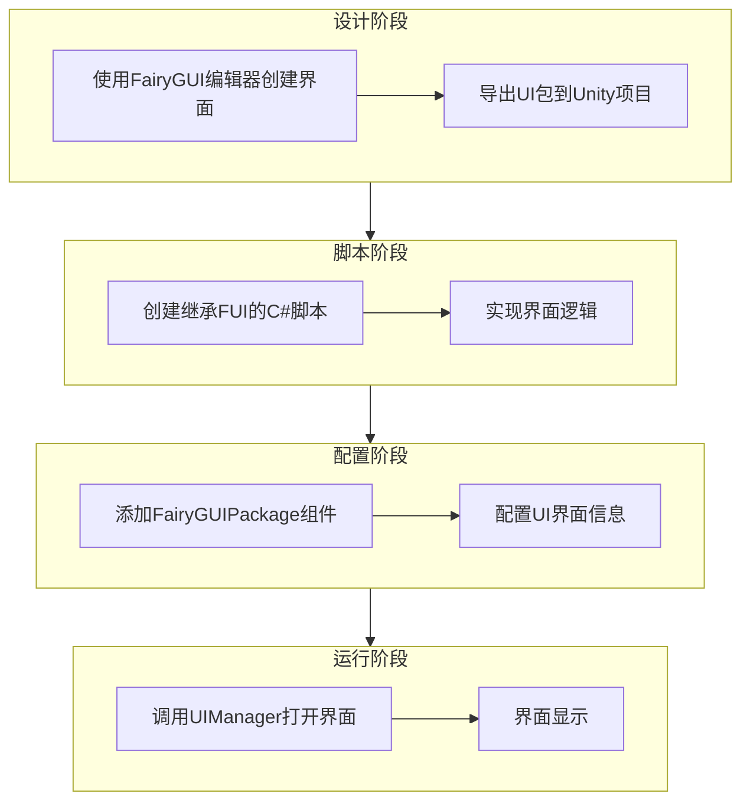
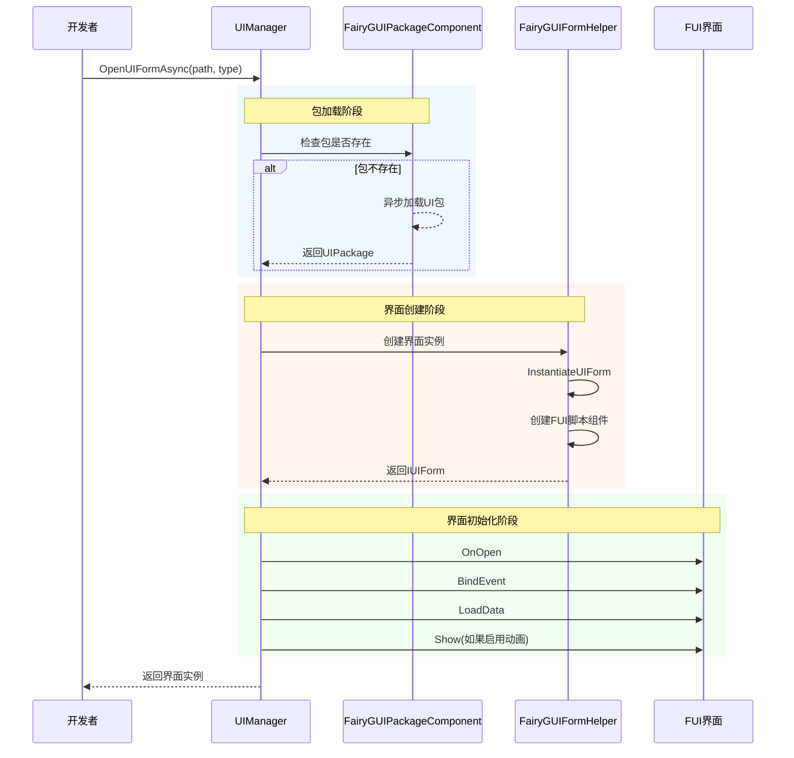
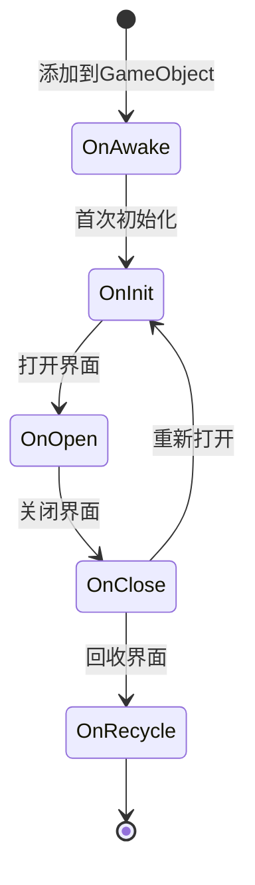

# 作成第1个界面

本ガイド将帮助你使用 GameFrameX 的 FairyGUI プラグイン作成第1个 UI 界面。通过本ガイド，你将理解する从 FairyGUI エディタ設計界面到在コード中打开界面的完全なフロー。

## 概要

在使用 FairyGUI プラグイン作成 UI 界面之前，〜する必要があります理解整个 UI 系统的アーキテクチャ。GameFrameX 的 FairyGUI プラグイン基于以下コアコンポーネントビルド：

- **FUI**：FairyGUI 界面的基底クラス，継承自 UIForm，提供界面显示/隐藏、GObject 管理等機能
- **FairyGUIPackageComponent**：UI パッケージマネージャー，负责ロード、缓存和アンロード UI リソースパッケージ
- **UIManager**：界面マネージャー，负责界面的打开、閉じる和ライフサイクル管理
- **FairyGUIFormHelper**：界面辅助器，负责作成、インスタンス化和解放界面インスタンス

整个 UI 系统的設計遵循了依存性注入和コンポーネント化的設計モード，使得界面作成和管理变得シンプル可控。

## 作成フロー

作成第1个 FairyGUI 界面的完全なフロー如下：



## ステップ一：使用 FairyGUI エディタ作成界面

まず〜する必要があります使用 FairyGUI エディタ設計和作成 UI 界面。FairyGUI 提供します一个強力的可视化エディタ，〜に役立ちます你快速ビルド UI。

### 1.1 インストール FairyGUI エディタ

从 [FairyGUI 官网](https://www.fairygui.com/) 下载并インストール FairyGUI エディタ。

### 1.2 作成新プロジェクト

在 FairyGUI エディタ中作成新プロジェクト，选择合适的分辨率和設定。

### 1.3 設計界面

使用エディタ提供的各种コンポーネント（ボタン、文本、图片、列表等）設計你的界面。完成設計后，保存プロジェクト。

### 1.4 导出 UI パッケージ

将設計好的界面导出为 Unity 可用的リソースパッケージ：

1. 点击メニュー「リリース」→「リリース設定」
2. 选择リリースプラットフォーム为 Unity
3. 設定输出路径（通常設定为 Unity プロジェクト的 `Assets/Res/FairyGUI` ディレクトリ）
4. 点击リリースボタン

导出后，会在输出ディレクトリ生成 `.bytes` 説明ファイル和相关的图片リソース。

## ステップ二：作成 FUI 界面脚本

在 Unity プロジェクト中作成継承自 `FUI` 的 C# 脚本。FUI 是 FairyGUI 界面的基底クラス，提供します与 FairyGUI GObject 交互的コア機能。

### 2.1 作成界面类

```csharp
using GameFrameX.UI.FairyGUI.Runtime;
using FairyGUI;
using GameFrameX.UI.Runtime;

/// <summary>
/// 主菜单界面
/// </summary>
public class MainMenuForm : FUI
{
    /// <summary>
    /// 初始化界面
    /// </summary>
    protected override void OnInit()
    {
        base.OnInit();
        
        // 获取界面中的按钮并添加点击事件
        var startButton = GObject.asCom.GetChild("btn_start");
        startButton.onClick.Add(OnStartButtonClick);
    }

    /// <summary>
    /// 开始按钮点击事件
    /// </summary>
    private void OnStartButtonClick()
    {
        // 处理点击逻辑
    }

    /// <summary>
    /// 界面打开时的回调，可以在这里接收传入的数据
    /// </summary>
    /// <param name="userData">打开界面时传入的数据</param>
    protected override void OnOpen(object userData)
    {
        base.OnOpen(userData);
        // 界面打开时的初始化逻辑
    }

    /// <summary>
    /// 界面关闭时的回调
    /// </summary>
    protected override void OnClose(bool isShutdown, bool isVisible)
    {
        // 界面关闭时的清理逻辑
        base.OnClose(isShutdown, isVisible);
    }
}
```
> Source: [FUI.cs](https://github.com/GameFrameX/com.gameframex.unity.ui.fairygui/blob/main/Runtime/FUI.cs#L43-L197)

### 2.2 FUI 类提供的コア機能

FUI 类継承自 UIForm，是所有 FairyGUI 界面的基底クラス。它提供します以下コア機能：

| 機能 | 説明 |
|------|------|
| GObject | 取得关联的 FairyGUI GObject 对象 |
| Visible | 取得或設定界面可见性 |
| Show | 显示界面，サポート动画 |
| Hide | 隐藏界面，サポート动画 |
| OnVisibleChanged | 可见性变更コールバック |

## ステップ三：設定 FairyGUIPackageComponent

FairyGUIPackageComponent 是 UI パッケージマネージャーコンポーネント，〜する必要があります追加到シーン中才能ロード UI パッケージ。

### 3.1 追加パッケージ管理コンポーネント

在 Unity エディタ中，按照以下ステップ操作：

1. 作成一个空 GameObject，命名为 `FairyGUIPackage`
2. 点击 Add Component ボタン
3. 検索并追加 `FairyGUIPackage` コンポーネント（实际上是 FairyGUIPackageComponent）
4. 確認してください该コンポーネント作为 GameFrameworkComponent 的サブクラス被正确初期化

### 3.2 パッケージマネージャー的コアメソッド

```csharp
// 异步加载 UI 包
public Task<UIPackage> AddPackageAsync(string descFilePath, bool isLoadAsset = true)

// 同步加载 UI 包
public void AddPackageSync(string descFilePath, bool isLoadAsset = true)

// 移除指定名称的 UI 包
public void RemovePackage(string packageName)

// 检查 UI 包是否存在
public bool Has(string uiPackageName)
```
> Source: [FairyGUIPackageComponent.cs](https://github.com/GameFrameX/com.gameframex.unity.ui.fairygui/blob/main/Runtime/FairyGUIPackageComponent.cs#L138-L290)

## ステップ四：打开界面

使用 UIManager 打开界面是最後に一步。UIManager 会自动処理パッケージ的ロード、界面的作成和显示。

### 4.1 打开界面的基本メソッド

```csharp
// 异步打开界面
await GameEntry.UI.OpenUIFormAsync("UI/MainMenu", typeof(MainMenuForm));

// 带用户数据打开界面
var userData = new StartGameData { LevelId = 1 };
await GameEntry.UI.OpenUIFormAsync("UI/MainMenu", typeof(MainMenuForm), userData);
```

### 4.2 打开界面的完全なフロー



### 4.3 界面パラメータ説明

| パラメータ | 説明 |
|------|------|
| uiFormAssetPath | 界面リソースパス，如 "UI/MainMenu" |
| uiFormType | 界面タイプ，传入界面类的 Type |
| pauseCoveredUIForm | 是否暂停被覆盖的界面 |
| userData | ユーザー自定義数据，会传递给界面的 OnOpen メソッド |
| isFullScreen | 是否全屏显示 |

## 界面ライフサイクル

理解界面的ライフサイクル对于正确管理 UI 非常重要な。FUI 界面有以下ライフサイクルメソッド：



| ライフサイクルメソッド | 呼び出し时机 | 用途 |
|-------------|----------|------|
| OnAwake | 脚本追加到 GameObject 时 | 一次性初期化 |
| OnInit | 界面首次作成时 | 初期化界面コンポーネント和イベント |
| OnOpen | 每次打开界面时 | 受信数据、刷新界面 |
| OnClose | 界面閉じる时 | 清理リソース、保存ステータス |
| OnRecycle | 界面回收时 | 彻底清理内存 |

## 界面閉じる

使用 UIManager 閉じる界面：

```csharp
// 关闭指定界面
GameEntry.UI.CloseUIForm(mainMenuForm);

// 关闭所有界面
GameEntry.UI.CloseAllUIForms();
```
> Source: [UIManager.Close.cs](https://github.com/GameFrameX/com.gameframex.unity.ui.fairygui/blob/main/Runtime/UIManager.Close.cs)

## よくある問題

### Q1: 界面打开后显示空白

请確認以下事项：
1. UI パッケージ是否正确导出并放置在 Unity プロジェクト的正确ディレクトリ
2. FairyGUIPackageComponent 是否已追加到シーン
3. 界面リソースパス是否正确

### Q2: 点击イベント没有响应

確認してください在 OnInit メソッド中正确绑定了イベント，かつ GObject 名称与 FairyGUI エディタ中的名称完全一致。

### Q3: 界面无法閉じる

確認是否在 OnClose メソッド中正确呼び出し了基底クラス的 OnClose メソッド，確認してくださいリソース被正确解放。

## 関連リンク

- [FUI 界面基底クラス](./4-core-concepts.1-fui-base-class) - 詳細理解する FUI 基底クラス的所有機能
- [界面マネージャー](./4-core-concepts.2-ui-manager) - 深入理解する UIManager 的機能
- [パッケージマネージャー](./4-core-concepts.3-package-manager) - 理解する UI パッケージ的管理机制
- [界面辅助器](./4-core-concepts.4-form-helper) - 理解する界面作成和解放的机制
- [打开和閉じる界面](./3-getting-started.2-open-close-ui) - 继续学习界面的打开和閉じる操作
