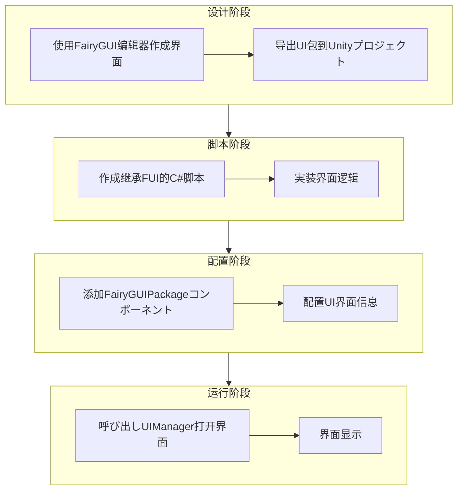
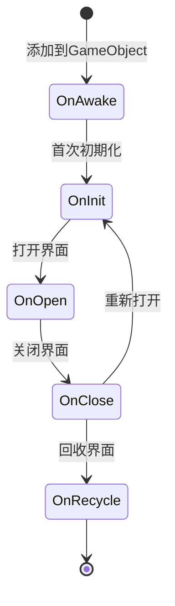

# 作成第一个界面

本指南将帮助你使用 GameFrameX 的 FairyGUI 插件作成第一个 UI 界面。を通じて本指南，你将了解从 FairyGUI 编辑器设计界面到在代码中打开界面的完整フロー。

## 概要

在使用 FairyGUI 插件作成 UI 界面之前，必要理解整个 UI 系统的架构。GameFrameX 的 FairyGUI 插件基づく以下コアコンポーネント构建：

- **FUI**：FairyGUI 界面的基クラス，を継承 UIForm，提供界面显示/隐藏、GObject 管理等機能
- **FairyGUIPackageComponent**：UI パッケージ管理器，负责加载、缓存和卸载 UI リソース包
- **UIManager**：界面管理器，负责界面的打开、关闭和生命周期管理
- **FairyGUIFormHelper**：界面辅助器，负责作成、インスタンス化和释放界面インスタンス

整个 UI 系统的设计遵循了依赖注入和コンポーネント化的设计模式，使得界面作成和管理变得简单可控。

## 作成フロー

作成第一个 FairyGUI 界面的完整フロー如下：



## 手順一：使用 FairyGUI 编辑器作成界面

首先必要使用 FairyGUI 编辑器设计和作成 UI 界面。FairyGUI 提供します一个强大的可视化编辑器，可能帮助你快速构建 UI。

### 1.1 安装 FairyGUI 编辑器

从 [FairyGUI 官网](https://www.fairygui.com/) ダウンロード并安装 FairyGUI 编辑器。

### 1.2 作成新プロジェクト

在 FairyGUI 编辑器中作成新プロジェクト，选择合适的分辨率和設定。

### 1.3 设计界面

使用编辑器提供的各种コンポーネント（按钮、文本、图片、列表等）设计你的界面。完成设计后，保存プロジェクト。

### 1.4 导出 UI 包

将设计好的界面导出为 Unity 可用的リソース包：

1. 点击菜单「发布」→「发布設定」
2. 选择发布平台为 Unity
3. 設定输出路径（通常設定为 Unity プロジェクト的 `Assets/Res/FairyGUI` ディレクトリ）
4. 点击发布按钮

导出后，会在输出ディレクトリ生成 `.bytes` 説明ファイル和関連的图片リソース。

## 手順二：作成 FUI 界面脚本

在 Unity プロジェクト中作成を継承 `FUI` 的 C# 脚本。FUI 是 FairyGUI 界面的基クラス，提供します与 FairyGUI GObject 交互的コア機能。

### 2.1 作成界面クラス

```csharp
using GameFrameX.UI.FairyGUI.Runtime;
using FairyGUI;
using GameFrameX.UI.Runtime;

/// <summary>
/// 主菜单界面
/// </summary>
public class MainMenuForm : FUI
{
    /// <summary>
    /// 初期化界面
    /// </summary>
    protected override void OnInit()
    {
        base.OnInit();
        
        // 取得界面中的按钮并添加点击イベント
        var startButton = GObject.asCom.GetChild("btn_start");
        startButton.onClick.Add(OnStartButtonClick);
    }

    /// <summary>
    /// 开始按钮点击イベント
    /// </summary>
    private void OnStartButtonClick()
    {
        // 处理点击逻辑
    }

    /// <summary>
    /// 界面打开时的回调，可能在这里接收传入的数据
    /// </summary>
    /// <param name="userData">打开界面时传入的数据</param>
    protected override void OnOpen(object userData)
    {
        base.OnOpen(userData);
        // 界面打开时の初期化論理
    }

    /// <summary>
    /// 界面关闭时的回调
    /// </summary>
    protected override void OnClose(bool isShutdown, bool isVisible)
    {
        // 界面关闭时的清理逻辑
        base.OnClose(isShutdown, isVisible);
    }
}
```
> Source: [FUI.cs](https://github.com/GameFrameX/com.gameframex.unity.ui.fairygui/blob/main/Runtime/FUI.cs#L43-L197)

### 2.2 FUI クラス提供的コア機能

FUI クラスを継承 UIForm，是所有 FairyGUI 界面的基クラス。它提供します以下コア機能：

| 機能 | 説明 |
|------|------|
| GObject | 取得关联的 FairyGUI GObject 对象 |
| Visible | 取得或設定界面可见性 |
| Show | 显示界面，サポート动画 |
| Hide | 隐藏界面，サポート动画 |
| OnVisibleChanged | 可见性变更回调 |

## 手順三：配置 FairyGUIPackageComponent

FairyGUIPackageComponent 是 UI パッケージ管理器コンポーネント，必要添加到シーン中才能加载 UI 包。

### 3.1 添加パッケージ管理コンポーネント

在 Unity 编辑器中，按照以下手順操作：

1. 作成一个空 GameObject，名前を付ける `FairyGUIPackage`
2. 点击 Add Component 按钮
3. 搜索并添加 `FairyGUIPackage` コンポーネント（实际上是 FairyGUIPackageComponent）
4. 确保该コンポーネント作为 GameFrameworkComponent 的サブクラス被正确初期化

### 3.2 パッケージ管理器的コアメソッド

```csharp
// 异步加载 UI 包
public Task<UIPackage> AddPackageAsync(string descFilePath, bool isLoadAsset = true)

// 同步加载 UI 包
public void AddPackageSync(string descFilePath, bool isLoadAsset = true)

// 移除指定名称的 UI 包
public void RemovePackage(string packageName)

// 检查 UI 包是否存在
public bool Has(string uiPackageName)
```
> Source: [FairyGUIPackageComponent.cs](https://github.com/GameFrameX/com.gameframex.unity.ui.fairygui/blob/main/Runtime/FairyGUIPackageComponent.cs#L138-L290)

## 手順四：打开界面

使用 UIManager 打开界面是最后一步。UIManager 会自动处理包的加载、界面的作成和显示。

### 4.1 打开界面的基本メソッド

```csharp
// 异步打开界面
await GameEntry.UI.OpenUIFormAsync("UI/MainMenu", typeof(MainMenuForm));

// 带用户数据打开界面
var userData = new StartGameData { LevelId = 1 };
await GameEntry.UI.OpenUIFormAsync("UI/MainMenu", typeof(MainMenuForm), userData);
```

### 4.2 打开界面的完整フロー


### 4.3 界面参数説明

| 参数 | 説明 |
|------|------|
| uiFormAssetPath | 界面リソース路径，如 "UI/MainMenu" |
| uiFormType | 界面クラス型，传入界面クラス的 Type |
| pauseCoveredUIForm | 是否暂停被覆盖的界面 |
| userData | 用户自定义数据，会传递给界面的 OnOpen メソッド |
| isFullScreen | 是否全屏显示 |

## 界面生命周期

理解界面的生命周期对于正确管理 UI 非常重要。FUI 界面有以下生命周期メソッド：



| 生命周期メソッド | 呼び出し时机 | 用途 |
|-------------|----------|------|
| OnAwake | 脚本添加到 GameObject 时 | 一次性初期化 |
| OnInit | 界面首次作成时 | 初期化界面コンポーネント和イベント |
| OnOpen | 每次打开界面时 | 接收数据、刷新界面 |
| OnClose | 界面关闭时 | 清理リソース、保存ステータス |
| OnRecycle | 界面回收时 | 彻底清理内存 |

## 界面关闭

使用 UIManager 关闭界面：

```csharp
// 关闭指定界面
GameEntry.UI.CloseUIForm(mainMenuForm);

// 关闭所有界面
GameEntry.UI.CloseAllUIForms();
```
> Source: [UIManager.Close.cs](https://github.com/GameFrameX/com.gameframex.unity.ui.fairygui/blob/main/Runtime/UIManager.Close.cs)

## よくある質問

### Q1: 界面打开后显示空白

お願いします检查以下事项：
1. UI 包是否正确导出并放置在 Unity プロジェクト的正确ディレクトリ
2. FairyGUIPackageComponent 是否已添加到シーン
3. 界面リソース路径是否正确

### Q2: 点击イベント没有响应

确保在 OnInit メソッド中正确绑定了イベント，并且 GObject 名称与 FairyGUI 编辑器中的名称完全一致。

### Q3: 界面无法关闭

检查是否在 OnClose メソッド中正确呼び出し了基クラス的 OnClose メソッド，确保リソース被正确释放。

## 関連リンク

- [FUI 界面基クラス](./4-core-concepts.1-fui-base-class) - 详细了解 FUI 基クラス的全機能
- [界面管理器](./4-core-concepts.2-ui-manager) - 深入了解 UIManager 的機能
- [パッケージ管理器](./4-core-concepts.3-package-manager) - 了解 UI 包的管理机制
- [界面辅助器](./4-core-concepts.4-form-helper) - 了解界面作成和释放的机制
- [打开和关闭界面](./3-getting-started.2-open-close-ui) - 继续学习界面的打开和关闭操作
