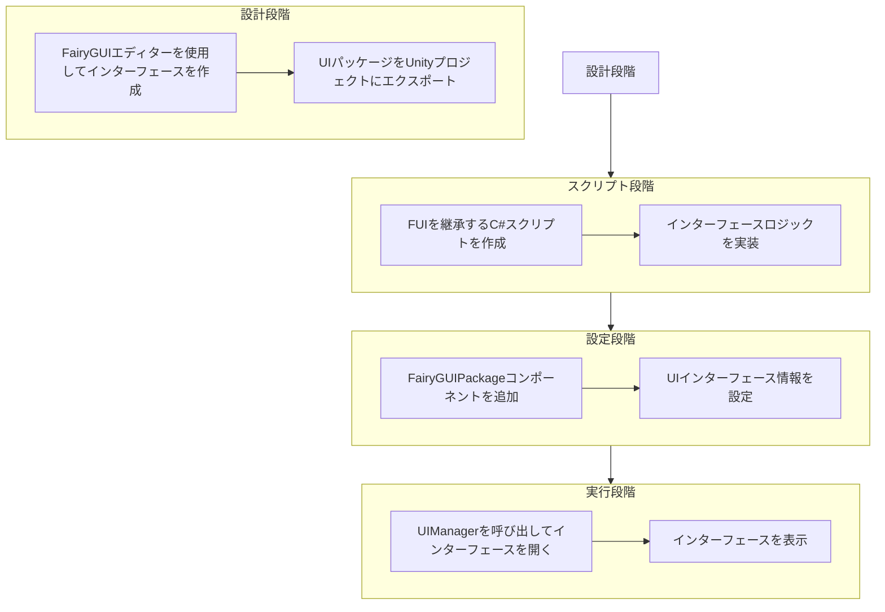
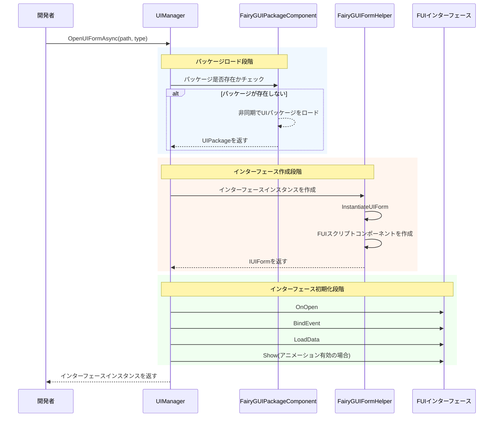
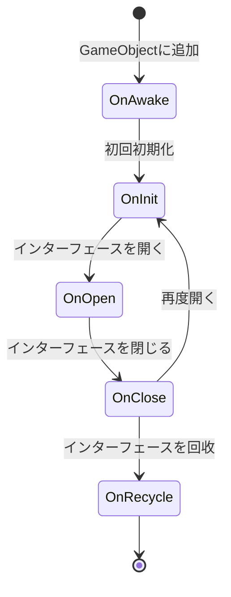

# 最初のインターフェースを作成する

このガイドでは、GameFrameX の FairyGUI プラグインを使用して最初の UI インターフェースを作成する方法を説明します。このガイドを通じて、FairyGUI エディターでインターフェースを設計してから、コードでインターフェースを開くまでの完全なフローを理解できます。

## 概要

FairyGUI プラグインで UI インターフェースを作成する前に、UI システム全体の架构を理解する必要があります。GameFrameX の FairyGUI プラグインは、以下のコアコンポーネントに基づいて構築されています：

- **FUI**：FairyGUI インターフェースのベースクラスで、UIForm を継承し、インターフェース表示/非表示、GObject 管理などの機能を提供します
- **FairyGUIPackageComponent**：UI パッケージマネージャーで、UI リソースパッケージのロード、キャッシュ、アンロードを担当します
- **UIManager**：インターフェースマネージャーで、インターフェースのオープン、クローズ、ライフサイクル管理を担当します
- **FairyGUIFormHelper**：インターフェースヘルパーで、インターフェースの作成、インスタンス化、解放を担当します

UI システム全体は、依存性注入とコンポーネント化された設計パターンに従っており、インターフェースの作成と管理をシンプルで制御可能にします。

## 作成フロー

最初の FairyGUI インターフェースを作成する完全なフローは以下の通りです：



## 手順1：FairyGUI エディターを使用してインターフェースを作成

まず、FairyGUI エディターを使用して UI インターフェースを設計し、作成する必要があります。FairyGUI は、UI を迅速に構築できる強力なビジュアルエディターを提供します。

### 1.1 FairyGUI エディターのインストール

[FairyGUI 公式サイト](https://www.fairygui.com/) から FairyGUI エディターをダウンロードしてインストールします。

### 1.2 新規プロジェクトの作成

FairyGUI エディターで新規プロジェクトを作成し、適切な解像度と設定を選びます。

### 1.3 インターフェースの設計

エディターが提供する様々なコンポーネント（ボタン、テキスト、画像、リストなど）を使用してインターフェースを設計します。設計が完了したら、プロジェクトを保存します。

### 1.4 UI パッケージのエクスポート

デザインしたインターフェースを Unity で使用可能なリソースパッケージとしてエクスポートします：

1. メニュー「パブリッシュ」→「パブリッシュ設定」をクリック
2. パブリッシュプラットフォームとして Unity を選択
3. 出力パスを設定（通常は Unity プロジェクトの `Assets/Res/FairyGUI` ディレクトリに設定）
4. パブリッシュボタンをクリック

エクスポート後、出力ディレクトリに `.bytes` 説明ファイルと関連する画像リソースが生成されます。

## 手順2：FUI インターフェーススクリプトの作成

Unity プロジェクトで `FUI` を継承する C# スクリプトを作成します。FUI は FairyGUI インターフェースのベースクラスであり、FairyGUI GObject と対話するコア機能を提供します。

### 2.1 インターフェースクラスの作成

```csharp
using GameFrameX.UI.FairyGUI.Runtime;
using FairyGUI;
using GameFrameX.UI.Runtime;

/// <summary>
/// メインメニューインターフェース
/// </summary>
public class MainMenuForm : FUI
{
    /// <summary>
    /// インターフェースを初期化
    /// </summary>
    protected override void OnInit()
    {
        base.OnInit();

        // インターフェース内のボタンを取得してクリックイベントを追加
        var startButton = GObject.asCom.GetChild("btn_start");
        startButton.onClick.Add(OnStartButtonClick);
    }

    /// <summary>
    /// スタートボタンのクリックイベント
    /// </summary>
    private void OnStartButtonClick()
    {
        // クリックロジックを処理
    }

    /// <summary>
    /// インターフェースが開いた時のコールバック。在这里で渡されたデータを受信可能
    /// </summary>
    /// <param name="userData">インターフェースを開く時に渡されたデータ</param>
    protected override void OnOpen(object userData)
    {
        base.OnOpen(userData);
        // インターフェースが開いた時の初期化ロジック
    }

    /// <summary>
    /// インターフェースが閉じる時のコールバック
    /// </summary>
    protected override void OnClose(bool isShutdown, bool isVisible)
    {
        // インターフェースが閉じる時のクリーンアップロジック
        base.OnClose(isShutdown, isVisible);
    }
}
```
> Source: [FUI.cs](https://github.com/GameFrameX/com.gameframex.unity.ui.fairygui/blob/main/Runtime/FUI.cs#L43-L197)

### 2.2 FUI クラスが提供するコア機能

FUI クラスは UIForm を継承し、すべての FairyGUI インターフェースのベースクラスです。以下のコア機能を提供します：

| 機能 | 説明 |
|------|------|
| GObject | 関連する FairyGUI GObject オブジェクトを取得 |
| Visible | インターフェースの可視性を取得または設定 |
| Show | インターフェースを表示、アニメーションをサポート |
| Hide | インターフェースを非表示化、アニメーションをサポート |
| OnVisibleChanged | 可視性変更コールバック |

## 手順3：FairyGUIPackageComponent の設定

FairyGUIPackageComponent は UI パッケージマネージャーコンポーネントであり、シーンに追加しないと UI パッケージをロードできません。

### 3.1 パッケージ管理コンポーネントの追加

Unity エディターで、以下の手順で操作します：

1. 空の GameObject を作成し、名前を `FairyGUIPackage` にする
2. Add Component ボタンをクリック
3. `FairyGUIPackage` コンポーネントを検索して追加（実際のコンポーネントは FairyGUIPackageComponent）
4. このコンポーネントが GameFrameworkComponent のサブクラスとして正しく初期化されていることを確認

### 3.2 パッケージマネージャーのコアメソッド

```csharp
// 非同期で UI パッケージをロード
public Task<UIPackage> AddPackageAsync(string descFilePath, bool isLoadAsset = true)

// 同期で UI パッケージをロード
public void AddPackageSync(string descFilePath, bool isLoadAsset = true)

// 指定された名前の UI パッケージを削除
public void RemovePackage(string packageName)

// UI パッケージが存在するかチェック
public bool Has(string uiPackageName)
```
> Source: [FairyGUIPackageComponent.cs](https://github.com/GameFrameX/com.gameframex.unity.ui.fairygui/blob/main/Runtime/FairyGUIPackageComponent.cs#L138-L290)

## 手順4：インターフェースを開く

UIManager を使用してインターフェースを開くことが最後のステップです。UIManager はパッケージのロード、インターフェースの作成、表示を自動的に処理します。

### 4.1 インターフェースを開く基本メソッド

```csharp
// 非同期でインターフェースを開く
await GameEntry.UI.OpenUIFormAsync("UI/MainMenu", typeof(MainMenuForm));

// ユーザーデータ付きでインターフェースを開く
var userData = new StartGameData { LevelId = 1 };
await GameEntry.UI.OpenUIFormAsync("UI/MainMenu", typeof(MainMenuForm), userData);
```

### 4.2 インターフェースを開く完全なフロー



### 4.3 インターフェースパラメータの説明

| パラメータ | 説明 |
|------|------|
| uiFormAssetPath | インターフェースリソースパス（例："UI/MainMenu"） |
| uiFormType | インターフェース論理クラスの型 |
| pauseCoveredUIForm | 被覆されたインターフェースを一時停止するか |
| userData | インターフェースに渡されるカスタムデータ |
| isFullScreen | 全画面表示するか |

## インターフェースライフサイクル

UI を正しく管理するためには、インターフェースのライフサイクルを理解することが重要です。FUI インターフェースには以下のライフサイクルメソッドがあります：



| ライフサイクルメソッド | 呼び出しタイミング | 用途 |
|-------------|----------|------|
| OnAwake | スクリプトが GameObject に追加された時 | 1回限りの初期化 |
| OnInit | インターフェースが初めて作成された時 | インターフェースコンポーネントとイベントの初期化 |
| OnOpen | インターフェースを開く度 | データ受信、画面更新 |
| OnClose | インターフェースが閉じる時 | リソース清理、ステータス保存 |
| OnRecycle | インターフェースが回收される時 | メモリを完全に清理 |

## インターフェースのクローズ

UIManager を使用してインターフェースを閉じます：

```csharp
// 指定したインターフェースを閉じる
GameEntry.UI.CloseUIForm(mainMenuForm);

// すべてのインターフェースを閉じる
GameEntry.UI.CloseAllUIForms();
```
> Source: [UIManager.Close.cs](https://github.com/GameFrameX/com.gameframex.unity.ui.fairygui/blob/main/Runtime/UIManager.Close.cs)

## よくある質問

### Q1: インターフェースを開いた後、白紙表示される

以下の事項を確認してください：
1. UI パッケージが正しくエクスポートされ、Unity プロジェクトの正しいディレクトリに置かれているか
2. FairyGUIPackageComponent がシーンに追加されているか
3. インターフェースリソースパスが正しいか

### Q2: クリックイベントが反応しない

OnInit メソッドでイベントが正しくバインディングされていることを確認し、GObject 名が FairyGUI エディター内の名前と完全一致していることを確認してください。

### Q3: インターフェースが閉じられない

OnClose メソッドでベースの OnClose メソッドが正しく呼び出されていることを確認し、リソースが正しく解放されていることを確認してください。

## 関連リンク

- [FUI インターフェースベースクラス](./4-core-concepts.1-fui-base-class) - FUI ベースクラスのすべての機能を詳細に理解
- [インターフェースマネージャー](./4-core-concepts.2-ui-manager) - UIManager の機能を詳しく理解
- [パッケージマネージャー](./4-core-concepts.3-package-manager) - UI パッケージの管理メカニズムを理解
- [インターフェースヘルパー](./4-core-concepts.4-form-helper) - インターフェース作成と解放のメカニズムを理解
- [インターフェースを開く・閉じる](./3-getting-started.2-open-close-ui) - インターフェースを開く・閉じる操作の続きを学ぶ