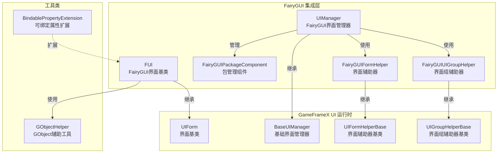

# 機能特性

GameFrameX UI FairyGUI プラグインは专为 Unity 游戏引擎設計的 FairyGUI UI コンポーネント集成方案，提供完全な的界面管理、界面ライフサイクル控制、パッケージリソース管理等機能。

## 概要

本プラグイン将 GameFrameX コアフレームワーク的 UI 系统与 FairyGUI 完美整合，提供以下コア能力：

- **界面ライフサイクル管理**：完全な的界面打开、閉じる、显示、隐藏机制
- **リソースパッケージ管理**：サポート UI パッケージ的异步/同期ロード、缓存和アンロード
- **界面组系统**：サポート多层级的界面分组和深度控制
- **对象池**：サポート界面インスタンス的复用，减少内存开销
- **动画系统**：サポート显示/隐藏动画的柔軟設定
- **拡張サポート**：提供 FairyGUI 特定的数据绑定拡張

## コアアーキテクチャ



### アーキテクチャ説明

| コンポーネント | 职责 | 継承/実装 |
|------|------|----------|
| **FUI** | FairyGUI 界面基底クラス，処理 GObject 关联和可见性 | 継承 UIForm |
| **UIManager** | 界面マネージャー，処理界面打开/閉じる/ライフサイクル | 継承 BaseUIManager |
| **FairyGUIPackageComponent** | パッケージ管理コンポーネント，异步/同期ロード UI パッケージ | 継承 GameFrameworkComponent |
| **FairyGUIFormHelper** | 界面辅助器，インスタンス化/作成/解放界面 | 実装 UIFormHelperBase |
| **FairyGUIUIGroupHelper** | 界面组辅助器，管理界面层级深度 | 継承 UIGroupHelperBase |
| **GObjectHelper** | GObject 工具类，FUI 对象缓存管理 | 静态类 |

## コア機能特性

### 1. 界面基底クラス (FUI)

FUI 是 FairyGUI 特定的界面基底クラス，提供以下機能：

- **GObject 关联**：与 FairyGUI 的 GObject 无缝关联
- **可见性管理**：通过 `Visible` プロパティ控制界面显示/隐藏
- **动画サポート**：サポート显示/隐藏动画設定
- **全屏显示**：サポート全屏モード設定
- **イベント系统**：提供可见性改变イベントコールバック

```csharp
// FUI 使用示例
public class MainMenuForm : FUI
{
    protected override void OnInit(object userData)
    {
        base.OnInit(userData);
        // 设置 GObject 关联
        GObject.onClick.Add(() => { /* 点击处理 */ });
    }
}
```
> Source: [FUI.cs](https://github.com/GameFrameX/com.gameframex.unity.ui.fairygui/blob/main/Runtime/FUI.cs#L36-L197)

### 2. パッケージ管理系统

FairyGUIPackageComponent 负责管理 FairyGUI UI リソースパッケージ：

- **非同期ロード**：`AddPackageAsync()` サポート非同期ロード UI パッケージ
- **同期ロード**：`AddPackageSync()` サポート同期ロード UI パッケージ
- **パッケージ缓存**：已ロード的パッケージ会被缓存，避免重复ロード
- **リソース预ロード**：サポート `LoadAllAssets()` 预ロード所有リソース
- **パッケージ移除**：`RemovePackage()` / `RemoveAllPackages()` サポートパッケージ的アンロード

```csharp
// 包管理示例
var package = await FairyGuiPackage.AddPackageAsync("UI/MainMenu");
var package = FairyGuiPackage.AddPackageSync("UI/Settings");
```
> Source: [FairyGUIPackageComponent.cs](https://github.com/GameFrameX/com.gameframex.unity.ui.fairygui/blob/main/Runtime/FairyGUIPackageComponent.cs#L138-L254)

### 3. 界面ライフサイクル

UIManager 提供完全な的界面ライフサイクル管理：


### 4. 界面辅助器

FairyGUIFormHelper 负责界面的インスタンス化和解放：

- **インスタンス化**：通过 `InstantiateUIForm()` 作成 GComponent インスタンス
- **作成界面**：通过 `CreateUIForm()` 将インスタンスパッケージ装为 IUIForm
- **解放リソース**：通过 `ReleaseUIForm()` 解放界面和关联リソース
- **动画設定**：自动读取界面タイプ的特性設定动画

> Source: [FairyGUIFormHelper.cs](https://github.com/GameFrameX/com.gameframex.unity.ui.fairygui/blob/main/Runtime/FairyGUIFormHelper.cs#L46-L232)

### 5. 界面组系统

FairyGUIUIGroupHelper 提供界面层级管理：

- **深度控制**：通过 `SetDepth()` 設定界面显示层级
- **全屏适配**：自动設定全屏大小适配
- **关系绑定**：与 GRoot 自动建立宽高关系

```csharp
// 界面组深度管理
public override void SetDepth(int depth)
{
    Depth = depth;
    transform.localPosition = new Vector3(0, 0, depth * 100);
}
```
> Source: [FairyGUIUIGroupHelper.cs](https://github.com/GameFrameX/com.gameframex.unity.ui.fairygui/blob/main/Runtime/FairyGUIUIGroupHelper.cs#L62-L96)

### 6. GObject 辅助工具

GObjectHelper 提供 FUI 对象的缓存和管理：

- **取得关联 FUI**：`Get<T>()` 从 GObject 取得关联的 FUI
- **追加映射**：`Add()` 将 GObject 与 FUI 关联
- **移除映射**：`Remove()` 移除 GObject 与 FUI 的关联
- **清理缓存**：`ClearAll()` 清理所有缓存

```csharp
// GObject 与 FUI 映射示例
GObject obj = package.CreateObject("MainMenu", "MainMenuForm");
MainMenuForm fui = new MainMenuForm(obj);
obj.Add(fui);  // 建立映射

// 后续获取
MainMenuForm cached = obj.Get<MainMenuForm>();
```
> Source: [GObjectHelper.cs](https://github.com/GameFrameX/com.gameframex.unity.ui.fairygui/blob/main/Runtime/GObjectHelper.cs#L42-L114)

### 7. 数据绑定拡張

BindablePropertyExtension 提供 FairyGUI 環境下的プロパティ绑定：

- **自动注销**：GObject 破棄时自动清除绑定イベント
- **ライフサイクル联动**：将プロパティ变化与界面ライフサイクル关联

```csharp
// 可绑定属性在 FairyGUI 中的使用
BindableProperty<int> score = new BindableProperty<int>(0);
score.Register(newValue => { textField.text = newValue.ToString(); });
score.ClearWithGObjectDestroyed(textField);
```
> Source: [BindablePropertyExtension.cs](https://github.com/GameFrameX/com.gameframex.unity.ui.fairygui/blob/main/Runtime/BindablePropertyExtension.cs#L41-L57)

## 機能特性对比

| 機能 | 説明 | 相关コンポーネント |
|------|------|----------|
| 界面基底クラス | FairyGUI 特定的界面基底クラス | FUI |
| 界面管理 | 打开/閉じる/ライフサイクル管理 | UIManager |
| パッケージ管理 | UIリソースパッケージ异步/同期ロード | FairyGUIPackageComponent |
| 界面インスタンス化 | 界面作成/インスタンス化/解放 | FairyGUIFormHelper |
| 界面组管理 | 界面层级/深度控制 | FairyGUIUIGroupHelper |
| 对象缓存 | GObject与FUI映射管理 | GObjectHelper |
| プロパティ绑定 | 可绑定プロパティ拡張サポート | BindablePropertyExtension |

## 設計优势

1. **分层設計**：清晰的分层アーキテクチャ，易于拡張和维护
2. **面向インターフェース**：大量使用インターフェース，便于置換実装
3. **对象池复用**：界面インスタンス复用，减少内存分配
4. **异步サポート**：完全な的非同期ロードサポート，提高性能
5. **特性設定**：使用特性設定动画和界面组，簡素化コード
6. **イベント驱动**：基于イベント系统，解耦コンポーネント间依赖

## 関連リンク

- [プラグイン介绍](./1-overview.1-introduction) - 理解するプラグイン概要和設計理念
- [系统要求](./1-overview.3-requirements) - 確認运行環境要求
- [インストールガイド](./2-installation.1-install-methods) - 快速インストールプラグイン
- [FUI 类详解](./5-api-reference.1-fui-class) - FUI 完全な API リファレンス
- [界面マネージャー](./4-core-concepts.2-ui-manager) - 界面管理コアコンセプト
- [パッケージマネージャー](./4-core-concepts.3-package-manager) - パッケージ管理コアコンセプト
