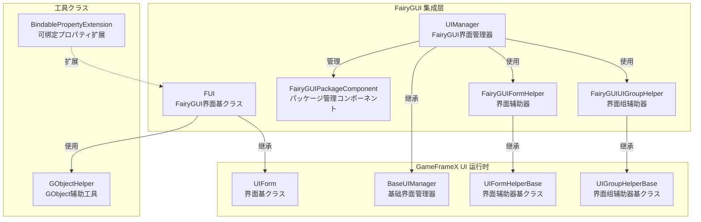
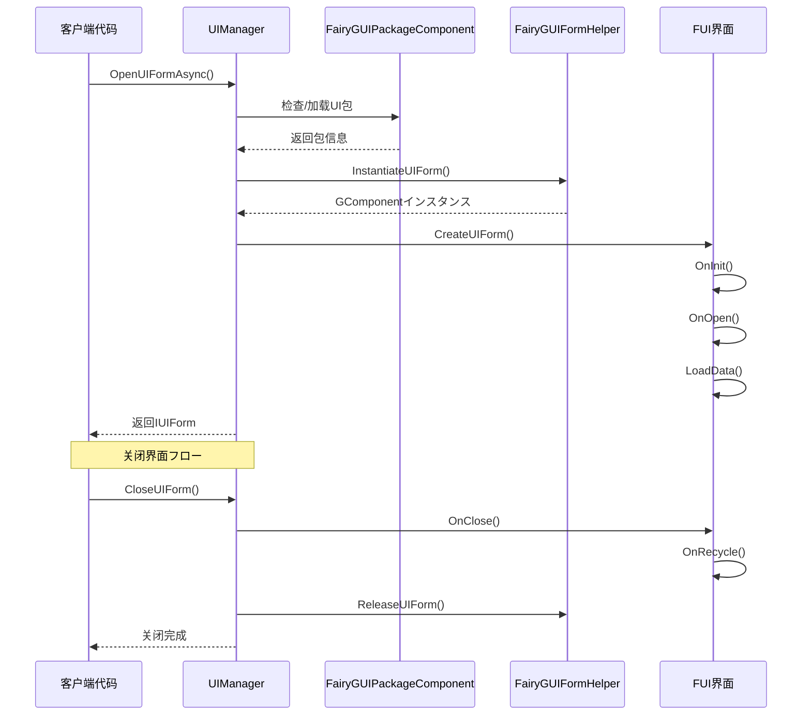

# 機能特性

GameFrameX UI FairyGUI 插件是一款专为 Unity ゲーム引擎设计的 FairyGUI UI コンポーネント集成方案，提供完整的界面管理、界面生命周期控制、包リソース管理等機能。

## 概要

本插件将 GameFrameX コアフレームワーク的 UI 系统与 FairyGUI 完美整合，提供以下コア能力：

- **界面生命周期管理**：完整的界面打开、关闭、显示、隐藏机制
- **リソースパッケージ管理**：サポート UI 包的异步/同步加载、缓存和卸载
- **界面组系统**：サポート多层级的界面分组和深度控制
- **オブジェクトプール**：サポート界面インスタンス的复用，减少内存开销
- **动画系统**：サポート显示/隐藏动画的灵活配置
- **扩展サポート**：提供 FairyGUI 特定的数据绑定扩展

## コア架构



### 架构説明

| コンポーネント | 职责 | 继承/実装 |
|------|------|----------|
| **FUI** | FairyGUI 界面基クラス，处理 GObject 关联和可见性 | 继承 UIForm |
| **UIManager** | 界面管理器，处理界面打开/关闭/生命周期 | 继承 BaseUIManager |
| **FairyGUIPackageComponent** | パッケージ管理コンポーネント，异步/同步加载 UI 包 | 继承 GameFrameworkComponent |
| **FairyGUIFormHelper** | 界面辅助器，インスタンス化/作成/释放界面 | 実装 UIFormHelperBase |
| **FairyGUIUIGroupHelper** | 界面组辅助器，管理界面层级深度 | 继承 UIGroupHelperBase |
| **GObjectHelper** | GObject 工具クラス，FUI 对象缓存管理 | 静态クラス |

## コア機能特性

### 1. 界面基クラス (FUI)

FUI 是 FairyGUI 特定的界面基クラス，提供以下機能：

- **GObject 关联**：与 FairyGUI 的 GObject 无缝关联
- **可见性管理**：を通じて `Visible` プロパティ控制界面显示/隐藏
- **动画サポート**：サポート显示/隐藏动画配置
- **全屏显示**：サポート全屏模式設定
- **イベント系统**：提供可见性改变イベント回调

```csharp
// FUI 使用示例
public class MainMenuForm : FUI
{
    protected override void OnInit(object userData)
    {
        base.OnInit(userData);
        // 設定 GObject 关联
        GObject.onClick.Add(() => { /* 点击处理 */ });
    }
}
```
> Source: [FUI.cs](https://github.com/GameFrameX/com.gameframex.unity.ui.fairygui/blob/main/Runtime/FUI.cs#L36-L197)

### 2. パッケージ管理系统

FairyGUIPackageComponent 负责管理 FairyGUI UI リソース包：

- **异步加载**：`AddPackageAsync()` サポート异步加载 UI 包
- **同步加载**：`AddPackageSync()` サポート同步加载 UI 包
- **包缓存**：已加载的包会被缓存，避免重复加载
- **リソース预加载**：サポート `LoadAllAssets()` 预加载所有リソース
- **包移除**：`RemovePackage()` / `RemoveAllPackages()` サポート包的卸载

```csharp
// パッケージ管理示例
var package = await FairyGuiPackage.AddPackageAsync("UI/MainMenu");
var package = FairyGuiPackage.AddPackageSync("UI/Settings");
```
> Source: [FairyGUIPackageComponent.cs](https://github.com/GameFrameX/com.gameframex.unity.ui.fairygui/blob/main/Runtime/FairyGUIPackageComponent.cs#L138-L254)

### 3. 界面生命周期

UIManager 提供完整的界面生命周期管理：



### 4. 界面辅助器

FairyGUIFormHelper 负责界面的インスタンス化和释放：

- **インスタンス化**：を通じて `InstantiateUIForm()` 作成 GComponent インスタンス
- **作成界面**：を通じて `CreateUIForm()` 将インスタンス包装为 IUIForm
- **释放リソース**：を通じて `ReleaseUIForm()` 释放界面和关联リソース
- **动画配置**：自动读取界面クラス型的特性配置动画

> Source: [FairyGUIFormHelper.cs](https://github.com/GameFrameX/com.gameframex.unity.ui.fairygui/blob/main/Runtime/FairyGUIFormHelper.cs#L46-L232)

### 5. 界面组系统

FairyGUIUIGroupHelper 提供界面层级管理：

- **深度控制**：を通じて `SetDepth()` 設定界面显示层级
- **全屏适配**：自动設定全屏大小适配
- **关系绑定**：与 GRoot 自动建立宽高关系

```csharp
// 界面组深度管理
public override void SetDepth(int depth)
{
    Depth = depth;
    transform.localPosition = new Vector3(0, 0, depth * 100);
}
```
> Source: [FairyGUIUIGroupHelper.cs](https://github.com/GameFrameX/com.gameframex.unity.ui.fairygui/blob/main/Runtime/FairyGUIUIGroupHelper.cs#L62-L96)

### 6. GObject 辅助工具

GObjectHelper 提供 FUI 对象的缓存和管理：

- **取得关联 FUI**：`Get<T>()` 从 GObject 取得关联的 FUI
- **添加映射**：`Add()` 将 GObject 与 FUI 关联
- **移除映射**：`Remove()` 移除 GObject 与 FUI 的关联
- **清理缓存**：`ClearAll()` 清理所有缓存

```csharp
// GObject 与 FUI 映射示例
GObject obj = package.CreateObject("MainMenu", "MainMenuForm");
MainMenuForm fui = new MainMenuForm(obj);
obj.Add(fui);  // 建立映射

// 后续取得
MainMenuForm cached = obj.Get<MainMenuForm>();
```
> Source: [GObjectHelper.cs](https://github.com/GameFrameX/com.gameframex.unity.ui.fairygui/blob/main/Runtime/GObjectHelper.cs#L42-L114)

### 7. 数据绑定扩展

BindablePropertyExtension 提供 FairyGUI 环境下的プロパティ绑定：

- **自动注销**：GObject 销毁时自动清除绑定イベント
- **生命周期联动**：将プロパティ变化与界面生命周期关联

```csharp
// 可绑定プロパティ在 FairyGUI 中的使用
BindableProperty<int> score = new BindableProperty<int>(0);
score.Register(newValue => { textField.text = newValue.ToString(); });
score.ClearWithGObjectDestroyed(textField);
```
> Source: [BindablePropertyExtension.cs](https://github.com/GameFrameX/com.gameframex.unity.ui.fairygui/blob/main/Runtime/BindablePropertyExtension.cs#L41-L57)

## 機能特性对比

| 機能 | 説明 | 関連コンポーネント |
|------|------|----------|
| 界面基クラス | FairyGUI 特定的界面基クラス | FUI |
| 界面管理 | 打开/关闭/生命周期管理 | UIManager |
| パッケージ管理 | UIリソース包异步/同步加载 | FairyGUIPackageComponent |
| 界面インスタンス化 | 界面作成/インスタンス化/释放 | FairyGUIFormHelper |
| 界面组管理 | 界面层级/深度控制 | FairyGUIUIGroupHelper |
| 对象缓存 | GObject与FUI映射管理 | GObjectHelper |
| プロパティ绑定 | 可绑定プロパティ扩展サポート | BindablePropertyExtension |

## 设计优势

1. **分层设计**：清晰的分层架构，易于扩展和维护
2. **面向インターフェース**：大量使用インターフェース，便于替换実装
3. **オブジェクトプール复用**：界面インスタンス复用，减少内存分配
4. **异步サポート**：完整的异步加载サポート，提高性能
5. **特性配置**：使用特性配置动画和界面组，简化代码
6. **イベント驱动**：基づくイベント系统，解耦コンポーネント间依赖

## 関連リンク

- [插件介绍](./1-overview.1-introduction) - 了解插件概述和设计理念
- [システム要件](./1-overview.3-requirements) - 查看运行环境要求
- [安装指南](./2-installation.1-install-methods) - 快速安装插件
- [FUI クラス详解](./5-api-reference.1-fui-class) - FUI 完整 API 参考
- [界面管理器](./4-core-concepts.2-ui-manager) - 界面管理コア概念
- [パッケージ管理器](./4-core-concepts.3-package-manager) - パッケージ管理コア概念
