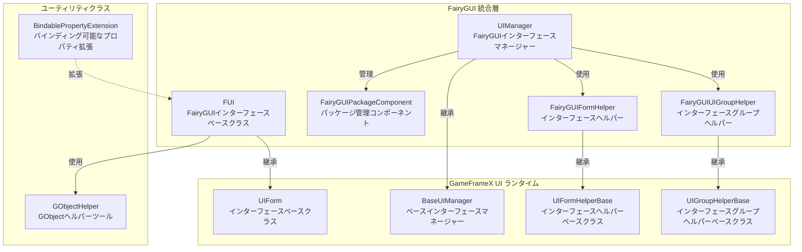
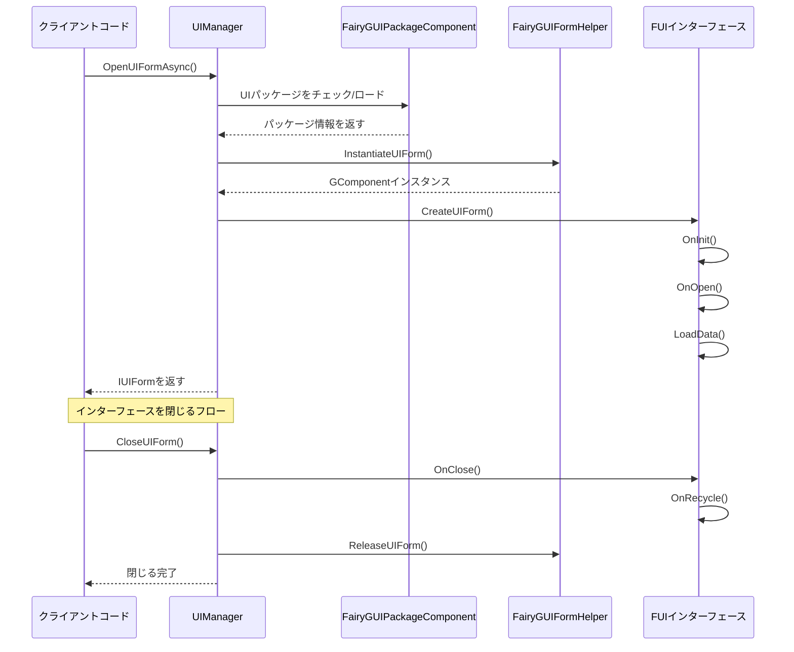

# 機能特性

GameFrameX UI FairyGUI プラグインは、Unity ゲームエンジン向けに設計された FairyGUI UI コンポーネント統合ソリューションであり、完全なインターフェース管理、インターフェースライフサイクル制御、パッケージリソース管理などの機能を提供します。

## 概要

このプラグインは GameFrameX コアフレームワークの UI システムを FairyGUI とシームレスに統合し、以下のコア機能を提供します：

- **インターフェースライフサイクル管理**：完全なインターフェースを開く、閉じる、表示、非表示化メカニズム
- **リソースパッケージ管理**：UI パッケージの非同期/同期ロード、キャッシュ、アンロードをサポート
- **インターフェースグループシステム**：マルチレベルのインターフェースグループ化と深度制御をサポート
- **オブジェクトプール**：インターフェースインスタンスの再利用をサポートし、メモリ开销を削減
- **アニメーションシステム**：表示/非表示アニメーションの柔軟な設定をサポート
- **拡張サポート**：FairyGUI 固有のデータバインディング拡張を提供

## コアアーキテクチャ



### アーキテクチャ説明

| コンポーネント | 責務 | 継承/実装 |
|------|------|----------|
| **FUI** | FairyGUI インターフェースベースクラス、GObject 関連性と可視性を処理 | UIForm を継承 |
| **UIManager** | インターフェースマネージャー、インターフェースを開く/閉じる/ライフサイクルを処理 | BaseUIManager を継承 |
| **FairyGUIPackageComponent** | パッケージ管理コンポーネント、非同期/同期で UI パッケージをロード | GameFrameworkComponent を継承 |
| **FairyGUIFormHelper** | インターフェースヘルパー、インスタンス化/作成/解放インターフェース | UIFormHelperBase を実装 |
| **FairyGUIUIGroupHelper** | インターフェースグループヘルパー、インターフェースレイヤ深度を管理 | UIGroupHelperBase を継承 |
| **GObjectHelper** | GObject ユーティリティクラス、FUI オブジェクトキャッシュ管理 | 静的クラス |

## コア機能特性

### 1. インターフェースベースクラス (FUI)

FUI は FairyGUI 固有のインターフェースベースクラスであり、以下の機能を提供します：

- **GObject 関連**：FairyGUI の GObject とシームレスに連携
- **可視性管理**：`Visible` プロパティを通じてインターフェース表示/非表示を制御
- **アニメーションサポート**：表示/非表示アニメーション設定をサポート
- **全画面表示**：全画面モード設定をサポート
- **イベントシステム**：可視性変更イベントコールバックを提供

```csharp
// FUI 使用例
public class MainMenuForm : FUI
{
    protected override void OnInit(object userData)
    {
        base.OnInit(userData);
        // GObject 関連を設定
        GObject.onClick.Add(() => { /* クリック処理 */ });
    }
}
```
> Source: [FUI.cs](https://github.com/GameFrameX/com.gameframex.unity.ui.fairygui/blob/main/Runtime/FUI.cs#L36-L197)

### 2. パッケージ管理システム

FairyGUIPackageComponent は FairyGUI UI リソースパッケージの管理を担当します：

- **非同期ロード**：`AddPackageAsync()` は UI パッケージの非同期ロードをサポート
- **同期ロード**：`AddPackageSync()` は UI パッケージの同期ロードをサポート
- **パッケージキャッシュ**：ロード済みパッケージはキャッシュされ、重複ロードを回避
- **リソースプリロード**：`LoadAllAssets()` はすべてのリソースのプリロードをサポート
- **パッケージ削除**：`RemovePackage()` / `RemoveAllPackages()` はパッケージのアンロードをサポート

```csharp
// パッケージ管理例
var package = await FairyGuiPackage.AddPackageAsync("UI/MainMenu");
var package = FairyGuiPackage.AddPackageSync("UI/Settings");
```
> Source: [FairyGUIPackageComponent.cs](https://github.com/GameFrameX/com.gameframex.unity.ui.fairygui/blob/main/Runtime/FairyGUIPackageComponent.cs#L138-L254)

### 3. インターフェースライフサイクル

UIManager は完全なインターフェースライフサイクル管理を提供します：



### 4. インターフェースヘルパー

FairyGUIFormHelper はインターフェースのインスタンス化と解放を担当します：

- **インスタンス化**：`InstantiateUIForm()` を通じて GComponent インスタンスを作成
- **インターフェース作成**：`CreateUIForm()` を通じてインスタンスを IUIForm にラップ
- **リソース解放**：`ReleaseUIForm()` を通じてインターフェースと関連リソースを解放
- **アニメーション設定**：インターフェースクラスの属性から自動的にアニメーション設定を読み取る

> Source: [FairyGUIFormHelper.cs](https://github.com/GameFrameX/com.gameframex.unity.ui.fairygui/blob/main/Runtime/FairyGUIFormHelper.cs#L46-L232)

### 5. インターフェースグループシステム

FairyGUIUIGroupHelper はインターフェースレイヤ管理を提供します：

- **深度制御**：`SetDepth()` を通じてインターフェース表示レイヤを設定
- **全画面適応**：全画面サイズ適応を自動設定
- **関係バインディング**：GRoot と自動的に幅高の関係を設定

```csharp
// インターフェースグループ深度管理
public override void SetDepth(int depth)
{
    Depth = depth;
    transform.localPosition = new Vector3(0, 0, depth * 100);
}
```
> Source: [FairyGUIUIGroupHelper.cs](https://github.com/GameFrameX/com.gameframex.unity.ui.fairygui/blob/main/Runtime/FairyGUIUIGroupHelper.cs#L62-L96)

### 6. GObject ヘルパーツール

GObjectHelper は FUI オブジェクトのキャッシュと管理を提供します：

- **関連 FUI を取得**：`Get<T>()` は GObject から関連する FUI を取得
- **マッピングを追加**：`Add()` は GObject と FUI を関連付け
- **マッピングを削除**：`Remove()` は GObject と FUI の関連付けを解除
- **キャッシュをクリア**：`ClearAll()` ですべてのキャッシュをクリア

```csharp
// GObject と FUI マッピング例
GObject obj = package.CreateObject("MainMenu", "MainMenuForm");
MainMenuForm fui = new MainMenuForm(obj);
obj.Add(fui);  // マッピングを確立

// 後続の取得
MainMenuForm cached = obj.Get<MainMenuForm>();
```
> Source: [GObjectHelper.cs](https://github.com/GameFrameX/com.gameframex.unity.ui.fairygui/blob/main/Runtime/GObjectHelper.cs#L42-L114)

### 7. データバインディング拡張

BindablePropertyExtension は FairyGUI 環境でのプロパティバインディングを提供します：

- **自動解除**：GObject 破棄時にバインディングイベントを自動的にクリア
- **ライフサイクル連動**：プロパティ変化をインターフェースライフサイクルに関連付け

```csharp
// FairyGUI でのバインディング可能なプロパティの使用
BindableProperty<int> score = new BindableProperty<int>(0);
score.Register(newValue => { textField.text = newValue.ToString(); });
score.ClearWithGObjectDestroyed(textField);
```
> Source: [BindablePropertyExtension.cs](https://github.com/GameFrameX/com.gameframex.unity.ui.fairygui/blob/main/Runtime/BindablePropertyExtension.cs#L41-L57)

## 機能特性比較

| 機能 | 説明 | 関連コンポーネント |
|------|------|----------|
| インターフェースベースクラス | FairyGUI 固有のインターフェースベースクラス | FUI |
| インターフェース管理 | を開く/閉じる/ライフサイクル管理 | UIManager |
| パッケージ管理 | UIリソースパッケージ非同期/同期ロード | FairyGUIPackageComponent |
| インターフェースインスタンス化 | インターフェース作成/インスタンス化/解放 | FairyGUIFormHelper |
| インターフェースグループ管理 | インターフェースレイヤ/深度制御 | FairyGUIUIGroupHelper |
| オブジェクトキャッシュ | GObjectとFUIマッピング管理 | GObjectHelper |
| プロパティバインディング | バインディング可能なプロパティ拡張サポート | BindablePropertyExtension |

## 設計上の優位性

1. **レイヤー設計**：明確なレイヤーアーキテクチャで、拡張と保守が容易
2. **インターフェース指向**：多くのインターフェースを使用し、実装の置き換えが容易
3. **オブジェクトプール再利用**：インターフェースインスタンスを再利用し、メモリ割り当てを削減
4. **非同期サポート**：完全な非同期ロードサポートで、パフォーマンスを向上
5. **属性設定**：属性を使用してアニメーションとインターフェースグループを設定し、コードを簡素化
6. **イベント駆動**：イベントシステムに基づいてコンポーネント間の依存関係を分離

## 関連リンク

- [プラグイン紹介](./1-overview.1-introduction) - プラグインの概要と設計理念を理解
- [システム要件](./1-overview.3-requirements) - 動作環境要件を確認
- [インストールガイド](./2-installation.1-install-methods) - プラグインを迅速にインストール
- [FUI クラス詳解](./5-api-reference.1-fui-class) - FUI 完全 API リファレンス
- [インターフェースマネージャー](./4-core-concepts.2-ui-manager) - インターフェース管理コアコンセプト
- [パッケージマネージャー](./4-core-concepts.3-package-manager) - パッケージ管理コアコンセプト