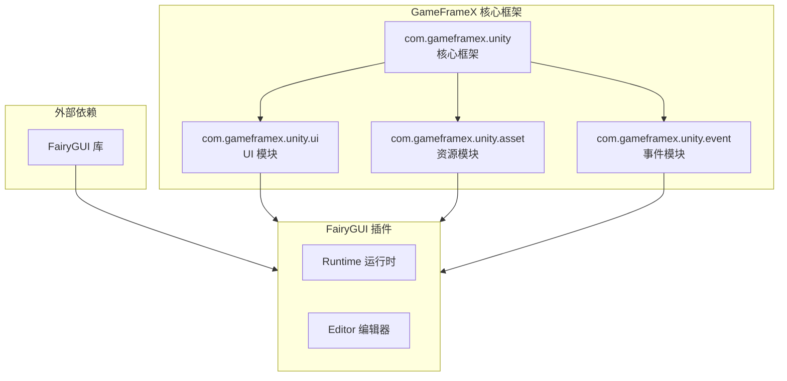
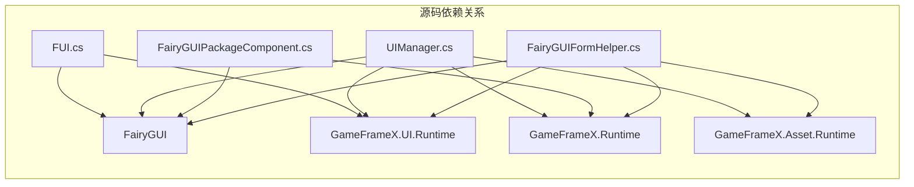

# 依赖設定

このドキュメント介绍 GameFrameX UI FairyGUI コンポーネント的依赖設定要求，含みます必需的コアフレームワーク依赖和外部库依赖。

## 概要

GameFrameX UI FairyGUI コンポーネントは基于 FairyGUI 的 Unity UI 機能パッケージ，它依赖于 GameFrameX コアフレームワーク和 FairyGUI 第3方库。正确設定这些依赖是確認してくださいプラグイン正常工作的前提条件。

## 依赖アーキテクチャ



## コア依赖

### GameFrameX フレームワーク依赖

| 依赖パッケージ | 最低バージョン | 説明 |
|--------|----------|------|
| com.gameframex.unity | 1.1.1 | GameFrameX コアフレームワーク，提供基本アーキテクチャ和コンポーネント系统 |
| com.gameframex.unity.ui | 1.0.0 | UI 基本モジュール，定義 UIForm、UIComponent 等コア类 |
| com.gameframex.unity.asset | 1.0.6 | リソース管理モジュール，负责リソースロード和アンロード |
| com.gameframex.unity.event | 1.0.0 | イベント系统モジュール，提供イベント購読和リリース機能 |

### package.json 中的依赖設定

```json
{
  "dependencies": {
    "com.gameframex.unity": "1.1.1",
    "com.gameframex.unity.ui": "1.0.0",
    "com.gameframex.unity.asset": "1.0.6",
    "com.gameframex.unity.event": "1.0.0"
  }
}
```
> Source: [package.json](https://github.com/GameFrameX/com.gameframex.unity.ui.fairygui/blob/main/package.json#L21-L26)

## 外部依赖

### FairyGUI 库

FairyGUI 是プラグイン的コア依赖，提供します完全な的 UI フレームワーク機能。

| コンポーネント | 説明 |
|------|------|
| FairyGUI.Runtime | FairyGUI ランタイム库，提供 GObject、GComponent、UIPackage 等コア类 |
| FairyGUI.Editor | FairyGUI エディタ拡張，用于在 Unity Editor 中编辑 UI |

**取得方法：**
- 从 [FairyGUI 官网](https://www.fairygui.com/) 下载官方 Unity 集成パッケージ
- 通过 Unity Package Manager 导入 FairyGUI

### FairyGUI 与 GameFrameX 的集成

FairyGUI プラグイン通过以下名前空間集成到 GameFrameX フレームワーク中：

```csharp
using FairyGUI;                           // FairyGUI 核心库
using GameFrameX.Runtime;                 // GameFrameX 核心运行时
using GameFrameX.Asset.Runtime;           // 资源管理
using GameFrameX.UI.Runtime;              // UI 基础模块
using GameFrameX.UI.FairyGUI.Runtime;     // FairyGUI 插件运行时
```
> Source: [FairyGUIPackageComponent.cs](https://github.com/GameFrameX/com.gameframex.unity.ui.fairygui/blob/main/Runtime/FairyGUIPackageComponent.cs#L30-L35)

## 系统要求

### Unity バージョン要求

| 要求 | 规格 |
|------|------|
| 最低バージョン | Unity 2019.4 |
| 推奨バージョン | Unity 2021.3 LTS 或更高 |

### 依赖关系详解



### コア类依赖对照表

| プラグイン类 | 依赖的 GameFrameX 类 | 依赖的 FairyGUI 类 |
|--------|---------------------|-------------------|
| FUI | UIForm | GObject |
| UIManager | BaseUIManager | UIPackage |
| FairyGUIPackageComponent | GameFrameworkComponent | UIPackage |
| FairyGUIFormHelper | UIFormHelperBase | GComponent |
| GObjectHelper | - | GObject, FUI |

## Unity プロジェクト設定

### 1. インストール GameFrameX コアフレームワーク

在 Unity プロジェクト中インストール GameFrameX コアフレームワーク及其依赖：

```json
// manifest.json 示例
{
  "dependencies": {
    "com.gameframex.unity": "1.1.1",
    "com.gameframex.unity.ui": "1.0.0",
    "com.gameframex.unity.asset": "1.0.6",
    "com.gameframex.unity.event": "1.0.0"
  }
}
```

### 2. インストール FairyGUI

从 FairyGUI 官网下载并导入 Unity パッケージ，確認してくださいパッケージ含：
- Runtime ディレクトリ（コアランタイム）
- Editor ディレクトリ（エディタ拡張）

### 3. インストール FairyGUI プラグイン

将 GameFrameX UI FairyGUI コンポーネント追加到プロジェクト中：

```json
{
  "dependencies": {
    "com.gameframex.unity.ui.fairygui": "https://github.com/gameframex/com.gameframex.unity.ui.fairygui.git"
  }
}
```

> 詳細インストールステップ请参照 [インストール方法](./2-installation.1-install-methods) ドキュメント。

## 依赖検証

インストール完成后，以下类〜すべき〜できます正常访问：

```csharp
// GameFrameX 核心类
using GameFrameX.Runtime;
using GameFrameX.Asset.Runtime;
using GameFrameX.UI.Runtime;

// FairyGUI 类
using FairyGUI;

// FairyGUI 插件类
using GameFrameX.UI.FairyGUI.Runtime;
```

## バージョン互換性

| プラグインバージョン | Unity バージョン | GameFrameX バージョン | FairyGUI バージョン |
|----------|-----------|-----------------|---------------|
| 3.2.x | 2019.4+ | 1.1.x | 官方最新バージョン |
| 3.1.x | 2019.4+ | 1.0.x | 官方最新バージョン |

## よくある問題

### Q1: インストール后出现名前空間找不到エラー

**解決策：** 確認してください已正确インストール所有 GameFrameX 依赖パッケージ。確認 manifest.json 中是否パッケージ含所有必需的依赖。

### Q2: FairyGUI 类ヒント找不到

**解決策：** 確認してください已インストール FairyGUI 官方パッケージ，かつ FairyGUI.dll 已正确放置在プロジェクト中。

### Q3: バージョン不兼容警告

**解決策：** 確認 Unity バージョン是否满足最低要求（2019.4），并確認してください所有 GameFrameX 依赖パッケージバージョン符合要求。

## 関連リンク

- [インストール方法](./2-installation.1-install-methods) - 詳細インストールステップ
- [プラグイン介绍](./1-overview.1-introduction) - プラグイン機能概要
- [系统要求](./1-overview.3-requirements) - 系统要求详情
- [GitHub リポジトリ](https://github.com/GameFrameX/com.gameframex.unity.ui.fairygui.git) - 官方リポジトリ
- [官方ドキュメント](https://gameframex.doc.alianblank.com/) - GameFrameX ドキュメント中心
