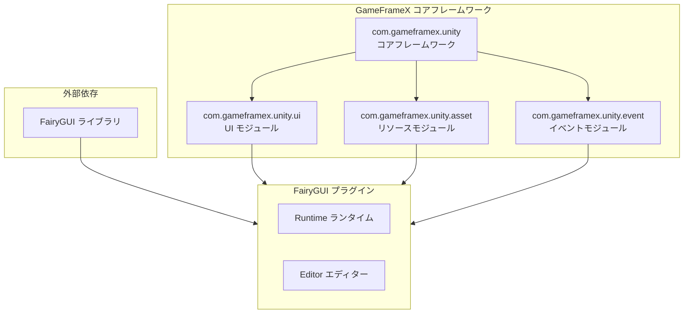
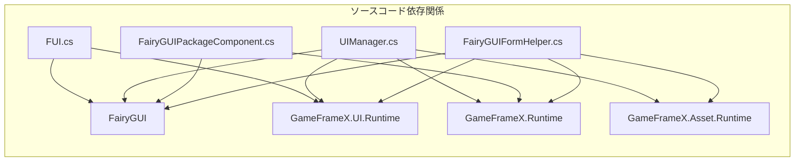

# 依存関係設定

このドキュメントでは、GameFrameX UI FairyGUI コンポーネントの依存関係設定要件について説明します。コアフレームワークの必須の依存関係と外部ライブラリの依存関係を含みます。

## 概要

GameFrameX UI FairyGUI コンポーネントは、FairyGUI に基づく Unity UI 機能パッケージであり、GameFrameX コアフレームワークと FairyGUI サードパーティライブラリに依存します。これらの依存関係を正しく設定することが、プラグインが正常に動作するための前提条件です。

## 依存関係アーキテクチャ



## コア依存関係

### GameFrameX フレームワーク依存関係

| 依存パッケージ | 最小バージョン | 説明 |
|--------|----------|------|
| com.gameframex.unity | 1.1.1 | GameFrameX コアフレームワーク、アーキテクチャとコンポーネントシステムを提供 |
| com.gameframex.unity.ui | 1.0.0 | UI ベースモジュール、UIForm、UIComponent などのコアクラスを定義 |
| com.gameframex.unity.asset | 1.0.6 | リソース管理モジュール、リソースのロードとアンロードを担当 |
| com.gameframex.unity.event | 1.0.0 | イベントシステムモジュール、イベントの購読と発行機能を提供 |

### package.json 内の依存関係設定

```json
{
  "dependencies": {
    "com.gameframex.unity": "1.1.1",
    "com.gameframex.unity.ui": "1.0.0",
    "com.gameframex.unity.asset": "1.0.6",
    "com.gameframex.unity.event": "1.0.0"
  }
}
```
> Source: [package.json](https://github.com/GameFrameX/com.gameframex.unity.ui.fairygui/blob/main/package.json#L21-L26)

## 外部依存関係

### FairyGUI ライブラリ

FairyGUI はプラグインのコア依存関係であり、完全な UI フレームワーク機能を提供します。

| コンポーネント | 説明 |
|------|------|
| FairyGUI.Runtime | FairyGUI ランタイムライブラリ、GObject、GComponent、UIPackage などのコアクラスを提供 |
| FairyGUI.Editor | FairyGUI エディター拡張、Unity Editor での UI 編集に使用 |

**取得方法：**
- [FairyGUI 公式サイト](https://www.fairygui.com/) から公式 Unity 統合パッケージをダウンロード
- Unity Package Manager を通じて FairyGUI をインポート

### FairyGUI と GameFrameX の統合

FairyGUI プラグインは以下の名前空間を通じて GameFrameX フレームワークに統合されます：

```csharp
using FairyGUI;                           // FairyGUI コアライブラリ
using GameFrameX.Runtime;                 // GameFrameX コアランタイム
using GameFrameX.Asset.Runtime;           // リソース管理
using GameFrameX.UI.Runtime;              // UI ベースモジュール
using GameFrameX.UI.FairyGUI.Runtime;     // FairyGUI プラグインランタイム
```
> Source: [FairyGUIPackageComponent.cs](https://github.com/GameFrameX/com.gameframex.unity.ui.fairygui/blob/main/Runtime/FairyGUIPackageComponent.cs#L30-L35)

## システム要件

### Unity バージョン要件

| 要件 | 仕様 |
|------|------|
| 最小バージョン | Unity 2019.4 |
| 推奨バージョン | Unity 2021.3 LTS 以上 |

### 依存関係詳細



### コアクラス依存関係対応表

| プラグインクラス | 依存する GameFrameX クラス | 依存する FairyGUI クラス |
|--------|---------------------|-------------------|
| FUI | UIForm | GObject |
| UIManager | BaseUIManager | UIPackage |
| FairyGUIPackageComponent | GameFrameworkComponent | UIPackage |
| FairyGUIFormHelper | UIFormHelperBase | GComponent |
| GObjectHelper | - | GObject, FUI |

## Unity プロジェクト設定

### 1. GameFrameX コアフレームワークのインストール

Unity プロジェクトに GameFrameX コアフレームワークとその依存関係をインストールします：

```json
// manifest.json 例
{
  "dependencies": {
    "com.gameframex.unity": "1.1.1",
    "com.gameframex.unity.ui": "1.0.0",
    "com.gameframex.unity.asset": "1.0.6",
    "com.gameframex.unity.event": "1.0.0"
  }
}
```

### 2. FairyGUI のインストール

FairyGUI 公式サイトから Unity パッケージをダウンロードしてインポートし、以下が含まれていることを確認します：
- Runtime ディレクトリ（コアランタイム）
- Editor ディレクトリ（エディター拡張）

### 3. FairyGUI プラグインのインストール

GameFrameX UI FairyGUI コンポーネントをプロジェクトに追加します：

```json
{
  "dependencies": {
    "com.gameframex.unity.ui.fairygui": "https://github.com/gameframex/com.gameframex.unity.ui.fairygui.git"
  }
}
```

> 詳細なインストール手順については、[インストール方法](./2-installation.1-install-methods) ドキュメントを参照してください。

## 依存関係検証

インストール完了後、以下のクラスに正常にアクセスできるはずです：

```csharp
// GameFrameX コアクラス
using GameFrameX.Runtime;
using GameFrameX.Asset.Runtime;
using GameFrameX.UI.Runtime;

// FairyGUI クラス
using FairyGUI;

// FairyGUI プラグインクラス
using GameFrameX.UI.FairyGUI.Runtime;
```

## バージョン互換性

| プラグインバージョン | Unity バージョン | GameFrameX バージョン | FairyGUI バージョン |
|----------|-----------|-----------------|---------------|
| 3.2.x | 2019.4+ | 1.1.x | 公式最新バージョン |
| 3.1.x | 2019.4+ | 1.0.x | 公式最新バージョン |

## よくある質問

### Q1: インストール後、名前空間が見つからないエラーが発生する

**解決策：** すべての GameFrameX 依存パッケージが正しくインストールされていることを確認してください。manifest.json にすべての必須の依存関係が含まれているか確認してください。

### Q2: FairyGUI クラスが見つからないというヒントが表示される

**解決策：** FairyGUI 公式パッケージがインストールされていること、および FairyGUI.dll がプロジェクトに正しく配置されていることを確認してください。

### Q3: バージョン非互換性警告

**解決策：** Unity バージョンが最小要件（2019.4）を満たしていることを確認し、すべての GameFrameX 依存パッケージのバージョンが要件を満たしていることを確認してください。

## 関連リンク

- [インストール方法](./2-installation.1-install-methods) - 詳細なインストール手順
- [プラグイン紹介](./1-overview.1-introduction) - プラグイン機能概要
- [システム要件](./1-overview.3-requirements) - システム要件詳細
- [GitHub リポジトリ](https://github.com/GameFrameX/com.gameframex.unity.ui.fairygui.git) - 公式リポジトリ
- [公式ドキュメント](https://gameframex.doc.alianblank.com/) - GameFrameX ドキュメントセンター