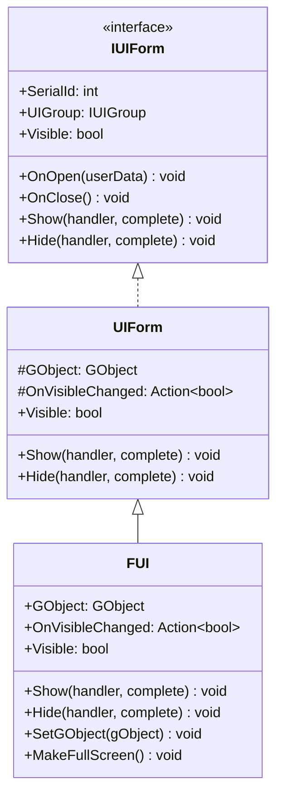
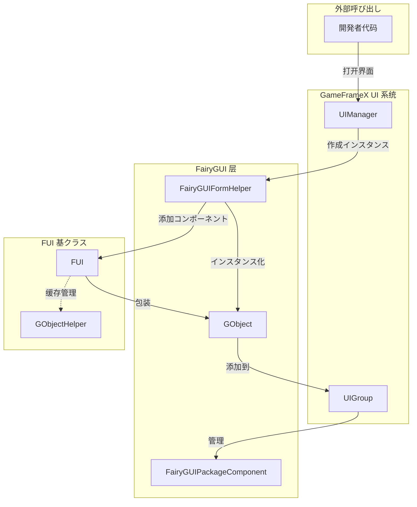

# FUI 界面基クラス

FUI 是 GameFrameX 插件中 FairyGUI 界面的基クラス，を継承 UIForm，提供 FairyGUI 特定的界面機能実装。

## 概要

`FUI` クラス是 FairyGUI 界面系统的コア基クラス，它将 FairyGUI 的 `GObject` 与 GameFrameX 的 UI 系统进行桥接。を通じて继承 `FUI`，開発者可能作成遵循统一架构的 FairyGUI 界面，并自动获得以下機能：

- 与 GameFrameX UI 系统的无缝集成
- 统一的显示/隐藏动画サポート
- 可见性ステータス管理和イベント回调
- 全屏显示模式サポート
- GObject 生命周期管理

### 继承关系



## アーキテクチャ設計

### コアコンポーネント交互



### 界面生命周期


## コア機能

### 1. GObject 关联

FUI を通じて `GObject` プロパティ关联 FairyGUI 的界面对象，这是与 FairyGUI 系统交互的コアエントリーポイント。

```csharp
// 源码路径: Runtime/FUI.cs#L45-L53
[UnityEngine.Scripting.Preserve]
public class FUI : UIForm
{
    /// <summary>
    /// 取得关联的 FairyGUI GObject 对象。
    /// </summary>
    [UnityEngine.Scripting.Preserve]
    public GObject GObject { get; private set; }
```
> Source: [FUI.cs](https://github.com/GameFrameX/com.gameframex.unity.ui.fairygui/blob/main/Runtime/FUI.cs#L45-L53)

### 2. 可见性管理

FUI 提供します完善的可见性管理机制，包括内部設定和プロパティ访问。

```csharp
// 源码路径: Runtime/FUI.cs#L115-L155
/// <summary>
/// 内部設定界面的显示ステータス，不发出イベント。
/// </summary>
[UnityEngine.Scripting.Preserve]
protected override void InternalSetVisible(bool value)
{
    if (GObject.visible == value)
    {
        return;
    }

    GObject.visible = value;
    OnVisibleChanged?.Invoke(value);
    EventSubscriber?.Fire(UIFormVisibleChangedEventArgs.EventId, UIFormVisibleChangedEventArgs.Create(this, value));
}

/// <summary>
/// 取得或設定界面是否可见。
/// </summary>
[UnityEngine.Scripting.Preserve]
public override bool Visible
{
    get
    {
        if (GObject == null)
        {
            return false;
        }

        return GObject.visible;
    }
    protected set
    {
        if (GObject == null)
        {
            return;
        }

        InternalSetVisible(value);
    }
}
```
> Source: [FUI.cs](https://github.com/GameFrameX/com.gameframex.unity.ui.fairygui/blob/main/Runtime/FUI.cs#L115-L155)

### 3. 显示/隐藏动画

FUI を継承 UIForm 的动画配置，サポート显示和隐藏动画。

```csharp
// 源码路径: Runtime/FUI.cs#L74-L105
/// <summary>
/// 显示界面。
/// </summary>
[UnityEngine.Scripting.Preserve]
public override void Show(IUIFormShowHandler handler, Action complete)
{
    if (handler != null)
    {
        handler.Handler(GObject, EnableShowAnimation, ShowAnimationName, complete);
    }
    else
    {
        complete?.Invoke();
    }
}

/// <summary>
/// 隐藏界面。
/// </summary>
[UnityEngine.Scripting.Preserve]
public override void Hide(IUIFormHideHandler handler, Action complete)
{
    if (handler != null)
    {
        handler.Handler(GObject, EnableHideAnimation, HideAnimationName, complete);
    }
    else
    {
        complete?.Invoke();
    }
}
```
> Source: [FUI.cs](https://github.com/GameFrameX/com.gameframex.unity.ui.fairygui/blob/main/Runtime/FUI.cs#L74-L105)

### 4. 全屏显示

`MakeFullScreen()` メソッド将界面設定为全屏显示模式。

```csharp
// 源码路径: Runtime/FUI.cs#L165-L168
/// <summary>
/// 将当前 UI 对象設定为全屏显示。
/// </summary>
[UnityEngine.Scripting.Preserve]
protected override void MakeFullScreen()
{
    GObject?.asCom?.MakeFullScreen();
}
```
> Source: [FUI.cs](https://github.com/GameFrameX/com.gameframex.unity.ui.fairygui/blob/main/Runtime/FUI.cs#L165-L168)

## 作成自定义界面

### 基本手順

1. 作成一个を継承 `FUI` 的クラス
2. 実装 `InitView()` メソッド初期化界面
3. 重写生命周期メソッド如 `OnOpen`、`OnClose` 等

### 例代码

```csharp
using FairyGUI;
using GameFrameX.UI.FairyGUI.Runtime;

public class MainMenuForm : FUI
{
    private GButton _startButton;
    private GTextField _titleText;

    public MainMenuForm(GObject gObject, bool isRoot = false) : base(gObject, isRoot)
    {
    }

    protected override void InitView()
    {
        base.InitView();
        
        // 取得界面コンポーネント
        _startButton = GObject.GetChild("btn_start");
        _titleText = GObject.GetChild("txt_title");
        
        // 绑定イベント
        _startButton.onClick.Add(OnStartButtonClick);
    }

    private void OnStartButtonClick()
    {
        // 处理开始按钮点击
    }

    protected override void OnOpen(object userData)
    {
        base.OnOpen(userData);
        // 界面打开时的逻辑
    }

    protected override void OnClose()
    {
        // 界面关闭时的清理逻辑
        _startButton.onClick.Remove(OnStartButtonClick);
        base.OnClose();
    }
}
```
> Source: [FUI.cs](https://github.com/GameFrameX/com.gameframex.unity.ui.fairygui/blob/main/Runtime/FUI.cs#L179-L197)

## GObjectHelper 工具クラス

`GObjectHelper` 提供 FUI 对象的缓存和管理機能，方便在 GObject 和 FUI 之间建立映射关系。

```csharp
// 源码路径: Runtime/GObjectHelper.cs#L42-L115
namespace GameFrameX.UI.FairyGUI.Runtime
{
    /// <summary>
    /// GObject 辅助クラス，提供 FUI 对象的缓存和管理機能。
    /// </summary>
    [UnityEngine.Scripting.Preserve]
    public static class GObjectHelper
    {
        private static readonly Dictionary<GObject, FUI> s_GObjectToFuiMap = new Dictionary<GObject, FUI>();

        /// <summary>
        /// 从コンポーネント池中取得关联的 FUI 对象。
        /// </summary>
        [UnityEngine.Scripting.Preserve]
        public static T Get<T>(this GObject self) where T : FUI
        {
            if (self != null && s_GObjectToFuiMap.TryGetValue(self, out var pair))
            {
                return pair as T;
            }

            return default(T);
        }

        /// <summary>
        /// 将 FUI 对象添加到コンポーネント池。
        /// </summary>
        [UnityEngine.Scripting.Preserve]
        public static void Add(this GObject self, FUI fui)
        {
            if (self != null && fui != null)
            {
                s_GObjectToFuiMap[self] = fui;
            }
        }

        /// <summary>
        /// 从コンポーネント池中删除 FUI 对象。
        /// </summary>
        [UnityEngine.Scripting.Preserve]
        public static FUI Remove(this GObject self)
        {
            if (self != null && s_GObjectToFuiMap.TryGetValue(self, out var value))
            {
                s_GObjectToFuiMap.Remove(self);
                return value;
            }

            return default;
        }

        /// <summary>
        /// 清理所有缓存的 FUI 对象。
        /// </summary>
        [UnityEngine.Scripting.Preserve]
        public static void ClearAll()
        {
            s_GObjectToFuiMap.Clear();
        }
    }
}
```
> Source: [GObjectHelper.cs](https://github.com/GameFrameX/com.gameframex.unity.ui.fairygui/blob/main/Runtime/GObjectHelper.cs#L42-L115)

## 可绑定プロパティ扩展

`BindablePropertyExtension` 提供します在 FairyGUI 环境下使用可绑定プロパティ的便捷メソッド，自动处理 GObject 销毁时的プロパティ清理。

```csharp
// 源码路径: Runtime/BindablePropertyExtension.cs#L42-L57
namespace GameFrameX.UI.FairyGUI.Runtime
{
    public static class BindablePropertyExtension
    {
        /// <summary>
        /// 在 FairyGUI 环境下使用此メソッド，当 GObject 销毁时自动注销绑定プロパティ的イベント。
        /// </summary>
        [UnityEngine.Scripting.Preserve]
        public static void ClearWithGObjectDestroyed<T>(this BindableProperty<T> bindableProperty, GObject gObject)
        {
            gObject.onRemovedFromStage.Add(bindableProperty.Clear);
        }
    }
}
```
> Source: [BindablePropertyExtension.cs](https://github.com/GameFrameX/com.gameframex.unity.ui.fairygui/blob/main/Runtime/BindablePropertyExtension.cs#L42-L57)

## API 参考

### FUI クラス

#### プロパティ

| プロパティ名 | クラス型 | 可读 | 可写 | 説明 |
|--------|------|------|------|------|
| `GObject` | `GObject` | ✅ | ❌ | 取得关联的 FairyGUI GObject 对象 |
| `OnVisibleChanged` | `Action<bool>` | ✅ | ✅ | 取得或設定可见性改变イベント的回调 |
| `Visible` | `bool` | ✅ | ✅ | 取得或設定界面可见性 |
| `EnableShowAnimation` | `bool` | ✅ | ✅ | 是否启用显示动画（を継承 UIForm） |
| `ShowAnimationName` | `string` | ✅ | ✅ | 显示动画名称（を継承 UIForm） |
| `EnableHideAnimation` | `bool` | ✅ | ✅ | 是否启用隐藏动画（を継承 UIForm） |
| `HideAnimationName` | `string` | ✅ | ✅ | 隐藏动画名称（を継承 UIForm） |

#### メソッド

| メソッド名 | 返回クラス型 | 説明 |
|--------|----------|------|
| `Show(handler, complete)` | `void` | 显示界面 |
| `Hide(handler, complete)` | `void` | 隐藏界面 |
| `InternalSetVisible(value)` | `void` | 内部設定可见性 |
| `MakeFullScreen()` | `void` | 設定为全屏显示 |
| `SetGObject(gObject)` | `void` | 設定关联的 GObject 对象 |
| `InitView()` | `void` | 初期化视图（可重写） |
| `OnOpen(userData)` | `void` | 界面打开回调（可重写） |
| `OnClose()` | `void` | 界面关闭回调（可重写） |
| `OnPause()` | `void` | 界面暂停回调（可重写） |
| `OnResume()` | `void` | 界面恢复回调（可重写） |

### GObjectHelper 静态クラス

| メソッド名 | 返回クラス型 | 説明 |
|--------|----------|------|
| `Get<T>(GObject)` | `T` | 从缓存中取得关联的 FUI 对象 |
| `Add(GObject, FUI)` | `void` | 将 FUI 对象添加到缓存 |
| `Remove(GObject)` | `FUI` | 从缓存中移除 FUI 对象 |
| `ClearAll()` | `void` | 清空所有缓存 |

## 関連リンク

- [界面管理器](./4-core-concepts.2-ui-manager)
- [パッケージ管理器](./4-core-concepts.3-package-manager)
- [界面辅助器](./4-core-concepts.4-form-helper)
- [界面组辅助器](./4-core-concepts.5-ui-group-helper)
- [FUI クラス API 参考](./5-api-reference.1-fui-class)
- [FairyGUIPackageComponent クラス API 参考](./5-api-reference.2-package-component)
- [作成第一个界面](./3-getting-started.1-first-ui-form)
