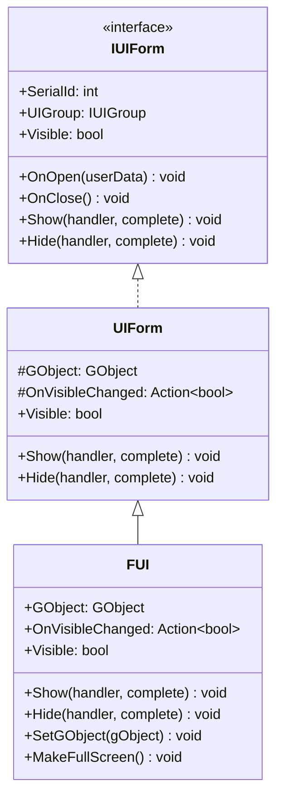
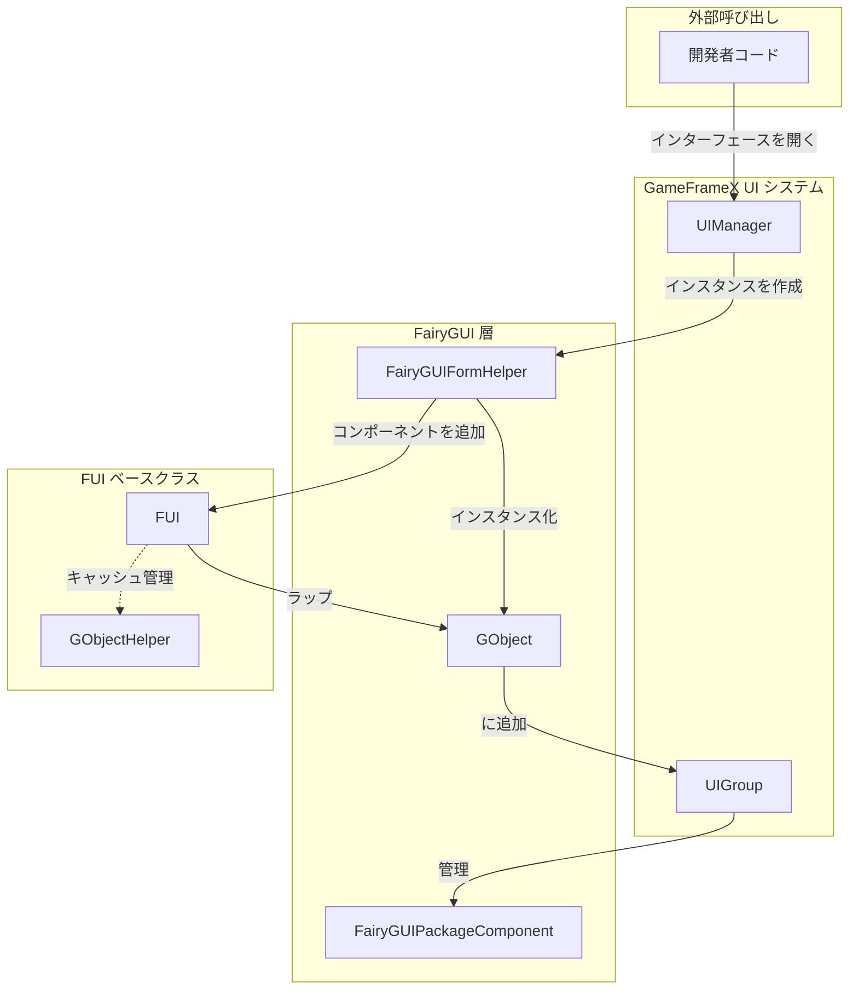
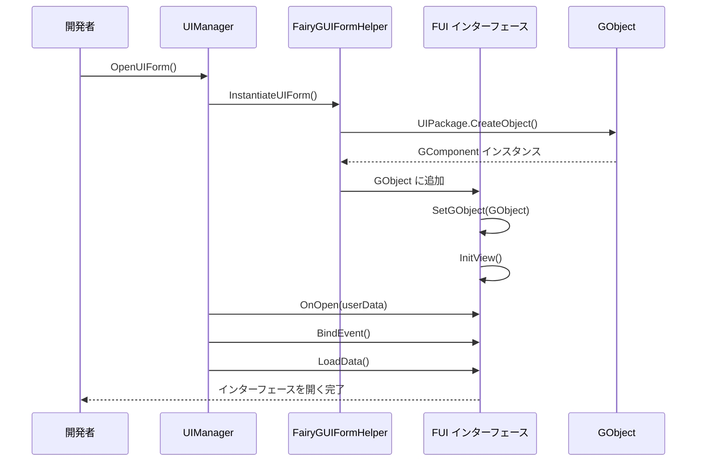

# FUI インターフェースベースクラス

FUI は、GameFrameX プラグインにおいて FairyGUI インターフェースのベースクラスであり、UIForm を継承し、FairyGUI 固有のインターフェース機能を提供します。

## 概要

`FUI` クラスは、FairyGUI インターフェースシステムのコアベースクラスです。FairyGUI の `GObject` と GameFrameX の UI システムをブリッジします。`FUI` を継承することで、開発者は統一されたアーキテクチャに従った FairyGUI インターフェースを作成し、以下の機能を自動的に取得できます：

- GameFrameX UI システムとのシームレスな統合
- 統一された表示/非表示アニメーションサポート
- 可視性状態管理とイベントコールバック
- 全画面表示モードサポート
- GObject ライフサイクル管理

### 継承関係



## アーキテクチャ設計

### コアコンポーネント相互作用



### インターフェースライフサイクル



## コア機能

### 1. GObject 関連付け

FUI は `GObject` プロパティを通じて FairyGUI のインターフェースオブジェクトを関連付け、これは FairyGUI システムと対話するコアエントリポイントです。

```csharp
// ソースパス: Runtime/FUI.cs#L45-L53
[UnityEngine.Scripting.Preserve]
public class FUI : UIForm
{
    /// <summary>
    /// 関連する FairyGUI GObject オブジェクトを取得。
    /// </summary>
    [UnityEngine.Scripting.Preserve]
    public GObject GObject { get; private set; }
```
> Source: [FUI.cs](https://github.com/GameFrameX/com.gameframex.unity.ui.fairygui/blob/main/Runtime/FUI.cs#L45-L53)

### 2. 可視性管理

FUI は、内部設定とプロパティアクセスを含む、完全な可視性管理メカニズムを提供します。

```csharp
// ソースパス: Runtime/FUI.cs#L115-L155
/// <summary>
/// インターフェースを表示状態を設定。イベントを発しない。
/// </summary>
[UnityEngine.Scripting.Preserve]
protected override void InternalSetVisible(bool value)
{
    if (GObject.visible == value)
    {
        return;
    }

    GObject.visible = value;
    OnVisibleChanged?.Invoke(value);
    EventSubscriber?.Fire(UIFormVisibleChangedEventArgs.EventId, UIFormVisibleChangedEventArgs.Create(this, value));
}

/// <summary>
/// インターフェースが表示されているかどうかを取得または設定。
/// </summary>
[UnityEngine.Scripting.Preserve]
public override bool Visible
{
    get
    {
        if (GObject == null)
        {
            return false;
        }

        return GObject.visible;
    }
    protected set
    {
        if (GObject == null)
        {
            return;
        }

        InternalSetVisible(value);
    }
}
```
> Source: [FUI.cs](https://github.com/GameFrameX/com.gameframex.unity.ui.fairygui/blob/main/Runtime/FUI.cs#L115-L155)

### 3. 表示/非表示アニメーション

FUI は UIForm から継承したアニメーション設定をサポートし、表示と非表示アニメーションを提供します。

```csharp
// ソースパス: Runtime/FUI.cs#L74-L105
/// <summary>
/// インターフェースを表示。
/// </summary>
[UnityEngine.Scripting.Preserve]
public override void Show(IUIFormShowHandler handler, Action complete)
{
    if (handler != null)
    {
        handler.Handler(GObject, EnableShowAnimation, ShowAnimationName, complete);
    }
    else
    {
        complete?.Invoke();
    }
}

/// <summary>
/// インターフェースを非表示化。
/// </summary>
[UnityEngine.Scripting.Preserve]
public override void Hide(IUIFormHideHandler handler, Action complete)
{
    if (handler != null)
    {
        handler.Handler(GObject, EnableHideAnimation, HideAnimationName, complete);
    }
    else
    {
        complete?.Invoke();
    }
}
```
> Source: [FUI.cs](https://github.com/GameFrameX/com.gameframex.unity.ui.fairygui/blob/main/Runtime/FUI.cs#L74-L105)

### 4. 全画面表示

`MakeFullScreen()` メソッドは、インターフェースを全画面表示モードに設定します。

```csharp
// ソースパス: Runtime/FUI.cs#L165-L168
/// <summary>
/// 現在の UI オブジェクトを全画面表示に設定。
/// </summary>
[UnityEngine.Scripting.Preserve]
protected override void MakeFullScreen()
{
    GObject?.asCom?.MakeFullScreen();
}
```
> Source: [FUI.cs](https://github.com/GameFrameX/com.gameframex.unity.ui.fairygui/blob/main/Runtime/FUI.cs#L165-L168)

## カスタムインターフェースの作成

### 基本手順

1. `FUI` を継承するクラスを作成
2. `InitView()` メソッドを実装してインターフェースを初期化
3. `OnOpen`、`OnClose` などのライフサイクルメソッドをオーバーライド

### サンプルコード

```csharp
using FairyGUI;
using GameFrameX.UI.FairyGUI.Runtime;

public class MainMenuForm : FUI
{
    private GButton _startButton;
    private GTextField _titleText;

    public MainMenuForm(GObject gObject, bool isRoot = false) : base(gObject, isRoot)
    {
    }

    protected override void InitView()
    {
        base.InitView();

        // インターフェースコンポーネントを取得
        _startButton = GObject.GetChild("btn_start");
        _titleText = GObject.GetChild("txt_title");

        // イベントをバインド
        _startButton.onClick.Add(OnStartButtonClick);
    }

    private void OnStartButtonClick()
    {
        // スタートボタンのクリックを処理
    }

    protected override void OnOpen(object userData)
    {
        base.OnOpen(userData);
        // インターフェースを開く時のロジック
    }

    protected override void OnClose()
    {
        // インターフェースを閉じる時のクリーンアップロジック
        _startButton.onClick.Remove(OnStartButtonClick);
        base.OnClose();
    }
}
```
> Source: [FUI.cs](https://github.com/GameFrameX/com.gameframex.unity.ui.fairygui/blob/main/Runtime/FUI.cs#L179-L197)

## GObjectHelper ユーティリティクラス

`GObjectHelper` は、FUI オブジェクトのキャッシュと管理機能を提供し、GObject と FUI の間にマッピング関係を確立便于。

```csharp
// ソースパス: Runtime/GObjectHelper.cs#L42-L115
namespace GameFrameX.UI.FairyGUI.Runtime
{
    /// <summary>
    /// GObject ヘルパークラス。FUI オブジェクトのキャッシュと管理機能を提供。
    /// </summary>
    [UnityEngine.Scripting.Preserve]
    public static class GObjectHelper
    {
        private static readonly Dictionary<GObject, FUI> s_GObjectToFuiMap = new Dictionary<GObject, FUI>();

        /// <summary>
        /// コンポーネントプールから関連する FUI オブジェクトを取得。
        /// </summary>
        [UnityEngine.Scripting.Preserve]
        public static T Get<T>(this GObject self) where T : FUI
        {
            if (self != null && s_GObjectToFuiMap.TryGetValue(self, out var pair))
            {
                return pair as T;
            }

            return default(T);
        }

        /// <summary>
        /// FUI オブジェクトをコンポーネントプールに追加。
        /// </summary>
        [UnityEngine.Scripting.Preserve]
        public static void Add(this GObject self, FUI fui)
        {
            if (self != null && fui != null)
            {
                s_GObjectToFuiMap[self] = fui;
            }
        }

        /// <summary>
        /// コンポーネントプールから FUI オブジェクトを削除。
        /// </summary>
        [UnityEngine.Scripting.Preserve]
        public static FUI Remove(this GObject self)
        {
            if (self != null && s_GObjectToFuiMap.TryGetValue(self, out var value))
            {
                s_GObjectToFuiMap.Remove(self);
                return value;
            }

            return default;
        }

        /// <summary>
        /// キャッシュされたすべての FUI オブジェクトを清理。
        /// </summary>
        [UnityEngine.Scripting.Preserve]
        public static void ClearAll()
        {
            s_GObjectToFuiMap.Clear();
        }
    }
}
```
> Source: [GObjectHelper.cs](https://github.com/GameFrameX/com.gameframex.unity.ui.fairygui/blob/main/Runtime/GObjectHelper.cs#L42-L115)

## バインディング可能なプロパティ拡張

`BindablePropertyExtension` は、FairyGUI 環境でバインディング可能なプロパティを使用する便利な方法を提供し、GObject が破棄された時にプロパティを自動的に清理します。

```csharp
// ソースパス: Runtime/BindablePropertyExtension.cs#L42-L57
namespace GameFrameX.UI.FairyGUI.Runtime
{
    public static class BindablePropertyExtension
    {
        /// <summary>
        /// FairyGUI 環境でこのメソッドを使用すると、GObject が破棄された時にバインディングプロパティのイベントが自動的に解除されます。
        /// </summary>
        [UnityEngine.Scripting.Preserve]
        public static void ClearWithGObjectDestroyed<T>(this BindableProperty<T> bindableProperty, GObject gObject)
        {
            gObject.onRemovedFromStage.Add(bindableProperty.Clear);
        }
    }
}
```
> Source: [BindablePropertyExtension.cs](https://github.com/GameFrameX/com.gameframex.unity.ui.fairygui/blob/main/Runtime/BindablePropertyExtension.cs#L42-L57)

## API リファレンス

### FUI クラス

#### プロパティ

| プロパティ名 | タイプ | 読取 | 書込 | 説明 |
|--------|------|------|------|------|
| `GObject` | `GObject` | ✅ | ❌ | 関連する FairyGUI GObject オブジェクトを取得 |
| `OnVisibleChanged` | `Action<bool>` | ✅ | ✅ | 可視性変更イベントのコールバックを取得または設定 |
| `Visible` | `bool` | ✅ | ✅ | インターフェースの可視性を取得または設定 |
| `EnableShowAnimation` | `bool` | ✅ | ✅ | 表示アニメーションを有効にするか（UIForm から継承） |
| `ShowAnimationName` | `string` | ✅ | ✅ | 表示アニメーション名（UIForm から継承） |
| `EnableHideAnimation` | `bool` | ✅ | ✅ | 非表示アニメーションを有効にするか（UIForm から継承） |
| `HideAnimationName` | `string` | ✅ | ✅ | 非表示アニメーション名（UIForm から継承） |

#### メソッド

| メソッド名 | 戻り値タイプ | 説明 |
|--------|----------|------|
| `Show(handler, complete)` | `void` | インターフェースを表示 |
| `Hide(handler, complete)` | `void` | インターフェースを非表示化 |
| `InternalSetVisible(value)` | `void` | 内部で可視性を設定 |
| `MakeFullScreen()` | `void` | 全画面表示に設定 |
| `SetGObject(gObject)` | `void` | 関連する GObject オブジェクトを設定 |
| `InitView()` | `void` | ビューを初期化（オーバーライド可能） |
| `OnOpen(userData)` | `void` | インターフェースを開くコールバック（オーバーライド可能） |
| `OnClose()` | `void` | インターフェースを閉じるコールバック（オーバーライド可能） |
| `OnPause()` | `void` | インターフェースを一時停止するコールバック（オーバーライド可能） |
| `OnResume()` | `void` | インターフェースを再開するコールバック（オーバーライド可能） |

### GObjectHelper 静的クラス

| メソッド名 | 戻り値タイプ | 説明 |
|--------|----------|------|
| `Get<T>(GObject)` | `T` | キャッシュから関連する FUI オブジェクトを取得 |
| `Add(GObject, FUI)` | `void` | FUI オブジェクトをキャッシュに追加 |
| `Remove(GObject)` | `FUI` | キャッシュから FUI オブジェクトを削除 |
| `ClearAll()` | `void` | すべてのキャッシュをクリア |

## 関連リンク

- [インターフェースマネージャー](./4-core-concepts.2-ui-manager)
- [パッケージマネージャー](./4-core-concepts.3-package-manager)
- [インターフェースヘルパー](./4-core-concepts.4-form-helper)
- [インターフェースグループヘルパー](./4-core-concepts.5-ui-group-helper)
- [FUI クラス API リファレンス](./5-api-reference.1-fui-class)
- [FairyGUIPackageComponent クラス API リファレンス](./5-api-reference.2-package-component)
- [最初のインターフェースを作成](./3-getting-started.1-first-ui-form)