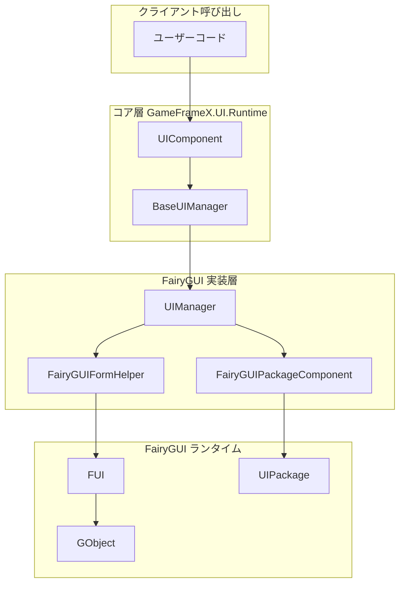
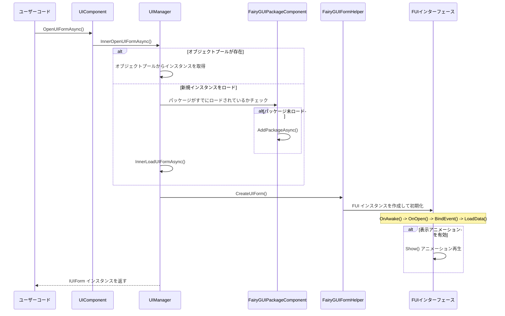
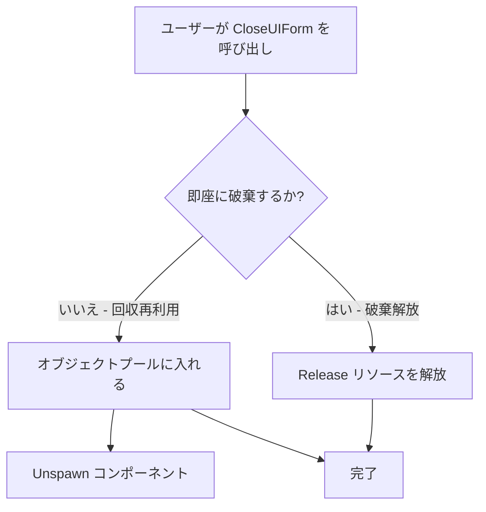
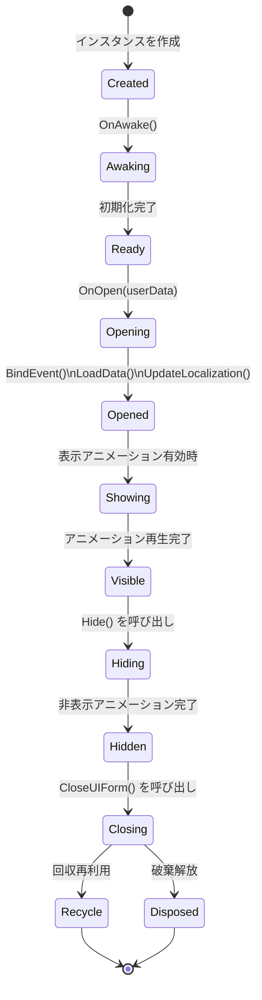

# インターフェースを開く・閉じる

このドキュメントでは、GameFrameX フレームワークで FairyGUI プラグインを使用してインターフェースを開く・閉じる方法を説明します。

## 概要

GameFrameX フレームワークでは、インターフェースのオープン・クローズ操作はコアの UIComponent によって一元管理され、FairyGUI プラグインは `UIManager` を通じて具体的な機能を実装します。インターフェースライフサイクル管理を理解することは、流れるような UI システムを構築するために不可欠です。

インターフェース管理は非同期ロードメカニズムを採用し、以下の機能をサポートします：
- オブジェクトプール再利用でパフォーマンスを向上
- パッケージの需要に応じたロードで、初期ロード時間を短縮
- 表示/非表示アニメーションでユーザー体験を向上
- インターフェースグループ管理でレイヤ制御をサポート

## アーキテクチャ

インターフェースを開く・閉じるには、以下のコアコンポーネントの協力が必要です：



### コンポーネント責務

| コンポーネント | 責務 |
|------|------|
| UIComponent | 公開の Open/Close インターフェースを提供 |
| UIManager | インターフェースを開く・閉じる具体的なロジックを実装 |
| FairyGUIFormHelper | UI インターフェースインスタンスの作成と解放 |
| FairyGUIPackageComponent | UI パッケージのロードとキャッシュを管理 |
| FUI | インターフェースベースクラス、GObject をラップしてライフサイクルメソッドを提供 |

## インターフェースを開くフロー

インターフェースを開くことは非同期プロセスであり、リソースロード、パッケージ管理、インスタンス作成、インターフェース初期化など複数のステップを含みます。

### コアフロー



### インターフェースを開く例

```csharp
using GameFrameX.UI.Runtime;
using GameFrameX.UI.FairyGUI.Runtime;

// 非同期でインターフェースを開く
var uiForm = await GameEntry.UI.OpenUIFormAsync(
    "UI/TestUI",           // インターフェースリソースパス
    typeof(TestUIForm),    // インターフェース論理クラス
    "MainUI"               // インターフェースグループ名
);

// ユーザーデータ付きでを開く方法
var userData = new OpenFormData { Id = 1001, Name = "Player" };
var uiFormWithData = await GameEntry.UI.OpenUIFormAsync(
    "UI/PlayerInfo",
    typeof(PlayerInfoForm),
    "MainUI",
    false,                 // 被覆されたインターフェースを一時停止するか
    userData               // インターフェースに渡すデータ
);
```

> Source: [UIManager.Open.cs](https://github.com/GameFrameX/com.gameframex.unity.ui.fairygui/blob/main/Runtime/UIManager.Open.cs#L66-L107)

### を開くパラメータの説明

| パラメータ | タイプ | 説明 |
|------|------|------|
| uiFormAssetPath | string | インターフェースリソースパス（例："UI/TestUI"） |
| uiFormType | Type | インターフェース論理クラスの型 |
| uiGroupName | string | インターフェースグループ名、レイヤ制御に使用 |
| pauseCoveredUIForm | bool | 被覆されたインターフェースを一時停止するか |
| userData | object | インターフェースに渡すカスタムデータ |
| isFullScreen | bool | 全画面表示するか |

## インターフェースを閉じるフロー

インターフェースを閉じることは、回収再利用と破棄解放の2つのモードをサポートしています。

### コアフロー



### インターフェースを閉じる例

```csharp
// インターフェースインスタンスに基づいて閉じる
var uiForm = GameEntry.UI.GetUIForm(serialId);
GameEntry.UI.CloseUIForm(uiForm);

// インターフェースタイプに基づいて閉じる（そのタイプのすべてのインターフェースを閉じる）
GameEntry.UI.CloseUIForm(typeof(TestUIForm));

// すべてのインターフェースを閉じる
GameEntry.UI.CloseAllUIForms();

// 指定したインターフェースを閉じると同時にデータを渡す
GameEntry.UI.CloseUIForm(uiForm, closeFormData);
```

> Source: [UIManager.Close.cs](https://github.com/GameFrameX/com.gameframex.unity.ui.fairygui/blob/main/Runtime/UIManager.Close.cs#L50-L79)

## インターフェースライフサイクル

FUI インターフェースは完全なライフサイクルを持ち、各段階で対応するコールバックメソッドがトリガーされます。

### ライフサイクル段階



### 各段階の説明

| 段階 | メソッド | 説明 |
|------|------|------|
| 作成 | コンストラクタ | インターフェースオブジェクトをインスタンス化 |
| 起床 | OnAwake() | インターフェース論理が初めて実行される時に呼び出し |
| 開く | OnOpen(userData) | インターフェースを開く時に呼び出し、渡されたデータを取得可能 |
| イベントバインディング | BindEvent() | インターフェースイベントリスナーをバインド |
| データロード | LoadData() | インターフェースに必要なデータをロード |
| ローカライゼーション | UpdateLocalization() | インターフェーステキストのローカライゼーションを更新 |
| 表示 | Show() | 表示アニメーションを再生（有効な場合） |
| 非表示 | Hide() | 非表示アニメーションを再生（有効な場合） |
| 回収 | OnRecycle() | インターフェースがオブジェクトプールに回収される時に呼び出し |
| 破棄 | OnClose() | インターフェースが本当に破棄される時に呼び出し |

### ライフサイクルメソッドの例

```csharp
using FairyGUI;
using GameFrameX.UI.FairyGUI.Runtime;

public class TestUIForm : FUI
{
    // インターフェースが初めて作成された時に呼び出し
    protected override void OnAwake()
    {
        base.OnAwake();
        // インターフェースコンポーネント参照を初期化
    }

    // インターフェースを開く時に呼び出し
    protected override void OnOpen(object userData)
    {
        base.OnOpen(userData);

        // 開く時に渡されたデータを受信
        if (userData is OpenFormData data)
        {
            // 渡されたデータを処理
        }
    }

    // インターフェースを閉じる時に呼び出し
    protected override void OnClose()
    {
        base.OnClose();
        // データを清理、イベント購読を解除など
    }

    // インターフェースが回収される時に呼び出し
    protected override void OnRecycle()
    {
        base.OnRecycle();
        // インターフェースステータスをリセット、再利用做准备
    }
}
```

> Source: [FUI.cs](https://github.com/GameFrameX/com.gameframex.unity.ui.fairygui/blob/main/Runtime/FUI.cs#L43-L197)

## インターフェースグループ管理

インターフェースグループは、異なるレイヤとタイプのインターフェースを管理し、インターフェースの表示優先順位制御を実装するために使用されます。

### インターフェースグループ設定

インターフェースグループは、`[OptionUIGroup]` 属性を通じてインターフェースクラスで指定します：

```csharp
using GameFrameX.UI.Runtime;

[OptionUIGroup("MainUI")]
public class MainMenuForm : FUI
{
    // インターフェース実装
}
```

> UI グループの構成の詳細については、[インターフェースグループ設定](./6-configuration.2-ui-group-config) を参照してください。

### インターフェースグループ使用例

```csharp
// インターフェースを開く時にグループを指定
await GameEntry.UI.OpenUIFormAsync(
    "UI/MainMenu",
    typeof(MainMenuForm),
    "MainUI"  // インターフェースグループ名
);

// インターフェースグループを取得
var uiGroup = GameEntry.UI.GetUIGroup("MainUI");

// グループ内のすべてのインターフェースを取得
var allForms = uiGroup.GetAllUIForms();
```

## 上級用法

### カスタム表示アニメーション

属性を通じてインターフェースの表示・非表示アニメーションを設定できます：

```csharp
using GameFrameX.UI.Runtime;

[OptionUIGroup("DialogUI")]
[OptionUIShowAnimation(true, "DialogOpen")]
[OptionUIHideAnimation(true, "DialogClose")]
public class DialogForm : FUI
{
    // インターフェース実装
}
```

### FUI オブジェクトを取得

GObjectHelper ユーティリティクラスを使用すると、GObject に対応する FUI オブジェクトを便利に取得できます：

```csharp
using GameFrameX.UI.FairyGUI.Runtime;

// GObject 拡張メソッドを通じて FUI を取得
TestUIForm fui = GObject.Get<TestUIForm>();

// FUI を GObject に関連付け
GObject.Add(fui);

// FUI 関連付けを解除
GObject.Remove();
```

> Source: [GObjectHelper.cs](https://github.com/GameFrameX/com.gameframex.unity.ui.fairygui/blob/main/Runtime/GObjectHelper.cs#L42-L114)

### インターフェース可視性変化の監視

```csharp
public class TestUIForm : FUI
{
    protected override void OnAwake()
    {
        base.OnAwake();

        // 可視性変化イベントを購読
        OnVisibleChanged = OnVisibleChangedHandler;
    }

    private void OnVisibleChangedHandler(bool visible)
    {
        if (visible)
        {
            // インターフェースが表示された
        }
        else
        {
            // インターフェースが非表示化された
        }
    }
}
```

> Source: [FUI.cs](https://github.com/GameFrameX/com.gameframex.unity.ui.fairygui/blob/main/Runtime/FUI.cs#L62-L63)

## よくある質問

### インターフェースを開くことに失敗した

インターフェースを開くことに失敗した場合は、以下を確認してください：
1. インターフェースリソースパスが正しいか
2. FairyGUI パッケージがプロジェクトに正しく追加されているか
3. インターフェースクラスが FUI を継承しているか
4. インターフェースグループ名が設定されているか

### インターフェースを閉じた後、データがリセットされていない

`OnRecycle()` メソッドでインターフェースステータスをリセットしてください：

```csharp
protected override void OnRecycle()
{
    base.OnRecycle();
    // 入力框、リストなどのコントロールステータスをリセット
    // キャッシュデータをクリア
}
```

### インターフェースアニメーションが再生されない

以下の条件を満たすか確認してください：
1. インターフェースクラスに `[OptionUIShowAnimation]` が設定されているか
2. FairyGUI エディターで対応するアニメーションが作成されているか
3. インターフェースマネージャーでアニメーション機能が有効になっているか

## 関連リンク

- [最初のインターフェースを作成](./3-getting-started.1-first-ui-form) - 新しいインターフェースを作成方法を学ぶ
- [FUI インターフェースベースクラス](./4-core-concepts.1-fui-base-class) - FUI ベースクラスを詳しく理解
- [インターフェースマネージャー](./4-core-concepts.2-ui-manager) - UIManager 詳細ドキュメント
- [インターフェースヘルパー](./4-core-concepts.4-form-helper) - FairyGUIFormHelper ドキュメント
- [パッケージマネージャー](./4-core-concepts.3-package-manager) - FairyGUIPackageComponent ドキュメント
- [インターフェースグループ設定](./6-configuration.2-ui-group-config) - インターフェースグループ設定ガイド