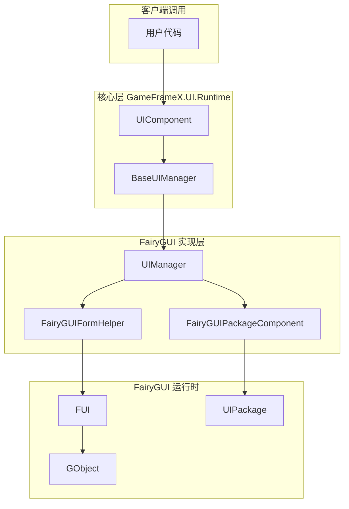
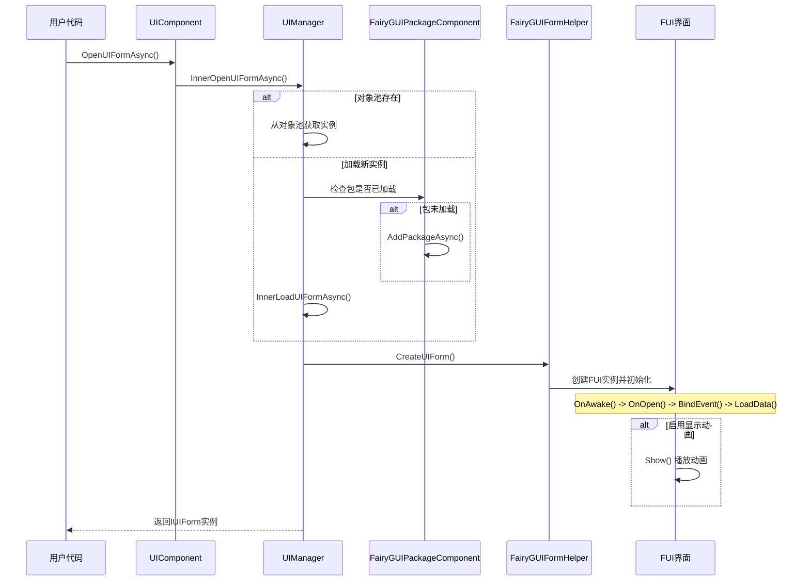
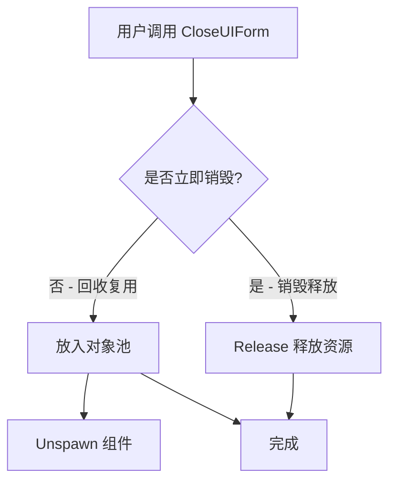
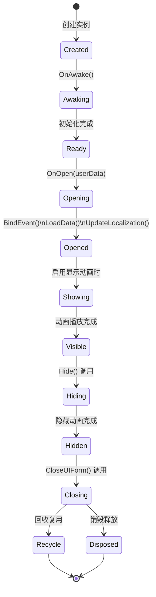

# 打开和閉じる界面

このドキュメント介绍如何在 GameFrameX フレームワーク中使用 FairyGUI プラグイン打开和閉じる界面。

## 概要

在 GameFrameX フレームワーク中，界面的打开和閉じる操作由コア的 UIComponent 統一された管理，FairyGUI プラグイン通过 `UIManager` 実装具体的機能。理解する界面ライフサイクル管理对于ビルド流畅的 UI 系统至关重要な。

界面管理采用非同期ロード机制，サポート：
- 对象池复用，提高性能
- パッケージ按需ロード，减少初始ロード时间
- 显示/隐藏动画，提升ユーザー体验
- 界面组管理，サポート层级控制

## アーキテクチャ

界面打开和閉じる涉及以下コアコンポーネント的协作：



### コンポーネント职责

| コンポーネント | 职责 |
|------|------|
| UIComponent | 提供公开的 Open/Close インターフェース |
| UIManager | 実装界面打开閉じる的具体逻辑 |
| FairyGUIFormHelper | 作成和解放 UI 界面インスタンス |
| FairyGUIPackageComponent | 管理 UI パッケージ的ロード和缓存 |
| FUI | 界面基底クラス，パッケージ装 GObject 并提供ライフサイクルメソッド |

## 打开界面フロー

界面打开は异步过程，涉及リソースロード、パッケージ管理、インスタンス作成和界面初期化等多个ステップ。

### コアフロー



### 打开界面例

```csharp
using GameFrameX.UI.Runtime;
using GameFrameX.UI.FairyGUI.Runtime;

// 异步打开界面
var uiForm = await GameEntry.UI.OpenUIFormAsync(
    "UI/TestUI",           // 界面资源路径
    typeof(TestUIForm),    // 界面逻辑类型
    "MainUI"               // 界面组名称
);

// 或者带有用户数据的打开方式
var userData = new OpenFormData { Id = 1001, Name = "Player" };
var uiFormWithData = await GameEntry.UI.OpenUIFormAsync(
    "UI/PlayerInfo",
    typeof(PlayerInfoForm),
    "MainUI",
    false,                 // 是否暂停被遮挡的界面
    userData               // 传递给界面的数据
);
```

> Source: [UIManager.Open.cs](https://github.com/GameFrameX/com.gameframex.unity.ui.fairygui/blob/main/Runtime/UIManager.Open.cs#L66-L107)

### 打开パラメータ説明

| パラメータ | タイプ | 説明 |
|------|------|------|
| uiFormAssetPath | string | 界面リソースパス，如 "UI/TestUI" |
| uiFormType | Type | 界面逻辑类的タイプ |
| uiGroupName | string | 界面组名称，用于控制层级 |
| pauseCoveredUIForm | bool | 是否暂停被遮挡的界面 |
| userData | object | 传递给界面的自定義数据 |
| isFullScreen | bool | 是否全屏显示 |

## 閉じる界面フロー

界面閉じるサポート两种モード：回收复用和破棄解放。

### コアフロー



### 閉じる界面例

```csharp
// 根据界面实例关闭
var uiForm = GameEntry.UI.GetUIForm(serialId);
GameEntry.UI.CloseUIForm(uiForm);

// 根据界面类型关闭（关闭所有该类型的界面）
GameEntry.UI.CloseUIForm(typeof(TestUIForm));

// 关闭所有界面
GameEntry.UI.CloseAllUIForms();

// 关闭指定界面的同时传递数据
GameEntry.UI.CloseUIForm(uiForm, closeFormData);
```

> Source: [UIManager.Close.cs](https://github.com/GameFrameX/com.gameframex.unity.ui.fairygui/blob/main/Runtime/UIManager.Close.cs#L50-L79)

## 界面ライフサイクル

FUI 界面具有完全な的ライフサイクル，各个フェーズ都会トリガー相应的コールバックメソッド。

### ライフサイクルフェーズ



### 各フェーズ説明

| フェーズ | メソッド | 説明 |
|------|------|------|
| 作成 | コンストラクタ | 界面对象インスタンス化 |
| 唤醒 | OnAwake() | 界面逻辑首次执行时呼び出し |
| 打开 | OnOpen(userData) | 界面打开时呼び出し，可取得打开时传入的数据 |
| イベント绑定 | BindEvent() | 绑定界面イベント监听器 |
| 数据ロード | LoadData() | ロード界面所需的数据 |
| 本地化 | UpdateLocalization() | アップデート界面文本的本地化 |
| 显示 | Show() | 再生显示动画（もし启用） |
| 隐藏 | Hide() | 再生隐藏动画（もし启用） |
| 回收 | OnRecycle() | 界面回收到对象池时呼び出し |
| 破棄 | OnClose() | 界面真正破棄时呼び出し |

### ライフサイクルメソッド例

```csharp
using FairyGUI;
using GameFrameX.UI.FairyGUI.Runtime;

public class TestUIForm : FUI
{
    // 界面首次创建时调用
    protected override void OnAwake()
    {
        base.OnAwake();
        // 初始化界面组件引用
    }
    
    // 界面打开时调用
    protected override void OnOpen(object userData)
    {
        base.OnOpen(userData);
        
        // 接收打开时传递的数据
        if (userData is OpenFormData data)
        {
            // 处理传入的数据
        }
    }
    
    // 界面关闭时调用
    protected override void OnClose()
    {
        base.OnClose();
        // 清理数据、取消事件订阅等
    }
    
    // 界面回收时调用
    protected override void OnRecycle()
    {
        base.OnRecycle();
        // 重置界面状态，准备复用
    }
}
```

> Source: [FUI.cs](https://github.com/GameFrameX/com.gameframex.unity.ui.fairygui/blob/main/Runtime/FUI.cs#L43-L197)

## 界面组管理

界面组用于管理不同层级和タイプ的界面，実装界面的显示优先级控制。

### 界面组設定

界面组通过 `[OptionUIGroup]` 特性在界面类上指定：

```csharp
using GameFrameX.UI.Runtime;

[OptionUIGroup("MainUI")]
public class MainMenuForm : FUI
{
    // 界面实现
}
```

> See [界面组設定](./6-configuration.2-ui-group-config) for full details on configuring UI groups.

### 界面组使用例

```csharp
// 打开界面时指定组
await GameEntry.UI.OpenUIFormAsync(
    "UI/MainMenu", 
    typeof(MainMenuForm), 
    "MainUI"  // 界面组名称
);

// 获取界面组
var uiGroup = GameEntry.UI.GetUIGroup("MainUI");

// 获取组内所有界面
var allForms = uiGroup.GetAllUIForms();
```

## 高级用法

### 自定義显示动画

〜できます通过特性設定界面的显示和隐藏动画：

```csharp
using GameFrameX.UI.Runtime;

[OptionUIGroup("DialogUI")]
[OptionUIShowAnimation(true, "DialogOpen")]
[OptionUIHideAnimation(true, "DialogClose")]
public class DialogForm : FUI
{
    // 界面实现
}
```

### 取得 FUI 对象

使用 GObjectHelper 工具类〜できます方便地取得 GObject 对应的 FUI 对象：

```csharp
using GameFrameX.UI.FairyGUI.Runtime;

// 通过 GObject 扩展方法获取 FUI
TestUIForm fui = GObject.Get<TestUIForm>();

// 将 FUI 关联到 GObject
GObject.Add(fui);

// 移除 FUI 关联
GObject.Remove();
```

> Source: [GObjectHelper.cs](https://github.com/GameFrameX/com.gameframex.unity.ui.fairygui/blob/main/Runtime/GObjectHelper.cs#L42-L114)

### 界面可见性变化监听

```csharp
public class TestUIForm : FUI
{
    protected override void OnAwake()
    {
        base.OnAwake();
        
        // 订阅可见性变化事件
        OnVisibleChanged = OnVisibleChangedHandler;
    }
    
    private void OnVisibleChangedHandler(bool visible)
    {
        if (visible)
        {
            // 界面显示
        }
        else
        {
            // 界面隐藏
        }
    }
}
```

> Source: [FUI.cs](https://github.com/GameFrameX/com.gameframex.unity.ui.fairygui/blob/main/Runtime/FUI.cs#L62-L63)

## よくある問題

### 界面打开失敗

もし界面打开失敗，请確認：
1. 界面リソースパス是否正确
2. FairyGUI パッケージ是否已正确追加到プロジェクト
3. 界面类是否継承自 FUI
4. 界面组名称是否已設定

### 界面閉じる后数据未重置

確認してください在 `OnRecycle()` メソッド中重置界面ステータス：

```csharp
protected override void OnRecycle()
{
    base.OnRecycle();
    // 重置输入框、列表等控件状态
    // 清除缓存数据
}
```

### 界面动画不再生

確認是否满足以下条件：
1. 界面类上設定了 `[OptionUIShowAnimation]`
2. FairyGUI エディタ中作成了对应的动画
3. 界面マネージャー中启用了动画機能

## 関連リンク

- [作成第1个界面](./3-getting-started.1-first-ui-form) - 学习如何作成新的界面
- [FUI 界面基底クラス](./4-core-concepts.1-fui-base-class) - 深入理解する FUI 基底クラス
- [界面マネージャー](./4-core-concepts.2-ui-manager) - UIManager 詳細ドキュメント
- [界面辅助器](./4-core-concepts.4-form-helper) - FairyGUIFormHelper ドキュメント
- [パッケージマネージャー](./4-core-concepts.3-package-manager) - FairyGUIPackageComponent ドキュメント
- [界面组設定](./6-configuration.2-ui-group-config) - 界面组設定ガイド
