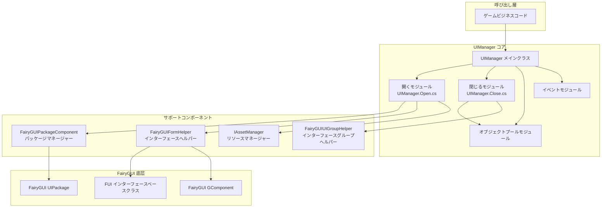
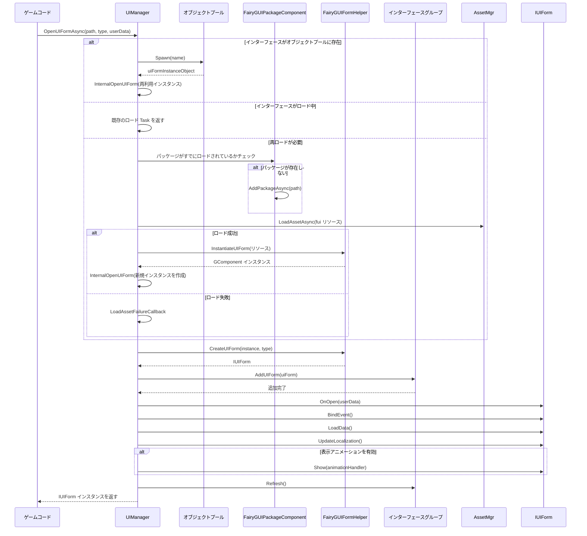

# インターフェースマネージャー

UIManager は、FairyGUI プラグインのコアコンポーネントであり、インターフェースのオープン、クローズ、ライフサイクル管理を担当します。`BaseUIManager` を継承し、FairyGUI 固有のインターフェース管理実装を提供し、非同期ロード、オブジェクトプール再利用、インターフェースグループ管理などの機能をサポートします。

## 概要

UIManager は、GameFrameX UI システムにおける FairyGUI の具体的な実装であり、すべての FairyGUI インターフェースの完全なライフサイクルを管理します。開発者は UIManager を通じてインターフェースを簡単に開いたり、閉じたり、表示・非表示にできます。同時に、システムはリソースのロード、キャッシュ、回収を自動的に処理します。

### コア責務

- **インターフェースロードとインスタンス化**：Resources ディレクトリまたは AssetBundle から UI リソースを非同期ロードすることをサポート
- **オブジェクトプール管理**：オブジェクトプールを通じてインターフェースインスタンスの再利用を実装し、メモリ割り当てと GC オーバーヘッドを削減
- **インターフェースグループ管理**：インターフェースを異なるグループに分配し、グループ表示・非表示を実装をサポート
- **ライフサイクル管理**：インターフェースの初期化、オープン、クローズ、回収などのステータス遷移を管理

### 設計意図

UIManager は部分クラス（Partial Class）を使用してコードを組織し、異なる機能モジュールを独立したファイルに分離します：
- `UIManager.cs`：ベースの初期化とリソースマネージャー設定
- `UIManager.Open.cs`：インターフェースを開く、非同期ロードロジック
- `UIManager.Close.cs`：インターフェースを閉じる、リソース回収ロジック
- `UIManager.OpenUIFormInfoData.cs`：インターフェースを開く情報のデータ構造

この設計により、コードの保守と拡張が容易になり、各ファイルは単一の責務に集中できます。

## アーキテクチャ設計



### コンポーネント関係の説明

| コンポーネント | 責務 | 依存元 |
|------|------|--------|
| UIManager | インターフェース管理コア | ゲームビジネスコード |
| FairyGUIPackageComponent | FairyGUI パッケージのロードと管理 | UIManager |
| FairyGUIFormHelper | インターフェースインスタンス化と解放 | UIManager |
| FairyGUIUIGroupHelper | インターフェースグループ管理 | UIManager |
| IAssetManager | リソースロード | UIManager.Open.cs |

## コアフロー

### インターフェースを開くフロー

`OpenUIFormAsync` を呼び出してインターフェースを開くと、システムは以下のフローを実行します：



### インターフェースを閉じる・回収フロー

```mermaid
flowchart TD
    Start([CloseUIForm を呼び出し]) --> Check{即座に破棄する必要があるか?}

    Check -->|いいえ| Recycle[RecycleUIForm を呼び出し]
    Check -->|はい| Dispose[RecycleUIForm(isDispose=true) を呼び出し]

    Recycle --> OnRecycle[uiForm.OnRecycle()]
    OnRecycle --> GetHandle[Handle を取得]
    GetHandle --> GetDisplayInfo[DisplayObjectInfo を取得]
    GetDisplayInfo --> Unspawn[オブジェクトプール Unspawn]

    Dispose --> OnRecycle2[uiForm.OnRecycle()]
    OnRecycle2 --> Unspawn2[オブジェクトプール Unspawn]
    Unspawn2 --> Release[オブジェクトプール Release]

    Unspawn --> End([完了])
    Release --> End
```

## コア機能の詳細

### 非同期インターフェースロード

UIManager は完全に非同期のインターフェースロードメカニズムをサポートしており、これは大規模な UI リソースのロードにとって特に重要であり、メインスレッドのブロックを避けることができます：

```csharp
// 非同期でインターフェースを開く
var uiForm = await UIManager.Instance.OpenUIFormAsync("UI/MainMenu", typeof(MainMenuForm), userData);
```

> Source: [UIManager.Open.cs](https://github.com/GameFrameX/com.gameframex.unity.ui.fairygui/blob/main/Runtime/UIManager.Open.cs#L66-L107)

システムは最初にオブジェクトプールに再利用可能なインターフェースインスタンスがあるかチェックし、存在する場合は直接再利用します。重複の作成を避けます。存在しない場合は、非同期ロードフローに移ります。

### オブジェクトプール管理

UIManager はオブジェクトプールを内蔵してインターフェースインスタンスを管理し、以下の利点をもたらします：

- **メモリ割り当てを削減**：インターフェースオブジェクトの作成と破棄を繰り返すことを避ける
- **ロード速度を向上**：再利用インスタンスは秒で開インターフェースを実装可能
- **GC 圧力を低下**：垃圾オブジェクトの生成を減少

オブジェクトプールの初期化はコンストラクタで完了します：

```csharp
public UIManager()
{
    m_InstancePool = null;  // オブジェクトプールインスタンス
    m_RecycleTime = 0;
    if (m_RecycleInterval < 10)
    {
        m_RecycleInterval = 10;  // デフォルト回収間隔 10 秒
    }
}
```

> Source: [UIManager.cs](https://github.com/GameFrameX/com.gameframex.unity.ui.fairygui/blob/main/Runtime/UIManager.cs#L62-L77)

### インターフェースリソースパス解析

システムは2つのリソースロード方法をサポートしています：

1. **Resources からロード**：パスに "Bundles" ディレクトリが含まれていない場合、Resources ディレクトリからロード
2. **AssetBundle からロード**：パスに "Bundles" ディレクトリが含まれている場合、YooAsset を使って非同期ロード

```csharp
// リソースロード方法を判断
if (assetPath.IndexOf(Utility.Asset.Path.BundlesDirectoryName, StringComparison.OrdinalIgnoreCase) < 0)
{
    // Resources からロード
    if (!hasUIPackage)
    {
        FairyGuiPackage.AddPackageSync(assetPath);
    }
    return LoadAssetSuccessCallback(...);
}
```

> Source: [UIManager.Open.cs](https://github.com/GameFrameX/com.gameframex.unity.ui.fairygui/blob/main/Runtime/UIManager.Open.cs#L137-L146)

### インターフェースグループサポート

すべてのインターフェースは1つのインターフェースグループ（UIGroup）に属し、インターフェースグループはインターフェースの表示レイヤと表示策略を決定します：

```csharp
var uiGroup = uiForm.UIGroup;
if (!uiGroup.InternalHasInstanceUIForm(uiFormAssetName, uiForm))
{
    uiGroup.AddUIForm(uiForm);
}
uiGroup.Refresh();
```

> Source: [UIManager.Open.cs](https://github.com/GameFrameX/com.gameframex.unity.ui.fairygui/blob/main/Runtime/UIManager.Open.cs#L236-L250)

### インターフェース回収メカニズム

インターフェースを閉じる時、システムは設定に基づいて回収するか破棄するかを決定します：

```csharp
protected override void RecycleUIForm(IUIForm uiForm, bool isDispose = false)
{
    uiForm.OnRecycle();
    var formHandle = uiForm.Handle as GameObject;
    if (!formHandle) return;

    var displayObjectInfo = formHandle.GetComponent<DisplayObjectInfo>();
    if (!displayObjectInfo) return;

    var component = displayObjectInfo.displayObject.gOwner as GComponent;
    if (component == null) return;

    m_InstancePool.Unspawn(component);
    if (isDispose)
    {
        m_InstancePool.ReleaseObject(component);
    }
}
```

> Source: [UIManager.Close.cs](https://github.com/GameFrameX/com.gameframex.unity.ui.fairygui/blob/main/Runtime/UIManager.Close.cs#L52-L79)

## を開くインターフェース情報データ

OpenUIFormInfoData は、インターフェースロードプロセス中に情報を渡すために使用される参照タイプのデータクラスです：

```csharp
internal sealed class OpenUIFormInfoData : IReference
{
    private int m_SerialId = 0;
    private bool m_PauseCoveredUIForm = false;
    private object m_UserData = null;
    private string m_PackageName;
    private string m_UIName;
    private Type m_FormType;

    public static OpenUIFormInfoData Create(int serialId, string packageName, string uiName,
        Type uiFormType, bool pauseCoveredUIForm, object userData)
    {
        // 参照プールからインスタンスを取得
        OpenUIFormInfoData openUIFormInfo = ReferencePool.Acquire<OpenUIFormInfoData>();
        // ... フィールドを初期化
        return openUIFormInfo;
    }

    public void Clear()
    {
        // すべてのフィールドをリセット
    }
}
```

> Source: [UIManager.OpenUIFormInfoData.cs](https://github.com/GameFrameX/com.gameframex.unity.ui.fairygui/blob/main/Runtime/UIManager.OpenUIFormInfoData.cs#L41-L177)

## イベントシステム

UIManager は、インターフェースを開く成功または失敗を通知するための完全なイベントシステムを提供します：

```csharp
// インターフェースを開く成功イベント
m_OpenUIFormSuccessEventHandler = null;

// インターフェースを開く失敗イベント
m_OpenUIFormFailureEventHandler = null;
```

インターフェースが正常に保存された時、成功イベントがトリガーされます：

```csharp
if (m_OpenUIFormSuccessEventHandler != null)
{
    OpenUIFormSuccessEventArgs openUIFormSuccessEventArgs =
        OpenUIFormSuccessEventArgs.Create(uiForm, duration, userData);
    m_OpenUIFormSuccessEventHandler(this, openUIFormSuccessEventArgs);
}
```

> Source: [UIManager.Open.cs](https://github.com/GameFrameX/com.gameframex.unity.ui.fairygui/blob/main/Runtime/UIManager.Open.cs#L252-L258)

## 初期化設定

UIManager は実行時に正しく初期化する必要があり、通常はゲームの起動時に依存性注入を通じて完了します：

```csharp
public override void SetResourceManager(IAssetManager assetManager)
{
    base.SetResourceManager(assetManager);
    // FairyGUI パッケージ管理コンポーネントを取得
    FairyGuiPackage = GameEntry.GetComponent<FairyGUIPackageComponent>();
    GameFrameworkGuard.NotNull(FairyGuiPackage, nameof(FairyGuiPackage));
}
```

> Source: [UIManager.cs](https://github.com/GameFrameX/com.gameframex.unity.ui.fairygui/blob/main/Runtime/UIManager.cs#L87-L92)

## 関連リンク

- [FUI インターフェースベースクラス](./4-core-concepts.1-fui-base-class) - すべての FairyGUI インターフェースの基本クラス実装を理解
- [パッケージマネージャー](./4-core-concepts.3-package-manager) - FairyGUI パッケージのロードと管理を理解
- [インターフェースヘルパー](./4-core-concepts.4-form-helper) - インターフェースインスタンス化と解放メカニズムを理解
- [インターフェースグループヘルパー](./4-core-concepts.5-ui-group-helper) - インターフェースグループ管理メカニズムを理解
- [クイックスタート：インターフェースを開く・閉じる](./3-getting-started.2-open-close-ui) - 実践チュートリアル