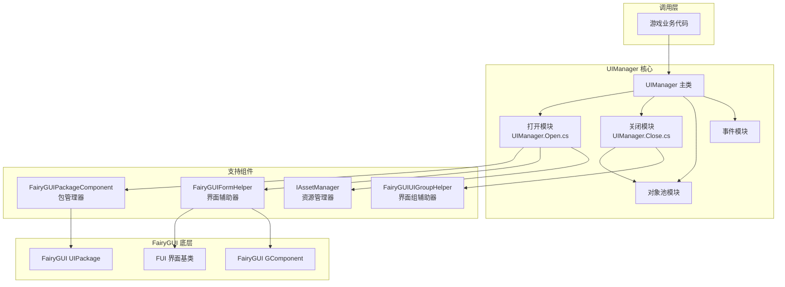
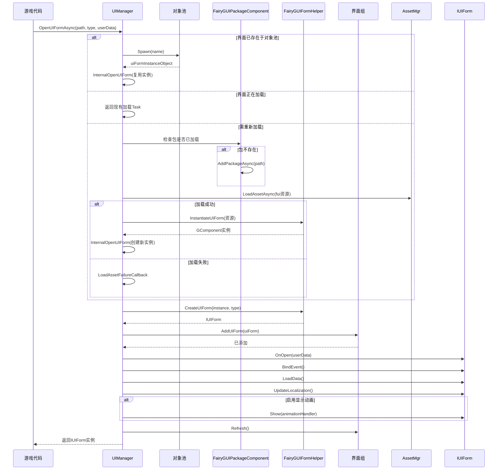

# 界面マネージャー

UIManager 是 FairyGUI プラグイン的コアコンポーネント，负责界面的打开、閉じる和ライフサイクル管理。它継承自 `BaseUIManager`，提供します FairyGUI 特定的界面管理実装，サポート非同期ロード、对象池复用、界面组管理等機能。

## 概要

UIManager 是 GameFrameX UI 系统中 FairyGUI 的具体実装，负责管理所有 FairyGUI 界面的完全なライフサイクル。開発者通过 UIManager 〜できます方便地打开、閉じる、显示和隐藏界面，同時に系统自动処理リソース的ロード、缓存和回收。

### コア职责

- **界面ロード与インスタンス化**：サポート从 Resources ディレクトリ或 AssetBundle 非同期ロード UI リソース
- **对象池管理**：通过对象池実装界面インスタンス的复用，减少内存分配和 GC 开销
- **界面组管理**：サポート将界面分配到不同的组，実装分组显示和隐藏
- **ライフサイクル管理**：管理界面的初期化、打开、閉じる、回收等ステータス转换

### 設計意图

UIManager 采用部分类（Partial Class）的方法组织コード，将不同機能モジュール分离到独立ファイル中：
- `UIManager.cs`：基本初期化和リソースマネージャー設定
- `UIManager.Open.cs`：界面打开和非同期ロード逻辑
- `UIManager.Close.cs`：界面閉じる和リソース回收逻辑
- `UIManager.OpenUIFormInfoData.cs`：界面打开情報的数据结构

这种設計使得コード更易于维护和拡張，每个ファイル专注于单一职责。

## アーキテクチャ設計



### コンポーネント关系説明

| コンポーネント | 职责 | 依赖方 |
|------|------|--------|
| UIManager | 界面管理コア | 游戏业务コード |
| FairyGUIPackageComponent | FairyGUI パッケージロード和管理 | UIManager |
| FairyGUIFormHelper | 界面インスタンス化和解放 | UIManager |
| FairyGUIUIGroupHelper | 界面组管理 | UIManager |
| IAssetManager | リソースロード | UIManager.Open.cs |

## コアフロー

### 界面打开フロー

当呼び出し `OpenUIFormAsync` 打开一个界面时，系统会经历以下フロー：



### 界面閉じる与回收フロー

```mermaid
flowchart TD
    Start([调用 CloseUIForm]) --> Check{是否需要立即销毁?}
    
    Check -->|否| Recycle[调用 RecycleUIForm]
    Check -->|是| Dispose[调用 RecycleUIForm(isDispose=true)]
    
    Recycle --> OnRecycle[uiForm.OnRecycle()]
    OnRecycle --> GetHandle[获取 Handle]
    GetHandle --> GetDisplayInfo[获取 DisplayObjectInfo]
    GetDisplayInfo --> Unspawn[对象池 Unspawn]
    
    Dispose --> OnRecycle2[uiForm.OnRecycle()]
    OnRecycle2 --> Unspawn2[对象池 Unspawn]
    Unspawn2 --> Release[对象池 Release]
    
    Unspawn --> End([完成])
    Release --> End
```

## コア機能详解

### 异步界面ロード

UIManager サポート完全异步的界面ロード机制，这对于大型 UI リソース的ロード尤为重要な，〜できます避免阻塞主线程：

```csharp
// 异步打开界面
var uiForm = await UIManager.Instance.OpenUIFormAsync("UI/MainMenu", typeof(MainMenuForm), userData);
```

> Source: [UIManager.Open.cs](https://github.com/GameFrameX/com.gameframex.unity.ui.fairygui/blob/main/Runtime/UIManager.Open.cs#L66-L107)

系统会まず確認对象池中是否存在可复用的界面インスタンス，もし存在则直接复用，避免重复作成。もし不存在，则进入非同期ロードフロー。

### 对象池管理

UIManager 内置了对象池来管理界面インスタンス，这带来了以下优势：

- **减少内存分配**：避免频繁作成和破棄界面对象
- **提高ロード速度**：复用インスタンス〜できます実装秒开界面
- **降低 GC 压力**：减少垃圾对象的产生

对象池的初期化在コンストラクタ中完成：

```csharp
public UIManager()
{
    m_InstancePool = null;  // 对象池实例
    m_RecycleTime = 0;
    if (m_RecycleInterval < 10)
    {
        m_RecycleInterval = 10;  // 默认回收间隔10秒
    }
}
```

> Source: [UIManager.cs](https://github.com/GameFrameX/com.gameframex.unity.ui.fairygui/blob/main/Runtime/UIManager.cs#L62-L77)

### 界面リソースパス解析

系统サポート两种リソースロード方法：

1. **从 Resources ロード**：路径不パッケージ含 "Bundles" ディレクトリ时，从 Resources ディレクトリロード
2. **从 AssetBundle ロード**：路径パッケージ含 "Bundles" ディレクトリ时，使用 YooAsset 非同期ロード

```csharp
// 判断资源加载方式
if (assetPath.IndexOf(Utility.Asset.Path.BundlesDirectoryName, StringComparison.OrdinalIgnoreCase) < 0)
{
    // 从 Resources 中加载
    if (!hasUIPackage)
    {
        FairyGuiPackage.AddPackageSync(assetPath);
    }
    return LoadAssetSuccessCallback(...);
}
```

> Source: [UIManager.Open.cs](https://github.com/GameFrameX/com.gameframex.unity.ui.fairygui/blob/main/Runtime/UIManager.Open.cs#L137-L146)

### 界面组サポート

每个界面都属于一个界面组（UIGroup），界面组决定了界面的显示层级和显示策略：

```csharp
var uiGroup = uiForm.UIGroup;
if (!uiGroup.InternalHasInstanceUIForm(uiFormAssetName, uiForm))
{
    uiGroup.AddUIForm(uiForm);
}
uiGroup.Refresh();
```

> Source: [UIManager.Open.cs](https://github.com/GameFrameX/com.gameframex.unity.ui.fairygui/blob/main/Runtime/UIManager.Open.cs#L236-L250)

### 界面回收机制

当閉じる界面时，系统会根据設定决定是回收还是破棄：

```csharp
protected override void RecycleUIForm(IUIForm uiForm, bool isDispose = false)
{
    uiForm.OnRecycle();
    var formHandle = uiForm.Handle as GameObject;
    if (!formHandle) return;

    var displayObjectInfo = formHandle.GetComponent<DisplayObjectInfo>();
    if (!displayObjectInfo) return;

    var component = displayObjectInfo.displayObject.gOwner as GComponent;
    if (component == null) return;

    m_InstancePool.Unspawn(component);
    if (isDispose)
    {
        m_InstancePool.ReleaseObject(component);
    }
}
```

> Source: [UIManager.Close.cs](https://github.com/GameFrameX/com.gameframex.unity.ui.fairygui/blob/main/Runtime/UIManager.Close.cs#L52-L79)

## 打开界面情報数据

OpenUIFormInfoData は参照タイプ的数据类，用于在界面ロード过程中传递情報：

```csharp
internal sealed class OpenUIFormInfoData : IReference
{
    private int m_SerialId = 0;
    private bool m_PauseCoveredUIForm = false;
    private object m_UserData = null;
    private string m_PackageName;
    private string m_UIName;
    private Type m_FormType;
    
    public static OpenUIFormInfoData Create(int serialId, string packageName, string uiName, 
        Type uiFormType, bool pauseCoveredUIForm, object userData)
    {
        // 从引用池获取实例
        OpenUIFormInfoData openUIFormInfo = ReferencePool.Acquire<OpenUIFormInfoData>();
        // ... 初始化字段
        return openUIFormInfo;
    }
    
    public void Clear()
    {
        // 重置所有字段
    }
}
```

> Source: [UIManager.OpenUIFormInfoData.cs](https://github.com/GameFrameX/com.gameframex.unity.ui.fairygui/blob/main/Runtime/UIManager.OpenUIFormInfoData.cs#L41-L177)

## イベント系统

UIManager 提供します完善的イベント系统，用于通知界面打开成功或失敗：

```csharp
// 界面打开成功事件
m_OpenUIFormSuccessEventHandler = null;

// 界面打开失败事件  
m_OpenUIFormFailureEventHandler = null;
```

在界面成功打开时，会トリガー成功イベント：

```csharp
if (m_OpenUIFormSuccessEventHandler != null)
{
    OpenUIFormSuccessEventArgs openUIFormSuccessEventArgs = 
        OpenUIFormSuccessEventArgs.Create(uiForm, duration, userData);
    m_OpenUIFormSuccessEventHandler(this, openUIFormSuccessEventArgs);
}
```

> Source: [UIManager.Open.cs](https://github.com/GameFrameX/com.gameframex.unity.ui.fairygui/blob/main/Runtime/UIManager.Open.cs#L252-L258)

## 初期化設定

UIManager 〜する必要があります在ランタイム正确初期化，通常在游戏启动时通过依存性注入完成：

```csharp
public override void SetResourceManager(IAssetManager assetManager)
{
    base.SetResourceManager(assetManager);
    // 获取 FairyGUI 包管理组件
    FairyGuiPackage = GameEntry.GetComponent<FairyGUIPackageComponent>();
    GameFrameworkGuard.NotNull(FairyGuiPackage, nameof(FairyGuiPackage));
}
```

> Source: [UIManager.cs](https://github.com/GameFrameX/com.gameframex.unity.ui.fairygui/blob/main/Runtime/UIManager.cs#L87-L92)

## 関連リンク

- [FUI 界面基底クラス](./4-core-concepts.1-fui-base-class) - 理解する所有 FairyGUI 界面的基底クラス実装
- [パッケージマネージャー](./4-core-concepts.3-package-manager) - 理解する FairyGUI パッケージ的ロード和管理
- [界面辅助器](./4-core-concepts.4-form-helper) - 理解する界面インスタンス化和解放机制
- [界面组辅助器](./4-core-concepts.5-ui-group-helper) - 理解する界面组管理机制
- [快速开始：打开和閉じる界面](./3-getting-started.2-open-close-ui) - 实践教程
