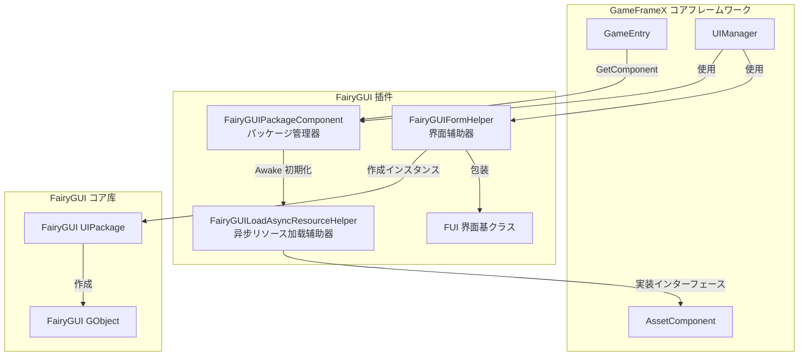
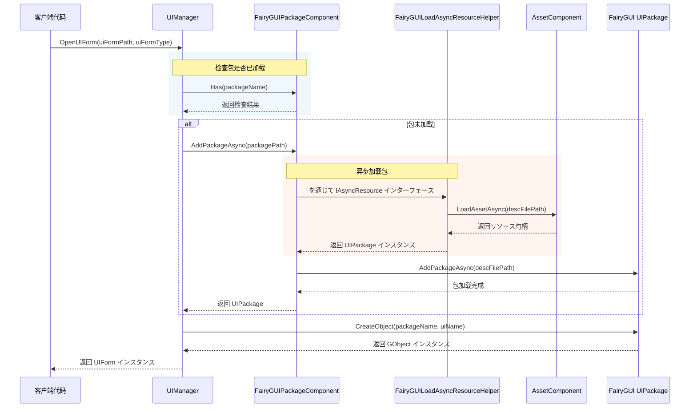

# パッケージ管理器

パッケージ管理器是 FairyGUI 插件的コアコンポーネント，负责管理所有 UI 包的加载、缓存和卸载操作。它提供します同步和异步两种加载方法，并深度集成了 GameFrameX 的リソース管理系统。

## 概要

`FairyGUIPackageComponent` 是を継承 `GameFrameworkComponent` 的 Unity コンポーネント，充当 FairyGUI 与 GameFrameX リソース系统之间的桥梁。它的主要职责包括：

- **包加载管理**：サポート同步和异步加载 UI 包
- **包缓存机制**：已加载的包会被缓存，避免重复加载
- **リソース清理**：提供包的卸载機能，释放内存リソース
- **异步リソース加载**：を通じて実装 `IAsyncResource` インターフェース，サポート FairyGUI 的异步リソース加载需求

### コア职责

パッケージ管理器的设计目标是简化 UI 包的管理フロー，让開発者专注于界面逻辑而不是リソース加载细节。当必要显示一个 UI 界面时，パッケージ管理器会自动检查目标包是否已加载：

- 如果包已加载 → 直接使用缓存的包作成界面インスタンス
- 如果包未加载 → 自动加载包后再作成界面インスタンス

这种设计大大简化了 UI 开发フロー，提升了开发效率。

## アーキテクチャ設計

パッケージ管理器在系统中的位置和交互关系如下：



### コアクラス説明

| クラス名 | 职责 | 访问级别 |
|------|------|----------|
| `FairyGUIPackageComponent` | UI パッケージ管理コアコンポーネント | `public` |
| `FairyGUILoadAsyncResourceHelper` | 実装 IAsyncResource インターフェース，处理异步リソース加载 | `internal` |
| `UIPackageData` | 存储已加载包的信息 | `public` (嵌套クラス) |

## コア機能

### 包加载机制

パッケージ管理器采用双重加载策略，同时サポート同步和异步加载方法：

#### 异步加载 (推荐)

```csharp
/// <summary>
/// 异步添加 UI 包。
/// </summary>
/// <param name="descFilePath">説明ファイル路径</param>
/// <param name="isLoadAsset">是否加载リソース</param>
/// <returns>表示 UI 包的异步任务</returns>
public Task<UIPackage> AddPackageAsync(string descFilePath, bool isLoadAsset = true)
```

异步加载是推荐使用的方法，特别适に使用必要动态加载大量 UI リソース的シーン。加载过程中不会阻塞主线程，能够保持流畅的用户体验。

> Source: [FairyGUIPackageComponent.cs#L148-L179](https://github.com/GameFrameX/com.gameframex.unity.ui.fairygui/blob/main/Runtime/FairyGUIPackageComponent.cs#L148-L179)

#### 同步加载

```csharp
/// <summary>
/// 同步添加 UI 包。
/// </summary>
/// <param name="descFilePath">説明ファイル路径</param>
/// <param name="isLoadAsset">是否加载リソース</param>
public void AddPackageSync(string descFilePath, bool isLoadAsset = true)
```

同步加载适に使用编辑器环境或ゲーム启动时的预加载シーン。

> Source: [FairyGUIPackageComponent.cs#L190-L203](https://github.com/GameFrameX/com.gameframex.unity.ui.fairygui/blob/main/Runtime/FairyGUIPackageComponent.cs#L190-L203)

### 包查询操作

```csharp
/// <summary>
/// 检查是否存在指定名称的 UI 包。
/// </summary>
public bool Has(string uiPackageName)

/// <summary>
/// 取得指定名称的 UI 包。
/// </summary>
public UIPackage Get(string uiPackageName)
```

> Source: [FairyGUIPackageComponent.cs#L265-L290](https://github.com/GameFrameX/com.gameframex.unity.ui.fairygui/blob/main/Runtime/FairyGUIPackageComponent.cs#L265-L290)

### 包卸载机制

パッケージ管理器提供します精细的卸载控制：

```csharp
/// <summary>
/// 移除指定名称的 UI 包。
/// </summary>
public void RemovePackage(string packageName)

/// <summary>
/// 移除所有 UI 包。
/// </summary>
public void RemoveAllPackages()
```

卸载操作会执行以下手順：
1. 呼び出し `Package.UnloadAssets()` 卸载リソース
2. 从 FairyGUI 移除包
3. を通じてリソース辅助器释放底层リソース
4. 从缓存字典中移除记录

> Source: [FairyGUIPackageComponent.cs#L213-L254](https://github.com/GameFrameX/com.gameframex.unity.ui.fairygui/blob/main/Runtime/FairyGUIPackageComponent.cs#L213-L254)

## 加载フロー

当界面管理器 (UIManager) 打开一个 UI 界面时，パッケージ管理器的呼び出しフロー如下：



### 关键设计要点

1. **自动包加载**：界面管理器会自动检查并加载所需的 UI 包，開発者无需手动管理
2. **并发加载控制**：を通じて `m_UIPackageLoading` 字典防止同一包的重复加载お願いします求
3. **リソースクラス型区分**：に基づいてリソースクラス型（图片、音频、字体等）使用不同的加载策略

## 异步リソース加载辅助器

`FairyGUILoadAsyncResourceHelper` 是パッケージ管理器的内部コンポーネント，実装了 FairyGUI 的 `IAsyncResource` インターフェース。它的主要機能是：

- 封装 GameFrameX 的 `AssetComponent` 供 FairyGUI 使用
- 管理 UI 包リソース的异步加载
- 处理不同クラス型リソース的加载逻辑（图片、图集、字体、音频等）

### サポート的リソースクラス型

| リソースクラス型 | FairyGUI クラス型 | 加载方法 |
|----------|---------------|----------|
| 图片 | `PackageItemType.Image` | Texture |
| 图集 | `PackageItemType.Atlas` | Texture |
| 音频 | `PackageItemType.Sound` | AudioClip |
| 字体 | `PackageItemType.Font` | Font |
| Spine 动画 | `PackageItemType.Spine` | TextAsset |
| 龙骨动画 | `PackageItemType.DragoneBones` | DragonBonesData |

> Source: [FairyGUILoadAsyncResourceHelper.cs#L124-L252](https://github.com/GameFrameX/com.gameframex.unity.ui.fairygui/blob/main/Runtime/FairyGUILoadAsyncResourceHelper.cs#L124-L252)

## 使用例

### 取得パッケージ管理器インスタンス

```csharp
var packageComponent = GameEntry.GetComponent<FairyGUIPackageComponent>();
```

### 检查包是否存在

```csharp
bool exists = packageComponent.Has("MyUIPackage");
```

### 手动加载包

```csharp
// 异步加载
var package = await packageComponent.AddPackageAsync("UIPackages/MyUIPackage");

// 同步加载
packageComponent.AddPackageSync("UIPackages/MyUIPackage");
```

### 取得已加载的包

```csharp
var package = packageComponent.Get("MyUIPackage");
if (package != null)
{
    // 使用包作成对象
    var obj = package.CreateObject("MainPanel");
}
```

### 卸载包

```csharp
// 卸载指定包
packageComponent.RemovePackage("MyUIPackage");

// 卸载所有包
packageComponent.RemoveAllPackages();
```

## 内部実装细节

### 包数据存储

每个加载的包都会作成 `UIPackageData` インスタンス进行存储：

```csharp
[Serializable]
public sealed class UIPackageData
{
    public string DescFilePath { get; }      // 説明ファイル路径
    public bool IsLoadAsset { get; }          // 是否加载リソース
    public UIPackage Package { get; }         // 包インスタンス
    public string Name { get; }               // 包名称
}
```

> Source: [FairyGUIPackageComponent.cs#L64-L136](https://github.com/GameFrameX/com.gameframex.unity.ui.fairygui/blob/main/Runtime/FairyGUIPackageComponent.cs#L64-L136)

### コンポーネント初期化

パッケージ管理器在 `Awake` 阶段进行初期化：

```csharp
protected override void Awake()
{
    IsAutoRegister = false;
    base.Awake();
    m_ResourceHelper = new FairyGUILoadAsyncResourceHelper();
    UIPackage.SetAsyncLoadResource(m_ResourceHelper);
}
```

这里設定了 `IsAutoRegister = false`，表示不会自动注册到 GameEntry，这是为了手动控制初期化顺序。

> Source: [FairyGUIPackageComponent.cs#L300-L306](https://github.com/GameFrameX/com.gameframex.unity.ui.fairygui/blob/main/Runtime/FairyGUIPackageComponent.cs#L300-L306)

## API 参考

### `FairyGUIPackageComponent` クラス

#### メソッド

| メソッド | 返回クラス型 | 説明 |
|------|----------|------|
| `AddPackageAsync(string, bool)` | `Task<UIPackage>` | 异步添加 UI 包 |
| `AddPackageSync(string, bool)` | `void` | 同步添加 UI 包 |
| `RemovePackage(string)` | `void` | 移除指定名称的 UI 包 |
| `RemoveAllPackages()` | `void` | 移除所有 UI 包 |
| `Has(string)` | `bool` | 检查是否存在指定名称的 UI 包 |
| `Get(string)` | `UIPackage` | 取得指定名称的 UI 包 |

#### プロパティ

| プロパティ | クラス型 | 説明 |
|------|------|------|
| `m_UILoadedPackages` | `Dictionary<string, UIPackageData>` | 已加载包的缓存字典 |
| `m_UIPackageLoading` | `Dictionary<string, TaskCompletionSource<UIPackage>>` | 正在加载的包字典 |

### `UIPackageData` 嵌套クラス

| プロパティ | クラス型 | 説明 |
|------|------|------|
| `DescFilePath` | `string` | 取得説明ファイル路径 |
| `IsLoadAsset` | `bool` | 取得是否加载リソース |
| `Package` | `UIPackage` | 取得 UI 包インスタンス |
| `Name` | `string` | 取得 UI 包名称 |

## よくある質問

### 包加载失败

如果包加载失败，お願いします检查：
1. 説明ファイル路径是否正确
2. 包リソース是否存在于指定路径
3. リソース系统是否正确初期化

### 内存泄漏

确保在不必要使用 UI 包时呼び出し `RemovePackage` 或 `RemoveAllPackages` 进行释放，避免内存泄漏。

### リソースクラス型不サポート

当前版本サポート图片、图集、音频、字体、Spine 和龙骨动画。如需サポート其他クラス型，お願いします参考 `FairyGUILoadAsyncResourceHelper` 中的加载逻辑进行扩展。

## 関連リンク

- [FUI 界面基クラス](./4-core-concepts.1-fui-base-class) - 了解如何作成 FairyGUI 界面
- [界面管理器](./4-core-concepts.2-ui-manager) - 了解界面打开和关闭的フロー
- [界面辅助器](./4-core-concepts.4-form-helper) - 了解界面インスタンス化和释放机制
- [FairyGUIPackageComponent API 参考](./5-api-reference.2-package-component) - 完整的 API 文档
