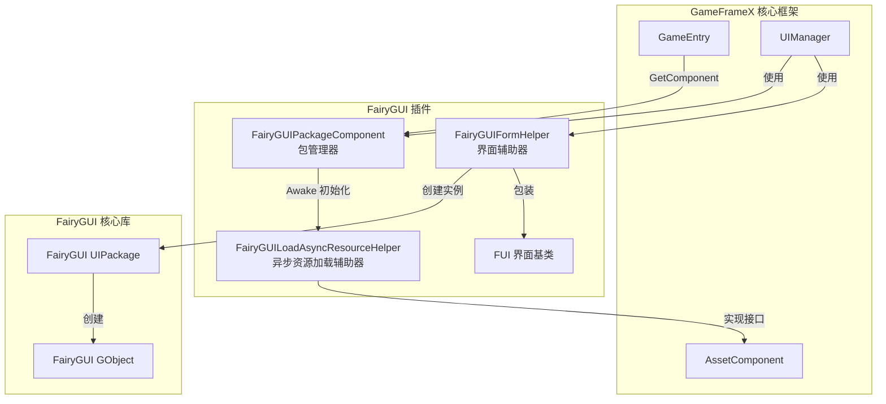
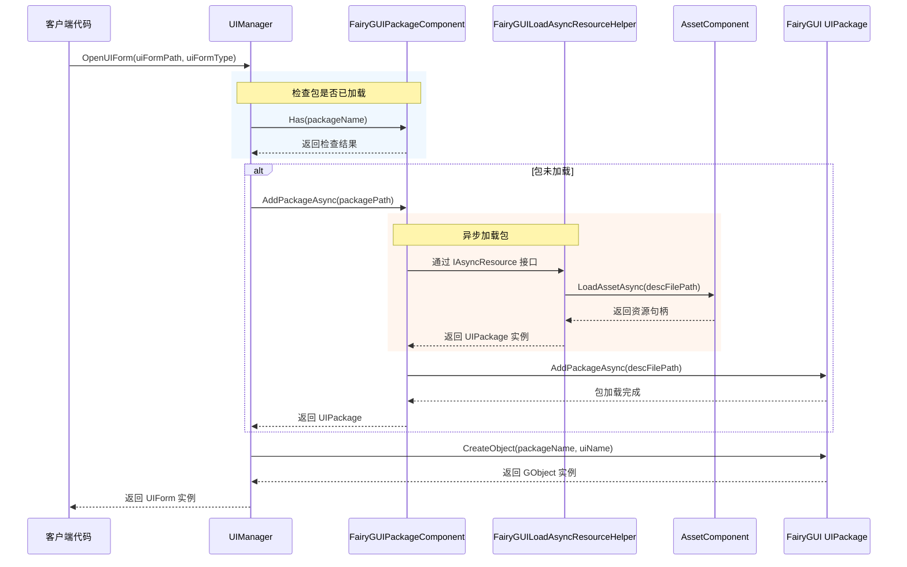

# パッケージマネージャー

パッケージマネージャー是 FairyGUI プラグイン的コアコンポーネント，负责管理所有 UI パッケージ的ロード、缓存和アンロード操作。它提供します同步和异步两种ロード方法，并深度集成了 GameFrameX 的リソース管理系统。

## 概要

`FairyGUIPackageComponent` 是継承自 `GameFrameworkComponent` 的 Unity コンポーネント，充当 FairyGUI 与 GameFrameX リソースシステム之间的桥梁。它的主な职责含みます：

- **パッケージロード管理**：サポート同步和非同期ロード UI パッケージ
- **パッケージ缓存机制**：已ロード的パッケージ会被缓存，避免重复ロード
- **リソース清理**：提供パッケージ的アンロード機能，解放内存リソース
- **异步リソースロード**：通过実装 `IAsyncResource` インターフェース，サポート FairyGUI 的异步リソースロード需求

### コア职责

パッケージマネージャー的設計目标是簡素化 UI パッケージ的管理フロー，让開発者专注于界面逻辑而不是リソースロード细节。当〜する必要があります显示一个 UI 界面时，パッケージマネージャー会自动確認目标パッケージ是否已ロード：

- もしパッケージ已ロード → 直接使用缓存的パッケージ作成界面インスタンス
- もしパッケージ未ロード → 自动ロードパッケージ后再作成界面インスタンス

这种設計大大簡素化了 UI 开发フロー，提升了开发效率。

## アーキテクチャ設計

パッケージマネージャー在系统中的位置和交互关系如下：



### コア类説明

| 类名 | 职责 | 访问级别 |
|------|------|----------|
| `FairyGUIPackageComponent` | UI パッケージ管理コアコンポーネント | `public` |
| `FairyGUILoadAsyncResourceHelper` | 実装 IAsyncResource インターフェース，処理异步リソースロード | `internal` |
| `UIPackageData` | 存储已ロードパッケージ的情報 | `public` (嵌套类) |

## コア機能

### パッケージロード机制

パッケージマネージャー采用双重ロード策略，同時にサポート同步和非同期ロード方法：

#### 非同期ロード (推奨)

```csharp
/// <summary>
/// 异步添加 UI 包。
/// </summary>
/// <param name="descFilePath">描述文件路径</param>
/// <param name="isLoadAsset">是否加载资源</param>
/// <returns>表示 UI 包的异步任务</returns>
public Task<UIPackage> AddPackageAsync(string descFilePath, bool isLoadAsset = true)
```

非同期ロード是推奨使用的方法，特别適しています〜する必要があります动态ロード大量 UI リソース的シーン。ロード过程中不会阻塞主线程，能够保持流畅的ユーザー体验。

> Source: [FairyGUIPackageComponent.cs#L148-L179](https://github.com/GameFrameX/com.gameframex.unity.ui.fairygui/blob/main/Runtime/FairyGUIPackageComponent.cs#L148-L179)

#### 同期ロード

```csharp
/// <summary>
/// 同步添加 UI 包。
/// </summary>
/// <param name="descFilePath">描述文件路径</param>
/// <param name="isLoadAsset">是否加载资源</param>
public void AddPackageSync(string descFilePath, bool isLoadAsset = true)
```

同期ロード適していますエディタ環境或游戏启动时的预ロードシーン。

> Source: [FairyGUIPackageComponent.cs#L190-L203](https://github.com/GameFrameX/com.gameframex.unity.ui.fairygui/blob/main/Runtime/FairyGUIPackageComponent.cs#L190-L203)

### パッケージ查询操作

```csharp
/// <summary>
/// 检查是否存在指定名称的 UI 包。
/// </summary>
public bool Has(string uiPackageName)

/// <summary>
/// 获取指定名称的 UI 包。
/// </summary>
public UIPackage Get(string uiPackageName)
```

> Source: [FairyGUIPackageComponent.cs#L265-L290](https://github.com/GameFrameX/com.gameframex.unity.ui.fairygui/blob/main/Runtime/FairyGUIPackageComponent.cs#L265-L290)

### パッケージアンロード机制

パッケージマネージャー提供します精细的アンロード控制：

```csharp
/// <summary>
/// 移除指定名称的 UI 包。
/// </summary>
public void RemovePackage(string packageName)

/// <summary>
/// 移除所有 UI 包。
/// </summary>
public void RemoveAllPackages()
```

アンロード操作会执行以下ステップ：
1. 呼び出し `Package.UnloadAssets()` アンロードリソース
2. 从 FairyGUI 移除パッケージ
3. 通过リソース辅助器解放底层リソース
4. 从缓存字典中移除记录

> Source: [FairyGUIPackageComponent.cs#L213-L254](https://github.com/GameFrameX/com.gameframex.unity.ui.fairygui/blob/main/Runtime/FairyGUIPackageComponent.cs#L213-L254)

## ロードフロー

当界面マネージャー (UIManager) 打开一个 UI 界面时，パッケージマネージャー的呼び出しフロー如下：



### 关键設計要点

1. **自动パッケージロード**：界面マネージャー会自动確認并ロード所需的 UI パッケージ，開発者无需手动管理
2. **并发ロード控制**：通过 `m_UIPackageLoading` 字典防止同一パッケージ的重复ロード请求
3. **リソースタイプ区分**：根据リソースタイプ（图片、音频、字体等）使用不同的ロード策略

## 异步リソースロード辅助器

`FairyGUILoadAsyncResourceHelper` 是パッケージマネージャー的内部コンポーネント，実装了 FairyGUI 的 `IAsyncResource` インターフェース。它的主な機能是：

- カプセル化 GameFrameX 的 `AssetComponent` 供 FairyGUI 使用
- 管理 UI パッケージリソース的非同期ロード
- 処理不同タイプリソース的ロード逻辑（图片、图集、字体、音频等）

### サポート的リソースタイプ

| リソースタイプ | FairyGUI タイプ | ロード方法 |
|----------|---------------|----------|
| 图片 | `PackageItemType.Image` | Texture |
| 图集 | `PackageItemType.Atlas` | Texture |
| 音频 | `PackageItemType.Sound` | AudioClip |
| 字体 | `PackageItemType.Font` | Font |
| Spine 动画 | `PackageItemType.Spine` | TextAsset |
| 龙骨动画 | `PackageItemType.DragoneBones` | DragonBonesData |

> Source: [FairyGUILoadAsyncResourceHelper.cs#L124-L252](https://github.com/GameFrameX/com.gameframex.unity.ui.fairygui/blob/main/Runtime/FairyGUILoadAsyncResourceHelper.cs#L124-L252)

## 使用例

### 取得パッケージマネージャーインスタンス

```csharp
var packageComponent = GameEntry.GetComponent<FairyGUIPackageComponent>();
```

### 確認パッケージ是否存在

```csharp
bool exists = packageComponent.Has("MyUIPackage");
```

### 手动ロードパッケージ

```csharp
// 异步加载
var package = await packageComponent.AddPackageAsync("UIPackages/MyUIPackage");

// 同步加载
packageComponent.AddPackageSync("UIPackages/MyUIPackage");
```

### 取得已ロード的パッケージ

```csharp
var package = packageComponent.Get("MyUIPackage");
if (package != null)
{
    // 使用包创建对象
    var obj = package.CreateObject("MainPanel");
}
```

### アンロードパッケージ

```csharp
// 卸载指定包
packageComponent.RemovePackage("MyUIPackage");

// 卸载所有包
packageComponent.RemoveAllPackages();
```

## 内部実装细节

### パッケージ数据存储

每个ロード的パッケージ都会作成 `UIPackageData` インスタンス进行存储：

```csharp
[Serializable]
public sealed class UIPackageData
{
    public string DescFilePath { get; }      // 描述文件路径
    public bool IsLoadAsset { get; }          // 是否加载资源
    public UIPackage Package { get; }         // 包实例
    public string Name { get; }               // 包名称
}
```

> Source: [FairyGUIPackageComponent.cs#L64-L136](https://github.com/GameFrameX/com.gameframex.unity.ui.fairygui/blob/main/Runtime/FairyGUIPackageComponent.cs#L64-L136)

### コンポーネント初期化

パッケージマネージャー在 `Awake` フェーズ进行初期化：

```csharp
protected override void Awake()
{
    IsAutoRegister = false;
    base.Awake();
    m_ResourceHelper = new FairyGUILoadAsyncResourceHelper();
    UIPackage.SetAsyncLoadResource(m_ResourceHelper);
}
```

这里設定了 `IsAutoRegister = false`，表示不会自动登録到 GameEntry，这是为了手动控制初期化顺序。

> Source: [FairyGUIPackageComponent.cs#L300-L306](https://github.com/GameFrameX/com.gameframex.unity.ui.fairygui/blob/main/Runtime/FairyGUIPackageComponent.cs#L300-L306)

## API リファレンス

### `FairyGUIPackageComponent` 类

#### メソッド

| メソッド | 返すタイプ | 説明 |
|------|----------|------|
| `AddPackageAsync(string, bool)` | `Task<UIPackage>` | 异步追加 UI パッケージ |
| `AddPackageSync(string, bool)` | `void` | 同步追加 UI パッケージ |
| `RemovePackage(string)` | `void` | 移除指定名称的 UI パッケージ |
| `RemoveAllPackages()` | `void` | 移除所有 UI パッケージ |
| `Has(string)` | `bool` | 確認是否存在指定名称的 UI パッケージ |
| `Get(string)` | `UIPackage` | 取得指定名称的 UI パッケージ |

#### プロパティ

| プロパティ | タイプ | 説明 |
|------|------|------|
| `m_UILoadedPackages` | `Dictionary<string, UIPackageData>` | 已ロードパッケージ的缓存字典 |
| `m_UIPackageLoading` | `Dictionary<string, TaskCompletionSource<UIPackage>>` | 〜中ロード的パッケージ字典 |

### `UIPackageData` 嵌套类

| プロパティ | タイプ | 説明 |
|------|------|------|
| `DescFilePath` | `string` | 取得説明ファイル路径 |
| `IsLoadAsset` | `bool` | 取得是否ロードリソース |
| `Package` | `UIPackage` | 取得 UI パッケージインスタンス |
| `Name` | `string` | 取得 UI パッケージ名称 |

## よくある問題

### パッケージロード失敗

もしパッケージロード失敗，请確認：
1. 説明ファイル路径是否正确
2. パッケージリソース是否存在于指定路径
3. リソースシステム是否正确初期化

### 内存泄漏

確認してください在不〜する必要があります使用 UI パッケージ时呼び出し `RemovePackage` 或 `RemoveAllPackages` 进行解放，避免内存泄漏。

### リソースタイプ不サポート

当前バージョンサポート图片、图集、音频、字体、Spine 和龙骨动画。如需サポート其他タイプ，请リファレンス `FairyGUILoadAsyncResourceHelper` 中的ロード逻辑进行拡張。

## 関連リンク

- [FUI 界面基底クラス](./4-core-concepts.1-fui-base-class) - 理解する如何作成 FairyGUI 界面
- [界面マネージャー](./4-core-concepts.2-ui-manager) - 理解する界面打开和閉じる的フロー
- [界面辅助器](./4-core-concepts.4-form-helper) - 理解する界面インスタンス化和解放机制
- [FairyGUIPackageComponent API リファレンス](./5-api-reference.2-package-component) - 完全な的 API ドキュメント
